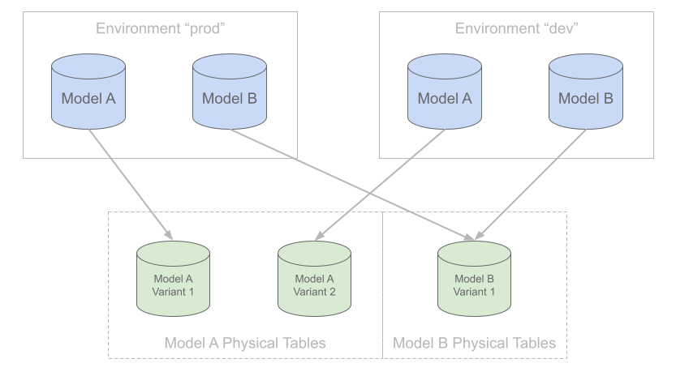

# プラン

プランとは、プロジェクトのローカル状態とターゲットの[環境](environments.md)の状態の差異をまとめた変更セットです。モデルの変更をターゲット環境に反映させるには、プランを作成して適用する必要があります。

プラン作成時：

* SQLMeshプロジェクトのローカル状態とターゲット環境の状態が比較されます。両者の差異と、環境をローカル状態に同期するために必要なアクションがプランを構成します。
* ユーザーは、既存のモデルに対する[変更を分類](#change-categories)するように求められる場合があります。これにより、SQLMeshは間接的に影響を受けるモデル（更新されたモデルに依存する下流のモデル）に対してどのようなアクションを実行するかを判断できます。デフォルトでは、SQLMeshは変更を自動的に分類しようとしますが、この動作は[構成](../reference/configuration.md#auto_categorize_changes)によって変更できます。
* 各プランには、適用対象となる日付範囲が必要です。指定しない場合は、モデル定義とターゲット環境に基づいて日付範囲が自動的に導出されます。

プランの利点は、すべての変更をデータウェアハウスに適用して計算を実行する前に確認および検証できることです。一般的なプランには、以下の情報が含まれます。

* 追加されたモデルのリスト
* 削除されたモデルのリスト
* 直接変更されたモデルのリストと、行われた変更のテキスト差分
* 間接的に変更されたモデルのリスト
* 影響を受けるモデルの欠損データ間隔
* プランの適用によって影響を受ける日付範囲

新しいプランを作成するには、次のコマンドを実行します。

```bash
sqlmesh plan [environment name]
```

環境名が指定されていない場合は、`prod` 環境のプランが生成されます。

## 変更カテゴリ

カテゴリは、直接変更されたモデルに対してのみ指定する必要があります。間接的に変更された下流モデルのカテゴリは、直接変更されたモデルへの変更の種類に基づいて推測されます。

間接的に変更されたモデルの上流依存関係が複数変更され、それらのカテゴリが競合している場合、最も保守的なカテゴリ（breaking）がこのモデルに割り当てられます。

### 破壊的変更

直接変更されたモデルの変更が破壊的変更に分類された場合、その変更とその下流の依存関係はバックフィルされます。

一般的に、これはすべての下流の依存関係に変更が反映されることを保証するため、最も安全なオプションです。ただし、追加のデータ再処理が必要となり、実行時にコストがかかるため、よりコストの高いオプションとなります（[バックフィル](#バックフィリング) を参照）。

モデルのロジックに変更が加えられ、それが下流の依存関係に機能的な影響を与えた場合、このオプションを選択してください。たとえば、モデルの `WHERE` 句を追加または変更することは、下流のモデルにフィルター処理によって除外される行が含まれるため、破壊的変更となります。

### 非破壊的変更

非破壊的と分類される直接変更されたモデルはバックフィルされますが、下流の依存関係はバックフィルされません。

これは、新しい列の追加など、下流のモデルに影響を与えないアクションの場合によく使用されます。これは、下流のモデルで新しい列を使用するには、その列を直接変更して選択する必要があるためです。

下流のモデルにモデルからの `select *` が含まれている場合、SQLMesh はベストエフォート方式で非破壊的状態を推測しようとします。不要な再計算を避けるため、クエリの列を明示的に指定することをお勧めします。

### 概要

| 変更カテゴリ | 変更タイプ | 動作 |
|--------------------------------------|----------------------------------------------------------------------------------------------------|----------------------------------------------------------------|
| [破壊的](#破壊的変更) | [直接](glossary.md#direct-modification) または [間接](glossary.md#indirect-modification) | [バックフィル](glossary.md#backfill) |
| [非破壊的](#非破壊的変更) | [直接](glossary.md#direct-modification) | [バックフィル](glossary.md#backfill) |
| [非破壊的](#非破壊的変更) | [間接](glossary.md#indirect-modification) | [バックフィルなし](glossary.md#backfill) |

## 前方参照のみの変更

変更を互換性のない変更と互換性のない変更に分類することに加えて、前方参照のみとして分類することもできます。

前方参照のみとして分類されたモデル変更は、変更が本番環境（「prod」環境）にデプロイされた後も既存の物理テーブルを引き続き使用します。つまり、バックフィルは行われません。

開発環境で前方参照のみの変更を反復処理している間、モデルの出力は、エンジンでサポートされている場合は、一時テーブルまたは本番環境テーブルのシャロークローンに保存されます。

いずれの場合も、開発環境でこのように生成されたデータはプレビューにのみ使用でき、変更が本番環境にデプロイされた後は再利用されません。詳細については、[前方参照のみのプラン](#forward-only-plans) を参照してください。

このカテゴリは、ユーザーが [前方参照のみのプラン](#forward-only-plans) の使用を選択した場合、またはモデルが明示的に前方参照のみとして構成されている場合に、SQLMesh によって自動的に割り当てられます。

## プランの適用

プランが作成され、レビューされると、変更を有効にするために対象の[環境](environments.md)に適用されます。

プランの一部としてモデルが変更されるたびに、そのモデルの新しいバリアントがバックグラウンドで作成されます（固有の[フィンガープリント](architecture/snapshots.md#fingerprints)を持つ[スナップショット](architecture/snapshots.md)が割り当てられます）。そして、各モデルバリアントのデータは個別の物理テーブルに保存されます。[forward-only](#forward-only-plans)プランを除き、同じモデルの異なるバリアント間でデータは共有されません。

プランが環境に適用されると、その環境はそのプランに含まれるモデルバリアントのセットに関連付けられます。つまり、各環境は、モデルバリアントとそれらに関連付けられた物理テーブルへの参照のコレクションです。



*各モデルバリアントは独自の物理テーブルを持ちますが、環境にはこれらのテーブルへの参照のみが含まれます。*

変更を理解し適用するためのこの独自のアプローチこそが、SQLMesh の仮想環境を実現している理由です。これにより、SQLMesh は環境間の完全な分離を確保しながら、適切かつ安全な場合には環境間で物理データ資産を共有できます。

さらに、各モデルの変更は個別の物理テーブルに記録されるため、物理テーブルが管理プロセスによってガベージコレクションされていない限り、以前のバージョンへの復元は簡単かつ迅速な操作となります（[仮想更新](#virtual-update) を参照）。

SQLMesh は、正確性を容易に維持し、誤って不可逆的に破損させることを非常に困難にします。

### バックフィリング
上記のアプローチには多くの利点がある一方で、トレードオフがないわけではありません。

新しいモデルバージョンを作成した直後は、そのモデルに割り当てられた物理テーブルは空です。そのため、SQLMesh は新しいモデルの物理テーブルにデータを入力するため、新しいモデルバージョンのロジックをそのモデルの日付範囲全体に再適用する必要があります。このプロセスはバックフィリングと呼ばれます。

「バックフィリング」という用語は、モデルが更新されるあらゆる状況を指す広義の用語として使用されています。これには以下の操作が含まれます。

* VIEW モデルが作成されるとき
* FULL モデルが構築されるとき
* INCREMENTAL モデルが初めて構築されるとき
* INCREMENTAL モデルに最新データが追加されるとき
* INCREMENTAL モデルに古いデータが挿入されるとき（つまり、データギャップの解消や履歴データの先頭への追加）

増分モデルに関する注意：バックフィルは増分的に実行できますが（モデルの `batch_size` パラメータを参照）、追加の実行時間が必要となるため、この操作には追加のコストがかかります。実行時間コストが懸念される場合は、代わりに [forward-only plan](#forward-only-plans) を使用してください。

### 仮想更新

SQLMesh のアプローチの利点は、開発環境にある間に新しいモデルバージョンのデータを完全に事前構築できることです。これにより、すべての変更とその下流の依存関係を、本番環境にプロモートする前に完全にプレビューできます。

このアプローチにより、変更を本番環境にプロモートするプロセスは参照のスワップのみに簡略化されます。

プラン作成時にデータギャップが検出されず、新しいモデルバージョンへの参照のみを更新する必要がある場合、その更新は仮想更新と呼ばれます。仮想更新では、追加の実行時オーバーヘッドやコストは発生しません。

### 開始日と終了日

`plan` コマンドには、`--start` と `--end` という 2 つの時間オプションがあります。これらのオプションは、非本番環境のプランにのみ適用されます。

コンテキストとして、すべてのモデルには開始日があります。開始日は、[モデル定義](./models/overview.md#start)、[プロジェクト構成の `model_defaults`](../guides/configuration.md#model-defaults)、または SQLMesh のデフォルト値である昨日で指定できます。

本番環境はビジネスオペレーションをサポートするため、本番環境プランでは、すべてのモデルが開始日から最新の完了期間までバックフィルされます。この制限により、`plan` コマンドの `--start` および `--end` オプションは、本番環境に対する通常のプランではサポートされていません。これらのオプションは、既存データのサブセットを再処理できるように、本番環境に対する [再ステートメントプラン](#restatement-plans) でサポートされています。

非本番環境向けプランは通常、開発用に使用されるため、`--start` および `--end` オプションを使用して、任意の日付範囲でモデルをバックフィルできます。日付範囲を制限することで、バックフィルが高速化し、開発効率が向上します。特に、大規模なテーブルを使用する増分モデルの場合に有効です。

#### モデル種別の制限事項

一部のモデル種別では、限定された日付範囲のバックフィルがサポートされていません。

ちなみに、SQLMesh はモデルを _べき等_ にすることを目指しています。つまり、複数回実行しても毎回同じ正しい結果が得られるということです。

ただし、一部のモデル種別は本質的に非べき等です。

- [INCREMENTAL_BY_UNIQUE_KEY](models/model_kinds.md#incremental_by_unique_key)
- [INCREMENTAL_BY_PARTITION](models/model_kinds.md#incremental_by_partition)
- [SCD_TYPE_2_BY_TIME](models/model_kinds.md#scd-type-2-by-time-recommended)
- [SCD_TYPE_2_BY_COLUMN](models/model_kinds.md#scd-type-2-by-column)
- クエリが自己参照型であるモデル（つまり、新しいデータ行の内容がテーブルに既に存在するデータ行の影響を受けるモデル）

これらのモデル種別は、日付範囲が限定された非本番環境プランでは次のように動作します。

- もし`--start` オプションの日付がモデルの開始日と同じかそれ以前の場合、モデルは常に完全に更新されます。
- `--start` オプションの日付がモデルの開始日以降の場合、このモデルについてはプレビューのみが計算され、本番環境へのデプロイ時に再利用することはできません。

#### 例

デフォルトの開始日が2024年9月20日であるSQLMeshプロジェクトを考えてみましょう。

このプロジェクトには、明示的に開始日を2024年9月23日とする以下の`INCREMENTAL_BY_UNIQUE_KEY`モデルが含まれています。

```sql linenums="1" hl_lines="6"
MODEL (
  name sqlmesh_example.start_end_model,
  kind INCREMENTAL_BY_UNIQUE_KEY (
    unique_key item_id
  ),
  start '2024-09-23'
);

SELECT
  item_id,
  num_orders
FROM
  sqlmesh_example.full_model
```

プロジェクトの最初のプランを実行すると、SQLMesh が他のモデル (プロジェクトのデフォルトの開始日は 2024-09-20) とは異なる `start_end_model` の開始日を正しく検出したことがわかります。

```bash linenums="1" hl_lines="17"
❯ sqlmesh plan
======================================================================
Successfully Ran 1 tests against duckdb
----------------------------------------------------------------------
`prod` environment will be initialized

Models:
└── Added:
    ├── sqlmesh_example.full_model
    ├── sqlmesh_example.incremental_model
    ├── sqlmesh_example.seed_model
    └── sqlmesh_example.start_end_model
Models needing backfill (missing dates):
├── sqlmesh_example.full_model: 2024-09-20 - 2024-09-26
├── sqlmesh_example.incremental_model: 2024-09-20 - 2024-09-26
├── sqlmesh_example.seed_model: 2024-09-20 - 2024-09-26
└── sqlmesh_example.start_end_model: 2024-09-23 - 2024-09-26
Apply - Backfill Tables [y/n]:
```

このプランを実行した後、`incremental_model` クエリと `start_end_model` クエリの両方に列を追加します。

次に、`sqlmesh plan dev` を実行して新しい `dev` 環境を作成します。

```bash linenums="1" hl_lines="23-26"

❯ sqlmesh plan dev
======================================================================
Successfully Ran 1 tests against duckdb
----------------------------------------------------------------------
New environment `dev` will be created from `prod`

Differences from the `prod` environment:

Models:
├── Directly Modified:
│   ├── sqlmesh_example__dev.start_end_model
│   └── sqlmesh_example__dev.incremental_model
└── Indirectly Modified:
    └── sqlmesh_example__dev.full_model

[...model diff omitted...]

Directly Modified: sqlmesh_example__dev.incremental_model (Non-breaking)
└── Indirectly Modified Children:
    └── sqlmesh_example__dev.full_model (Indirect Non-breaking)

[...model diff omitted...]

Directly Modified: sqlmesh_example__dev.start_end_model (Non-breaking)
Models needing backfill (missing dates):
├── sqlmesh_example__dev.incremental_model: 2024-09-20 - 2024-09-26
└── sqlmesh_example__dev.start_end_model: 2024-09-23 - 2024-09-26
Enter the backfill start date (eg. '1 year', '2020-01-01') or blank to backfill from the beginning of history:
```

出力について、次の 2 つの点に注意してください。

1. 以前と同様に、SQLMesh は各モデルのバックフィル期間全体を表示します。`incremental_model` にはプロジェクトのデフォルトの開始日である 2024-09-20、`start_end_model` には 2024-09-23 が使用されています。
2. `sqlmesh plan dev` コマンドに `--start` オプションを指定しなかったため、SQLMesh はバックフィルの開始日の入力を求めています。

このプランをキャンセルし、開始日として 2024-09-24 を指定して新しいプランを開始してみましょう。

`start_end_model` は `INCREMENTAL_BY_UNIQUE_KEY` 型であり、非べき等性であるため、特定の期間でバックフィルすることはできません。

コマンドの `--start` である 2024-09-24 は `start_end_model` の開始日 2024-09-23 より後なので、`start_end_model` はプレビューとしてマークされます。

``` bash linenums="1" hl_lines="12-13 20-21"
❯ sqlmesh plan dev --start 2024-09-24
======================================================================
Successfully Ran 1 tests against duckdb
----------------------------------------------------------------------
New environment `dev` will be created from `prod`

Differences from the `prod` environment:

Models:
├── Directly Modified:
│   ├── sqlmesh_example__dev.start_end_model
│   └── sqlmesh_example__dev.incremental_model
└── Indirectly Modified:
    └── sqlmesh_example__dev.full_model

[...model diff omitted...]

Directly Modified: sqlmesh_example__dev.start_end_model (Non-breaking)
Models needing backfill (missing dates):
├── sqlmesh_example__dev.incremental_model: 2024-09-24 - 2024-09-26
└── sqlmesh_example__dev.start_end_model: 2024-09-24 - 2024-09-26 (preview)
Enter the backfill end date (eg. '1 month ago', '2020-01-01') or blank to backfill up until '2024-09-27 00:00:00':
```

#### 最小間隔

`--start` または `--end` で固定の日付を指定してプランを実行すると、限定されたデータのサブセットを含む仮想データ環境が作成されます。ただし、指定された時間範囲がいずれかのモデルの間隔のサイズよりも短い場合、そのモデルはデフォルトでスキップされます。

例えば、次のようなモデルがあるとします。

```sql
MODEL(
    name sqlmesh_example.monthly_model,
    kind INCREMENTAL_BY_TIME_RANGE (
        time_column month
    ),
    cron '@monthly'
);

SELECT SUM(a) AS sum_a, MONTH(day) AS month
FROM sqlmesh_example.upstream_model
WHERE day BETWEEN @start_ds AND @end_ds
```

これを変更して、以下を実行します。

```bash linenums="1" hl_lines="8"
$ sqlmesh plan dev --start '1 day ago' 

Models:
└── Added:
    └── sqlmesh_example__dev.monthly_model
Apply - Virtual Update [y/n]: y

SKIP: No model batches to execute
```

`1日前`には1ヶ月分が含まれないため、データはバックフィルされません。ただし、`--min-intervals`オプションを使用すると、この動作を以下のように上書きできます。

```bash linenums="1" hl_lines="11"
$ sqlmesh plan dev --start '1 day ago' --min-intervals 1

Models:
└── Added:
    └── sqlmesh_example__dev.monthly_model
Apply - Virtual Update [y/n]: y

[1/1] sqlmesh_example__dev.monthly_model   [insert 2025-06-01 - 2025-06-30]   0.08s   
Executing model batches ━━━━━━━━━━━━━━━━━━━━━━━━━━━━━━━━━━━━━━━━ 100.0% • 1/1 • 0:00:00                                                             
                                                                                                                                                    
✔ Model batches executed
```

これにより、プランの `--start` 日付に関係なく、追加または変更されたすべてのモデルで、少なくとも `--min-intervals` 間隔がバックフィルに考慮されるようになります。

!!! info

    プランを手動で実行する場合は、対象のモデルをカバーするのに十分な範囲になるように `--start` の日付を調整するだけで済みます。

    `--min-intervals` オプションは主に、[自動化シナリオ](../integrations/github.md) を対象としており、プランは常にデフォルトの相対開始日で実行され、ターゲット環境に常に（例えば）「2週間分のデータ」が必要な状況を想定しています。

### 前方参照のみの変更のデータプレビュー

前述のとおり、開発環境で[前方参照のみの変更](#forward-only-change)によって生成されたデータ出力はプレビューのみに使用でき、本番環境では再利用されません。

デプロイされていない前方参照のみの変更に依存する後続の変更についても同様です。データはプレビューできますが、本番環境では再利用できません。

プレビューのみを目的としており、本番環境へのデプロイ時に再利用されないバックフィルには、プラン概要で明示的に「(preview)」というラベルが付けられます。

```bash
Models needing backfill (missing dates):
├── sushi__dev.customers: 2023-12-22 - 2023-12-28 (preview)
├── sushi__dev.waiter_revenue_by_day: 2023-12-22 - 2023-12-28
├── sushi__dev.top_waiters: 2023-12-22 - 2023-12-28
└── sushi__dev.waiter_as_customer_by_day: 2023-12-22 - 2023-12-28 (preview)
```

## フォワードオンリープラン

物理テーブル全体を再構築することに伴う実行時コストが高すぎて、別のテーブルを作成することで得られるメリットを上回ってしまう場合があります。このような場合にフォワードオンリープランが役立ちます。

フォワードオンリープランを `prod` 環境に適用すると、プランで変更されたモデルに対して新しい物理テーブルは作成されません。代わりに、以前のモデルバージョンの物理テーブルが再利用されます。

この方法の利点は、バックフィルが不要であるため、実行時のオーバーヘッドやコストが発生しないことです。欠点は、以前のバージョンに戻すことが簡単ではなく、追加のフォワードオンリー変更と[再記述](#restatement-plans)の組み合わせが必要になることです。

フォワードオンリー変更を `prod` に適用すると、更新されたモデルの以前のバージョンを参照していたすべての開発環境が影響を受けることに注意してください。

開発プロセスの中核となるのは、コードを実行してその動作を検証することです。環境間の分離を維持しながらこれを実現するため、`sqlmesh plan [環境名]` は、非本番環境のコードを評価し、本番環境テーブルの浅い（いわゆる「ゼロコピー」）クローン（本番環境テーブルをサポートしているエンジンの場合）を、または本番環境テーブルをサポートしていないエンジンの場合は新しく作成された一時的な物理テーブルをターゲットとします。

つまり、変更が `prod` に昇格される前に、開発環境では変更のプレビューが限定的にしか利用できません。プレビューの日付範囲は、プラン作成コマンドの一部として提供されます。

テーブルクローンがサポートされているエンジンは次のとおりです。

* `BigQuery`
* `Databricks`
* `Snowflake`

前方参照のみのプランで行われたすべての変更には、自動的に **前方参照のみ** のカテゴリが割り当てられることに注意してください。これらの種類の変更は、同じプラン内で [互換性に影響する変更と互換性のない変更](#change-categories) と混在させることはできません。

前方のみのプランを作成するには、`plan` コマンドに `--forward-only` オプションを追加します。

```bash
sqlmesh plan [environment name] --forward-only
```

!!! note
    明示的に[forward-only](models/overview.md#forward_only)として設定されたモデルに変更を適用する場合、`--forward-only`フラグは必要ありません。

    プレビューウィンドウの期間または[有効日](#effective-date)を指定する必要がある場合にのみ使用してください。

### 破壊的な変更

一部のモデル変更は、テーブル内の既存データを破壊します。SQLMesh は、[forward-only モデル](../guides/incremental_time.md#forward-only-models) への破壊的な変更を自動的に検出し、必要に応じて防止します。詳細は [こちら](../guides/incremental_time.md#destructive-changes) をご覧ください。

forward-only プランでは、プラン内のすべてのモデル変更が forward-only として扱われます。これらのプランでは、SQLMesh は forward-only モデルだけでなく、変更されたすべての増分モデルに対して破壊的なスキーマ変更の有無をチェックします。

SQLMeshは、以下の設定階層に基づいて各モデルの動作を決定します。

- **破壊的な変更の場合**: [モデルの `on_destructive_change` 値](../guides/incremental_time.md#schema-changes) (存在する場合)、`on_destructive_change` [モデルのデフォルト](../reference/model_configuration.md#model-defaults) 値 (存在する場合)、およびSQLMeshのグローバルデフォルトである `error`
- **追加的な変更の場合**: [モデルの `on_additive_change` 値](../guides/incremental_time.md#schema-changes) (存在する場合)、`on_additive_change` [モデルのデフォルト](../reference/model_configuration.md#model-defaults) 値 (存在する場合)、およびSQLMeshのグローバルデフォルトである `allow`

破壊的な変更を一時的に許可する場合破壊的な変更を許可しないモデルについては、`plan` コマンドの `--allow-destructive-model` セレクターを使用して、対象となるモデルを指定します。
同様に、`on_additive_change=error` で設定されたモデルに対して一時的に追加的な変更を許可する場合は、`--allow-additive-model` セレクターを使用します。

例えば、`analytics` スキーマ内のすべてのモデルに対して破壊的な変更を許可するには、次のようにします。

```bash
sqlmesh plan --forward-only --allow-destructive-model "analytics.*"
```

または、複数の特定のモデルに対して破壊的な変更を許可するには:

```bash
sqlmesh plan --forward-only --allow-destructive-model "sales.revenue_model" --allow-destructive-model "marketing.campaign_model"
```

モデル セレクターの詳細については、[こちら](../guides/model_selection.md) を参照してください。

### 有効日

将来のみの計画に含まれる変更は、有効日を指定することにより、本番環境に遡及的に適用することもできます。

```bash
sqlmesh plan --forward-only --effective-from 2023-01-01
```

この方法により、SQLMesh は、前方のみの変更が本番環境に展開されると、指定された日付からデータ間隔を再計算することを認識します。

## 再ステートメント計画

モデル定義が変更されていない場合でも、特定の期間についてモデルを再評価する必要がある場合があります。

例えば、以下のシナリオでは、既存のモデルデータの再評価が必要になります。

- モデルの既存データの一部を再処理することで、上流のデータの問題を修正する
- [forward-only plan](#forward-only-plans) の変更を一部の履歴データに遡及的に適用する
- モデルを完全に更新する

SQLMesh では、既存データの再処理を「再ステートメント」と呼びます。

`plan` コマンドの `--restate-model` セレクターを使用して、1 つ以上のモデルのデータを再ステートメントします。[セレクター](../guides/model_selection.md) を使用すると、名前、ワイルドカード、またはタグ（構文は [下記](#restatement-examples)）で、再ステートメントするモデルを指定できます。

!!! warning "変更は許可されません"

    通常のプランとは異なり、再ステートメントプランはローカルファイルへの変更を無視します。再ステートメントできるのは、ターゲット環境に既に存在するモデルのバージョンのみです。

    新しいモデルを再ステートメントすることはできません。新しいモデルはターゲット環境に既に存在している必要があります。存在しない場合は、まず `--restate-model` オプションなしで `sqlmesh plan` を実行してモデルを追加してください。

再ステートメントプランを適用すると、選択したすべてのモデルと、それらの下流にあるすべてのモデルに対してカスケードバックフィルが実行されます。再ステートメントが無効になっているモデルはスキップされ、バックフィルは実行されません。

外部モデルを再ステートメントできます。[外部モデル](./models/external_models.md)は外部テーブルに関するメタデータに過ぎないため、モデルは実際には何も再処理しません。代わりに、下流にあるすべてのモデルのカスケードバックフィルが実行されます。

プランの日付オプション「--start」と「--end」によって、再処理するデータ間隔が決まります。ただし、一部のモデルの種類では、限られた日付範囲でバックフィルを実行できません。詳細は[下記](#model-kind-limitations)をご覧ください。

!!! info "Just catching up"

    再ステートメント計画は、環境内で既に処理されている最新の時間間隔にモデルを「追いつく」ようにします。必要なデータが上流でまだ処理されていないため、追加の時間間隔は処理できません。

    環境の最新の時間間隔よりも後の日付を `--end` で指定した場合、SQLMesh は環境に追いつくだけで、追加の時間間隔は無視されます。

モデルの再ステートメントを一切行わないようにするには、[disable_restatement](models/overview.md#disable_restatement) 属性を `true` に設定します。

<a name="restatement-examples"></a>
これらの例は、モデル名またはモデルタグに基づいて、再ステートメントするモデルを選択する方法を示しています。

=== "Names Only"

    ```bash
    sqlmesh plan --restate-model "db.model_a" --restate-model "tag:expensive"
    ```

=== "Upstream"

    ```bash
    # All selected models (including upstream models) will also include their downstream models
    sqlmesh plan --restate-model "+db.model_a" --restate-model "+tag:expensive"
    ```

=== "Wildcards"

    ```bash
    sqlmesh plan --restate-model "db*" --restate-model "tag:exp*"
    ```

=== "Upstream + Wildcards"

    ```bash
    sqlmesh plan --restate-model "+db*" --restate-model "+tag:exp*"
    ```

=== "Specific Date Range"

    ```bash
    sqlmesh plan --restate-model "db.model_a" --start "2024-01-01" --end "2024-01-10"
    ```

### 本番環境と開発環境の再定義

再ステートメントプランは、`prod` 環境をターゲットにしているか [開発環境](./environments.md#how-to-use-environments) をターゲットにしているかによって動作が異なります。

`dev` のような環境名を指定して開発環境をターゲットにしている場合:

```bash
sqlmesh plan dev --restate-model "db.model_a" --start "2024-01-01" --end "2024-01-10"
```

再ステートメントプランは、`dev` 環境において指定されたモデルに対して要求された間隔を再ステートメントします。他の環境では、モデルは影響を受けません。

ただし、環境名を省略して `prod` 環境をターゲットにする場合は、次のようになります。

```bash
sqlmesh plan --restate-model "db.model_a" --start "2024-01-01" --end "2024-01-10"
```

再ステートメントプランは、`prod` テーブルの間隔を再ステートメントし、*他のすべての環境のモデルの時間間隔を状態からクリアします*。

次に `dev` で実行を行うと、`prod` で既に再処理された間隔も `dev` で再処理されます。これは、将来的に古いデータが `prod` に昇格されるのを防ぐためです。

この動作により、開発環境にのみ存在する下流のテーブルについても、影響を受ける間隔がクリアされます。以下の例を考えてみましょう。

- テーブル `A` は `prod` に存在します。
- 仮想環境 `dev` が作成され、`A` の下流に新しいテーブル `B` と `C` が作成されます。
    - `prod` の DAG は `A` のようになります。
    - `dev` の DAG は `A <- B <- C` のようになります。
- `prod` のテーブル `A` に対して、再ステートメントプランが実行されます。
- SQLMesh は、`dev` の `B` と `C` の影響を受ける間隔をクリアします。ただし、これらのテーブルは `prod` には存在しません。

!!! info "開発環境を最新化する"

    `prod` に対する再ステートメントプランは、開発環境のモデルの状態から時間間隔をクリアしますが、それらの間隔を再処理するための実行はトリガーしません。

    開発環境で再処理をトリガーするには、`sqlmesh run <環境名>` を実行します。

    `prod` 再ステートメントプランは、速度と効率性の観点から `prod` 環境でのみ機能するため、これは必須です。