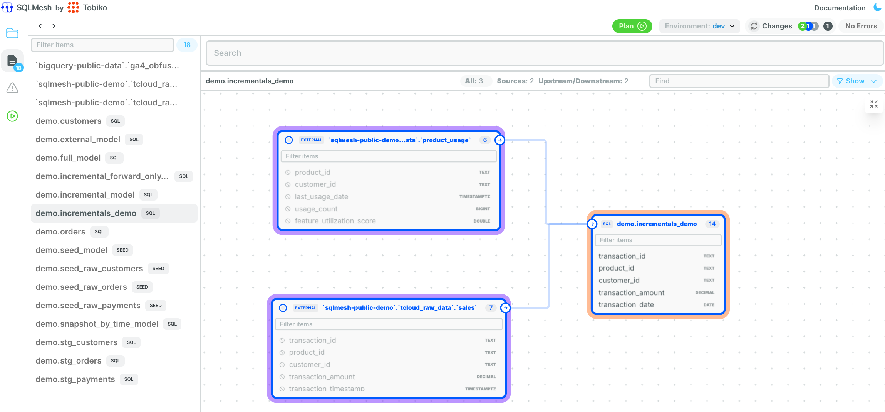

# 時間範囲による増分

<div style="position: relative; padding-bottom: 56.25%; height: 0;"><iframe src="https://www.loom.com/embed/adbedbe48a6547a5b0837c9393209604?sid=5bb751e4-9299-4106-9cb9-22677fc42dee" frameborder="0" webkitallowfullscreen mozallowfullscreen allowfullscreen style="position: absolute; top: 0; left: 0; width: 100%; height: 100%;"></iframe></div>

SQLMesh 増分モデルは、多様なフレーバーと構成が用意された強力な機能です。豊富なガードレールを活用して、クエリのパフォーマンスとスケジュール実行を **正確に** 望みどおりに微調整できます。

しかしながら、この強力な機能には、お客様が自信を持って成功できるよう万全を期す責任が伴うことも認識しています。

ここでは、明確なストーリー課題を段階的に解説します。最終的な目標は、この新しいワークフローで以下のことを実現できるようになることです。

- SQLMesh 増分モデルを使用してデータ変換の問題を解決する方法のメンタルモデルを構築する
- どの構成を更新する必要があるか、その理由を把握する
- 一連の `sqlmesh` コマンドを実行し、何が実行されているか、その理由を正確に把握する
- さまざまなアプローチ間のトレードオフを理解し、ユースケースに最適な決定を下す
- データ変換パイプラインの実行にかかる貴重な時間とコストを節約する

## ストーリー課題

私は、顧客にソフトウェアを直接販売する企業で働くデータエンジニアです。 1日あたり数百万件の取引がある売上データがあり、他の生データソースからディメンションを追加して、売上/製品のトレンドをより深く理解したいと考えています。

そのため、次のような2つの生データソースがあります。

- ソース A: 生の売上データを抽出し、1時間ごとにデータウェアハウス（BigQuery、Snowflake、Databricksなど）にロードします。
- ソース B: バックエンドデータベース（Postgresなど）から製品使用状況を抽出し、毎日データウェアハウスにロードします。

一見すると、これは簡単なことのように見えます。しかし、これを構築し、適切に維持するためにはどのような成功が求められるかを改めて考えてみると、解決すべき問題がたくさんあります。ご安心ください。これらの質問はすべて最後にお答えします。

- 遅れて到着するデータはどのように処理すればよいですか？
- UTCとPST（カリフォルニア）のタイムスタンプをどのように考慮すればよいですか？変換する必要がありますか？
- どのようなスケジュールで実行すればよいですか？
- このデータをどのようにテストすればよいですか？
- これを高速に実行し、必要な間隔（つまりパーティション）のみで実行するにはどうすればよいですか？
- 数か月前の誤ったデータでエッジケースエラーが発生した場合、どのようにパッチを変更すればよいですか？
- これに対するユニットテストはどのような感じでしょうか？
- 未処理または不完全な間隔によるデータギャップを防ぐにはどうすればよいですか？
- 不完全な間隔を処理しても大丈夫ですか（部分的な処理を許可するなど）？
- 最新のデータを得るために、どのようなトレードオフを許容できますか？
- 開発中にこれを複雑に感じさせないようにするにはどうすればよいですか？
- SQLMesh が期待どおりに動作していることをどのように確認すればよいですか？

## 開発ワークフロー

SQLMesh を使用する際は、以下の一般的な手順に従います。

1. `sqlmesh plan dev`: 新しい SQL モデル用の開発環境を作成します。
2. `sqlmesh fetchdf`: 開発環境でデータをプレビューします。
3. `sqlmesh create_external_models`: 生のソーステーブルの列レベルのリネージに関するドキュメントを自動生成します。
4. `sqlmesh plan`: モデルを開発環境から本番環境へプロモートします。
5. `sqlmesh plan dev --forward-only`: さらにコードを変更し、変更後のコードに基づいて新しいデータのみを処理します。履歴データはそのまま残します
6. `sqlmesh fetchdf`: 開発環境でデータをプレビューします
7. `sqlmesh create_test`: ユニットテストを自動生成します
8. `sqlmesh test`: 作成したユニットテストを実行します
9. `sqlmesh plan`: 開発環境を本番環境に昇格します

> 注: SQLMesh を初めて実行する場合は、まず [CLI クイックスタート](../quickstart/cli.md) に従ってから、この例に戻ることをお勧めします。

## セットアップ

まずは、既存のSQLMeshプロジェクトと、既に本番環境で稼働しているモデルを組み合わせたデモデータを用意してみましょう。

タイムスタンプと主キー/外部キー以外のデータの内容については、あまり深く考えないことをお勧めします。これらはすべて、このガイドのために作成されたものです。

私たちのデータウェアハウスには、以下のようなデータが毎日取り込まれています。

??? "Raw product usage data"

    | product_id | customer_id | last_usage_date           | usage_count | feature_utilization_score | user_segment |
    | ---------- | ----------- | ------------------------- | ----------- | ------------------------- | ------------ |
    | PROD-101   | CUST-001    | 2024-10-25 23:45:00+00:00 | 120         | 0.85                      | enterprise   |
    | PROD-103   | CUST-001    | 2024-10-27 12:30:00+00:00 | 95          | 0.75                      | enterprise   |
    | PROD-102   | CUST-002    | 2024-10-25 15:15:00+00:00 | 150         | 0.92                      | enterprise   |
    | PROD-103   | CUST-002    | 2024-10-26 14:20:00+00:00 | 80          | 0.68                      | enterprise   |
    | PROD-101   | CUST-003    | 2024-10-25 18:30:00+00:00 | 45          | 0.45                      | professional |
    | PROD-102   | CUST-003    | 2024-10-27 19:45:00+00:00 | 30          | 0.35                      | professional |
    | PROD-103   | CUST-004    | 2024-10-25 21:20:00+00:00 | 15          | 0.25                      | starter      |
    | PROD-102   | CUST-005    | 2024-10-25 23:10:00+00:00 | 5           | 0.15                      | starter      |
    | PROD-102   | CUST-006    | 2024-10-26 15:30:00+00:00 | 110         | 0.88                      | enterprise   |
    | PROD-101   | CUST-007    | 2024-10-26 17:45:00+00:00 | 60          | 0.55                      | professional |
    | PROD-103   | CUST-008    | 2024-10-26 22:20:00+00:00 | 25          | 0.30                      | starter      |
    | PROD-101   | CUST-009    | 2024-10-27 05:15:00+00:00 | 75          | 0.65                      | professional |
    | PROD-102   | CUST-010    | 2024-10-27 08:40:00+00:00 | 3           | 0.10                      | starter      |

??? "Raw sales data"

    | transaction_id | product_id | customer_id | transaction_amount | transaction_timestamp     | payment_method | currency |
    | -------------- | ---------- | ----------- | ------------------ | ------------------------- | -------------- | -------- |
    | TX-001         | PROD-101   | CUST-001    | 99.99              | 2024-10-25 08:30:00+00:00 | credit_card    | USD      |
    | TX-002         | PROD-102   | CUST-002    | 149.99             | 2024-10-25 09:45:00+00:00 | paypal         | USD      |
    | TX-003         | PROD-101   | CUST-003    | 99.99              | 2024-10-25 15:20:00+00:00 | credit_card    | USD      |
    | TX-004         | PROD-103   | CUST-004    | 299.99             | 2024-10-25 18:10:00+00:00 | credit_card    | USD      |
    | TX-005         | PROD-102   | CUST-005    | 149.99             | 2024-10-25 21:30:00+00:00 | debit_card     | USD      |
    | TX-006         | PROD-101   | CUST-001    | 99.99              | 2024-10-26 03:15:00+00:00 | credit_card    | USD      |
    | TX-007         | PROD-103   | CUST-002    | 299.99             | 2024-10-26 07:45:00+00:00 | paypal         | USD      |
    | TX-008         | PROD-102   | CUST-006    | 149.99             | 2024-10-26 11:20:00+00:00 | credit_card    | USD      |
    | TX-009         | PROD-101   | CUST-007    | 99.99              | 2024-10-26 14:30:00+00:00 | debit_card     | USD      |
    | TX-010         | PROD-103   | CUST-008    | 299.99             | 2024-10-26 19:45:00+00:00 | credit_card    | USD      |
    | TX-011         | PROD-101   | CUST-009    | 99.99              | 2024-10-27 02:30:00+00:00 | paypal         | USD      |
    | TX-012         | PROD-102   | CUST-010    | 149.99             | 2024-10-27 05:15:00+00:00 | credit_card    | USD      |
    | TX-013         | PROD-103   | CUST-001    | 299.99             | 2024-10-27 08:40:00+00:00 | credit_card    | USD      |
    | TX-014         | PROD-101   | CUST-002    | 99.99              | 2024-10-27 13:25:00+00:00 | debit_card     | USD      |
    | TX-015         | PROD-102   | CUST-003    | 149.99             | 2024-10-27 16:50:00+00:00 | credit_card    | USD      |

??? "BigQueryにデータをロードするコード"

    一緒に進めたい方は、BigQuery SQLクエリを簡単に実行できるものをご用意しました。クエリコンソールで直接実行してください。ご自身のデータウェアハウスに合わせて調整してください。

    ```sql
    -- Create the product_usage table with appropriate schema
    CREATE OR REPLACE TABLE `sqlmesh-public-demo.tcloud_raw_data.product_usage` (
        product_id STRING NOT NULL,
        customer_id STRING NOT NULL,
        last_usage_date TIMESTAMP NOT NULL,
        usage_count INT64 NOT NULL,
        feature_utilization_score FLOAT64 NOT NULL,
        user_segment STRING NOT NULL,
    );

    -- Insert the data
    INSERT INTO `sqlmesh-public-demo.tcloud_raw_data.product_usage`
    (product_id, customer_id, last_usage_date, usage_count, feature_utilization_score, user_segment)
    VALUES
        ('PROD-101', 'CUST-001', TIMESTAMP '2024-10-25 23:45:00+00:00', 120, 0.85, 'enterprise'),
        ('PROD-103', 'CUST-001', TIMESTAMP '2024-10-27 12:30:00+00:00', 95, 0.75, 'enterprise'),
        ('PROD-102', 'CUST-002', TIMESTAMP '2024-10-25 15:15:00+00:00', 150, 0.92, 'enterprise'),
        ('PROD-103', 'CUST-002', TIMESTAMP '2024-10-26 14:20:00+00:00', 80, 0.68, 'enterprise'),
        ('PROD-101', 'CUST-003', TIMESTAMP '2024-10-25 18:30:00+00:00', 45, 0.45, 'professional'),
        ('PROD-102', 'CUST-003', TIMESTAMP '2024-10-27 19:45:00+00:00', 30, 0.35, 'professional'),
        ('PROD-103', 'CUST-004', TIMESTAMP '2024-10-25 21:20:00+00:00', 15, 0.25, 'starter'),
        ('PROD-102', 'CUST-005', TIMESTAMP '2024-10-25 23:10:00+00:00', 5, 0.15, 'starter'),
        ('PROD-102', 'CUST-006', TIMESTAMP '2024-10-26 15:30:00+00:00', 110, 0.88, 'enterprise'),
        ('PROD-101', 'CUST-007', TIMESTAMP '2024-10-26 17:45:00+00:00', 60, 0.55, 'professional'),
        ('PROD-103', 'CUST-008', TIMESTAMP '2024-10-26 22:20:00+00:00', 25, 0.30, 'starter'),
        ('PROD-101', 'CUST-009', TIMESTAMP '2024-10-27 05:15:00+00:00', 75, 0.65, 'professional'),
        ('PROD-102', 'CUST-010', TIMESTAMP '2024-10-27 08:40:00+00:00', 3, 0.10, 'starter');

    ```

    ```sql
    --Create the sales table with appropriate schema
    CREATE OR REPLACE TABLE `sqlmesh-public-demo.tcloud_raw_data.sales` (
        transaction_id STRING NOT NULL,
        product_id STRING NOT NULL,
        customer_id STRING NOT NULL,
        transaction_amount NUMERIC(10,2) NOT NULL,
        transaction_timestamp TIMESTAMP NOT NULL,
        payment_method STRING,
        currency STRING,
    );

    -- Then, insert the data
    INSERT INTO `sqlmesh-public-demo.tcloud_raw_data.sales`
    (transaction_id, product_id, customer_id, transaction_amount, transaction_timestamp, payment_method, currency)
    VALUES
        ('TX-001', 'PROD-101', 'CUST-001', 99.99, TIMESTAMP '2024-10-25 08:30:00+00:00', 'credit_card', 'USD'),
        ('TX-002', 'PROD-102', 'CUST-002', 149.99, TIMESTAMP '2024-10-25 09:45:00+00:00', 'paypal', 'USD'),
        ('TX-003', 'PROD-101', 'CUST-003', 99.99, TIMESTAMP '2024-10-25 15:20:00+00:00', 'credit_card', 'USD'),
        ('TX-004', 'PROD-103', 'CUST-004', 299.99, TIMESTAMP '2024-10-25 18:10:00+00:00', 'credit_card', 'USD'),
        ('TX-005', 'PROD-102', 'CUST-005', 149.99, TIMESTAMP '2024-10-25 21:30:00+00:00', 'debit_card', 'USD'),
        ('TX-006', 'PROD-101', 'CUST-001', 99.99, TIMESTAMP '2024-10-26 03:15:00+00:00', 'credit_card', 'USD'),
        ('TX-007', 'PROD-103', 'CUST-002', 299.99, TIMESTAMP '2024-10-26 07:45:00+00:00', 'paypal', 'USD'),
        ('TX-008', 'PROD-102', 'CUST-006', 149.99, TIMESTAMP '2024-10-26 11:20:00+00:00', 'credit_card', 'USD'),
        ('TX-009', 'PROD-101', 'CUST-007', 99.99, TIMESTAMP '2024-10-26 14:30:00+00:00', 'debit_card', 'USD'),
        ('TX-010', 'PROD-103', 'CUST-008', 299.99, TIMESTAMP '2024-10-26 19:45:00+00:00', 'credit_card', 'USD'),
        ('TX-011', 'PROD-101', 'CUST-009', 99.99, TIMESTAMP '2024-10-27 02:30:00+00:00', 'paypal', 'USD'),
        ('TX-012', 'PROD-102', 'CUST-010', 149.99, TIMESTAMP '2024-10-27 05:15:00+00:00', 'credit_card', 'USD'),
        ('TX-013', 'PROD-103', 'CUST-001', 299.99, TIMESTAMP '2024-10-27 08:40:00+00:00', 'credit_card', 'USD'),
        ('TX-014', 'PROD-101', 'CUST-002', 99.99, TIMESTAMP '2024-10-27 13:25:00+00:00', 'debit_card', 'USD'),
        ('TX-015', 'PROD-102', 'CUST-003', 149.99, TIMESTAMP '2024-10-27 16:50:00+00:00', 'credit_card', 'USD');
    ```

## モデル構成

モデルの構成と、事前に準備したビジネスロジック/コードを組み合わせることで、上記の質問のいくつかに答えることができます。

このコードは、SQLMesh プロジェクトのコンテキストで [こちら](https://github.com/sungchun12/sqlmesh-demos/blob/incremental-demo/models/examples/incremental_model.sql) で確認できます。

```sql
MODEL (
  name demo.incrementals_demo,
  kind INCREMENTAL_BY_TIME_RANGE (
    -- How does this model kind behave?
    --   DELETE by time range, then INSERT
    time_column transaction_date,

    -- How do I handle late-arriving data?
    --   Handle late-arriving events for the past 2 (2*1) days based on cron
    --   interval. Each time it runs, it will process today, yesterday, and
    --   the day before yesterday.
    lookback 2,
  ),

  -- Don't backfill data before this date
  start '2024-10-25',

  -- What schedule should I run these at?
  --   Daily at Midnight UTC
  cron '@daily',

  -- Good documentation for the primary key
  grain transaction_id,

  -- How do I test this data?
  --   Validate that the `transaction_id` primary key values are both unique
  --   and non-null. Data audit tests only run for the processed intervals,
  --   not for the entire table.
  audits (
    UNIQUE_VALUES(columns = (transaction_id)),
    NOT_NULL(columns = (transaction_id))
  )
);

WITH sales_data AS (
  SELECT
    transaction_id,
    product_id,
    customer_id,
    transaction_amount,
    -- How do I account for UTC vs. PST (California baby) timestamps?
    --   Make sure all time columns are in UTC and convert them to PST in the
    --   presentation layer downstream.
    transaction_timestamp,
    payment_method,
    currency
  FROM sqlmesh-public-demo.tcloud_raw_data.sales  -- Source A: sales data
  -- How do I make this run fast and only process the necessary intervals?
  --   Use our date macros that will automatically run the necessary intervals.
  --   Because SQLMesh manages state, it will know what needs to run each time
  --   you invoke `sqlmesh run`.
  WHERE transaction_timestamp BETWEEN @start_dt AND @end_dt
),

product_usage AS (
  SELECT
    product_id,
    customer_id,
    last_usage_date,
    usage_count,
    feature_utilization_score,
    user_segment
  FROM sqlmesh-public-demo.tcloud_raw_data.product_usage  -- Source B
  -- Include usage data from the 30 days before the interval
  WHERE last_usage_date BETWEEN DATE_SUB(@start_dt, INTERVAL 30 DAY) AND @end_dt
)

SELECT
  s.transaction_id,
  s.product_id,
  s.customer_id,
  s.transaction_amount,
  -- Extract the date from the timestamp to partition by day
  DATE(s.transaction_timestamp) as transaction_date,
  -- Convert timestamp to PST using a SQL function in the presentation layer for end users
  DATETIME(s.transaction_timestamp, 'America/Los_Angeles') as transaction_timestamp_pst,
  s.payment_method,
  s.currency,
  -- Product usage metrics
  p.last_usage_date,
  p.usage_count,
  p.feature_utilization_score,
  p.user_segment,
  -- Derived metrics
  CASE
    WHEN p.usage_count > 100 AND p.feature_utilization_score > 0.8 THEN 'Power User'
    WHEN p.usage_count > 50 THEN 'Regular User'
    WHEN p.usage_count IS NULL THEN 'New User'
    ELSE 'Light User'
  END as user_type,
  -- Time since last usage
  DATE_DIFF(s.transaction_timestamp, p.last_usage_date, DAY) as days_since_last_usage
FROM sales_data s
LEFT JOIN product_usage p
  ON s.product_id = p.product_id
  AND s.customer_id = p.customer_id
```

## モデルの作成

既に本番環境にデータが存在する既存の SQLMesh プロジェクトに対して、初めてこのモデルを作成します。そのため、`dev` 環境で実行してみましょう。

以下のコマンドを実行して、この増分モデルを `dev` 環境に追加します。

```bash
sqlmesh plan dev
```

*注: 執筆時点では `sqlmesh` バージョン `0.132.1` を使用しています*

2024年10月25日以降のすべての履歴をバックフィルするため、日付プロンプトで Enter キーを押し続けます。

```bash
(venv) ✗ sqlmesh plan dev
======================================================================
Successfully Ran 2 tests against duckdb
----------------------------------------------------------------------
New environment `dev` will be created from `prod`

Differences from the `prod` environment:

Models:
└── Added:
    └── demo__dev.incrementals_demo
Models needing backfill (missing dates):
└── demo__dev.incrementals_demo: 2024-10-25 - 2024-11-04
Enter the backfill start date (eg. '1 year', '2020-01-01') or blank to backfill from the beginning of history:
Enter the backfill end date (eg. '1 month ago', '2020-01-01') or blank to backfill up until now:
Apply - Backfill Tables [y/n]: y
[1/1] demo__dev.incrementals_demo evaluated in 6.97s
Evaluating models ━━━━━━━━━━━━━━━━━━━━━━━━━━━━━━━━━━━━━━━━ 100.0% • 1/1 • 0:00:06


All model batches have been executed successfully

Virtually Updating 'dev' ━━━━━━━━━━━━━━━━━━━━━━━━━━━━━━━━━━━━━━━━ 100.0% • 0:00:01

The target environment has been updated successfully
```

今、私は「これが期待通りの動作をしていることを確認するために、具体的にどのようなSQLクエリが実行されているのだろうか？」と考えていました。

この一連のクエリは、まさにクエリエンジンで実行されているものです。トグルをクリックすると、SQLクエリが表示されます。

??? "適切なスキーマとバージョン管理された空のテーブルを作成する (ex: `__50975949`)"

    ```sql
    CREATE TABLE IF NOT EXISTS `sqlmesh-public-demo`.`sqlmesh__demo`.`demo__incrementals_demo__50975949` (
      `transaction_id` STRING,
      `product_id` STRING,
      `customer_id` STRING,
      `transaction_amount` NUMERIC,
      `transaction_date` DATE OPTIONS (description='We extract the date from the timestamp to partition by day'),
      `transaction_timestamp_pst` DATETIME OPTIONS (description='Convert this to PST using a SQL function'),
      `payment_method` STRING,
      `currency` STRING,
      `last_usage_date` TIMESTAMP,
      `usage_count` INT64,
      `feature_utilization_score` FLOAT64,
      `user_segment` STRING,
      `user_type` STRING OPTIONS (description='Derived metrics'),
      `days_since_last_usage` INT64 OPTIONS (description='Time since last usage')
      )
      PARTITION BY `transaction_date`
    ```

??? "データを処理する前にSQLを検証します（「WHERE FALSE LIMIT 0」とプレースホルダーのタイムスタンプに注意してください）"

    ```sql
    WITH `sales_data` AS (
      SELECT
        `sales`.`transaction_id` AS `transaction_id`,
        `sales`.`product_id` AS `product_id`,
        `sales`.`customer_id` AS `customer_id`,
        `sales`.`transaction_amount` AS `transaction_amount`,
        `sales`.`transaction_timestamp` AS `transaction_timestamp`,
        `sales`.`payment_method` AS `payment_method`,
        `sales`.`currency` AS `currency`
      FROM `sqlmesh-public-demo`.`tcloud_raw_data`.`sales` AS `sales`
      WHERE (
        `sales`.`transaction_timestamp` <= CAST('1970-01-01 23:59:59.999999+00:00' AS TIMESTAMP) AND
        `sales`.`transaction_timestamp` >= CAST('1970-01-01 00:00:00+00:00' AS TIMESTAMP)) AND
        FALSE
    ),
    `product_usage` AS (
      SELECT
        `product_usage`.`product_id` AS `product_id`,
        `product_usage`.`customer_id` AS `customer_id`,
        `product_usage`.`last_usage_date` AS `last_usage_date`,
        `product_usage`.`usage_count` AS `usage_count`,
        `product_usage`.`feature_utilization_score` AS `feature_utilization_score`,
        `product_usage`.`user_segment` AS `user_segment`
      FROM `sqlmesh-public-demo`.`tcloud_raw_data`.`product_usage` AS `product_usage`
      WHERE (
        `product_usage`.`last_usage_date` <= CAST('1970-01-01 23:59:59.999999+00:00' AS TIMESTAMP) AND
        `product_usage`.`last_usage_date` >= CAST('1969-12-02 00:00:00+00:00' AS TIMESTAMP)
        ) AND
        FALSE
    )

    SELECT
      `s`.`transaction_id` AS `transaction_id`,
      `s`.`product_id` AS `product_id`,
      `s`.`customer_id` AS `customer_id`,
      CAST(`s`.`transaction_amount` AS NUMERIC) AS `transaction_amount`,
      DATE(`s`.`transaction_timestamp`) AS `transaction_date`,
      DATETIME(`s`.`transaction_timestamp`, 'America/Los_Angeles') AS `transaction_timestamp_pst`,
      `s`.`payment_method` AS `payment_method`,
      `s`.`currency` AS `currency`,
      `p`.`last_usage_date` AS `last_usage_date`,
      `p`.`usage_count` AS `usage_count`,
      `p`.`feature_utilization_score` AS `feature_utilization_score`,
      `p`.`user_segment` AS `user_segment`,
      CASE
        WHEN `p`.`feature_utilization_score` > 0.8 AND `p`.`usage_count` > 100 THEN 'Power User'
        WHEN `p`.`usage_count` > 50 THEN 'Regular User'
        WHEN `p`.`usage_count` IS NULL THEN 'New User'
        ELSE 'Light User'
      END AS `user_type`,
      DATE_DIFF(`s`.`transaction_timestamp`, `p`.`last_usage_date`, DAY) AS `days_since_last_usage`
    FROM `sales_data` AS `s`
    LEFT JOIN `product_usage` AS `p`
      ON `p`.`customer_id` = `s`.`customer_id` AND
      `p`.`product_id` = `s`.`product_id`
    WHERE FALSE
    LIMIT 0
    ```

??? "空のテーブルにデータを結合する"

    ```sql
    MERGE INTO `sqlmesh-public-demo`.`sqlmesh__demo`.`demo__incrementals_demo__50975949` AS `__MERGE_TARGET__` USING (
      WITH `sales_data` AS (
        SELECT
          `transaction_id`,
          `product_id`,
          `customer_id`,
          `transaction_amount`,
          `transaction_timestamp`,
          `payment_method`,
          `currency`
        FROM `sqlmesh-public-demo`.`tcloud_raw_data`.`sales` AS `sales`
        WHERE `transaction_timestamp` BETWEEN CAST('2024-10-25 00:00:00+00:00' AS TIMESTAMP) AND CAST('2024-11-04 23:59:59.999999+00:00' AS TIMESTAMP)
      ),
      `product_usage` AS (
        SELECT
          `product_id`,
          `customer_id`,
          `last_usage_date`,
          `usage_count`,
          `feature_utilization_score`,
          `user_segment`
        FROM `sqlmesh-public-demo`.`tcloud_raw_data`.`product_usage` AS `product_usage`
        WHERE `last_usage_date` BETWEEN DATE_SUB(CAST('2024-10-25 00:00:00+00:00' AS TIMESTAMP), INTERVAL '30' DAY) AND CAST('2024-11-04 23:59:59.999999+00:00' AS TIMESTAMP)
      )

      SELECT
        `transaction_id`,
        `product_id`,
        `customer_id`,
        `transaction_amount`,
        `transaction_date`,
        `transaction_timestamp_pst`,
        `payment_method`,
        `currency`,
        `last_usage_date`,
        `usage_count`,
        `feature_utilization_score`,
        `user_segment`,
        `user_type`,
        `days_since_last_usage`
      FROM (
        SELECT
          `s`.`transaction_id` AS `transaction_id`,
          `s`.`product_id` AS `product_id`,
          `s`.`customer_id` AS `customer_id`,
          `s`.`transaction_amount` AS `transaction_amount`,
          DATE(`s`.`transaction_timestamp`) AS `transaction_date`,
          DATETIME(`s`.`transaction_timestamp`, 'America/Los_Angeles') AS `transaction_timestamp_pst`,
          `s`.`payment_method` AS `payment_method`,
          `s`.`currency` AS `currency`,
          `p`.`last_usage_date` AS `last_usage_date`,
          `p`.`usage_count` AS `usage_count`,
          `p`.`feature_utilization_score` AS `feature_utilization_score`,
          `p`.`user_segment` AS `user_segment`,
          CASE
            WHEN `p`.`usage_count` > 100 AND `p`.`feature_utilization_score` > 0.8 THEN 'Power User'
            WHEN `p`.`usage_count` > 50 THEN 'Regular User'
            WHEN `p`.`usage_count` IS NULL THEN 'New User'
            ELSE 'Light User'
          END AS `user_type`,
          DATE_DIFF(`s`.`transaction_timestamp`, `p`.`last_usage_date`, DAY) AS `days_since_last_usage`
        FROM `sales_data` AS `s`
        LEFT JOIN `product_usage` AS `p`
          ON `s`.`product_id` = `p`.`product_id`
          AND `s`.`customer_id` = `p`.`customer_id`
      ) AS `_subquery`
      WHERE `transaction_date` BETWEEN CAST('2024-10-25' AS DATE) AND CAST('2024-11-04' AS DATE)
    ) AS `__MERGE_SOURCE__`
    ON FALSE
    WHEN NOT MATCHED BY SOURCE AND `transaction_date` BETWEEN CAST('2024-10-25' AS DATE) AND CAST('2024-11-04' AS DATE) THEN DELETE
    WHEN NOT MATCHED THEN
      INSERT (
        `transaction_id`, `product_id`, `customer_id`, `transaction_amount`, `transaction_date`, `transaction_timestamp_pst`,
        `payment_method`, `currency`, `last_usage_date`, `usage_count`, `feature_utilization_score`, `user_segment`, `user_type`,
        `days_since_last_usage`
      )
      VALUES (
        `transaction_id`, `product_id`, `customer_id`, `transaction_amount`, `transaction_date`, `transaction_timestamp_pst`,
        `payment_method`, `currency`, `last_usage_date`, `usage_count`, `feature_utilization_score`, `user_segment`, `user_type`,
        `days_since_last_usage`
      )
    ```

??? "データ監査を実行して、`transaction_id` が一意であり、null ではないかどうかをテストします (SQL は自動的に生成されます)"

    `UNIQUE_VALUES()` audit
    ```sql
    SELECT
      COUNT(*)
    FROM (
      SELECT *
      FROM (
        SELECT
          ROW_NUMBER() OVER (
            PARTITION BY (`transaction_id`) O
            RDER BY (`transaction_id`)
          ) AS `rank_`
        FROM (
          SELECT *
          FROM `sqlmesh-public-demo`.`sqlmesh__demo`.`demo__incrementals_demo__50975949` AS `demo__incrementals_demo__50975949`
          WHERE `transaction_date` BETWEEN CAST('2024-10-25' AS DATE) AND CAST('2024-11-05' AS DATE)
        ) AS `_q_0`
      WHERE TRUE
    ) AS `_q_1`
    WHERE `rank_` > 1
    ) AS `audit`
    ```

    `NOT_NULL()` audit
    ```sql
    SELECT
      COUNT(*)
    FROM (
      SELECT *
      FROM (
        SELECT *
        FROM `sqlmesh-public-demo`.`sqlmesh__demo`.`demo__incrementals_demo__50975949` AS `demo__incrementals_demo__50975949`
        WHERE `transaction_date` BETWEEN CAST('2024-10-25' AS DATE) AND CAST('2024-11-05' AS DATE)
      ) AS `_q_0`
    WHERE
      `transaction_id` IS NULL
      AND TRUE
    ) AS `audit`
    ```

??? "プラン開発環境の名前に基づいて開発スキーマを作成する"

    ```sql
    CREATE SCHEMA IF NOT EXISTS `sqlmesh-public-demo`.`demo__dev`
    ```

??? "この新しいテーブルを正式にクエリするには、仮想レイヤーにビューを作成します。"

    心配しないでください。ビューのパフォーマンスが低下することはありません。最新のクエリ エンジンはプッシュダウン述語を使用してベース テーブルを直接クエリします [例](https://docs.snowflake.com/en/developer-guide/pushdown-optimization)。

    ```sql
    CREATE OR REPLACE VIEW `sqlmesh-public-demo`.`demo__dev`.`incrementals_demo` AS
    SELECT *
    FROM `sqlmesh-public-demo`.`sqlmesh__demo`.`demo__incrementals_demo__50975949`
    ```

それでは、見た目と操作性が希望どおりになっているか確認しましょう。新しい `dev` テーブルにクエリを実行してみましょう。

```bash
sqlmesh fetchdf "select * from demo__dev.incrementals_demo limit 5"
```

```bash
(.venv) ✗ sqlmesh fetchdf "select * from demo__dev.incrementals_demo limit 5"

  transaction_id product_id customer_id transaction_amount transaction_date  ... usage_count feature_utilization_score  user_segment     user_type  days_since_last_usage
0         TX-010   PROD-103    CUST-008      299.990000000       2024-10-26  ...          25                      0.30       starter    Light User                      0
1         TX-008   PROD-102    CUST-006      149.990000000       2024-10-26  ...         110                      0.88    enterprise    Power User                      0
2         TX-006   PROD-101    CUST-001       99.990000000       2024-10-26  ...         120                      0.85    enterprise    Power User                      0
3         TX-009   PROD-101    CUST-007       99.990000000       2024-10-26  ...          60                      0.55  professional  Regular User                      0
4         TX-007   PROD-103    CUST-002      299.990000000       2024-10-26  ...          80                      0.68    enterprise  Regular User                      0

[5 rows x 14 columns]
```

## 列レベルの系統を追跡

開発が順調にスタートしたので、これから1時間かけて大量の `yaml` を手動で記述することなく、この変換ロジックがどのように動作するかをドキュメント化して視覚化したいと考えています。

ありがたいことに、その必要はありません。自動生成される `external_models.yaml` ファイルが `incrementals_demo.sql` モデルを解析し、BigQuery メタデータをクエリしてすべての列とそのデータ型を取得します。すべてきちんとフォーマットされた状態で提供されます。

次のコマンドを実行します。

```bash
sqlmesh create_external_models
```

```yaml
# external_models.yaml
- name: '`sqlmesh-public-demo`.`tcloud_raw_data`.`product_usage`'
  columns:
    product_id: STRING
    customer_id: STRING
    last_usage_date: TIMESTAMP
    usage_count: INT64
    feature_utilization_score: FLOAT64
    user_segment: STRING
- name: '`sqlmesh-public-demo`.`tcloud_raw_data`.`sales`'
  columns:
    transaction_id: STRING
    product_id: STRING
    customer_id: STRING
    transaction_amount: NUMERIC(10,2)
    transaction_timestamp: TIMESTAMP
    payment_method: STRING
    currency: STRING
```

ここで、ターミナルで以下のコマンドを実行し、リンクをクリックすると、ブラウザが開き、よく知っている列レベルの系統が表示されます。

```bash
sqlmesh ui
```

```bash
(venv) ✗ sqlmesh ui
INFO:     Started server process [89705]
INFO:     Waiting for application startup.
INFO:     Application startup complete.
INFO:     Uvicorn running on http://127.0.0.1:8000 (Press CTRL+C to quit)
```



`demo.incrementals_demo` で列をクリックすると、その列がソースまでトレースされます！


通常、これらの変更は [このデモのプルリクエスト](https://github.com/TobikoData/tobiko-cloud-demo/pull/4) に示されているように、SQLMesh のオープンソース GitHub CICD ボットを使用して本番環境にプロモートしますが、このガイドを簡潔にするために、`sqlmesh plan` を直接実行してみましょう。

ここで、「無駄のないデータ変換」という主張が実感できます。私は開発環境でこの素晴らしい作業をすべて行っており、本番環境ではストレージの再処理と複製に慣れています。しかし、SQLMesh はデフォルトでこれらをすべてバイパスし、`dev` で作成された同じ物理テーブルを指す新しいビューを作成します。クエリ履歴で実際に確認できます。

```bash
(venv) ✗ sqlmesh plan
======================================================================
Successfully Ran 2 tests against duckdb
----------------------------------------------------------------------
Differences from the `prod` environment:

Models:
├── Added:
    ├── demo.incrementals_demo
    ├── tcloud_raw_data.product_usage
    └── tcloud_raw_data.sales
Apply - Virtual Update [y/n]: y

SKIP: No physical layer updates to perform

SKIP: No model batches to execute

Virtually Updating 'prod' ━━━━━━━━━━━━━━━━━━━━━━━━━━━━━━━━━━━━━━━━ 100.0% • 0:00:02

The target environment has been updated successfully
```

??? "存在しない場合は本番スキーマを作成する"

    ```sql
    CREATE SCHEMA IF NOT EXISTS `sqlmesh-public-demo`.`demo`
    ```

??? "ビューの製品版を作成します。SQLMesh はここで、既に行った大変な作業を再利用します。"

    ```sql
    CREATE OR REPLACE VIEW `sqlmesh-public-demo`.`demo`.`incrementals_demo` AS
    SELECT *
    FROM `sqlmesh-public-demo`.`sqlmesh__demo`.`demo__incrementals_demo__3076101542`
    ```

??? "データ監査を実行して、`transaction_id` が一意であり、null ではないかどうかをテストします (SQL は自動的に生成されます)"

    **見ていただきました！開発段階で既に合格した監査を再実行する必要はありません。**

## 変更の実施

このワークフローを一通りこなすのはなかなか良い感じですが、ここからがデータエンジニアとしての私の仕事の大部分を占める部分です。

- 変更の実施
- 変更内容のテスト
- 変更内容を安全かつ確実に本番環境にプロモートする

例えば、パワーユーザーの定義をコード内で変更したいのですが、これは定義を拡張したいという理由だけで、変更は行いません。ただし、従来のパワーユーザーの定義は維持したいと考えています。

一見すると、これは非常に複雑な操作で、カスタム `DML` 操作では難しそうに思えるかもしれませんが、幸いなことに SQLMesh にはこの問題を解決するネイティブな方法があります。

まず、SQL ロジックのしきい値を下げる変更を行います。

```sql
CASE
  WHEN p.usage_count > 50 AND p.feature_utilization_score > 0.5 THEN 'Power User'
```

前回とは異なり、`sqlmesh plan dev --forward-only` を `--forward-only` フラグ付きで実行します。これにより、SQLMesh は変更されたモデルを既存のすべてのデータに対して実行しないように指示されます。

ターミナル出力では、以前と同じように変更内容が表示されますが、新しい日付プロンプトがいくつか表示されます。

[有効日](../concepts/plans.md#effective-date) プロンプトは空白のままにしておきます。これは、`prod` で履歴データを再処理したくないためです。この新しいビジネスロジックは今後のみ適用します。

ただし、`prod` にプッシュする前に、`dev` 環境で新しいビジネスロジックをプレビューする必要があります。 `config.yaml` ファイルで、前方参照のみのモデルに対して [プレビューを作成するように SQLMesh を設定](https://github.com/TobikoData/sqlmesh-demos/blob/e0e3899e173cf7b8447ae707402a9df59911d1c0/config.yaml#L42) したため、SQLMesh によって `dev` 環境に `prod` テーブルの一時コピーが作成され、履歴データで新しいロジックをテストできるようになりました。

プレビュー開始日のプロンプトで、プレビューの履歴データ ウィンドウの開始日を `2024-10-27` に指定し、プレビュー終了日のプロンプトを空白のままにして、ウィンドウの終了日を現在に指定します。

```bash
sqlmesh plan dev --forward-only
```

```bash
(venv) ➜  sqlmesh-demos git:(incremental-demo) ✗ sqlmesh plan dev --forward-only
======================================================================
Successfully Ran 2 tests against duckdb
----------------------------------------------------------------------
Differences from the `dev` environment:

Models:
└── Directly Modified:
    └── demo__dev.incrementals_demo
---

+++

@@ -57,7 +57,7 @@

   p.feature_utilization_score,
   p.user_segment,
   CASE
-    WHEN p.usage_count > 100 AND p.feature_utilization_score > 0.6
+    WHEN p.usage_count > 50 AND p.feature_utilization_score > 0.5
     THEN 'Power User'
     WHEN p.usage_count > 50
     THEN 'Regular User'
Directly Modified: demo__dev.incrementals_demo (Forward-only)
Enter the effective date (eg. '1 year', '2020-01-01') to apply forward-only changes retroactively or blank to only apply them going forward once changes
are deployed to prod:
Models needing backfill (missing dates):
└── demo__dev.incrementals_demo: 2024-11-07 - 2024-11-07 (preview)
Enter the preview start date (eg. '1 year', '2020-01-01') or blank to backfill to preview starting from yesterday: 2024-10-27
Enter the preview end date (eg. '1 month ago', '2020-01-01') or blank to preview up until '2024-11-08 00:00:00':
Apply - Preview Tables [y/n]: y
[1/1] demo__dev.incrementals_demo evaluated in 6.18s
Evaluating models ━━━━━━━━━━━━━━━━━━━━━━━━━━━━━━━━━━━━━━━━ 100.0% • 1/1 • 0:00:06


All model batches have been executed successfully

Virtually Updating 'dev' ━━━━━━━━━━━━━━━━━━━━━━━━━━━━━━━━━━━━━━━━ 100.0% • 0:00:01

The target environment has been updated successfully

```

??? "バージョン管理された適切なスキーマを持つ別の空のテーブルを作成します (例: `__2896326998__dev__schema_migration_source`)。"

    ```sql
    CREATE TABLE IF NOT EXISTS `sqlmesh-public-demo`.`sqlmesh__demo`.`demo__incrementals_demo__2896326998__dev__schema_migration_source` (
      `transaction_id` STRING, `product_id` STRING, `customer_id` STRING, `transaction_amount` NUMERIC, `transaction_date` DATE,
      `transaction_timestamp_pst` DATETIME, `payment_method` STRING, `currency` STRING, `last_usage_date` TIMESTAMP, `usage_count` INT64,
      `feature_utilization_score` FLOAT64, `user_segment` STRING, `user_type` STRING, `days_since_last_usage` INT64
    )
    PARTITION BY `transaction_date`
    ```


??? "新しいSQLを検証します（「WHERE FALSE LIMIT 0」とプレースホルダーのタイムスタンプに注意してください）"

    ```sql
    WITH `sales_data` AS (
      SELECT
        `sales`.`transaction_id` AS `transaction_id`,
        `sales`.`product_id` AS `product_id`,
        `sales`.`customer_id` AS `customer_id`,
        `sales`.`transaction_amount` AS `transaction_amount`,
        `sales`.`transaction_timestamp` AS `transaction_timestamp`,
        `sales`.`payment_method` AS `payment_method`,
        `sales`.`currency` AS `currency`
      FROM `sqlmesh-public-demo`.`tcloud_raw_data`.`sales` AS `sales`
      WHERE (
        `sales`.`transaction_timestamp` <= CAST('1970-01-01 23:59:59.999999+00:00' AS TIMESTAMP)
        AND `sales`.`transaction_timestamp` >= CAST('1970-01-01 00:00:00+00:00' AS TIMESTAMP))
        AND FALSE
      ),
    `product_usage` AS (
      SELECT
        `product_usage`.`product_id` AS `product_id`,
        `product_usage`.`customer_id` AS `customer_id`,
        `product_usage`.`last_usage_date` AS `last_usage_date`,
        `product_usage`.`usage_count` AS `usage_count`,
        `product_usage`.`feature_utilization_score` AS `feature_utilization_score`,
        `product_usage`.`user_segment` AS `user_segment`
      FROM `sqlmesh-public-demo`.`tcloud_raw_data`.`product_usage` AS `product_usage`
      WHERE (
        `product_usage`.`last_usage_date` <= CAST('1970-01-01 23:59:59.999999+00:00' AS TIMESTAMP)
        AND `product_usage`.`last_usage_date` >= CAST('1969-12-02 00:00:00+00:00' AS TIMESTAMP))
        AND FALSE
      )
      SELECT
        `s`.`transaction_id` AS `transaction_id`,
        `s`.`product_id` AS `product_id`,
        `s`.`customer_id` AS `customer_id`,
        CAST(`s`.`transaction_amount` AS NUMERIC) AS `transaction_amount`,
        DATE(`s`.`transaction_timestamp`) AS `transaction_date`,
        DATETIME(`s`.`transaction_timestamp`, 'America/Los_Angeles') AS `transaction_timestamp_pst`,
        `s`.`payment_method` AS `payment_method`,
        `s`.`currency` AS `currency`,
        `p`.`last_usage_date` AS `last_usage_date`,
        `p`.`usage_count` AS `usage_count`,
        `p`.`feature_utilization_score` AS `feature_utilization_score`,
        `p`.`user_segment` AS `user_segment`,
        CASE
          WHEN `p`.`feature_utilization_score` > 0.5 AND `p`.`usage_count` > 50 THEN 'Power User'
          WHEN `p`.`usage_count` > 50 THEN 'Regular User'
          WHEN `p`.`usage_count` IS NULL THEN 'New User'
          ELSE 'Light User'
        END AS `user_type`,
        DATE_DIFF(`s`.`transaction_timestamp`, `p`.`last_usage_date`, DAY) AS `days_since_last_usage`
      FROM `sales_data` AS `s`
      LEFT JOIN `product_usage` AS `p` ON
        `p`.`customer_id` = `s`.`customer_id`
        AND `p`.`product_id` = `s`.`product_id`
      WHERE FALSE
      LIMIT 0
    ```

??? "これらの特定のバックフィル日付範囲の物理データを操作できるように、`preview` プロセスでテーブルの **CLONE** を作成します。"

    これは本番環境にデプロイされるときに再利用されません。

    ```sql
    CREATE OR REPLACE TABLE `sqlmesh-public-demo`.`sqlmesh__demo`.`demo__incrementals_demo__2896326998__dev`
    CLONE `sqlmesh-public-demo`.`sqlmesh__demo`.`demo__incrementals_demo__843752089`
    ```

??? "作成中のこの新しくバージョン管理されたテーブルのメタデータを検査して、開発から本番までの旅を適切に追跡できるようにします。"

    このクエリは、テーブルの列名と型に関する `INFORMATION_SCHEMA` メタデータを調べ、SQLMesh の状態としてオブジェクトが期待どおりに存在することを確認します。

    他のアクターがプロジェクトのテーブルにアクセス/変更する可能性があるため、SQLMesh はこの情報を再利用しません。変更されている可能性があるためです。そのため、ログにはこのクエリが何度も実行されていることがわかります。

    ```sql
    WITH `clustering_info` AS (
      SELECT
        `table_catalog`,
        `table_schema`,
        `table_name`,
        STRING_AGG(`column_name` ORDER BY `clustering_ordinal_position`) AS `clustering_key`
      FROM `sqlmesh-public-demo`.`sqlmesh__demo`.`INFORMATION_SCHEMA`.`COLUMNS`
      WHERE `clustering_ordinal_position` IS NOT NULL
      GROUP BY 1, 2, 3
    )
    SELECT
      `table_catalog` AS `catalog`,
      `table_name` AS `name`,
      `table_schema` AS `schema_name`,
      CASE
        WHEN `table_type` = 'BASE TABLE' THEN 'TABLE'
        WHEN `table_type` = 'CLONE' THEN 'TABLE'
        WHEN `table_type` = 'EXTERNAL' THEN 'TABLE'
        WHEN `table_type` = 'SNAPSHOT' THEN 'TABLE'
        WHEN `table_type` = 'VIEW' THEN 'VIEW'
        WHEN `table_type` = 'MATERIALIZED VIEW' THEN 'MATERIALIZED_VIEW'
        ELSE `table_type` END
      AS `type`,
      `ci`.`clustering_key` AS `clustering_key`
    FROM `sqlmesh-public-demo`.`sqlmesh__demo`.`INFORMATION_SCHEMA`.`TABLES`
    LEFT JOIN `clustering_info` AS `ci` USING (`table_catalog`, `table_schema`, `table_name`)
    WHERE `table_name` IN ('demo__incrementals_demo__2896326998__dev')
    ```

??? "メタデータを検査して移行元スキーマのジャーニーを追跡する"

    ```sql
    WITH `clustering_info` AS (
      SELECT
        `table_catalog`,
        `table_schema`,
        `table_name`,
        STRING_AGG(`column_name` ORDER BY `clustering_ordinal_position`) AS `clustering_key`
      FROM `sqlmesh-public-demo`.`sqlmesh__demo`.`INFORMATION_SCHEMA`.`COLUMNS`
      WHERE `clustering_ordinal_position` IS NOT NULL
      GROUP BY 1, 2, 3
    )
    SELECT
      `table_catalog` AS `catalog`,
      `table_name` AS `name`,
      `table_schema` AS `schema_name`,
      CASE
        WHEN `table_type` = 'BASE TABLE' THEN 'TABLE'
        WHEN `table_type` = 'CLONE' THEN 'TABLE'
        WHEN `table_type` = 'EXTERNAL' THEN 'TABLE'
        WHEN `table_type` = 'SNAPSHOT' THEN 'TABLE'
        WHEN `table_type` = 'VIEW' THEN 'VIEW'
        WHEN `table_type` = 'MATERIALIZED VIEW' THEN 'MATERIALIZED_VIEW'
        ELSE `table_type`
        END
      AS `type`,
      `ci`.`clustering_key` AS `clustering_key`
    FROM `sqlmesh-public-demo`.`sqlmesh__demo`.`INFORMATION_SCHEMA`.`TABLES`
    LEFT JOIN `clustering_info` AS `ci` USING (`table_catalog`, `table_schema`, `table_name`)
    WHERE `table_name` IN ('demo__incrementals_demo__2896326998__dev__schema_migration_source')
    ```

??? "適切な状態追跡に必要なメタデータが揃っているので、移行元テーブルを削除します。"

    ```sql
    DROP TABLE IF EXISTS `sqlmesh-public-demo`.`sqlmesh__demo`.`demo__incrementals_demo__2896326998__dev__schema_migration_source`
    ```

??? "2024-10-27 から「現在まで」までの、必要な間隔のみのデータを空のテーブルにマージします。"

    ```sql
    MERGE INTO `sqlmesh-public-demo`.`sqlmesh__demo`.`demo__incrementals_demo__2896326998__dev` AS `__MERGE_TARGET__` USING (
      WITH `sales_data` AS (
        SELECT
          `sales`.`transaction_id` AS `transaction_id`,
          `sales`.`product_id` AS `product_id`,
          `sales`.`customer_id` AS `customer_id`,
          `sales`.`transaction_amount` AS `transaction_amount`,
          `sales`.`transaction_timestamp` AS `transaction_timestamp`,
          `sales`.`payment_method` AS `payment_method`,
          `sales`.`currency` AS `currency`
        FROM `sqlmesh-public-demo`.`tcloud_raw_data`.`sales` AS `sales`
        WHERE
          `sales`.`transaction_timestamp` <= CAST('2024-11-07 23:59:59.999999+00:00' AS TIMESTAMP)
          AND `sales`.`transaction_timestamp` >= CAST('2024-10-27 00:00:00+00:00' AS TIMESTAMP)
      ),
      `product_usage` AS (
        SELECT
          `product_usage`.`product_id` AS `product_id`,
          `product_usage`.`customer_id` AS `customer_id`,
          `product_usage`.`last_usage_date` AS `last_usage_date`,
          `product_usage`.`usage_count` AS `usage_count`,
          `product_usage`.`feature_utilization_score` AS `feature_utilization_score`,
          `product_usage`.`user_segment` AS `user_segment`
        FROM `sqlmesh-public-demo`.`tcloud_raw_data`.`product_usage` AS `product_usage`
        WHERE
          `product_usage`.`last_usage_date` <= CAST('2024-11-07 23:59:59.999999+00:00' AS TIMESTAMP)
          AND `product_usage`.`last_usage_date` >= CAST('2024-09-27 00:00:00+00:00' AS TIMESTAMP)
      )
      SELECT
        `transaction_id`,
        `product_id`,
        `customer_id`,
        `transaction_amount`,
        `transaction_date`,
        `transaction_timestamp_pst`,
        `payment_method`,
        `currency`,
        `last_usage_date`,
        `usage_count`,
        `feature_utilization_score`,
        `user_segment`,
        `user_type`,
        `days_since_last_usage`
      FROM (
        SELECT
          `s`.`transaction_id` AS `transaction_id`,
          `s`.`product_id` AS `product_id`,
          `s`.`customer_id` AS `customer_id`,
          CAST(`s`.`transaction_amount` AS NUMERIC) AS `transaction_amount`,
          DATE(`s`.`transaction_timestamp`) AS `transaction_date`,
          DATETIME(`s`.`transaction_timestamp`, 'America/Los_Angeles') AS `transaction_timestamp_pst`,
          `s`.`payment_method` AS `payment_method`,
          `s`.`currency` AS `currency`,
          `p`.`last_usage_date` AS `last_usage_date`,
          `p`.`usage_count` AS `usage_count`,
          `p`.`feature_utilization_score` AS `feature_utilization_score`,
          `p`.`user_segment` AS `user_segment`,
          CASE
            WHEN `p`.`feature_utilization_score` > 0.5 AND `p`.`usage_count` > 50 THEN 'Power User'
            WHEN `p`.`usage_count` > 50 THEN 'Regular User'
            WHEN `p`.`usage_count` IS NULL THEN 'New User'
            ELSE 'Light User'
            END
          AS `user_type`,
          DATE_DIFF(`s`.`transaction_timestamp`, `p`.`last_usage_date`, DAY) AS `days_since_last_usage`
        FROM `sales_data` AS `s`
        LEFT JOIN `product_usage` AS `p` ON
          `p`.`customer_id` = `s`.`customer_id`
          AND `p`.`product_id` = `s`.`product_id`
      ) AS `_subquery`
      WHERE `transaction_date` BETWEEN CAST('2024-10-27' AS DATE) AND CAST('2024-11-07' AS DATE)
    ) AS `__MERGE_SOURCE__
    ON FALSE
    WHEN NOT MATCHED BY SOURCE AND `transaction_date` BETWEEN CAST('2024-10-27' AS DATE) AND CAST('2024-11-07' AS DATE) THEN DELETE
    WHEN NOT MATCHED THEN INSERT (
      `transaction_id`, `product_id`, `customer_id`, `transaction_amount`, `transaction_date`, `transaction_timestamp_pst`,
      `payment_method`, `currency`, `last_usage_date`, `usage_count`, `feature_utilization_score`, `user_segment`, `user_type`,
      `days_since_last_usage`)
      VALUES (`transaction_id`, `product_id`, `customer_id`, `transaction_amount`, `transaction_date`, `transaction_timestamp_pst`,
      `payment_method`, `currency`, `last_usage_date`, `usage_count`, `feature_utilization_score`, `user_segment`, `user_type`,
      `days_since_last_usage`)
    ```

??? "データ監査を実行して、`transaction_id` が一意であり、null ではないかどうかをテストします。"

    プレビューデータの範囲（スコープ：2024年10月27日から現在まで）に対してSQLが自動生成されます。

    `UNIQUE_VALUES()` 監査
    ```sql
    SELECT
      COUNT(*)
    FROM (
      SELECT *
      FROM (
        SELECT ROW_NUMBER() OVER (
          PARTITION BY (`transaction_id`)
          ORDER BY (`transaction_id`)
          ) AS `rank_`
        FROM (
          SELECT *
          FROM `sqlmesh-public-demo`.`sqlmesh__demo`.`demo__incrementals_demo__2896326998__dev` AS `demo__incrementals_demo__2896326998__dev`
          WHERE `transaction_date` BETWEEN CAST('2024-10-27' AS DATE) AND CAST('2024-11-08' AS DATE)
        ) AS `_q_0`
      WHERE TRUE
      ) AS `_q_1`
    WHERE `rank_` > 1
    ) AS `audit`
    ```

    `NOT_NULL()` 監査
    ```sql
    SELECT
      COUNT(*)
    FROM (
        SELECT *
        FROM (
          SELECT *
          FROM `sqlmesh-public-demo`.`sqlmesh__demo`.`demo__incrementals_demo__2896326998__dev` AS `demo__incrementals_demo__2896326998__dev`
        WHERE `transaction_date` BETWEEN CAST('2024-10-27' AS DATE) AND CAST('2024-11-08' AS DATE)
      ) AS `_q_0`
    WHERE
      (`transaction_id`) IS NULL
      AND TRUE
    ) AS `audit`
    ```

??? "プラン開発環境の名前に基づいて開発スキーマを作成する"

    ```sql
    CREATE SCHEMA IF NOT EXISTS `sqlmesh-public-demo`.`demo__dev`
    ```

??? "この新しいテーブルバージョンを正式にクエリするためのビューを仮想レイヤーに作成します"

    ```sql
    CREATE OR REPLACE VIEW `sqlmesh-public-demo`.`demo__dev`.`incrementals_demo` AS
    SELECT * FROM `sqlmesh-public-demo`.`sqlmesh__demo`.`demo__incrementals_demo__2896326998__dev`
    ```

データのプレビュー時に、期待通りの結果が得られるようになりました。

- 2024年10月27日以降のパワーユーザーの新しい定義を`dev`のみでバックフィル（再処理）する
- 2024年10月27日から現在までの新しいパワーユーザーの定義の適用状況を確認する
- 2024年10月27日以前のパワーユーザーの古い定義を保持して、比較をプレビューする

これまではPythonスクリプトとアドホックSQLを組み合わせ、変換ワークフロー外で手動で行っていた作業が、今では明確かつ予測可能になり、SQLMeshの状態履歴で追跡できるようになりました。

```bash
sqlmesh fetchdf "select * from demo__dev.incrementals_demo where usage_count>=50"
```

```bash
(venv) ✗ sqlmesh fetchdf "select * from demo__dev.incrementals_demo where usage_count>=50"

  transaction_id product_id customer_id transaction_amount  ... feature_utilization_score  user_segment     user_type days_since_last_usage
0         TX-002   PROD-102    CUST-002      149.990000000  ...                      0.92    enterprise    Power User                     0
1         TX-001   PROD-101    CUST-001       99.990000000  ...                      0.85    enterprise    Power User                     0
2         TX-008   PROD-102    CUST-006      149.990000000  ...                      0.88    enterprise    Power User                     0
3         TX-006   PROD-101    CUST-001       99.990000000  ...                      0.85    enterprise    Power User                     0
4         TX-007   PROD-103    CUST-002      299.990000000  ...                      0.68    enterprise  Regular User                     0
5         TX-009   PROD-101    CUST-007       99.990000000  ...                      0.55  professional  Regular User                     0
6         TX-011   PROD-101    CUST-009       99.990000000  ...                      0.65  professional    Power User                     0
7         TX-013   PROD-103    CUST-001      299.990000000  ...                      0.75    enterprise    Power User                     0

[8 rows x 14 columns]
```

ここで、開発中にこの質問について考えてみることにします。

- `sqlmesh plan dev --forward-only` のプレビュー部分でデータ結果が気に入らない場合はどうすればいいでしょうか？
  - コード変更を更新し、上記のワークフローを再度実行し、通常の `sqlmesh plan dev` でも `sqlmesh plan dev --forward-only` でも、特定の日付範囲のデータをプレビューします。

## ユニットテストの追加

データ監査は便利ですが、主キーの整合性などの基本的な事項しか検証しません。SQL ロジックが期待どおりに動作しているかどうかは検証できません。

SQLMesh にはユニットテスト機能があることは知っていますが、正直に言うと、大量の `yaml` を手作業で書くのは好きではありません。ありがたいことに、そうする必要はありません。

`sqlmesh create_test` コマンドを使ってユニットテスト構成ファイルを生成し、SQL クエリを使ってテスト実行対象のデータを選択して保存できます。

```bash
sqlmesh create_test demo.incrementals_demo \
--query sqlmesh-public-demo.tcloud_raw_data.product_usage "select * from sqlmesh-public-demo.tcloud_raw_data.product_usage where customer_id='CUST-001'" \
--query sqlmesh-public-demo.tcloud_raw_data.sales "select * from sqlmesh-public-demo.tcloud_raw_data.sales where customer_id='CUST-001'" \
--var start_dt '2024-10-25' \
--var end_dt '2024-10-27'
```

ライブクエリデータに基づいて、下記のようなユニットテスト設定ファイル（`test_incrementals_demo.yaml`）が自動的に作成されます。このファイルを好みに合わせて変更できます。

??? "ユニットテスト構成ファイル"

    ```yaml
    test_incrementals_demo:
      model: demo.incrementals_demo
      inputs:
        '`sqlmesh-public-demo`.`tcloud_raw_data`.`product_usage`':
        - product_id: PROD-101
          customer_id: CUST-001
          last_usage_date: 2024-10-25 23:45:00+00:00
          usage_count: 120
          feature_utilization_score: 0.85
          user_segment: enterprise
        - product_id: PROD-103
          customer_id: CUST-001
          last_usage_date: 2024-10-27 12:30:00+00:00
          usage_count: 95
          feature_utilization_score: 0.75
          user_segment: enterprise
        '`sqlmesh-public-demo`.`tcloud_raw_data`.`sales`':
        - transaction_id: TX-013
          product_id: PROD-103
          customer_id: CUST-001
          transaction_amount: '299.990000000'
          transaction_timestamp: 2024-10-27 08:40:00+00:00
          payment_method: credit_card
          currency: USD
        - transaction_id: TX-006
          product_id: PROD-101
          customer_id: CUST-001
          transaction_amount: '99.990000000'
          transaction_timestamp: 2024-10-26 03:15:00+00:00
          payment_method: credit_card
          currency: USD
        - transaction_id: TX-001
          product_id: PROD-101
          customer_id: CUST-001
          transaction_amount: '99.990000000'
          transaction_timestamp: 2024-10-25 08:30:00+00:00
          payment_method: credit_card
          currency: USD
      outputs:
        query:
        - transaction_id: TX-006
          product_id: PROD-101
          customer_id: CUST-001
          transaction_amount: 99.99
          transaction_date: 2024-10-25
          transaction_timestamp_pst: 2024-10-25 20:15:00
          payment_method: credit_card
          currency: USD
          last_usage_date: 2024-10-25 16:45:00-07:00
          usage_count: 120
          feature_utilization_score: 0.85
          user_segment: enterprise
          user_type: Power User
          days_since_last_usage: 0
        - transaction_id: TX-001
          product_id: PROD-101
          customer_id: CUST-001
          transaction_amount: 99.99
          transaction_date: 2024-10-25
          transaction_timestamp_pst: 2024-10-25 01:30:00
          payment_method: credit_card
          currency: USD
          last_usage_date: 2024-10-25 16:45:00-07:00
          usage_count: 120
          feature_utilization_score: 0.85
          user_segment: enterprise
          user_type: Power User
          days_since_last_usage: 0
      vars:
        start_dt: '2024-10-25'
        end_dt: '2024-10-27'
    ```

これで、`sqlmesh test` を実行すると、ローカルマシン上ですべてのユニットテストが無料で実行されます。

SQLMesh は、特定のデータベースの SQL 構文を [SQLGlot](https://github.com/tobymao/sqlglot) を介して同じ意味に変換することで、これらのユニットテストフィクスチャを [duckdb](https://duckdb.org/) のインメモリで直接実行します。そのため、非常に高速に動作します。

??? "メインのクエリエンジンに対してユニットテストを実行して、UDFなどのテストや、duckdbにうまくトランスパイルされない特殊なSQL関数があるかどうかをテストすることもできます。テスト接続の例。"

    ```yaml
    gateways:
      bigquery:
        connection:
          concurrent_tasks: 24
          register_comments: true
          type: bigquery
          method: service-account-json
          keyfile_json: {{ env_var('GOOGLE_SQLMESH_CREDENTIALS') }}
          project: sqlmesh-public-demo
        test_connection:
          concurrent_tasks: 24
          register_comments: true
          type: bigquery
          method: service-account-json
          keyfile_json: {{ env_var('GOOGLE_SQLMESH_CREDENTIALS') }}
          project: sqlmesh-public-demo
    ```

```sql
(venv) ✗ sqlmesh test
...
----------------------------------------------------------------------
Ran 3 tests in 0.090s

OK
```

## 変更を本番環境に昇格する

ここまで素晴らしい作業をすべて終えたので、本番環境に昇格するにはどうすればよいでしょうか？

通常は、このガイドの前半で述べたように、[SQLMesh GitHub CI/CD ボット](../integrations/github.md)と組み合わせてプルリクエストを作成します。しかし、ここでは手順をシンプルにするために、上記と同様に `sqlmesh plan` を実行します。

今回は順方向のみの開発モデルを本番環境に昇格するため、SQL定義の仮想的な更新となります。

バージョンテーブルに対してメタデータクエリを多数実行します。この順方向のみのモデル昇格では、古いスキーマと新しいスキーマの間でスキーマの進化（もしあれば）を追跡するために、さらに多くのクエリ（進行状況バーでは 15/15 と表示）が実行されます。

次回の実行時には、この新しい「パワーユーザー」の定義を使用して新しいデータがバックフィルされます。

```bash
sqlmesh plan
```

```bash
(venv) ➜  sqlmesh-demos git:(incremental-demo) ✗ sqlmesh plan
======================================================================
Successfully Ran 3 tests against duckdb
----------------------------------------------------------------------
Differences from the `prod` environment:

Models:
└── Directly Modified:
    └── demo.incrementals_demo
---

+++

@@ -57,7 +57,7 @@

   p.feature_utilization_score,
   p.user_segment,
   CASE
-    WHEN p.usage_count > 100 AND p.feature_utilization_score > 0.6
+    WHEN p.usage_count > 50 AND p.feature_utilization_score > 0.5
     THEN 'Power User'
     WHEN p.usage_count > 50
     THEN 'Regular User'
Directly Modified: demo.incrementals_demo (Forward-only)
Apply - Virtual Update [y/n]: y

SKIP: No physical layer updates to perform

SKIP: No model batches to execute

Virtually Updating 'prod' ━━━━━━━━━━━━━━━━━━━━━━━━━━━━━━━━━━━━━━━━ 100.0% • 0:00:02

The target environment has been updated successfully
```

??? "存在しない場合は本番スキーマを作成する"

    ```sql
    CREATE SCHEMA IF NOT EXISTS `sqlmesh-public-demo`.`demo`
    ```

??? "ビューの本番環境バージョンを作成します。SQLMeshは、既に行った作業内容を再利用します。監査を再実行する必要はありません。"

    ```sql
    CREATE OR REPLACE VIEW `sqlmesh-public-demo`.`demo`.`incrementals_demo` AS
    SELECT * FROM `sqlmesh-public-demo`.`sqlmesh__demo`.`demo__incrementals_demo__2896326998`
    ```

スケジュールに従って cron ジョブが実行されると、SQLMesh は UTC の午前 0 時が 1 日経過したかどうかを追跡し、その後で新しい間隔を実行してこの SQL モデルにバックフィルを実行します。注: 1 日経過していない場合は、このモデルのバックフィルはスキップされます。

実行結果は、例えば以下のようになります。

```bash
sqlmesh run --select-model "demo.incrementals_demo"
```

```bash
(venv) ✗ sqlmesh run --select-model "demo.incrementals_demo"
[1/1] demo.incrementals_demo evaluated in 8.40s
Evaluating models ━━━━━━━━━━━━━━━━━━━━━━━━━━━━━━━━━━━━━━━━ 100.0% • 1/1 • 0:00:08


All model batches have been executed successfully

Run finished for environment 'prod'
```

??? "このコマンドを最後に実行してからバックフィルしていない間隔のみのデータを空のテーブルにマージします"

    ```sql
    MERGE INTO `sqlmesh-public-demo`.`sqlmesh__demo`.`demo__incrementals_demo__922005762` AS `__MERGE_TARGET__` USING (
      WITH `sales_data` AS (
        SELECT
          `sales`.`transaction_id` AS `transaction_id`,
          `sales`.`product_id` AS `product_id`,
          `sales`.`customer_id` AS `customer_id`,
          `sales`.`transaction_amount` AS `transaction_amount`,
          `sales`.`transaction_timestamp` AS `transaction_timestamp`,
          `sales`.`payment_method` AS `payment_method`,
          `sales`.`currency` AS `currency`
        FROM `sqlmesh-public-demo`.`tcloud_raw_data`.`sales` AS `sales`
        WHERE
          `sales`.`transaction_timestamp` <= CAST('2024-11-07 23:59:59.999999+00:00' AS TIMESTAMP)
          AND `sales`.`transaction_timestamp` >= CAST('2024-11-03 00:00:00+00:00' AS TIMESTAMP)
      ),
      `product_usage` AS (
        SELECT
          `product_usage`.`product_id` AS `product_id`,
          `product_usage`.`customer_id` AS `customer_id`,
          `product_usage`.`last_usage_date` AS `last_usage_date`,
          `product_usage`.`usage_count` AS `usage_count`,
          `product_usage`.`feature_utilization_score` AS `feature_utilization_score`,
          `product_usage`.`user_segment` AS `user_segment`
        FROM `sqlmesh-public-demo`.`tcloud_raw_data`.`product_usage` AS `product_usage`
        WHERE
          `product_usage`.`last_usage_date` <= CAST('2024-11-07 23:59:59.999999+00:00' AS TIMESTAMP)
          AND `product_usage`.`last_usage_date` >= CAST('2024-10-04 00:00:00+00:00' AS TIMESTAMP)
      )
      SELECT
        `transaction_id`,
        `product_id`,
        `customer_id`,
        `transaction_amount`,
        `transaction_date`,
        `transaction_timestamp_pst`,
        `payment_method`,
        `currency`,
        `last_usage_date`,
        `usage_count`,
        `feature_utilization_score`,
        `user_segment`,
        `user_type`,
        `days_since_last_usage`
      FROM (
        SELECT
          `s`.`transaction_id` AS `transaction_id`,
          `s`.`product_id` AS `product_id`,
          `s`.`customer_id` AS `customer_id`,
          `s`.`transaction_amount` AS `transaction_amount`,
          DATE(`s`.`transaction_timestamp`) AS `transaction_date`,
          DATETIME(`s`.`transaction_timestamp`, 'America/Los_Angeles') AS `transaction_timestamp_pst`,
          `s`.`payment_method` AS `payment_method`,
          `s`.`currency` AS `currency`,
          `p`.`last_usage_date` AS `last_usage_date`,
          `p`.`usage_count` AS `usage_count`,
          `p`.`feature_utilization_score` AS `feature_utilization_score`,
          `p`.`user_segment` AS `user_segment`,
          CASE
            WHEN `p`.`feature_utilization_score` > 0.6 AND `p`.`usage_count` > 60 THEN 'Power User'
            WHEN `p`.`usage_count` > 50 THEN 'Regular User'
            WHEN `p`.`usage_count` IS NULL THEN 'New User'
            ELSE 'Light User'
            END
          AS `user_type`,
          DATE_DIFF(`s`.`transaction_timestamp`, `p`.`last_usage_date`, DAY) AS `days_since_last_usage`
        FROM `sales_data` AS `s`
        LEFT JOIN `product_usage` AS `p` ON
          `p`.`customer_id` = `s`.`customer_id`
          AND `p`.`product_id` = `s`.`product_id`
        ) AS `_subquery`
      WHERE
        `transaction_date` BETWEEN CAST('2024-11-03' AS DATE)
        AND CAST('2024-11-07' AS DATE)
    ) AS `__MERGE_SOURCE__`
    ON FALSE
    WHEN NOT MATCHED BY SOURCE AND `transaction_date` BETWEEN CAST('2024-11-03' AS DATE) AND CAST('2024-11-07' AS DATE) THEN DELETE
    WHEN NOT MATCHED THEN INSERT (
        `transaction_id`, `product_id`, `customer_id`, `transaction_amount`, `transaction_date`, `transaction_timestamp_pst`,
        `payment_method`, `currency`, `last_usage_date`, `usage_count`, `feature_utilization_score`, `user_segment`, `user_type`,
        `days_since_last_usage`)
        VALUES (`transaction_id`, `product_id`, `customer_id`, `transaction_amount`, `transaction_date`, `transaction_timestamp_pst`,
        `payment_method`, `currency`, `last_usage_date`, `usage_count`, `feature_utilization_score`, `user_segment`, `user_type`,
        `days_since_last_usage`)
    ```

??? "データ監査を実行して、transaction_id が一意であり、null ではないかどうかをテストします。SQL は自動的に生成されます。"

    `UNIQUE_VALUES()` 監査
    ```sql
    SELECT
      COUNT(*)
    FROM (
      SELECT *
      FROM (
        SELECT
          ROW_NUMBER() OVER (
            PARTITION BY (`transaction_id`)
            ORDER BY (`transaction_id`)
          ) AS `rank_`
        FROM (
          SELECT *
          FROM `sqlmesh-public-demo`.`sqlmesh__demo`.`demo__incrementals_demo__922005762` AS `demo__incrementals_demo__922005762`
        WHERE `transaction_date` BETWEEN CAST('2024-11-03' AS DATE) AND CAST('2024-11-08' AS DATE)
        ) AS `_q_0`
      WHERE TRUE
      ) AS `_q_1`
    WHERE `rank_` > 1
    ) AS `audit`
    ```

    `NOT_NULL()` 監査
    ```sql
    SELECT
      COUNT(*)
    FROM (
      SELECT *
      FROM (
        SELECT *
        FROM `sqlmesh-public-demo`.`sqlmesh__demo`.`demo__incrementals_demo__922005762` AS `demo__incrementals_demo__922005762`
        WHERE `transaction_date` BETWEEN CAST('2024-11-03' AS DATE) AND CAST('2024-11-08' AS DATE)
      ) AS `_q_0`
    WHERE
      (`transaction_id`) IS NULL
      AND TRUE
    ) AS `audit`
    ```

## まとめ

難解な問題に対するワークフローを一通り実行してみましたが、SQLMeshコマンドを実行する際に舞台裏で何が起こっているのかがわかって、本当に安心しました。dbtなどの他の変換フレームワークを使っていた方にとって、これは新しい作業方法でしょう。

SQLMeshはデータをインフラストラクチャとして扱い、変更のたびに何度も再構築する必要はありません。SQLMesh、特に増分モデルを今日から使い始める準備が整い、自信を持ってお使いいただけることを願っています。

関連する質問にすべてお答えしますので、ご安心ください。

- 遅れて到着するデータはどのように処理すればよいですか？
  - `lookback` 設定を使用します。
- UTC と PST（カリフォルニアベイビー）のタイムスタンプをどのように考慮すればよいですか？変換する必要がありますか？
  - 安全で信頼性の高い処理のために、デフォルトですべてが UTC で実行される方法については、SQL ロジックを参照してください。その後、下流のツール（ビジネスインテリジェンス、データ共有など）用にプレゼンテーションのタイムスタンプを PST に変換します。
- これらの実行スケジュールはどれにすればよいですか？
  - 商品情報と売上情報をマージする際に不完全な間隔を表示したくないため、デフォルトは毎日です。最短 5 分間隔で実行できます。
- これらのデータをどのようにテストすればよいですか？
  - コードの単体テスト、データの監査
- 必要な間隔（パーティション）のみで高速に実行するにはどうすればよいですか？
  - SQLMesh マクロは、状態を管理するため、デフォルトで必要な間隔のみで実行およびテストするように動作します。
  - `max(timestamp)` のような複雑な処理は不要です。
- 特定の期間に誤ったデータでエッジケースエラーが発生した場合、パッチの変更はどのように行いますか？
  - 本番環境にプロモートする前に、開発環境でコードを変更し、安全に必要なものだけをバックフィルします。
  - 履歴を保持し、特定の期間の変更を修正します。
  - 上記の forward-only の例を確認し、本番環境に**遡及的**な変更を加えることができることをご確認ください。
- この場合のユニットテストはどのような感じでしょうか？
  - 上記の自動ユニットテスト作成を参照してください。手作業で `yaml` を記述する必要はありません！
- 未処理または不完全な間隔によるデータギャップを防ぐにはどうすればよいですか？
  - SQLMesh は状態を管理するため、バックフィルされた間隔とそうでない間隔を追跡します。
  - スケジュールされた `sqlmesh run` 中に間隔が失敗した場合でも、次回このコマンドが実行されたときにそれを認識し、失敗した間隔のバックフィルを試みます。
  - `max(timestamp)` のようなアクロバットは不要です。
- 不完全な間隔を処理しても大丈夫ですか（部分的な処理を許可するなど）？
  - イベントデータのログ記録などについては、部分的な間隔の処理のみを許可しても問題ありませんが、売上データや製品データについては、エンドユーザーが不完全なデータと誤ったデータを混同しないように、完全な間隔が確実に処理されるようにしたいと考えています。
- 最新のデータと引き換えに、どのようなトレードオフを受け入れられますか？
  - 完全なデータ自体を最新のデータよりも優先します。売上データを表示する際には、正確性が重要です。
- 開発中にこれを複雑に感じさせないようにするにはどうすればよいですか？
  - このガイドがお役に立てば幸いです ;)
- SQLMesh が期待どおりに動作していることをどのように確認できますか？
  - 上記の SQLMesh によって実行されるクエリをご覧ください。クエリ履歴に表示されているとおりにリストされています。
  - 基本的なメタデータクエリや `SELECT 1` などのテスト接続クエリは、コアロジックタスクというよりはバックグラウンドタスクであるため、リストには記載していません。
- ボーナス質問：これはdbtの増分処理方法と比べてどうですか？
  - [完全な比較はこちら](https://tobikodata.com/dbt-incremental-but-incomplete.html)
