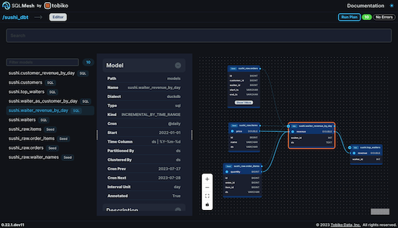

# FAQ

## 全般

???+ question "SQLMeshとは何ですか?"

    SQLMeshは、DevOpsのベストプラクティスをデータチームに提供するオープンソースのデータ変換フレームワークです。データエンジニア、サイエンティスト、アナリストは、SQLまたはPythonで記述されたデータ変換を効率的に実行・展開できます。

    SQLMeshは、Airbnb、Apple、Netflixのデータリーダーによって設立されたTobiko Dataによって開発・保守されています。

    [クイックスタートガイド](../quick_start.md)で実際の動作をご確認ください。

??? question "SQLMesh は何に使用されますか?"

    SQLMesh は、データ変換 (生データをビジネス上の意思決定に役立つ形式に変換するプロセス) を管理および実行するために使用されます。

??? question "SQLMesh はどのような問題を解決しますか?"

    **問題: SQL または Python でのデータ変換コードの整理、保守、変更**

    解決策:

    - データ変換モデル間の依存関係を特定し、実行順序を決定する
    - コード変更による意図しない副作用を防ぐため、データ監査と単体テストを実行する
    - 開発環境や継続的インテグレーション/継続的開発 (CI/CD) など、DevOps パラダイムのベストプラクティスを実装する
    - ある SQL 方言で記述された変換を、異なる SQL 方言を実行するエンジン/データベースで実行する (SQL トランスパイル)

     

    **問題: 複雑なデータ変換セットを理解する**

    解決策:

    - データ変換モデルを通るデータの流れを特定し、表示する
    - あるテーブル内のどの列が別のテーブルの列に影響しているかを追跡する (列レベルの系統)

     

    **問題: 非効率的で、不必要にコストのかかるデータ変換**

    解決策:

    - コード変更がコードベースと基盤となるデータテーブルに与える影響を理解する*コードを実行せずに*
    - 変更の影響を受ける変換のみを実行することで、コード変更を効率的にデプロイします。
    - 開発環境で実行された変換を本番環境に安全にプロモートすることで、計算が不必要に再実行されることを防ぎます。

     

    **課題：複雑なビジネス要件とデータ変換**

    ソリューション：

    - 増分データロードを簡単かつ安全に実装します。
    - Pythonモデル（機械学習モデル、ジオコーディングなど）を使用して、複雑なデータ変換や操作を実行します。

     

    …その他もろもろ！

??? question "SQL のセマンティック理解とは何ですか?"

    セマンティック理解とは、SQL コードを詳細に分析し、その動作を詳細に判断することです。SQLMesh は、無料のオープンソース Python ライブラリ [SQLGlot](https://github.com/tobymao/sqlglot) を使用して SQL コードを解析し、セマンティック理解を構築します。

    セマンティック理解により、SQLMesh はトランスパイル（ある SQL 方言を別の方言を実行しているエンジンで実行すること）や、増分読み込みクエリによるデータの重複を防ぐなどの処理を実行できます。

??? question "Does SQLMesh work like Terraform?"

    SQLMesh は Terraform にヒントを得ていますが、コマンドは同等ではありません。

    Terraform の「plan」アプローチは、ローカル構成とリモート構成を比較し、両者を同期するために必要なアクションを決定します。同様に、SQLMesh はローカルプロジェクトファイル（SQL モデルなど）の状態を環境と比較し、それらを同期するために必要なアクションを決定します。

    ただし、プランの作成と適用を行うコマンドは異なります。Terraform では、「plan」コマンドがプランを生成してファイルに保存します。「apply」コマンドはプランファイルを読み取り、適用します。

    SQLMesh では、「sqlmesh plan」コマンドがプランを生成し、ユニットテストを実行し、ユーザーにプランの適用を促します。SQLMesh には「apply」コマンドはありません。

## はじめる

??? question "SQLMesh をインストールするにはどうすればよいですか?"

    SQLMeshはPythonライブラリです。[適切なPythonランタイム](../prerequisites.md)があることを確認した後、[`pip`](../installation.md)を使用してインストールしてください。

??? question "SQLMesh はどのように使用すればいいですか?"

    SQLMeshには、[コマンドライン](../reference/cli.md)、[JupyterまたはDatabricksノートブック](../reference/notebook.md)、[グラフィカルユーザーインターフェース](../guides/ui.md)の3つのインターフェースがあります。

    [クイックスタートガイド](../quick_start.md)では、各インターフェースでのサンプルプロジェクトを紹介しています。

## 使い方

??? question "SQLMesh がスキーマを作成するのはなぜですか?"

    SQLMesh がスキーマを作成する理由は 2 つあります。

    - SQLMesh は、プロジェクトの状態/メタデータ情報を `sqlmesh` スキーマに保存します。このスキーマはプロジェクトのデフォルトゲートウェイに作成されますが、[別の場所を指定](../reference/configuration.md#state-connection) することもできます。
    - SQLMesh は、[仮想データ環境](https://tobikodata.com/virtual-data-environments.html) を使用して、可能な限り重複した計算を回避し、環境固有のオブジェクトをデフォルトで別々のスキーマに保存します。

    仮想データ環境の仕組み

    仮想データ環境は、ユーザーがモデル構築時に操作するビューの *仮想レイヤー* と、実際のデータを格納するテーブルの *物理レイヤー* を維持することで機能します。

    各 SQLMesh 環境は、ビューのコレクションで構成されています。変更が 1 つの環境から別の環境 (例: 開発環境から本番環境) にプロモートされると、SQLMesh は、基盤となる物理テーブルのデータが環境間で同等かどうかを判断します。該当する場合、SQLMesh は、既に実行された計算をやり直すのではなく、環境のビューを変更して、基盤となる別の物理テーブルからデータを取得するだけです。

    SQLMesh は、物理レイヤーと仮想レイヤーの両方にスキーマを作成します。物理レイヤーは `sqlmesh__[プロジェクト名]` という名前のスキーマに保存されます。たとえば、[クイックスタート サンプル](../quick_start.md) の物理レイヤーは `sqlmesh__sqlmesh_example` スキーマに保存されます。

    仮想レイヤーは、環境ごとに 1 つのスキーマに保存されます。すべての SQLMesh プロジェクトには、デフォルトで `prod` 環境が含まれており、その仮想レイヤーはプロジェクト名のスキーマ（クイックスタートの場合は `sqlmesh_example`）に保存されます。その他の環境の仮想レイヤーは、`[プロジェクト名]__[環境名]` という形式のスキーマに保存されます。たとえば、クイックスタート サンプルの `dev` 環境の仮想レイヤーは `sqlmesh_example__dev` スキーマにあります。

    SQLMesh の Janitor 機能は、使用されていない環境スキーマを自動的に削除します。この機能は、`sqlmesh plan [環境名]` コマンドがその環境で正常に実行されてからの経過時間に基づいて、環境スキーマを削除するかどうかを判断します。経過時間が環境の有効期間（デフォルト値は 1 週間）よりも長い場合、環境スキーマは削除されます。

    SQLMesh のデフォルトの動作はほとんどのデプロイメントに適していますが、[スキーマ構成オプション](../guides/configuration.md#environment-schemas) を使用して、SQLMesh が物理テーブルとビューを作成する場所をオーバーライドできます。

??? question "「テスト」と「監査」の違いは何ですか?"

    SQLMeshの[`test`](../concepts/tests.md)は、ソフトウェアエンジニアリングにおける「ユニットテスト」に相当します。既知の入力と出力に基づいて*コード*をテストします。SQLMeshでは、入力と出力はYAMLファイルで指定され、`sqlmesh plan`の実行時にSQLMeshが自動的にそれらを実行します。

    YAMLの記述は面倒でエラーが発生しやすいため、SQLMeshの[`create_test`コマンド](../concepts/tests.md#automatic-test-generation)を使用すると、既存のデータテーブルへのクエリに基づいてYAMLテストファイルを自動的に生成できます。

    SQLMeshの[`audit`](../concepts/audits.md)は、変換された*データ*が特定の基準を満たしていることを検証します。例えば、`audit`は、列に`NULL`値が含まれていないこと、または重複した値がないことを検証します。 SQLMesh は、`sqlmesh plan` コマンドが実行され、そのプランが適用されたとき、または `sqlmesh run` コマンドが実行されたときに、自動的に監査を実行します。

    `sqlmesh plan` コマンドが実行されると、SQLMesh の `test` コマンドはモデルのコードが実行される _前_ に実行されます。SQLMesh モデルの `audit` コマンドは、モデルのコードが実行された後に実行され、モデルによって出力されたデータを検証します。

??? question "モデルはいつ実行するかをどのように知るのでしょうか?"

    SQLMesh モデルは、[`cron`](#cron-question) パラメータと前回の実行からの経過時間に基づいて実行タイミングを決定します。

    モデルは上流データの更新を認識せず、上流データソースで発生した事象に基づいて実行されることはありません。

??? question "モデルの「cron」パラメータとは何ですか?"

    SQLMesh は、プロジェクトが実行されるたびにモデルを完全に更新するわけではありません。代わりに、各モデルの実行頻度を [`cron` パラメータ](../concepts/models/overview.md#cron) で指定します（デフォルトは daily）。

    `sqlmesh run` を実行すると、SQLMesh は各モデルの `cron` 値と、そのモデルが最後に実行されたときの記録を比較します。十分な時間が経過している場合はモデルが実行され、そうでない場合は何も行われません。

    例えば、`cron` が daily に設定されているモデルを考えてみましょう。今日初めて `sqlmesh run` を実行すると、モデルが実行されます。その後 `sqlmesh run` を再度実行すると、SQLMesh はモデルが今日既に実行されたことを検出し、再実行しません。

??? question "`sqlmesh plan` と `sqlmesh run` の違いは何ですか?"

    プロジェクト開発中は、プロジェクト ファイルの現在の状態と、各環境の既存の状態という 2 つの要素が関係します。

    SQLMesh の `plan` コマンドは、プロジェクトに加えた変更の影響を把握するための主要なツールです。プロジェクト ファイルが変更された場合、または環境の状態と異なる場合は、`sqlmesh plan [環境名]` を実行して環境の状態をプロジェクト ファイルと同期します。`sqlmesh plan` は、変更を実装するために必要なアクションの概要を生成し、ユニット テストを自動的に実行し、プランを `apply` して変更を実装するように促します。

    プロジェクト ファイルが変更されていない場合は、`sqlmesh run` を実行してプロジェクトのモデルと監査を実行します。

    `sqlmesh run` は、ローカル プロジェクト ファイルのモデル、マクロ、監査を使用しません。実行されるすべての処理は、ターゲット環境で現在プロモートされているモデル、マクロ、監査のバージョンに基づいています。これらのバージョンは、SQLMesh が環境の状態についてキャプチャするメタデータに保存されます。

    `sqlmesh run` を実行する賢明な方法は、Linux の `cron` ツールを使用して、SQLMesh モデルの最も短い `cron` パラメータと同じ頻度で `sqlmesh run` を実行することです。例えば、最も頻繁に実行されるモデルの `cron` が 1 時間の場合、`cron` ツールは少なくとも 1 時間ごとに `sqlmesh run` を実行する必要があります。

??? question "開始日と終了日は何の目的ですか?"

    SQLMesh は、["intervals" アプローチ](https://tobikodata.com/data_load_patterns_101.html) を使用して、時間による増分モデルクエリに含める日付範囲を決定します。このアプローチでは、時間を互いに重ならない間隔に分割し、どの間隔が処理されたかを追跡します。

    SQLMesh では、開始日は 2 つの異なる役割を果たします。増分モデル構成では、`start` パラメーターは、モデルの時間間隔セットに含める最初の日付を SQLMesh に指示します。

    開始日と終了日は、[`plan`](../reference/cli.md#plan) や [`run`](../reference/cli.md#run) などの SQLMesh コマンドのパラメーターとしても機能します。この場合、start と end は、コマンド実行時に特定の時間間隔のみを含めることを SQLMesh に指示します。たとえば、開発段階では、短時間で反復処理を実行するためにいくつかの間隔のみを処理し、その後、本番環境にデプロイしてすべての時間を処理するといったことが可能です。

??? question "すでに変換したデータを再処理するにはどうすればよいですか?"

    すでにロードおよび変換されたデータを再処理する必要がある場合があります。SQLMeshでは、[再処理プラン](../concepts/plans.md#restatement-plans)を使用してこれを実行します。

    [`plan` コマンド](../reference/cli.md#plan) の `--restate-model` オプションと、再処理するモデル名を指定します。プランを適用すると、指定したモデルと、その下流にあるすべてのモデルが再処理されます。`--start` オプションと `--end` オプションを使用すると、再処理を特定の日付範囲に限定できます。

??? question "新しいテーブルを作成する代わりに、既存のテーブルを再利用するにはどうすればよいですか?"

    テーブルが大きすぎて破壊的変更のために完全に再構築できない場合、既存のテーブルを再利用する必要があります。これは [forward-only プラン](../concepts/plans.md#forward-only-plans) で実現できます。[`plan` コマンド](../reference/cli.md#plan) に `--forward-only` オプションを追加して作成します: `sqlmesh plan [environment name] --forward-only`

    forward-only プランを `prod` 環境に適用すると、プランで変更されたモデルに対して新しい物理テーブルは作成されません。代わりに、以前のモデルバージョンの物理テーブルが再利用されます。forward-only プランで行われたすべての変更には、自動的に forward-only カテゴリが割り当てられます。通常の破壊的変更/非破壊的変更と混在させることはできません。

    [`plan` の `--effective-from` オプション](../reference/cli.md#plan) を使用すると、フォワードのみのプランの変更を実稼働環境の既存のデータに遡及的に適用できます。

??? question "モデルを今すぐ強制的に実行するにはどうすればよいですか?"

    モデルの `allow_partials` 属性が `true` に設定されていることを確認し、`--ignore-cron` オプションを指定して `run` コマンドを実行します（例：`sqlmesh run --ignore-cron`）。

    この理由については、[allow_partials](../concepts/models/overview.md#allow_partials) のドキュメントを参照してください。

## データベース/エンジン

??? question "SQLMesh はどのようなデータベース/エンジンで動作しますか?"

    現在サポートされているエンジンのリストについては、[このページ](../integrations/overview.md)を参照してください。

## スケジュール

??? question "SQLMesh モデルをスケジュールに従って実行するにはどうすればよいですか?"

    SQLMesh モデルは、[組み込みスケジューラ](../guides/scheduling.md#built-in-scheduler) または [Tobiko Cloud](../cloud/features/scheduler/scheduler.md) を使用して実行できます。

    どちらの方法も、各モデルの `cron` パラメータを使用してモデルの実行タイミングを決定します。詳細については、[上記の `cron` に関する質問](#cron-question) を参照してください。

    組み込みスケジューラは、コマンド `sqlmesh run` を実行することで動作します。プロジェクトでスケジュールに従って実行するための賢明な方法は、Linux の `cron` ツールを使用して、SQLMesh モデルの最も短い `cron` パラメータと同じ頻度で `sqlmesh run` を実行することです。たとえば、最も頻繁に実行されるモデルの `cron` が 1 時間の場合、`cron` ツールは少なくとも 1 時間ごとに `sqlmesh run` を実行する必要があります。

??? question "Airflow で SQLMesh を使用するにはどうすればよいですか?"

    Tobiko Cloud は Airflow のファーストクラスのサポートを提供します - 詳細については、[こちら](../cloud/features/scheduler/airflow.md) をご覧ください

??? question "How do I use SQLMesh with Dagster?"

    Tobiko Cloud は Dagster にファーストクラスのサポートを提供します - 詳細については、[こちら](../cloud/features/scheduler/dagster.md) をご覧ください

## 警告とエラー

??? question "'Query cannot be optimized due to missing schema(s) for model(s): [...]'「モデルのスキーマが見つからないためクエリを最適化できません: [...]」という警告が表示されるのはなぜですか?"

    SQLMesh はテーブルスキーマ（列名とデータ型）に関する知識を利用してモデルクエリを最適化し、列レベルのリネージを作成します。SQLMesh はプロジェクト外のデータソースのスキーマ情報を持っていないため、モデルが外部データソースからデータを選択する際にこの警告を生成します。

    この問題を解決するには、外部データソースごとに [`外部` モデル](../concepts/models/external_models.md) を作成します。`sqlmesh create_external_models` コマンドは外部データソースのスキーマ情報を取得し、プロジェクトの `schema.yml` ファイルに保存します。必要に応じて、このファイルを手動で作成することもできます。

??? question "'Table "xxx" must match the schema's nesting level: 3'「テーブル "xxx" はスキーマのネスト レベル 3 と一致する必要があります」というエラーが表示されるのはなぜですか?"

    SQLMeshは、モデル名にスキーマが含まれていない場合にこのエラーをスローします。モデル名は `schema.table` または `catalog.schema.table` の形式である必要があります。

## これは dbt とどう違うのでしょうか?

??? question "用語の違い?"

    - dbt の「マテリアライゼーション」は、[SQLMesh のモデル `kinds`](../concepts/models/model_kinds.md) に類似しています。
    - dbt のシードは、[SQLMesh のモデル種別](../concepts/models/model_kinds.md#seed) です。
    - dbt の「テスト」は、既存の *データ* の内容を監査するため、[SQLMesh では `audits`](../concepts/audits.md) と呼ばれます。[SQLMesh の `tests`](../concepts/tests.md) は、ソフトウェアエンジニアリングにおける「ユニットテスト」に相当し、既知の入力と出力に基づいて *code* の正確性を評価します。
    - `dbt build` は、[`sqlmesh run`](../reference/cli.md#run) に類似しています。

??? question "ワークフローの違い?"

    **dbt ワークフロー**

    - プロジェクトを構成し、開発中に使用する環境ごとに 1 つのデータベース接続ターゲットを設定します。
    - モデル、シード、テスト、その他のプロジェクト コンポーネントを作成、構成、変更します。
    - `dbt build`（またはその構成要素である `dbt run`、`dbt seed` など）を実行し、プロジェクト コンポーネントを評価およびテストします。
    - `dbt build`（またはその構成要素である `dbt run`、`dbt seed` など）をスケジュールに従って実行し、新しいデータを取り込んで変換します。

    **SQLMesh ワークフロー**

    - プロジェクトを構成し、プロジェクト データベースをセットアップします（ローカルの DuckDB またはデータベース接続を使用）。
    - モデル、監査、テスト、その他のプロジェクト コンポーネントを作成、構成、変更します。
    - `sqlmesh plan [環境名]` を実行して、次の操作を行います。
        - プロジェクト ファイルと環境の差異の概要と、各変更が「互換性を破る」ものかどうかを生成。 `plan` には、変更を実装するために必要なアクションのリストが含まれており、プロジェクトのユニット `test` を自動的に実行します。
        - オプションで、プランを適用してアクションを実装し、プロジェクトの `audit` を実行します。
    - スケジュールに従って `sqlmesh run` を実行し、新しいデータを取り込んで変換します。

??? question "実行モデルの違い?"

    dbt プロジェクトは、`dbt run` コマンド（モデルのみ）または `dbt build` コマンド（モデル、テスト、スナップショット）で実行されます。

    SQLMesh では、前回の実行以降にプロジェクトの内容が変更されているかどうかによって実行結果が異なります。

    - 変更されている場合、`sqlmesh plan` コマンドは次の処理を実行します。
        1. コード変更を実装するために実行されるアクションの概要を生成し、
        2. ユーザーにプランを「適用」してアクションを実行するよう促します。
    - 変更されていない場合、[`sqlmesh run`](../reference/cli.md#run) コマンドはプロジェクトモデルを評価し、監査を実行します。SQLMesh は、[`cron` 構成パラメータ](../concepts/models/overview.md#cron) に基づいて、実行するプロジェクトモデルを決定します。

        初めて `sqlmesh run` を実行するとモデルが実行されますが、2回目に `sqlmesh run` を実行しても何も起こりません。モデルは翌日まで再実行されないためです。

??? question "状態管理の違い?"

    **dbt**

    デフォルトでは、dbt の実行/ビルドは独立しており、以前の実行/ビルドに関する情報は保持されません。この情報は「状態」（「物事の状態」という意味）と呼ばれます。

    dbt は、`state` セレクターメソッドと `defer` 機能を使用して状態を保存/維持できます。dbt は、マニフェスト JSON ファイルなどの `artifacts` に状態情報を保存し、実行時にそのファイルを読み取ります。

    dbt のドキュメント [「状態比較に関する注意事項」ページ](https://docs.getdbt.com/reference/node-selection/state-comparison-caveats) では、これらの機能について次のように説明されています。「state: 選択メソッドは強力な機能ですが、その背後には多くの複雑な要素が存在します。」

    **SQLMesh**

    SQLMesh は、プロジェクトの構造、コンテンツ、過去の実行に関する状態を常に維持します。状態情報により、仮想データ環境や容易な増分ロードといった強力な SQLMesh 機能が実現します。

    状態情報はデフォルトで保存されるため、モデル実行時に状態情報を維持または使用するために特別な操作を行う必要はありません。dbt の注意事項ページに記載されているように、状態情報は強力ですが複雑です。SQLMesh がその複雑さを処理するため、基盤となるメカニズムについて心配する必要はありません。

    SQLMesh は状態情報をデータベーステーブルに保存します。デフォルトでは、この情報は [プロジェクトモデルが実行されるデータベース/接続](../reference/configuration.md#gateways) と同じ場所に保存されます。状態情報を別の場所に保存したい場合は、[別のデータベース/接続](../reference/configuration.md#state-connection) を指定できます。本番環境のデプロイメントでは、状態を保存するために別の接続を使用することをお勧めします。

    SQLMesh はトランザクションを介して状態テーブルに情報を追加しますが、BigQuery などの一部のデータベースはトランザクションの実行に最適化されていません。状態接続を PostgreSQL などの別のデータベースに変更すると、状態トランザクションによって発生する可能性のあるパフォーマンスの問題を軽減できます。

??? question "dbt プロジェクトの列レベルの系統を取得するにはどうすればよいですか?"

    SQLMesh は、[dbt アダプタ](../integrations/dbt.md) を使用して dbt プロジェクトを実行できます。SQLMesh で動作するように dbt プロジェクトを構成すると、[SQLMesh ブラウザ UI](../guides/ui.md) で列レベルの系統を表示できます。

    

??? question "SQL エンジンで Python モデルを実行する必要がありますか?"

    いいえ！SQLMeshは、SQLMeshが実行される場所であればどこでも[Pythonモデル](../concepts/models/python_models.md)を実行します。PandasまたはSpark DataFrameインスタンスを返す限り、モデルの機能に制限はありません。

    データがメモリに収まらないほど大きい場合、モデルはバッチ処理するか、外部のSparkクラスターで変換を実行できます。

??? question "増分モデルはどの日付を取り込むかをどのように決定しますか?"

    dbt は「最新レコード」アプローチを使用して、増分ロードに含める日付を決定します。これは、既存のデータに含まれる最新の日付をクエリし、その日付以降のすべてのレコードを単一のクエリでソースシステムから取り込むことで機能します。

    SQLMesh は代わりに [「間隔」アプローチ](https://tobikodata.com/data_load_patterns_101.html) を使用します。モデルの `cron` パラメータに基づいて時間を互いに重ならない間隔に分割し、どの間隔が処理されたかを記録します。未処理の間隔からのみソースレコードを取り込みます。間隔アプローチにより、バッチロードなどの機能が可能になります。

??? question "SQLMesh で追加専用モデルを実行するにはどうすればよいですか?"

    SQLMesh は、dbt で実装されているような追加専用モデルをサポートしていません。時間列を定義して [時間範囲による増分](../concepts/models/model_kinds.md#incremental_by_time_range) モデルを使用するか、一意キーを指定して [一意キーによる増分](../concepts/models/model_kinds.md#incremental_by_unique_key) モデルを使用することで、同様の結果を得ることができます。

## 会社

??? question "Tobiko Data はどのようにして収益を上げているのでしょうか?"

    - Tobiko Cloud：詳細はこちら（[こちら](https://tobikodata.com/product.html)）
    - エンタープライズ向け Github Actions CI/CD アプリ（開発中）
    - [オープンソース CI/CD ボット](../integrations/github.md) の高機能版
    - 企業の SQLMesh プロジェクトへのハンズオンサポートを提供
