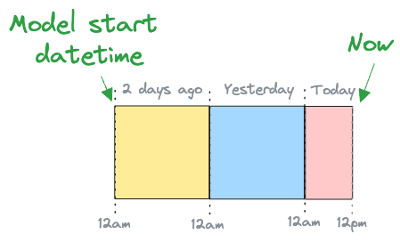
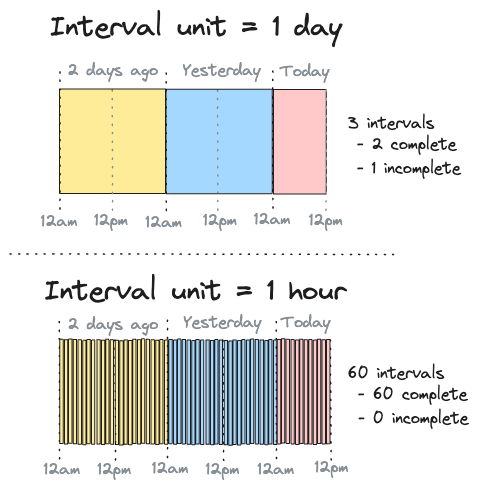

# 時間による増分ガイド

SQLMesh モデルは [種類](../concepts/models/model_kinds.md) によって分類されます。特に強力なモデルの種類の一つが「時間範囲による増分」です。このガイドでは、これらのモデルの動作原理と使用方法を説明します。

モデルの操作全般について詳しくは [モデルガイド](./models.md) をご覧ください。また、様々なモデルの種類の概要については [モデルの種類の概念ページ](../concepts/models/model_kinds.md) をご覧ください。

## 適切なデータをロードする

時間による増分データロード手法は、効率性を重視しています。これは、特定のデータ行を一度だけロードするという原則に基づいています。

 `VIEW` や `FULL` などのモデルは、実行のたびにソースシステムのデータ全体を再ロードします。場合によっては、すべてのデータを再ロードすることが現実的ではありません。また、時間と計算リソースの非効率的な使用につながる場合もあります。これらのリソースは、ビジネスが他のことに費やすことができたはずの費用に相当します。

時間による増分モデルは新しいデータのみをロードするため、モデル実行ごとに必要な計算リソースを大幅に削減できます。

## 時間のカウント

時間による増分モデルは、まずソーステーブルからデータを読み取る日付範囲を特定することで機能します。

日付範囲を決定する方法の一つとして、データ内で観測された最新のレコードのタイムスタンプに基づいて決定する方法があります。この方法は実装が簡単ですが、テーブルが既に存在する、データに時間的なギャップがない、クエリが1回のパスで実行可能である、という3つの前提があります。

SQLMeshは、時間間隔を使用するという異なるアプローチを採用しています。

### 間隔の計算

時間間隔を使用する最初のステップは、モデルの*開始日時*と*間隔単位*に基づいて、すべての間隔のセットを作成することです。開始日時は、モデルにおける時間の「開始」時刻を指定し、間隔単位は時間をどの程度細かく分割するかを指定します。

例えば、2日前の午前0時を基準に開始日時を設定し、今日の午後12時に処理するモデルを考えてみましょう。これは図1に示されています。



*__図1: 2日前の午前0時を基準に開始日時を設定し、今日の午後12時に処理するモデルの図__*

<br>

モデルの間隔単位が1日の場合、モデルの間隔セットには3つのエントリが含まれます。

- 2日前：1つ
- 昨日：1つ
- 今日：1つ

現在午後12時なので、今日の間隔はまだ完了していません。これは図2の上部パネルに示されています。



*__図2: 間隔単位を1日と1時間に設定し、60時間にわたって間隔をカウントする図__*

<br>

モデルの間隔単位が1時間だった場合、時間間隔セットには60個のエントリが含まれます。

- 2日前の1時間ごとに24個
- 昨日の1時間ごとに24個
- 本日の午前0時から午後0時までの1時間ごとに12個

午後0時（つまり午前11時の間隔は終了）なので、すべての間隔が完了しています。これは図2の下のパネルに示されています。

今日の午後0時に、`sqlmesh plan` の一部として下側のモデルを初めて実行してバックフィルすると、SQLMeshは60個の時間間隔セットを計算し、60個すべてがバックフィルされたことを記録します。この情報は、将来使用するためにSQLMesh状態テーブルに保持されます。

明日の午後12時にモデルを `sqlmesh run` すると、SQLMesh はすべての間隔を次のように計算します。

- 2日前：24
- 昨日：24
- 今日：24
- 明日の午前0時から午後12時まで：12

合計84個の間隔になります。

SQLMesh は、こ​​の84個の間隔を、既にバックフィルした保存済みの60個の間隔と比較し、昨日の午後12時から今日の午後12時までの未処理の間隔24個を特定します。そして、今日の実行では、これらの24個の間隔のみを処理します。

## `run` の実行

SQLMesh には、データ処理用の 2 つの異なるコマンドがあります。モデルが変更された場合は、[`sqlmesh plan`](../reference/cli.md#plan) を使用して、特定の環境のデータに変更を適用します。モデルが変更されていない場合は、[`sqlmesh run`](../reference/cli.md#run) を使用して、プロジェクトのモデルを実行します。

データの蓄積速度と鮮度要件はモデルによって異なる場合があります。`sqlmesh run` がコマンド実行時にすべてのモデルを実行すると、すべてのモデルが最も厳しいモデルと同じ鮮度要件を満たすことになります。これは非効率的であり、計算リソース（およびコスト）を無駄にします。

代わりに、各モデルに対して [`cron` パラメータ](../concepts/models/overview.md#cron) を指定します。`sqlmesh run` は各モデルの `cron` を使用して、特定の実行でそのモデルを実行するかどうかを判断します。

例えば、最も頻繁に実行するモデルの `cron` が 1 時間ごと に設定されている場合、`sqlmesh run` コマンドを少なくとも 1 時間ごとに実行する必要があります（Linux の cron などのツールを使用）。このモデルは 1 時間ごとに実行されますが、`cron` が daily に設定されている別のモデルは、前回の実行から 24 時間経過した場合にのみ 1 日に 1 回実行されます。

### 計算のスケジュール設定

デフォルトでは、SQLMesh はモデルの前回の実行から経過したすべての間隔を単一のジョブで処理します。モデルのソースデータが大きい場合は、計算をより小さなジョブに分割することが必要になる場合があります。これは、モデル設定の `batch_size` パラメータを使用して行います。

`batch_size` を指定すると、処理する間隔の総数が `batch_size` サイズのバッチに分割され、バッチごとに 1 つのジョブが実行されます。

## モデル時間

時間増分モデルでは、設定で時間列を指定する必要があります。さらに、モデルのSQLクエリでは、時間範囲でデータをフィルタリングする `WHERE` 句を指定する必要があります。

この例は、SQLMesh [クイックスタートプロジェクト](../quick_start.md) に追加できる時間増分モデルを示しています。

``` sql linenums="1"
MODEL (
  name sqlmesh_example.new_model,
  kind INCREMENTAL_BY_TIME_RANGE (
    time_column (model_time_column, '%Y-%m-%d'), -- Time column `model_time_column` with format '%Y-%m-%d'
  ),
);

SELECT
  *
FROM
  sqlmesh_example.incremental_model
WHERE
  model_time_column BETWEEN @start_ds and @end_ds -- WHERE clause filters based on time
```

モデル構成では、列 `model_time_column` が各行のタイムスタンプを表すように指定されており、モデルクエリには、time 列を使用してデータをフィルタリングする `WHERE` 句が含まれています。

`WHERE` 句では、[SQLMesh 定義済みマクロ変数](../concepts/macros/macro_variables.md#predefined-variables) `@start_ds` と `@end_ds` を使用して日付範囲を指定します。SQLMesh は、ジョブで処理される間隔に基づいて、適切な日付を自動的に置き換えます。

!!! tip "重要"

    SQLMesh のスケジューラおよび定義済みマクロ変数との適切な連携を確保するため、`time_column` は [UTC タイムゾーン](https://en.wikipedia.org/wiki/Coordinated_Universal_Time) で指定する必要があります。

SQLMesh は、クエリの `WHERE` 句に加えて、モデル設定の time 列を使用して、クエリを別の時間フィルタリング `WHERE` 句で自動的にラップすることで、データ漏洩を防止します。

ここで疑問が生じます。SQLMesh が時間フィルタリング `WHERE` 句を自動的に追加するのであれば、なぜクエリにこの句を含める必要があるのでしょうか？ 2 つのフィルターはそれぞれ異なる役割を果たしているからです。

- モデルクエリの `WHERE` 句は、*モデルに読み込まれる* データをフィルタリングします。
- SQLMesh ラッパーの `WHERE` 句は、*モデルによって出力される* データをフィルタリングします。

モデルクエリは、必要なデータのみがモデルによって処理されるようにするため、リソースの無駄がなくなります。また、柔軟性も向上します。上流モデルがモデル自身とは異なる時間列を使用している場合、クエリの `WHERE` 句でモデルの時間列に加えて（または代わりに）その列を使用できます。

SQLMesh の wrapper 句は、モデルが時間範囲外のレコードを返さないようにすることで、データ漏洩を防ぎます。これは、不適切に指定されたクエリを防ぐ安全機構です。

クエリによっては、2 つのフィルターが機能的に重複している場合もありますが、そうでない場合もあります。SQLMesh には、特定のインスタンスでフィルターが重複しているかどうかを判断する方法はありません。そのため、モデルクエリには常に時間フィルタリング用の `WHERE` 句を含める必要があります。

## 前方参照のみのモデル

モデルが変更されるたびに、SQLMesh はその変更を「[breaking](../concepts/plans.md#breaking-change)」または「[non-breaking](../concepts/plans.md#non-breaking-change)」に分類します。

重大な変更は下流モデルのデータを無効にする可能性があるため、変更されたモデルとその下流のすべてのモデルに対して新しい物理テーブルが作成され、完全に更新されます。重大な変更ではない変更は変更されたモデルにのみ影響するため、その物理テーブルのみが更新されます。

モデルのデータが非常に大きい場合、モデル自体または下流モデルの物理テーブルを再構築することが現実的ではないことがあります。このような状況では、3 つ目の種類の変更である「前方のみ」を使用できます。この名前は、変更が時間的に「前方」にのみ適用されることを反映しています。

### 前方参照のみの指定

前方参照のみの変更は、2つの方法で指定できます。1つ目は、モデルを[前方参照のみとして設定](../guides/configuration.md#models)し、そのモデルへのすべての変更が自動的に前方参照のみとして分類されるようにすることです。これにより、モデルの物理テーブルが完全に更新されることがなくなります。

次の例では、前の例のモデルを前方参照のみとして設定します。

``` sql linenums="1"
MODEL (
  name sqlmesh_example.new_model,
  kind INCREMENTAL_BY_TIME_RANGE (
    time_column (model_time_column, '%Y-%m-%d'),
    forward_only true -- All changes will be forward only
  )
);

SELECT
  *
FROM
  sqlmesh_example.incremental_model
WHERE
  model_time_column BETWEEN @start_ds and @end_ds
```

あるいは、フラグ `sqlmesh plan --forward-only` を使用して、*特定のプラン*に含まれるすべての変更をforward-onlyとして分類することもできます。forward-onlyフラグを含まない後続のプランは、モデルの物理テーブルを完全に更新します。forward-onlyプランの詳細については、[こちら](../concepts/plans.md#forward-only-plans)をご覧ください。

### スキーマの変更

SQLMesh は、増分モデルへの前方参照のみの変更を処理する際に、モデルの新しいスキーマと既存の物理テーブルスキーマを比較し、潜在的なデータ損失や互換性の問題を検出します。SQLMesh はスキーマ変更を次の 2 つの種類に分類します。

#### 破壊的な変更

一部のモデル変更は、テーブル内の既存のデータを破壊します。例としては、次のようなものがあります。

- モデルからの **列の削除**
- **列名の変更**
- データ損失を引き起こす可能性のある方法での **列のデータ型の変更**

特定の変更が破壊的であるかどうかは、SQL エンジンのスキーマ進化機能によって異なる場合があります。

#### 追加的な変更

追加的な変更とは、テーブルの列に対する変更のうち、破壊的ではないものを指します。簡単な例としては、テーブルに列を追加することなどが挙げられますが、列のデータ型を互換性のある型（例：INT -> STRING）に変更することも挙げられます。

SQLMesh は、モデル定義に基づいて、プラン実行時にスキーマ変更検出を実行します。プラン実行時にモデルの列データ型をすべて解決できない場合は、モデルの基盤となる物理テーブルに基づいて、実行時に再度チェックが実行されます。

#### 前方参照のみのモデルへの変更

SQLMesh には、スキーマ変更の処理方法を制御するための 2 つの構成設定があります。

- **`on_destructive_change`** - 破壊的なスキーマ変更の動作を制御します。
- **`on_additive_change`** - 追加的なスキーマ変更の動作を制御します。

##### 設定オプション

両方のプロパティは、以下の4つの値をサポートします。

- **`error`** (`on_destructive_change` のデフォルト): 実行を停止し、エラーを発生させます。
- **`warn`**: 警告をログに記録しますが、変更は続行します。
- **`allow`** (`on_additive_change` のデフォルト): 変更をそのまま続行します。
- **`ignore`**: この変更タイプに対するスキーマ変更チェックを完全にスキップします。

!!! warning "無視は危険"

`ignore` はエラーやデータ損失を引き起こす可能性があるため危険です。おそらく使用すべきではありませんが、「脱出口」として、あるいは予期せぬ動作を回避する方法として役立つ可能性があります。

##### 破壊的な変更の処理

`on_destructive_change` [構成設定](../reference/model_configuration.md#incremental-models) は、SQLMesh が破壊的な変更を検出した場合の動作を決定します。デフォルトでは、SQLMesh はエラーを出力し、データが失われることはありません。

次の例では、モデルが破壊的な変更をサイレントに `許可` するように設定しています。

``` sql linenums="1"
MODEL (
    name sqlmesh_example.new_model,
    kind INCREMENTAL_BY_TIME_RANGE (
        time_column model_time_column,
        forward_only true,
        on_destructive_change allow
    ),
);
```

##### 追加的な変更の処理

`on_additive_change` 設定は、SQLMesh が新しい列の追加などの追加的な変更を検出した場合の動作を決定します。デフォルトでは、SQLMesh は既存のデータを破壊しないため、これらの変更を許可します。

次の例では、追加的な変更に対してエラーを発生させるようにモデルを設定しています（厳密なスキーマ制御に役立ちます）。

``` sql linenums="1"
MODEL (
    name sqlmesh_example.new_model,
    kind INCREMENTAL_BY_TIME_RANGE (
        time_column model_time_column,
        forward_only true,
        on_additive_change error
    ),
);
```

##### 両方の設定を組み合わせる

両方の設定を組み合わせて設定することで、スキーマの進化をきめ細かく制御できます。

``` sql linenums="1"
MODEL (
    name sqlmesh_example.new_model,
    kind INCREMENTAL_BY_TIME_RANGE (
        time_column model_time_column,
        forward_only true,
        on_destructive_change warn,  -- Warn but allow destructive changes
        on_additive_change allow     -- Silently allow new columns
    ),
);
```

##### Mモデルのデフォルト

`on_destructive_change` と `on_additive_change` の両方のデフォルト値は、[モデルのデフォルト設定](../reference/model_configuration.md#model-defaults)ですべての増分モデルに対して設定できます。

##### 一般的なユースケース

スキーマ変更処理を設定するための一般的なパターンを以下に示します。

**厳密なスキーマ制御** - スキーマ変更を一切防止します。

```sql linenums="1"
MODEL (
    name sqlmesh_example.strict_model,
    kind INCREMENTAL_BY_TIME_RANGE (
        time_column event_date,
        forward_only true,
        on_destructive_change error,  -- Block destructive changes
        on_additive_change error      -- Block even new columns
    ),
);
```

**許容開発モデル** - すべてのスキーマ変更を許可します:

```sql linenums="1"
MODEL (
    name sqlmesh_example.dev_model,
    kind INCREMENTAL_BY_TIME_RANGE (
        time_column event_date,
        forward_only true,
        on_destructive_change allow,  -- Allow dropping columns
        on_additive_change allow      -- Allow new columns (`allow` is the default value for this setting, so it can be omitted here)
    ),
);
```

**本番環境の安全性** - 安全な変更を許可し、リスクのある変更については警告します。

```sql linenums="1"
MODEL (
    name sqlmesh_example.production_model,
    kind INCREMENTAL_BY_TIME_RANGE (
        time_column event_date,
        forward_only true,
        on_destructive_change warn,   -- Warn about destructive changes
        on_additive_change allow      -- Allow new columns (`allow` is the default value for this setting, so it can be omitted here)
    ),
);
```

#### フォワードオンリープランにおける変更

SQLMesh の `plan` [`--forward-only` オプション](../concepts/plans.md#forward-only-plans) は、プラン内のすべてのモデル変更をフォワードオンリーとして扱います。このオプションを指定すると、SQLMesh は `forward_only true` に設定されたモデルだけでなく、変更されたすべての増分モデルに対して、破壊的および追加的なスキーマ変更の有無をチェックします。

SQLMesh は、以下の設定階層に基づいて各モデルの動作を決定します。

- **破壊的な変更の場合**: モデルの `on_destructive_change` 値（存在する場合）、`on_destructive_change` [モデルのデフォルト](../reference/model_configuration.md#model-defaults) 値（存在する場合）、および SQLMesh グローバルのデフォルトである `error`
- **追加的な変更の場合**: モデルの `on_additive_change` 値（存在する場合）、`on_additive_change` [モデルのデフォルト](../reference/model_configuration.md#model-defaults) 値（存在する場合）、および SQLMesh グローバルのデフォルトである `allow`

破壊的な変更を許可していないモデルで一時的に破壊的な変更を許可する場合は、`plan` コマンドの [`--allow-destructive-model` を使用します。セレクター](../concepts/plans.md#destructive-changes) を使用して、モデルを指定します。同様に、`on_additive_change=error` が設定されたモデルに対して一時的に追加的な変更を許可する場合は、[`--allow-additive-model` セレクター](../concepts/plans.md#destructive-changes) を使用します。モデルセレクターの詳細については、[こちら](../guides/model_selection.md) をご覧ください。
