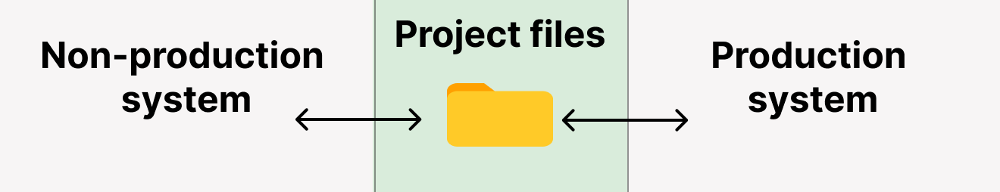

# 分離システムガイド

SQLMesh は、開発者が本番環境データにアクセスできるシステムでの使用に最適化されています。

部分的または代表的でないデータに対してコードを記述すると、エラーが発生するまで本番環境データの変更に気付かないため、問題が発生する可能性があります。

機械学習モデルなどの他のデータ製品は、トレーニングデータ内の値の分布に依存する場合があります。代表的でないデータに基づいて構築すると、本番環境と開発環境で異なる動作が発生する可能性があります。

ただし、一部の企業では、本番環境データと非本番環境データを、相互に通信できない別のデータウェアハウス（「分離システム」）に保存しています。これは通常、情報セキュリティ上の懸念によるもので、非本番環境ウェアハウスはより多くのユーザーがアクセスでき、セキュリティ制限が緩い場合があります。

このガイドでは、分離システムで SQLMesh を使用する方法と、分離システムが SQLMesh の動作に及ぼす影響について説明します。

## 用語

分離システムは「分離環境」と呼ばれることもありますが、「環境」はSQLMeshでは特別な意味を持つため、この用語は使用しません。

ここでは、分離システム（「本番環境システム」と「非本番環境システム」）と呼びます。

「環境」とは、常に[SQLMesh環境](../concepts/environments.md)、つまりSQLMeshによって作成および管理される分離された名前空間を指します。

## SQLMesh の構成

### 状態データの分離

SQLMesh は、モデルの更新時に変更を識別できるように、すべてのモデルバージョンの記録を保持しています。これらの記録は「状態」データと呼ばれ、「その時点でのモデルの状態」を意味します。

状態データは、プライマリデータウェアハウスまたは[別のデータベース](./configuration.md#state-connection)に他のデータと共に保存できます。クラウド SQL エンジンで実行されるプロジェクトには、別のトランザクションデータベースを使用することをお勧めします。

分離されたシステムでは、システムごとに**個別の**状態データベースを使用する必要があります。非本番環境システムのモデルやその他のオブジェクトの状態は、本番環境システムでは正確ではないため、状態データを共有するとプロジェクトが正しく実行されなくなります。

### 複数のゲートウェイ

SQLMesh データベース接続は、[gateways](./configuration.md#gateways) で設定します。[connections](./connections.md) やその他の設定パラメータが含まれています。

ゲートウェイには SQL エンジンへの接続が必須で、オプションで SQLMesh が状態データを保存するデータベースへの別の接続も含めることができます。

分離システムでは、本番環境システム用と非本番環境システム用の 2 つのゲートウェイを個別に設定する必要があります。

例えば、この設定では `nonproduction` と `production` という名前のゲートウェイが作成されます。状態データがゲートウェイのプライマリ接続に保存される場合は、`state_connection` キーを省略できます。

```yaml linenums="1"
gateways:
  nonproduction:
    connection:
      ...[your non-production connection parameters]...
    state_connection:
      ...[your non-production state connection parameters]...
  production:
    connection:
      ...[your production connection parameters]...
    state_connection:
      ...[your production state connection parameters]...
```

SQLMesh は、コマンド実行時に、設定内の最初のゲートウェイをデフォルトとして使用します。例えば、上記の設定では、SQLMesh はコマンド `sqlmesh plan` を実行する際に `nonproduction` ゲートウェイを使用します。

コマンドでは、`--gateway` オプション（`sqlmesh --gateway production plan` など）を使用して、デフォルトゲートウェイを上書きできます。

### ゲートウェイ固有のスキーマ

両方のシステムで同一のスキーマ名とモデル名を使用することをお勧めしますが、シナリオによってはそれが不可能な場合があります。

スキーマ名とモデル名は、定義済みの [`@gateway` マクロ変数](../concepts/macros/macro_variables.md#runtime-variables) を使用して、ゲートウェイによってパラメータ化できます。

この例では、SQLMesh [`@IF` マクロ演算子](../concepts/macros/sqlmesh_macros.md#if) を使用して、現在のゲートウェイのモデルスキーマ名を条件付けする方法を示します。ゲートウェイの名前が `production` の場合、`my_model` のスキーマは `prod_schema` になります。それ以外の場合は `dev_schema` になります。

```sql linenums="1"
MODEL (
  name @IF(@gateway = 'production', prod_schema, dev_schema).my_model
)
```

ゲートウェイ名をスキーマ名に直接埋め込むには、中括弧 `@{gateway}` 構文を使用します。

```sql linenums="1"
MODEL (
  name @{gateway}_schema.my_model
)
```

中括弧 `@{}` 構文の詳細については、[こちら](../concepts/macros/sqlmesh_macros.md#embedding-variables-in-strings) を参照してください。

## ワークフロー

### システムのリンク

システムを分離する目的は、システム間のネットワーク通信を制限することでデータの共有を防ぐことです。では、SQLMesh プロジェクトをシステム間で共有するにはどうすればよいでしょうか？

SQLMesh プロジェクトファイルは、システム間のリンクを提供します。ファイルは、Git リポジトリなど、相互にアクセス可能な場所に保存する必要があります。



### 単一システムでのワークフロー

このセクションでは、単一システムで SQLMesh プロジェクトを更新するためのワークフローについて説明します。

SQLMesh プロジェクトのバージョンが現在本番環境で実行されており、コード変更の開始点として使用されていることを前提としています。

#### 基本的なワークフロー

データシステムで変更の実装にCI/CDを使用していない場合は、このワークフローを使用します。

- モデルに変更を加える
- `sqlmesh plan dev`（または別の環境名）を実行して、ローカル環境で変更をプレビューする
- `sqlmesh plan` を実行して、`prod` 環境に変更を適用する

#### CI/CD ワークフロー

SQLMesh [Github CI/CD ボット](../integrations/github.md) でこのワークフローを使用します。

- プロジェクトリポジトリを `git clone` します。
- Git ブランチ内のモデルに変更を加えます。
- ブランチをプロジェクトリポジトリにプッシュし、プルリクエストを送信します。ボットが [同期デプロイメント](../integrations/github.md#synchronized-vs-desynchronized-deployments) に設定されている場合、変更をプレビューするための開発環境が作成されます。
- ブランチを `main` にマージして、変更を `prod` 環境に適用します。

同期デプロイメントと非同期デプロイメントの詳細については、[こちら](../integrations/github.md#synchronized-vs-desynchronized-deployments) をご覧ください。

#### 計算の再利用

これらのワークフローでは、ローカル環境のプレビューは `prod` 環境で使用されるのと同じデータに基づいて計算されるため、`prod` に変更を適用するとプレビューの計算が再利用され、仮想的な更新のみが必要になります。

### 分離システムでのワークフロー

このセクションでは、分離システムでのワークフローについて説明します。

このワークフローは、上記の基本ワークフローと CI/CD ワークフローを組み合わせたもので、非本番システムでは基本ワークフローを使用し、本番システムでは CI/CD ワークフローを使用します。

- プロジェクトリポジトリを `git clone` します。
- Git ブランチでモデルを変更します。
- 非本番システムで変更をプレビューするには、`sqlmesh plan dev` (または別の環境名) を実行します。プロジェクトの構成によっては、非本番システムで `--gateway` オプションを含める必要がある場合があります。
- ブランチをプロジェクトリポジトリにプッシュし、プルリクエストを送信します。ボットは、本番システムで [同期デプロイメント](../integrations/github.md#synchronized-vs-desynchronized-deployments) が設定されている場合、変更をプレビューするための環境を作成します。
- ブランチを `main` にマージして、変更を `prod` 環境に適用します。

非本番環境システムで変更内容が破壊的か非破壊的かの分類は、本番環境システムでは利用できません。これは、両システムが SQLMesh の状態データを共有していないためです。そのため、本番環境システムで再度分類を行う必要があります。

#### 計算の再利用

分離されたシステムでは、SQLMesh の仮想データ環境は各システム内では正常に動作しますが、システム間では動作しません。

非本番環境システムでは、プレビュー環境間で計算が再利用されます。ただし、システムのデータは本番環境のデータを反映したものではなく、本番環境システムでは再利用されません。

本番環境システムでは、CI/CD ボットが [同期デプロイメント](../integrations/github.md#synchronized-vs-desynchronized-deployments) に設定されている場合、プルリクエストが送信されたときに必要な計算が実行されます。main にマージし、変更を `prod` に適用すると、プレビューの計算が再利用され、仮想更新のみが必要になります。

このアプローチにより、真の [ブルーグリーン デプロイメント](https://en.m.wikipedia.org/wiki/Blue%E2%80%93green_deployment) が可能になります。仮想更新はビューのスワップのみを必要とするため、本番環境へのデプロイはシステムのダウンタイムなしで実行されます。変更が本番環境にプッシュされた後に問題が特定された場合、ビューを元に戻すだけなので、元に戻す作業は迅速かつ簡単です。