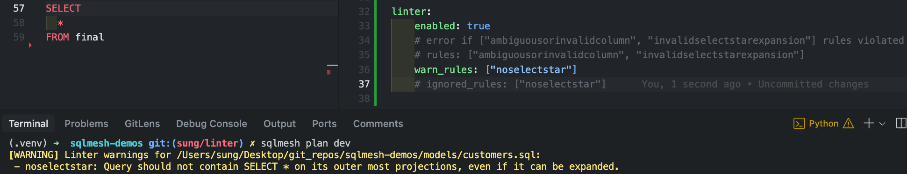

# Linter ガイド



Lint は、コードの品質と一貫性を向上させる強力なツールです。モデル定義を自動的に検証し、チームのベストプラクティスに準拠していることを確認できます。

SQLMesh プランが作成されると、各モデルのコードが、選択した一連のルールに準拠しているかどうかがチェックされます。

SQLMesh には組み込みルールが用意されており、カスタムルールを定義することもできます。これにより、コードの品質が向上し、開発サイクルの早い段階で問題を検出し、デバッグが容易になります。

## ルール

各リンティングルールは、モデルのコード内のパターンを識別する役割を担います。

一部のルールは、モデルの最も外側のクエリで `SELECT *` を許可しないなど、パターンが「存在しない」ことを検証します。他のルールは、すべてのモデルの `owner` フィールドが指定されていることを確認するなど、パターンが「存在する」ことを検証します。以下では、これら両方を「パターンの検証」と呼びます。

ルールは Python で定義されます。各ルールは、SQLMesh の `Rule` 基本クラスを継承した個別の Python クラスであり、パターンを検証するためのロジックを定義します。

以下に、`Rule` 基本クラスのコードの一部を示します ([完全なソースコード](https://github.com/TobikoData/sqlmesh/blob/main/sqlmesh/core/linter/rule.py))。そのメソッドとプロパティは、定義するサブクラス化されたルールの最も重要なコンポーネントを示しています。

作成する各ルールクラスには、4つの重要なコンポーネントがあります。

1. 名前: クラス名はルール名として使用されます。
2. 説明: クラスでは、ルールの目的を簡潔に説明する docstring を定義する必要があります。
3. パターン検証ロジック: クラスでは、ルールのパターンを検証するコアロジックを含む `check_model()` メソッドを定義する必要があります。このメソッドは、任意の `Model` 属性にアクセスできます。
4. ルール違反ロジック: ルールのパターンが検証されない場合、ルールは「違反」とみなされ、クラスは `RuleViolation` オブジェクトを返す必要があります。`RuleViolation` オブジェクトには、ユーザーが問題を理解して修正するために必要なコンテキスト情報が含まれている必要があります。

``` python linenums="1"
# Class name used as rule's name
class Rule:
    # Docstring provides rule's description
    """The base class for a rule."""

    # Pattern validation logic goes in `check_model()` method
    @abc.abstractmethod
    def check_model(self, model: Model) -> t.Optional[RuleViolation]:
        """The evaluation function that checks for a violation of this rule."""

    # Rule violation object returned by `violation()` method
    def violation(self, violation_msg: t.Optional[str] = None) -> RuleViolation:
        """Return a RuleViolation instance if this rule is violated"""
        return RuleViolation(rule=self, violation_msg=violation_msg or self.summary)
```

### 組み込みルール

SQLMesh には、潜在的な SQL エラーをチェックしたり、コードスタイルを強制したりする定義済みのルールセットが含まれています。

後者の例としては、モデルがクエリの最外部の SELECT 文で `SELECT *` を使用することを禁止する `NoSelectStar` ルールがあります。

以下は、組み込みの `NoSelectStar` ルールクラスのコードです。各コンポーネントにはアノテーションが付けられています。

``` python linenums="1"
# Rule's name is the class name `NoSelectStar`
class NoSelectStar(Rule):
    # Docstring explaining rule
    """Query should not contain SELECT * on its outer most projections, even if it can be expanded."""

    def check_model(self, model: Model) -> t.Optional[RuleViolation]:
        # If this model does not contain a SQL query, there is nothing to validate
        if not isinstance(model, SqlModel):
            return None

        # Use the query's `is_star` property to detect the `SELECT *` pattern.
        # If present, call the `violation()` method to return a `RuleViolation` object.
        return self.violation() if model.query.is_star else None
```

SQLMesh に組み込まれているすべての lint ルールを以下に示します。

| 名前 | チェックの種類 | 説明 |
| -------------------------- | ----------- | ---------------------------------------------------------------------------------------------------------------------------------------- |
| `ambiguousorinvalidcolumn` | 正確性 | SQLMesh は重複する列を検出したか、列が重複しているかどうかを判断できませんでした。 |
| `invalidselectstarexpansion` | 正確性 | クエリの最上位レベルの選択は `SELECT *` である可能性がありますが、SQLMesh が `SELECT *` を個々の列に展開できる場合のみです。 |
| `noselectstar` | スタイル | SQLMesh が `SELECT *` を個々の列に展開できる場合でも、クエリの最上位レベルの選択は `SELECT *` ではない可能性があります。 |
| `nomissingaudits` | ガバナンス | SQLMesh は、データ品質をテストするための `audits` をモデルの構成内に見つけることができませんでした。 |

### ユーザー定義ルール

チームのベストプラクティスを実装するために、カスタムルールを定義できます。

例えば、次の lint ルールを定義することで、すべてのモデルに `owner` が存在することを確認できます。

``` python linenums="1" title="linter/user.py"
import typing as t

from sqlmesh.core.linter.rule import Rule, RuleViolation
from sqlmesh.core.model import Model

class NoMissingOwner(Rule):
    """Model owner should always be specified."""

    def check_model(self, model: Model) -> t.Optional[RuleViolation]:
        # Rule violated if the model's owner field (`model.owner`) is not specified
        return self.violation() if not model.owner else None

```

ルールのコードをプロジェクトの `linter/` ディレクトリに配置します。SQLMesh は、そのディレクトリから `Rule` のすべてのサブクラスを読み込みます。

ルールがプロジェクトの [設定ファイル](#applying-linting-rules) で指定されている場合、SQLMesh は以下のタイミングでそのルールを実行します。
- `sqlmesh plan` でプランが作成された時
- コマンド `sqlmesh lint` が実行された時

モデルがルールに違反すると、SQLMesh はエラーを出力し、どのモデルがルールに違反したかを通知します。この例では、`full_model.sql` が `NoMissingOwner` ルールに違反し、実質的に実行を停止しています。

``` bash
$ sqlmesh plan

Linter errors for .../models/full_model.sql:
 - nomissingowner: Model owner should always be specified.

Error: Linter detected errors in the code. Please fix them before proceeding.
```

または、より高速な反復処理のためにスタンドアロン コマンドを使用します。

``` bash
$ sqlmesh lint

Linter errors for .../models/full_model.sql:
 - nomissingowner: Model owner should always be specified.

Error: Linter detected errors in the code. Please fix them before proceeding.
```

詳細については、`sqlmesh lint --help` を使用してください。


## リンティングルールの適用

プロジェクトに適用するリンティングルールは、プロジェクトの[設定ファイル](./configuration.md)で指定します。

ルールは、`linter` キーの下にルール名のリストとして指定します。`enabled` キーでリンティングをグローバルに有効または無効にします。デフォルトでは `false` です。

注: プロジェクトのリンティングルールを適用するには、`enabled` キーを `true` に設定する必要があります。

### 特定の lint ルール

この例では、`"ambiguousorinvalidcolumn"` および `"invalidselectstarexpansion"` の lint ルールを適用することを指定しています。

=== "YAML"

    ```yaml linenums="1"
    linter:
      enabled: true
      rules: ["ambiguousorinvalidcolumn", "invalidselectstarexpansion"]
    ```

=== "Python"

    ```python linenums="1"
    from sqlmesh.core.config import Config, LinterConfig

    config = Config(
        linter=LinterConfig(
            enabled=True,
            rules=["ambiguousorinvalidcolumn", "invalidselectstarexpansion"]
        )
    )
    ```

### すべての linting ルール

ルールのリストではなく `"ALL"` を指定することで、すべての組み込みルールとユーザー定義ルールを適用します。

=== "YAML"

    ```yaml linenums="1"
    linter:
      enabled: True
      rules: "ALL"
    ```

=== "Python"

    ```python linenums="1"
    from sqlmesh.core.config import Config, LinterConfig

    config = Config(
        linter=LinterConfig(
            enabled=True,
            rules="all",
        )
    )
    ```

いくつかのルールを除いてすべてのルールを適用する場合は、 `"ALL"` を指定し、無視するルールを `ignored_rules` キーにリストします。

=== "YAML"

    ```yaml linenums="1"
    linter:
      enabled: True
      rules: "ALL" # apply all built-in and user-defined rules and error if violated
      ignored_rules: ["noselectstar"] # but don't run the `noselectstar` rule
    ```

=== "Python"

    ```python linenums="1"
    from sqlmesh.core.config import Config, LinterConfig

    config = Config(
        linter=LinterConfig(
            enabled=True,
            # apply all built-in and user-defined linting rules and error if violated
            rules="all",
             # but don't run the `noselectstar` rule
            ignored_rules=["noselectstar"]
        )
    )
    ```

### モデルをリンティングから除外する

特定のモデルがリンティングルールを無視するように指定するには、そのモデルの `MODEL` ブロックに `ignored_rules` を指定します。

次の例では、モデル `docs_example.full_model` が `invalidselectstarexpansion` ルールを実行しないように指定しています。

```sql linenums="1"
MODEL(
  name docs_example.full_model,
  ignored_rules ["invalidselectstarexpansion"] # or "ALL" to turn off linting completely
);
```

### ルール違反の動作

Lint ルール違反はデフォルトでエラーを発生させ、違反が解決されるまでプロジェクトの実行を阻止します。

`rules` キーではなく `warn_rules` キーで指定することで、ルール違反をエラーにせず、警告のみをログに記録するように指定できます。

=== "YAML"

    ```yaml linenums="1"
    linter:
      enabled: True
      # error if `ambiguousorinvalidcolumn` rule violated
      rules: ["ambiguousorinvalidcolumn"]
      # but only warn if "invalidselectstarexpansion" is violated
      warn_rules: ["invalidselectstarexpansion"]
    ```

=== "Python"

    ```python linenums="1"
    from sqlmesh.core.config import Config, LinterConfig

    config = Config(
        linter=LinterConfig(
            enabled=True,
            # error if `ambiguousorinvalidcolumn` rule violated
            rules=["ambiguousorinvalidcolumn"],
            # but only warn if "invalidselectstarexpansion" is violated
            warn_rules=["invalidselectstarexpansion"],
        )
    )
    ```

`rules`、`warn_rules`、および `ignored_rules` キーの複数に同じルールが含まれている場合、それらは相互に排他的である必要があるため、SQLMesh ではエラーが発生します。