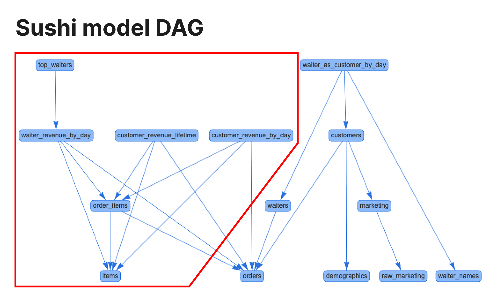

# モデル選択ガイド

このガイドでは、SQLMesh プランに含める特定のモデルを選択する方法について説明します。これは、SQLMesh プロジェクト内のモデルのサブセットを変更する場合に役立ちます。

注: 以下に説明するセレクター構文は、SQLMesh `plan` の [`--allow-destructive-model` および `--allow-additive-model` セレクター](../concepts/plans.md#destructive-changes)、および [複数のモデルを比較する](./tablediff.md#diffing-multiple-models-across-environments) を実行する `table_diff` コマンドにも使用されます。

## 背景

SQLMesh [プラン](../concepts/plans.md) は、プロジェクトのローカルバージョンと環境にデプロイされたバージョン間の変更を自動的に検出します。プランを適用すると、直接変更されたモデルと、間接的に変更された下流の子モデルがバックフィルされます。これにより、すべてのモデルデータがプロジェクトのローカルバージョンと整合されます。

大規模な SQLMesh プロジェクトでは、1 つのモデル変更が多くの​​下流モデルに影響を与える可能性があり、そのモデルと影響を受ける子モデルの評価にかなりの時間がかかります。場合によっては、実行時間が長すぎるためにユーザーが作業を完了できず、変更されたすべてのモデルと影響を受ける子モデルをバックフィルせずにタスクを完了できることもあります。

SQLMesh モデル選択を使用すると、プランに含める直接的なモデル変更をフィルタリングできます。これは、行ったモデル変更の一部の結果のみを確認する必要がある場合に便利です。

モデル選択は、直接変更されたモデルにのみ適用されます。選択したモデルの間接的に変更された子モデルは、バックフィルするモデルを追加で指定しない限り、常にプランに含まれます（詳細は [下記](#backfill) を参照）。

## 構文

モデルの選択は、CLI の `sqlmesh plan` 引数 `--select-model` で指定します。選択はいくつかの方法で指定できます。

最も単純な選択方法は、単一のモデル名（例：`example.incremental_model`）です。`--select-model` 引数を繰り返して、複数の個別のモデル名を指定することもできます。

```bash
sqlmesh plan --select-model "example.incremental_model" --select-model "example.full_model"
```

選択時にワイルドカード文字「*」を使用することで、複数のモデルを一度に選択できます。ワイルドカード以外の文字と一致するモデル名はすべて一致します。例:

- `"example.seed*"` は `example.seed_cities` と `example.seed_states` の両方に一致します。
- `"example.*l_model"` は `example.incremental_model` と `example.full_model` の両方に一致します。

タグセレクタ構文 `tag:tag_name` を使用して、複数のモデルを選択することもできます。たとえば、`"tag:my_tag"` は、タグ `my_tag` を持つすべてのモデルを選択します。

すべてのシードモデルに「seed」タグが付いており、すべての増分モデルに「incremental」タグが付いていると仮定します。

- `"tag:seed"` はすべてのシードモデルに一致します。
- `"tag:incremental"` はすべての増分モデルに一致します。

ワイルドカードはタグにも適用されます。たとえば、`"tag:reporting*"` は、"reporting" で始まるタグを持つすべてのモデルに一致します。

### 上流/下流インジケーター

デフォルトでは、選択範囲のうち直接変更されたモデルのみが計画に含まれます。

モデルの変更された上流モデルおよび/または下流モデルはすべて、プラス記号 `+` を使用して選択に含めることができます。選択範囲の先頭にプラス記号を付けると、変更された上流モデルが含まれ、選択範囲の末尾にプラス記号を付けると、下流モデルが含まれます。

例えば、以下の構造を持つ3つのモデルからなるプロジェクトで、3つのモデルすべてが変更されているとします。

`example.seed_model` --> `example.incremental_model` --> `example.full_model`

これらの選択により、プランには異なるモデルセットが含まれます。

- `--select-model "example.incremental_model"` = `incremental_model` のみ
- `--select-model "+example.incremental_model"` = `incremental_model` と上流の `seed_model`
- `--select-model "example.incremental_model+"` = `incremental_model` と下流の `full_model`

上流/下流の指定は、ワイルドカード演算子と組み合わせることができます。例えば、`--select-model "+example.*l_model"` はプロジェクト内の3つのモデルすべてを含みます。

- `example.incremental_model` はワイルドカードと一致します。
- `example.seed_model` は増分モデルの上流です。
- `example.full_model` はワイルドカードと一致します。

上流/下流の指定、ワイルドカード、そして複数の `--select-model` 引数を組み合わせることで、プランに対してきめ細かで複雑なモデル選択が可能になります。

上流/下流の指定はタグにも適用されます。例えば、`--select-model "+tag:reporting*"` は、`reporting` で始まるタグを持つすべてのモデルとその上流モデルを選択します。

## バックフィル

デフォルトでは、SQLMesh はプラン内で直接的および間接的に変更されたすべてのモデルをバックフィルします。大規模プロジェクトでは、1 つのモデル変更が多くの​​下流モデルに影響を与える可能性があり、すべての子モデルのバックフィルにかなりの時間がかかります。

`plan` の `--backfill-model` 引数を使用することで、バックフィルする下流モデルを制限できます。この引数は、`--select-model` と同じ選択構文を使用します。

`--select-model` は、`plan` に含める直接変更されたモデルを決定し、`--backfill-model` は、`plan` によってバックフィルされるモデルを決定します。モデルのバックフィルされたデータは、その親モデルもバックフィルされている場合にのみ最新です。したがって、`--backfill-model` で指定された各モデルの親モデルもバックフィルされます。

`--select-model` オプションと `--backfill-model` オプションの両方を指定する場合、1 つのモデルが両方のオプションの影響を受ける可能性があるため、注意が必要です。例えば、モデル `test_model` を考えてみましょう。このモデルには 2 つのバージョンがあります。直接変更された新しいバージョン ("test_model changed") と、環境で既にアクティブな既存のバージョン ("test_model existing") です。`--select-model` で `test_model` が選択されていない場合、直接変更されたバージョン "test_model changed" はプランから除外されます。ただし、`test_model` が `--backfill-model` モデルの上流にある場合、既存のバージョン "test_model existing" に未処理の間隔があれば、そのバージョンがバックフィルされます。

注: `--backfill-model` 引数は開発環境 (つまり `prod` 以外の環境) でのみ使用できます。

## 例

ここでは、[SQLMesh Github リポジトリ](https://github.com/TobikoData/sqlmesh) の `examples/sushi` ディレクトリにある SQLMesh `sushi` サンプルプロジェクトで、`--select-model` と `--backfill-model` の使用方法を説明します。

### sushi

sushi プロジェクトは、寿司レストランで収集されたデータを生成および変換します。このガイドでは、マーケティングと顧客に関連するプロジェクトのモデルセットに焦点を当てます。

これらのモデルの DAG には、赤い図形内に使用するプライマリセットが表示されます。



サブ DAG のルートは、下部にある `items` です。そのすぐ下流には、`order_items`、`waiter_revenue_by_day`、`customer_revenue_lifetime`、`customer_revenue_by_day` があります。最後に、`top_waiters` は `waiter_revenue_by_day` の下流にあります。

例の準備として、`prod` で初期プランを実行し、バックフィルを完了しました。モデルの選択がプランにどのような影響を与えるかを示すために、`sushi.items` モデルと `sushi.order_items` モデルを変更しました。

### 選択例

#### 選択なし

特定のモデルを選択せず​​に `plan` を実行すると、SQLMesh は `sushi.order_items` の下流にある 2 つの直接変更されたモデルと 4 つの間接変更されたモデルを含めます。

```bash
❯ sqlmesh plan dev
New environment `dev` will be created from `prod`

Differences from the `prod` environment:

Models:
├── Directly Modified:
│   ├── sushi.order_items
│   └── sushi.items
└── Indirectly Modified:
    ├── sushi.waiter_revenue_by_day
    ├── sushi.customer_revenue_by_day
    ├── sushi.customer_revenue_lifetime
    └── sushi.top_waiters
```

#### `order_items` を選択します

`--select-model` オプションを指定して `"sushi.order_items` を選択すると、直接変更された `sushi.items` モデルはプランに含まれなくなります。

```bash
❯ sqlmesh plan dev --select-model "sushi.order_items"
New environment `dev` will be created from `prod`

Differences from the `prod` environment:

Models:
├── Directly Modified:
│   └── sushi.order_items
└── Indirectly Modified:
    ├── sushi.waiter_revenue_by_day
    ├── sushi.customer_revenue_lifetime
    ├── sushi.customer_revenue_by_day
    └── sushi.top_waiters
```

#### `+order_items` を選択します

`--select-model` オプションに上流の `+` を指定して `"+sushi.order_items"` を選択すると、`sushi.order_items` の上流にある `sushi.items` モデルが選択されます。

```bash
❯ sqlmesh plan dev --select-model "+sushi.order_items"
New environment `dev` will be created from `prod`

Differences from the `prod` environment:

Models:
├── Directly Modified:
│   ├── sushi.items
│   └── sushi.order_items
└── Indirectly Modified:
    ├── sushi.top_waiters
    ├── sushi.customer_revenue_lifetime
    ├── sushi.waiter_revenue_by_day
    └── sushi.customer_revenue_by_day
```

#### `items` を選択

`--select-model` オプションを指定して `"sushi.items` を選択した場合、SQLMesh は `sushi.order_items` を選択しません（したがって、直接変更されたとは分類されません）。

ただし、`sushi.order_items` は間接的に変更されたと分類されます。モデル選択によって直接的な変更は除外されますが、選択された `sushi.items` モデルの下流にあるため、間接的に変更されます。

```bash hl_lines="10"
❯ sqlmesh plan dev --select-model "sushi.items"
New environment `dev` will be created from `prod`

Differences from the `prod` environment:

Models:
├── Directly Modified:
│   └── sushi.items
└── Indirectly Modified:
    ├── sushi.order_items
    ├── sushi.customer_revenue_by_day
    ├── sushi.waiter_revenue_by_day
    ├── sushi.customer_revenue_lifetime
    └── sushi.top_waiters
```

#### `items+` を選択

`--select-model` オプションに下流の `+` を指定して `"sushi.items+"` を選択すると、`sushi.items` の下流にある `sushi.order_items` モデルが選択され、直接変更されたモデルとして分類されます。

```bash
❯ sqlmesh plan dev --select-model "sushi.items+"
New environment `dev` will be created from `prod`

Differences from the `prod` environment:

Models:
├── Directly Modified:
│   ├── sushi.items
│   └── sushi.order_items
└── Indirectly Modified:
    ├── sushi.waiter_revenue_by_day
    ├── sushi.customer_revenue_lifetime
    ├── sushi.customer_revenue_by_day
    └── sushi.top_waiters
```

#### `*items` を選択

`--select-model` オプションにワイルドカード `*` を指定して `"sushi.*items` を選択すると、ワイルドカードに一致するため `sushi.items` と `sushi.order_items` の両方が選択されます。

```bash
❯ sqlmesh plan dev --select-model "sushi.*items"
New environment `dev` will be created from `prod`

Differences from the `prod` environment:

Models:
├── Directly Modified:
│   ├── sushi.order_items
│   └── sushi.items
└── Indirectly Modified:
    ├── sushi.waiter_revenue_by_day
    ├── sushi.top_waiters
    ├── sushi.customer_revenue_by_day
    └── sushi.customer_revenue_lifetime
```

#### タグで選択

`--select-model` オプションに `"tag:reporting"` のようなタグセレクターを指定すると、"reporting" タグを持つすべてのモデルが選択されます。タグは大文字と小文字を区別せず、ワイルドカードが使用できます。

```bash
❯ sqlmesh plan dev --select-model "tag:reporting*"
New environment `dev` will be created from `prod`

Differences from the `prod` environment:

Models:
├── Directly Modified:
│   ├── sushi.daily_revenue
│   └── sushi.monthly_revenue
└── Indirectly Modified:
    └── sushi.revenue_dashboard
```

#### Git の変更で選択

Git ベースのセレクタを使用すると、ターゲットブランチ（デフォルト：main）と比較してファイルが変更されているモデルを選択できます。これには以下のものが含まれます。
- 追跡されていないファイル（Git に存在しない新しいファイル）
- 作業ディレクトリ内の未コミットの変更
- ターゲットブランチとは異なるコミット済みの変更

例:

```bash
❯ sqlmesh plan dev --select-model "git:feature"
New environment `dev` will be created from `prod`

Differences from the `prod` environment:

Models:
├── Directly Modified:
│   └── sushi.items # Changed in feature branch
└── Indirectly Modified:
    ├── sushi.order_items
    └── sushi.daily_revenue
```

また、git の選択とアップストリーム/ダウンストリームのインジケーターを組み合わせることもできます。

```bash
❯ sqlmesh plan dev --select-model "git:feature+"
# Selects changed models and their downstream dependencies

❯ sqlmesh plan dev --select-model "+git:feature"
# Selects changed models and their upstream dependencies
```

#### 論理演算子を使用した複雑な選択

モデルセレクターでは、論理演算子を使用して複数の条件を組み合わせることができます。

- `&` (AND): 両方の条件が真である必要があります
- `|` (OR): どちらかの条件が真である必要があります
- `^` (NOT): 条件を否定します

例:

```bash
❯ sqlmesh plan dev --select-model "(tag:finance & ^tag:deprecated)"
# Selects models with finance tag that don't have deprecated tag

❯ sqlmesh plan dev --select-model "(+model_a | model_b+)"
# Selects model_a and its upstream deps OR model_b and its downstream deps

❯ sqlmesh plan dev --select-model "(tag:finance & git:main)"
# Selects changed models that also have the finance tag

❯ sqlmesh plan dev --select-model "^(tag:test) & metrics.*"
# Selects models in metrics schema that don't have the test tag
```

### バックフィルの例

#### バックフィルの選択なし

選択やバックフィルのオプションがないプランには、4 つのモデルすべてが含まれます。そのうち 2 つは直接変更され、残りの 2 つは間接的に変更されています。

`--backfill-model` オプションは、モデルがプランに含まれるかどうかには影響しません（つまり、上記の選択例の出力には引き続き表示されます）。代わりに、モデルがバックフィルが必要なモデルのリスト（プランの出力の下部に表示されます）に含まれるかどうかを決定します。

オプションが指定されていない場合、`plan` は 6 つのモデルすべてをバックフィルします。`dev` 環境用のプランを作成しているため、バックフィルは `sushi__dev` スキーマで行われます。

```bash
❯ sqlmesh plan dev

< output omitted>

Models needing backfill (missing dates):
├── sushi__dev.items: 2023-12-01 - 2023-12-07
├── sushi__dev.order_items: 2023-12-01 - 2023-12-07
├── sushi__dev.customer_revenue_by_day: 2023-12-01 - 2023-12-07
├── sushi__dev.customer_revenue_lifetime: 2023-12-01 - 2023-12-07
├── sushi__dev.waiter_revenue_by_day: 2023-12-01 - 2023-12-07
└── sushi__dev.top_waiters: 2023-12-01 - 2023-12-07
```

#### `sushi.waiter_revenue_by_day` をバックフィルします

`--backfill-model` オプションで `"sushi.waiter_revenue_by_day"` を指定すると、バックフィルリスト内のモデルが少なくなります。

`sushi__dev.customer_revenue_by_day`、`sushi__dev.customer_revenue_lifetime`、`sushi__dev.top_waiters` モデルは `sushi.waiter_revenue_by_day` の上流ではないため除外されます。

`sushi__dev.items` モデルと `sushi__dev.order_items` モデルは `sushi.waiter_revenue_by_day` の上流であるため、引き続き含まれます。

`--backfill-model` 式で選択されたモデルよりも上流のモデルは、式の先頭に `+` 記号が含まれているかどうかに関係なく、常に含まれます。

```bash
❯ sqlmesh plan dev --backfill-model "sushi.waiter_revenue_by_day"

< output omitted>

Models needing backfill (missing dates):
├── sushi__dev.items: 2023-12-04 - 2023-12-10
├── sushi__dev.order_items: 2023-12-04 - 2023-12-10
└── sushi__dev.waiter_revenue_by_day: 2023-12-04 - 2023-12-10
```
