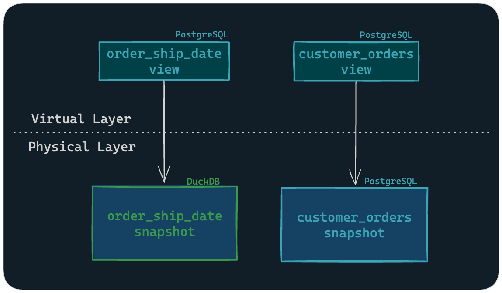
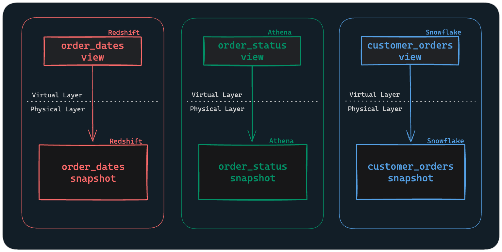

# マルチエンジンガイド

組織は通常、データの一貫性を確保するために、単一のエンジンを介してデータウェアハウスに接続します。しかし、特定のタスクに対して、あるエンジンの処理能力が他のエンジンよりも適している場合があります。

企業では、データの保存方法と保存場所と、そのデータに対する計算の実行方法を切り離す傾向が強まっており、プラットフォームやツール間の相互運用性が求められています。Apache Iceberg、Delta Lake、Hive などのオープンテーブル形式は、複数の SQL エンジンで使用できる共通のストレージ形式を提供します。

SQLMesh は、単一プロジェクト内で複数のエンジンアダプターをサポートすることでこの分離を実現し、各計算タスクに最適なエンジンを柔軟に選択できます。モデルが実行する計算内容やその他の組織固有の考慮事項に基づいて、各モデルが使用するエンジンを指定できます。

## 複数のエンジンを使用するプロジェクトの設定

複数のエンジンを使用するようにプロジェクトを設定する手順は簡単です。

- 必要なすべての [ゲートウェイ接続](../reference/configuration.md#connection) を構成に含めます。
- 実行に使用する `gateway` を `MODEL` DDL で指定します。

モデルにゲートウェイが明示的に定義されていない場合は、プロジェクトの [default_gateway](../reference/configuration.md#default-gateway) が使用されます。

デフォルトでは、仮想レイヤービューは `default_gateway` に作成されます。この方法では、すべてのエンジンが同じ共有カタログに対して読み取りと書き込みを実行できる必要があります。そのため、`default_gateway` 内のビューは別のゲートウェイ内のテーブルにアクセスできます。

あるいは、各ゲートウェイが実行するモデル用の仮想レイヤービューを作成することもできます。このアプローチを使用するには、プロジェクト構成で [gateway_managed_virtual_layer](#gateway-managed-virtual-layer) フラグを `true` に設定します。

### 共有仮想レイヤー

SQLMesh では、[物理レイヤー](../concepts/glossary.md#physical-layer) は具体的なデータストレージレイヤーであり、データベーステーブルとマテリアライズドビューにデータを保存・管理します。

一方、[仮想レイヤー](../concepts/glossary.md#virtual-layer) は、モデルごとに1つずつ存在するビューで構成され、各ビューは物理レイヤーのスナップショットテーブルを参照します。

共有データカタログを持つマルチエンジンプロジェクトでは、モデル固有のゲートウェイが物理レイヤーを管理し、デフォルトゲートウェイが仮想レイヤーの管理に使用されます。

#### 例: DuckDB + PostgreSQL

以下は、DuckDBとPostgreSQLの両方に接続するプロジェクトを設定する簡単な例です。

この設定では、PostgreSQLエンジンがデフォルトとして設定されているため、仮想レイヤーのビューの管理にPostgreSQLが使用されます。また、DuckDBの[attach](https://duckdb.org/docs/sql/statements/attach.html)機能により、PostgreSQLカタログの物理テーブルへの読み取り/書き込みアクセスが可能になります。

=== "YAML"

    ```yaml linenums="1"
    gateways:
      duckdb:
        connection:
          type: duckdb
          catalogs:
            main_db:
              type: postgres
              path: 'dbname=main_db user=postgres host=127.0.0.1'
          extensions:
            - name: iceberg
      postgres:
        connection:
          type: postgres
          database: main_db
          user: user
          password: password
          host: 127.0.0.1
          port: 5432
    default_gateway: postgres
    ```

=== "Python"

    ```python linenums="1"
    from sqlmesh.core.config import (
        Config,
        ModelDefaultsConfig,
        GatewayConfig,
        DuckDBConnectionConfig,
        PostgresConnectionConfig
    )
    from sqlmesh.core.config.connection import DuckDBAttachOptions

    config = Config(
        model_defaults=ModelDefaultsConfig(dialect="postgres"),
        gateways={
            "duckdb": GatewayConfig(
                connection=DuckDBConnectionConfig(
                    catalogs={
                        "main_db": DuckDBAttachOptions(
                            type="postgres",
                            path="dbname=main_db user=postgres host=127.0.0.1"
                        ),
                    },
                    extensions=["iceberg"],
                )
            ),
            "postgres": GatewayConfig(
                connection=PostgresConnectionConfig(
                    host="127.0.0.1",
                    port=5432,
                    user="postgres",
                    password="password",
                    database="main_db",
                )
            ),
        },
        default_gateway="postgres",
    )
    ```

この構成では、モデルのゲートウェイが DuckDB に設定されている場合、DuckDB エンジンは、PostgreSQL の `main_db` カタログ内の物理テーブルをマテリアライズする前に計算を実行します。

```sql linenums="1"
MODEL (
  name orders.order_ship_date,
  kind FULL,
  gateway duckdb,
);

SELECT
  l_orderkey,
  l_shipdate
FROM
  iceberg_scan('data/bucket/lineitem_iceberg', allow_moved_paths = true);
```

`order_ship_date` モデルは DuckDB エンジンを指定しており、このエンジンは PostgreSQL データベースに物理テーブルを作成するための計算を実行します。

これにより、Iceberg テーブルからデータを効率的にスキャンできるほか、[HTTPFS](https://duckdb.org/docs/stable/extensions/httpfs/overview.html) 拡張機能と組み合わせて使用​​すれば、S3 から直接テーブルをクエリすることも可能です。


*図 1: ゲートウェイは実行エンジンを示し、仮想レイヤーのビューと物理レイヤーのテーブルはどちらも PostgreSQL に存在します*

`customer_orders` モデルのようにゲートウェイが指定されていないモデルでは、デフォルトの PostgreSQL エンジンが仮想レイヤーに物理テーブルとビューの両方を作成します。

### ゲートウェイ管理の仮想レイヤー

デフォルトでは、すべての仮想レイヤービューはプロジェクトのデフォルトゲートウェイに作成されます。

プロジェクトのエンジンに相互アクセス可能なカタログがない場合、または生データが異なるエンジンに分散されている場合は、各モデルの仮想レイヤービューを、そのモデルを実行したゲートウェイに配置することをお勧めします。これにより、単一の SQLMesh プロジェクトで、異なるゲートウェイにある分離されたモデルセットを管理できるようになります。これは、データガバナンスやセキュリティ上の懸念から必要な場合があります。

これを有効にするには、設定で `gateway_managed_virtual_layer` を `true` に設定します。デフォルトでは、このフラグは false に設定されています。

#### 例: Redshift + Athena + Snowflake

Redshift、Athena、Snowflake のモデルを含むプロジェクトを作成し、各エンジンがモデルの仮想レイヤービューをホストするシナリオを考えてみましょう。

まず、設定に接続を追加し、`gateway_managed_virtual_layer` フラグを `true` に設定します。

=== "YAML"

    ```yaml linenums="1" hl_lines="30"
    gateways:
      redshift:
        connection:
          type: redshift
          user: <redshift_user>
          password: <redshift_password>
          host: <redshift_host>
          database: <redshift_database>
        variables:
          gw_var: 'redshift'
      athena:
        connection:
          type: athena
          aws_access_key_id: <athena_aws_access_key_id>
          aws_secret_access_key: <athena_aws_secret_access_key>
          s3_warehouse_location: <athena_s3_warehouse_location>
        variables:
          gw_var: 'athena'
      snowflake:
        connection:
          type: snowflake
          account: <snowflake_account>
          user: <snowflake_user>
          database: <snowflake_database>
          warehouse: <snowflake_warehouse>
        variables:
          gw_var: 'snowflake'

    default_gateway: redshift
    gateway_managed_virtual_layer: true

    variables:
      gw_var: 'global'
      global_var: 5
    ```

=== "Python"

    ```python linenums="1" hl_lines="48"
    from sqlmesh.core.config import (
        Config,
        ModelDefaultsConfig,
        GatewayConfig,
        RedshiftConnectionConfig,
        AthenaConnectionConfig,
        SnowflakeConnectionConfig,
    )

    config = Config(
        model_defaults=ModelDefaultsConfig(dialect="redshift"),
        gateways={
            "redshift": GatewayConfig(
                connection=RedshiftConnectionConfig(
                    user="<redshift_user>",
                    password="<redshift_password>",
                    host="<redshift_host>",
                    database="<redshift_database>",
                ),
                variables={
                    "gw_var": "redshift"
                },
            ),
            "athena": GatewayConfig(
                connection=AthenaConnectionConfig(
                    aws_access_key_id="<athena_aws_access_key_id>",
                    aws_secret_access_key="<athena_aws_secret_access_key>",
                    region_name="<athena_region_name>",
                    s3_warehouse_location="<athena_s3_warehouse_location>",
                ),
                variables={
                    "gw_var": "athena"
                },
            ),
            "snowflake": GatewayConfig(
                connection=SnowflakeConnectionConfig(
                    account="<snowflake_account>",
                    user="<snowflake_user>",
                    database="<snowflake_database>",
                    warehouse="<snowflake_warehouse>",
                ),
                variables={
                    "gw_var": "snowflake"
                },
            ),
        },
        default_gateway="redshift",
        gateway_managed_virtual_layer=True,
        variables={
            "gw_var": "global",
            "global_var": 5,
        },
    )
    ```

ゲートウェイ固有の変数はグローバル変数よりも優先されることに注意してください。上記の例では、モデルで使用される `gw_var` は、モデルのゲートウェイで指定された値に解決されます。

さらにカスタマイズするには、[ゲートウェイ固有のモデルデフォルト](../guides/configuration.md#gateway-specific-model-defaults) を有効にすることもできます。これにより、大文字と小文字を区別しない正規化を行う方言を指定するなど、カスタム動作を定義できます。

上記の設定例では、デフォルトゲートウェイは `redshift` であるため、`gateway` 指定のないすべてのモデルは、次の `order_dates` モデルのように redshift 上で実行されます。

```sql linenums="1"
MODEL (
  name redshift_schema.order_dates,
  table_format iceberg,
);

SELECT
  order_date,
  order_id
FROM
  bucket.raw_data;
```

`athena_schema.order_status` モデルの場合、`athena` ゲートウェイを明示的に指定します。

```sql linenums="1" hl_lines="4"
MODEL (
  name athena_schema.order_status,
  table_format iceberg,
  gateway athena,
);

SELECT
  order_id,
  status
FROM
  bucket.raw_data;
```

最後に、`customer_orders` モデルに `snowflake` ゲートウェイを指定すると、残りのモデルから分離され、Snowflake データベース内のテーブルから読み取られるようになります。

```sql linenums="1" hl_lines="4"
MODEL (
  name snowflake_schema.customer_orders,
  table_format iceberg,
  gateway snowflake
);

SELECT
  customer_id,
  orders
FROM
  bronze_schema.customer_data;
```



*図 2: ゲートウェイは実行エンジンを表し、仮想レイヤーのビューと物理レイヤーのテーブルが存在する場所を示します*

プランを実行すると、ゲートウェイの接続に基づいて各モデルのカタログが自動的に設定され、対応する各モデルが指定されたエンジンによって実行されます。

```bash
❯ sqlmesh plan

`prod` environment will be initialized

Models:
└── Added:
    ├── awsdatacatalog.athena_schema.order_status # each model uses its gateway's catalog and schema
    ├── redshift_schema.order_dates
    └── silver.snowflake_schema.customers
Models needing backfill:
├── awsdatacatalog.athena_schema.order_status: [full refresh]
├── redshift_schema.order_dates: [full refresh]
└── silver.snowflake_schema.customer_orders: [full refresh]
Apply - Backfill Tables [y/n]: y
```

仮想レイヤーのビューも、対応するエンジンごとに作成されます。

このアプローチにより、モデル間の分離を維持しながら、プロジェクト全体の集中管理を維持できます。
