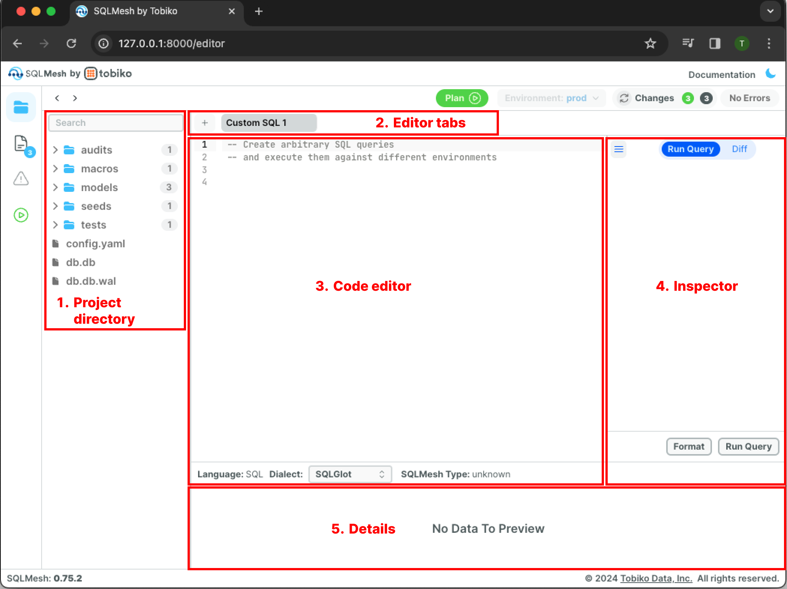
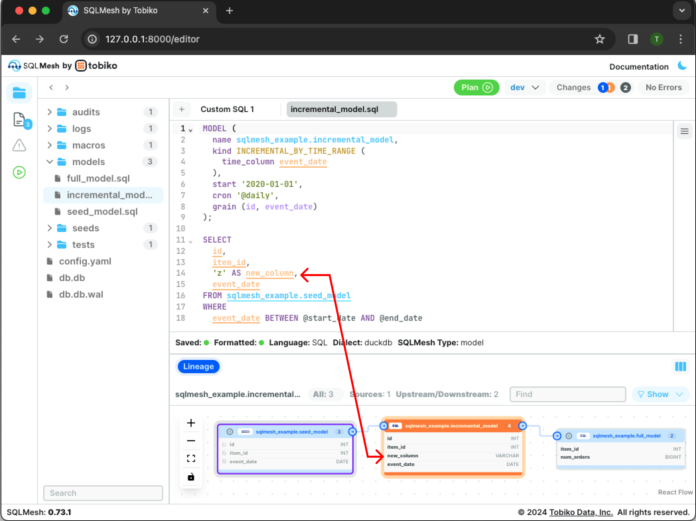
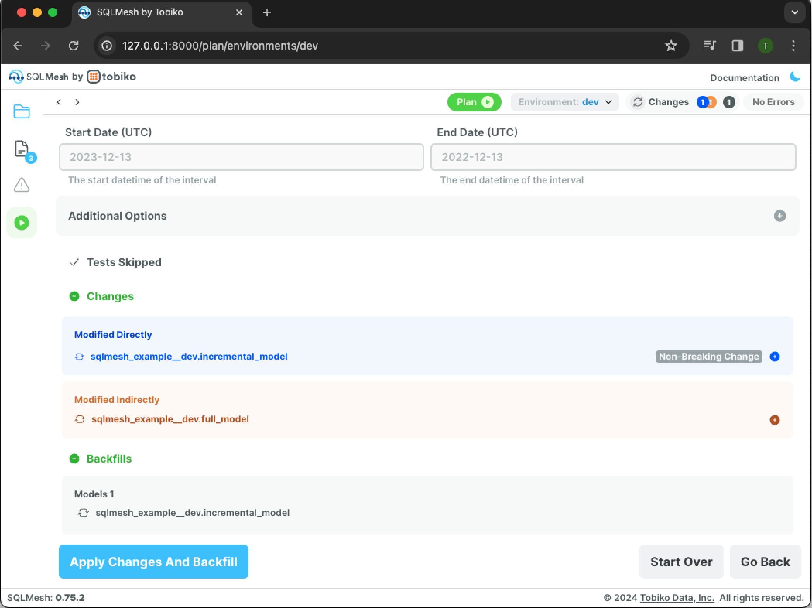

# ブラウザUIガイド

!!! warning

    ブラウザUIは非推奨です。代わりに[VSCode拡張機能](vscode.md)をご利用ください。


SQLMesh の無料のオープンソース ブラウザ ユーザー インターフェース (UI) を使用すると、SQLMesh プロジェクトを簡単に理解、調査、変更することができます。

このページでは、UI のコンポーネントとその動作について説明します。

## 目的

SQLMesh プロジェクトの変更には、コードの変更、環境の作成、プランの適用が含まれます。ブラウザ UI は、SQLMesh コマンドを実行するためのグラフィカルインターフェースを備えており、このプロセスを容易にします。

ただし、すべての SQLMesh コマンドを実行できるわけではありません。たとえば、`sqlmesh run` は [CLI](../reference/cli.md) または [Python](../reference/python.md) インターフェース経由で実行する必要があります。

### コード編集

SQLMesh プロジェクトを変更する際、コード編集は主要な作業です。

多くの開発者は、[VSCode](https://code.visualstudio.com/) や [PyCharm](https://www.jetbrains.com/pycharm/) などの統合開発環境 (IDE) でコードを編集します。IDE には、オートコンプリート、キーマッピングのカスタマイズ、コード検証、組み込みターミナルなど、豊富な編集機能が備わっています。

SQLMesh UI エディターは IDE ではなく、モデルを迅速に更新したり、アドホック SQL クエリを記述したりするためのコードエディターです。

開発作業では、SQLMesh UI を IDE と併用することをお勧めします。UI はモジュール設計になっているため、IDE でコードを編集しながら UI コンポーネントを組み合わせることができます。詳しくは [下記](#working-with-an-ide) をご覧ください。

## セットアップ

始める前に、SQLMesh を使用するための [前提条件](../prerequisites.md) をすべて満たしていることを確認してください。SQLMesh ブラウザ UI を使用するには、SQLMesh の基本インストールには含まれていない追加の Python ライブラリが必要です。

UI を使用するには、`web` アドオンを使用して SQLMesh をインストールします。まず、Python 仮想環境を使用している場合は、[インストール](../installation.md) 時に使用したフォルダから `source .venv/bin/activate` コマンドを実行して、仮想環境がアクティブ化されていることを確認してください。

次に、`pip` を使用して UI をインストールします。

```bash
pip install "sqlmesh[web]"
```

## ブラウザ UI を起動します

プロジェクトディレクトリ内から `sqlmesh ui` コマンドを実行して UI を開きます。

```bash
sqlmesh ui
```

起動後、SQLMesh Web UI はデフォルトで `http://127.0.0.1:8000` で提供されます。

{ loading=lazy }

ターミナルでリンクをクリックするか (サポートされている場合)、Web ブラウザにコピーして貼り付けて、URL に移動します。

{ loading=lazy }

## モジュール

UI は、さまざまな機能を備えたモジュールで構成されており、モジュールのセットは「モード」にグループ化されています（モードの詳細については、[下記](#modes) をご覧ください）。

UI モジュールは次のとおりです。

- [コードエディター](#editor-module)
- [プランビルダー](#plan-module)
- [データカタログ](#data-catalog-module)
- [テーブルと列のリネージ](#lineage-module)

以下のほとんどの例のスクリーンショットでは、デフォルトの「エディター」モードを使用しています。

### エディターモジュール {#editor-module}

モードを指定せずに UI を起動すると、デフォルトで `editor` モジュールが表示されます。デフォルトのビューには 5 つのペインがあります。

1. プロジェクトディレクトリでは、プロジェクトディレクトリとファイル間を移動できます。
2. エディタータブでは、開いているコードエディターが表示されます。
3. コードエディターでは、コードファイルの表示と編集ができます。
4. インスペクターでは、最近の操作と現在アクティブなペインに基づいて設定と情報が表示されます。(注: インスペクターペインはデフォルトで折りたたまれています。折りたたまれたペインの上部にあるハンバーガーボタンをクリックすると展開します (前の画像を参照)。)
5. 詳細では、エディターで開いているモデルの列レベルの系統とクエリの結果が表示されます。(注: 詳細ペインはデフォルトで折りたたまれています。エディターでモデルを開いたり、クエリを実行したりすると、自動的に展開されます。)

{ loading=lazy }

また、次の9つのボタンがあります。

1. エディター/データカタログ/エラー/プランの切り替えは、エディターモジュール（デフォルト）、データカタログモジュール、エラービュー、プランモジュールを切り替えます。エラービューは、エラーが発生した場合にのみ表示されます。
2. 履歴ナビゲーションは、Webブラウザの戻るボタンと同様に、前のビューに戻ります。
3. 新しいタブの追加は、新しいコードエディターウィンドウを開きます。
4. プランは、プランモジュールを開きます。
5. ドキュメントは、SQLMeshドキュメントウェブサイトへのリンクです。
6. 三日月は、ページのライトモードとダークモードを切り替えます。
7. SQLクエリの実行は、[`sqlmesh fetchdf` コマンド](../reference/cli.md#fetchdf)を実行します。
8. SQLクエリのフォーマットは、SQLGlotのきれいなレイアウトを使用してSQLクエリを再フォーマットします。
9. SQLダイアレクトの変更は、カスタムSQLクエリの現在のタブのSQLダイアレクトを指定します。プロジェクトのSQLダイアレクトには影響しません。

{ loading=lazy }

また、4つのステータスインジケーターがあります。

1. エディタータブの言語には、現在のコードエディタータブのプログラミング言語（SQLまたはPython）が表示されます。
2. 現在の環境には、現在選択されている環境が表示されます。
3. 変更インジケーターには、選択した環境で最後に実行されたSQLMeshプランと比較したプロジェクトファイルの変更の概要が表示されます。
4. エラーインジケーターには、プロジェクト内のエラーの数が表示されます。

{ loading=lazy }

#### モデルの編集

左側のプロジェクトディレクトリペインでファイル名をクリックすると、新しいタブでモデルが開きます。

タブにはモデル定義が表示され、下部の詳細ペインにはプロジェクトのテーブルと列の系統内のモデルが表示されます。

{ loading=lazy }

モデルの変更が保存されると、系統の表示が更新されます。例えば、クエリに新しい列を追加することで、増分SQLモデルを変更することができます。`Cmd + S` (Windowsの場合は `Ctrl + S`) を押すと、変更されたモデルファイルが保存され、更新された系統が表示されます。

{ loading=lazy }

右上の「変更」インジケーターに、モデルの更新を反映した青とオレンジの円が表示されます。

#### SQL クエリの実行

カスタム SQL エディターのタブから SQL クエリを実行します。

例えば、「カスタム SQL 1」タブに SQL クエリ「select * from sqlmesh_example.incremental_model」を追加します。クエリを実行するには、まずハンバーガーアイコンをクリックしてエクスプローラーペインを開きます。

{ loading=lazy }

次に、右下の「クエリ実行」ボタンをクリックしてクエリを実行します。

{ loading=lazy }

結果は、エディターの下の詳細ペインにあるインタラクティブなテーブルに表示されます。

### プランモジュール {#plan-module}

プランモジュールは、`sqlmesh plan` コマンド用のグラフィカルインターフェースを提供します。このモジュールの動作は、SQLMesh プロジェクトの現在の状態に基づいて変化します。例えば、SQL モデルに最後に保存された変更に基づいて、影響分析を自動更新します。

プランモジュールを開くには、左側のペインにある緑色の丸いボタン、または環境ドロップダウンの横にある上部バーの緑色のプランボタンをクリックします。

以下のセクションでは、SQLMesh [クイックスタートプロジェクト](../quick_start.md) を使用してモジュールのデモを行います。

#### 新規プロジェクト

新規プロジェクトでは、環境は空の「prod」環境のみです。最初のSQLMeshプランでは、すべてのモデルを実行して本番環境にデータを投入する必要があります。

プランモジュールを開くと、プロジェクトの最初のプランに関する複数の情報が表示されます。

- 「Initializing Prod Environment（本番環境の初期化）」セクションには、プランが「prod」環境を初期化していることがわかります。
- 「Start date（開始日）」と「End date（終了日）」セクションは、プランを「prod」環境で実行する際に許可されないため、グレー表示になっています。
- 「Changes（変更）」セクションには、SQLMeshが現在の空の環境に対して追加された3つのモデルを検出したことがわかります。
- 「Backfills（バックフィル）」セクションには、追加された3つのモデルすべてに対してバックフィルが行われることがわかります。

{ loading=lazy }

「変更を適用してバックフィル」というラベルの付いた青いボタンをクリックすると、SQLMesh はプランを適用し、バックフィルを開始します。

ページが更新され、新しい出力セクションが表示されます。各セクションはプラン適用の各段階を反映しており、ステップが成功すると緑色になります。

「テスト完了」セクションは、プロジェクトの[ユニットテスト](../concepts/tests.md)が正常に実行されたことを示します。

「スナップショットテーブル作成」セクションは、追加および変更されたモデルの[スナップショット](../concepts/architecture/snapshots.md)が正常に作成されたことを示します。

「バックフィル完了」セクションには、バックフィル操作の進行状況インジケーターが表示されます。最初の進行状況インジケーターは、バックフィル操作全体のタスクの合計数と完了率を示します。残りの進行状況バーには、各モデルの完了率と実行時間が表示されます (この単純な例では非常に高速です)。

{ loading=lazy }

#### 新しい環境

新しい環境を作成するには、右上の緑色の「プラン」ボタンの横にある「環境: prod \/」というドロップダウンをクリックして、環境メニューを開きます。

「dev」という名前の環境を作成するには、「環境」フィールドに「dev」と入力し、青い「追加」ボタンをクリックします。

{ loading=lazy }

ドロップダウンには、SQLMesh UI が `dev` 環境で動作していることが表示されます。

{ loading=lazy }

本番環境のビューを環境に取り込むには、緑色の「プラン」ボタンをクリックしてプランモジュールを開きます。

{ loading=lazy }

`dev` は既存の `prod` 環境から変更を加えずに作成されているため、出力セクションには追加/変更されたモデルやバックフィルは表示されません。

青色の「仮想更新を適用」ボタンをクリックすると、新しいプランが適用されます。

{ loading=lazy }


#### 既存の環境

プロジェクトファイルを変更する場合は、既存の環境に変更を適用する必要があります。この例では、プロジェクトの `incremental_model` を変更し、その変更を `dev` 環境に適用しています。

プランモジュールを開くと、変更内容の概要が表示されます。

{ loading=lazy }

`Changes` セクションでは、`incremental_model` が直接変更され、`full_model` は増分モデルから選択されているため間接的に変更されたことが検出されます。

青い「変更を適用してバックフィルを実行」ボタンをクリックして、プランを適用し、バックフィルを実行します。

{ loading=lazy }

### データカタログモジュール {#data-catalog-module}

データカタログモジュールは、プロジェクトのすべてのモデルに関する情報を 1 つのインターフェースに表示します。

左側のペインにすべてのモデルのリストが表示されます。ペイン上部のフィールドにモデル名を入力すると、モデルをフィルタリングできます。

モデルを選択すると、そのクエリ、系統、属性が表示されます。この例は、[クイックスタートプロジェクト](../quick_start.md) の増分モデルの情報を示しています。

{ loading=lazy }

デフォルトでは、モデル定義のソースコードが表示されます。「コンパイル済みクエリ」に切り替えると、マクロ値が置き換えられたモデルクエリの例が表示されます。

{ loading=lazy }

### リネージモジュール {#lineage-module}

リネージモジュールは、プロジェクトのテーブルと列のリネージをグラフィカルに表示します。

左側のペインでモデルをクリックすると、そのリネージが表示されます。デフォルトでは、モデルの上流の親と下流の子のみが表示されます。

{ loading=lazy }

右上の「表示」ドロップダウンで「すべて」をクリックすると、プロジェクトのすべてのモデルを含めることができます。この例では、2つのモデルが追加されています。

{ loading=lazy }

「表示」ドロップダウンメニューで「接続済み」をクリックすると、上流の親と下流の子の間のエッジが青色で強調表示されます。これは、プロジェクトに多数のモデルが含まれている場合に役立ちます。

{ loading=lazy }

## モード

SQLMesh UI は、上記の 4 つのモジュールで構成され、3 つの異なる「モード」にグループ化されています。モードを使用すると、セッション中に使用する予定のない UI 機能を非表示にすることで、すっきりとしたインターフェースを維持できます。

[コマンドラインで UI を起動](#ブラウザの UI を起動) する際に、オプションとして UI モードを指定できます。たとえば、UI をプランモードで実行するには、プロジェクトディレクトリ内から CLI コマンド `sqlmesh ui --mode plan` を実行します。

UI モードには、以下のモジュールが含まれています。

- `editor`: コードエディター、プランビルダー、データカタログ、テーブルと列のリネージ
- `plan`: プランビルダー、データカタログ、テーブルと列のリネージ
- `catalog`: データカタログ、テーブルと列のリネージ

### IDE での作業

SQLMesh ブラウザ UI は、プロジェクトコードへの変更の影響を迅速に表示することで IDE を補完します。

このセクションでは、VSCode での編集中に UI を使用する方法の 1 つを紹介します。UI の「プラン」モードでは、コードエディターモジュールが非表示になり、作業の邪魔になりません。

VSCode は、[VSCode ウィンドウでの Web ブラウザの起動](https://dev.to/equiman/vscode-browser-inside-2b06) をネイティブでサポートしています。このウィンドウでブラウザ UI を開き、コード更新の効果をリアルタイムで確認できます。

このワークフローを使用するには、まず VSCode でターミナルを開き、プロジェクトディレクトリに移動します。次に、次の手順を実行します。

<b>1.</b> コマンド「sqlmesh ui --mode plan」を使用して、ブラウザ UI を「プラン」モードで起動します。

{ loading=lazy }

<br></br>
<b>2.</b> VSCode では、ショートカット「cmd+shift+p」を入力して検索メニューを開きます。

{ loading=lazy }

<br></br>
<b>3.</b> 検索メニューに `simple browser` と入力し、 `Simple browser: Show` というエントリをクリックします。

{ loading=lazy }

<br></br>
<b>4.</b> コマンド出力に表示される Web アドレス (デフォルトでは `http://127.0.0.1:8000`) をコピーし、メニューに貼り付けて Enter キーを押します。

{ loading=lazy }

<br></br>
<b>5.</b> UI が VSCode タブに表示されます。

{ loading=lazy }

<br></br>
<b>6.</b> VSCodeウィンドウを分割して、UIと並行してコードエディタを開きます。モデルを更新すると、UIプランと系統インターフェースがリアルタイムで更新され、変更が反映されます。

{ loading=lazy }

{ loading=lazy }
