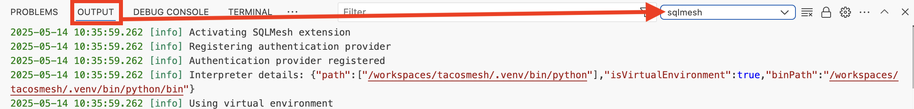
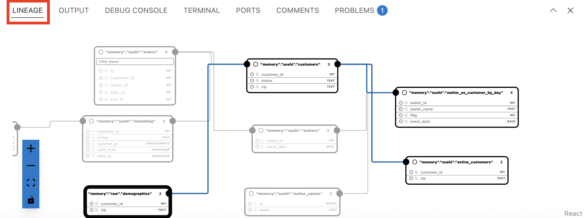
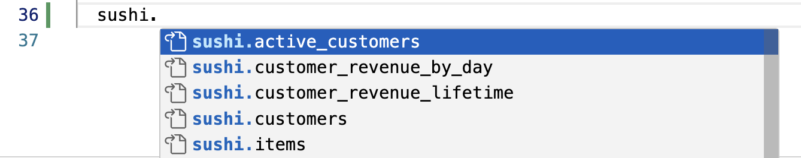
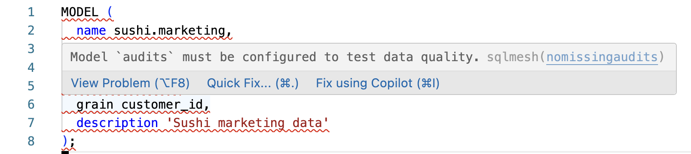
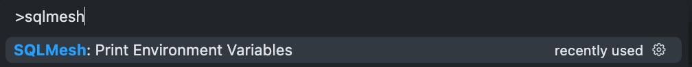
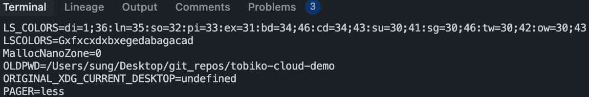
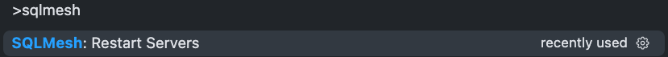
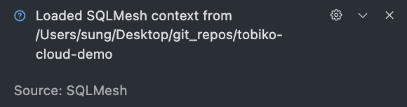

# Visual Studio Code 拡張

<div style="position: relative; padding-bottom: 56.25%; height: 0;"><iframe src="https://www.loom.com/embed/4a2e974ec8294716a4b1dbb0146add82?sid=b6c8def6-b7e0-4bfc-af6c-e37d5d83b0b1" frameborder="0" webkitallowfullscreen mozallowfullscreen allowfullscreen style="position: absolute; top: 0; left: 0; width: 100%; height: 100%;"></iframe></div>

!!! danger "Preview"

    SQLMesh Visual Studio Code 拡張機能はプレビュー版であり、現在開発が進められています。ご利用の SQLMesh バージョンによっては、バグや API の非互換性が発生する可能性があります。

    拡張機能をお試しいただき、問題が発生した場合は [GitHub Issue を作成](https://github.com/tobikodata/sqlmesh/issues) することをお勧めします。

このガイドでは、Visual Studio Code IDE ソフトウェア (以下、「VSCode」と呼びます) で SQLMesh 拡張機能を設定します。

拡張機能の機能と、よくある問題のトラブルシューティング方法について説明します。

## インストール

### VSCode 拡張機能

拡張機能は、Visual Studio の公式 [マーケットプレイス ウェブサイト](https://marketplace.visualstudio.com/items?itemName=tobikodata.sqlmesh) からインストールするか、VSCode の [拡張機能] タブで「SQLMesh」を検索してインストールしてください。

VSCode 拡張機能のインストールの詳細については、[公式ドキュメント](https://code.visualstudio.com/docs/configure/extensions/extension-marketplace#_install-an-extension) をご覧ください。

### Python のセットアップ

拡張機能のインストールは簡単ですが、VSCode で Python 環境をセットアップして構成するのは少し複雑です。

SQLMesh をインストールするには、専用の *Python 仮想環境* を使用することをお勧めします。仮想環境の詳細については、[Python ドキュメント](https://docs.python.org/3/library/venv.html) をご覧ください。

以下では仮想環境の作成と有効化の手順を説明しますが、さらに詳しい情報は [SQLMesh インストールページ](../installation.md) で確認できます。

まず、拡張機能に必要な SQLMesh ライブラリをインストールします。

SQLMesh プロジェクトのディレクトリでターミナルインスタンスを開き、次のコマンドを実行して `.venv` ディレクトリに仮想環境を作成します。

```bash
python -m venv .venv
```

次に、仮想環境をアクティブ化します。

```bash
source .venv/bin/activate
```

#### オープンソース SQLMesh

オープンソース SQLMesh を使用している場合は、VSCode 拡張機能を有効にする `lsp` エクストラを使用して SQLMesh をインストールしてください（SQLMesh エクストラの詳細については、[こちら](../installation.md#install-extras) をご覧ください）。

```bash
pip install 'sqlmesh[lsp]'
```

#### Tobiko Cloud

Tobiko Cloud をご利用の場合は、`tcloud` ライブラリによって SQLMesh が自動的にインストールされます。

まず、上記の [Python のセットアップ](#python-setup) の手順に従って Python 環境を作成し、有効化します。次に、`tcloud` をインストールします。

```bash
pip install tcloud # always make sure to install the latest version of tcloud
```

最後に、[こちら](../cloud/tcloud_getting_started.md#connect-tobiko-cloud-to-data-warehouse) の説明に従って、`lsp` エクストラを `tcloud.yml` 構成ファイルに追加します。

### VSCode Python インタープリター

Python 仮想環境には、独自の Python コピー（「Python インタープリター」）が含まれています。

VSCode が、システム全体のインタープリターや、インストールした SQLMesh ライブラリにアクセスできない他のインタープリターではなく、仮想環境のインタープリターを使用していることを確認する必要があります。

VSCode が正しいインタープリターを使用していることを確認するには、[コマンドパレット](https://code.visualstudio.com/docs/getstarted/userinterface#_command-palette) に移動し、「Python: インタープリターを選択」をクリックします。仮想環境のディレクトリ `.venv` にある Python 実行ファイルを選択します。


完了したら、[出力パネル](https://code.visualstudio.com/docs/getstarted/userinterface#_output-panel) の `sqlmesh` チャネルを確認して、すべてが正しく動作していることを確認します。 Python インタープリターのパスと SQLMesh インストールの詳細が表示されます。



## 機能

SQLMesh の VSCode 拡張機能を使用すると、以下の機能により SQLMesh プロジェクトを簡単に編集および理解できます。

- Lineage
    - モデルの系統図をインタラクティブに表示
- エディター
    - モデル名と SQLMesh キーワードの自動補完
    - モデル参照にマウスオーバーするとモデルの概要が表示される
    - モデル参照からモデルファイルを開くためのリンク
    - インライン SQLMesh リンター診断
- VSCode コマンド
    - SQLMesh プロジェクトファイルのフォーマット
    - Tobiko Cloud へのサインイン/サインアウト (Tobiko Cloud ユーザーのみ)

### Lineage

この拡張機能は、SQLMeshモデルに系統ビューを追加します。モデルの系統を表示するには、パネルの `Lineage` タブに移動します。



### レンダリング

この拡張機能を使用すると、マクロを解決したモデルをレンダリングできます。コマンドパレットの `Render SQLMesh Model` を選択するか、右上のプレビューボタンをクリックして呼び出すことができます。

### エディター

SQLMesh VSCode 拡張機能には、SQLMesh モデルの編集をより簡単かつ迅速にする機能がいくつか含まれています。

**補完**

SQL モデル、キーワード、またはモデル名を記述する際に、自動補完候補が表示されます。



**定義への移動とホバー情報**

モデル名にマウスオーバーすると、モデルの説明を含むツールチップが表示されます。

ホバー情報に加えて、SQL ファイル内の以下のオブジェクトの定義に移動するには、右クリックして「定義へ移動」を選択するか、該当する参照を Command/Control キーを押しながらクリックします。現在、この方法は以下の場合に有効です。

- SQL ファイル内の `FROM my_model` のようなモデル参照
- SQL ファイル内の `WITH my_cte AS (...) ... FROM my_cte` のような CTE 参照
- SQL ファイル内の `SELECT @my_macro(...)` のような Python マクロ

**診断**

[SQLMesh linter](../guides/linter.md) を有効にしている場合、問題はエディターに直接報告されます。これは、SQLMesh の組み込み linter ルールとカスタム linter ルールの両方で有効です。



**フォーマット**

SQLMesh のモデルフォーマットツールはエディターに直接統合されているため、モデルのフォーマットを統一して簡単に行うことができます。

### コマンド

SQLMesh VSCode 拡張機能は、VSCode コマンドパレットに以下のコマンドを提供します。

- `Format SQLMesh project`
- `Sign in to Tobiko Cloud` (Tobiko Cloud users only)
- `Sign out of Tobiko Cloud` (Tobiko Cloud users only)

## トラブルシューティング

### DuckDB の同時アクセス

SQLMesh プロジェクトで状態保存に DuckDB を使用している場合、問題が発生する可能性があります。

SQLMesh は状態データベースへの複数の接続を作成できますが、DuckDB のローカルデータベースファイルは同時アクセスをサポートしていません。

VSCode 拡張機能はデータベースに接続された長時間実行プロセスを確立するため、CLI からの標準的な SQLMesh 使用時よりもアクセス競合が発生する可能性が高くなります。

したがって、VSCode 拡張機能で状態保存に DuckDB を使用することはお勧めしません。

### 環境変数

VSCode 拡張機能は、バックグラウンドで別プロセスとして実行される [言語サーバー](https://en.wikipedia.org/wiki/Language_Server_Protocol) に基づいています。VSCode 拡張機能がバックグラウンド言語サーバーを起動すると、サーバーは VSCode を起動した環境から環境変数を継承します。サーバーは VSCode のターミナルインスタンスから環境変数を継承しないため、CLI から SQLMesh を呼び出すときに使用する変数にアクセスできない可能性があります。

コンテキストと言語サーバーに必要な環境変数がある場合は、次のいずれかの方法で言語サーバーに変数を渡すことができます。

- 変数が既に設定されているターミナルから VSCode を開きます。
    - ターミナルをデフォルトで初期化する際に、シェル設定ファイル (例: `.zshrc` または `.bashrc`) に `export ENV_VAR=value` と記述しておくと、そのターミナルから言語サーバーを開いたときに変数が取得されます。
- シークレットストアへの接続などにより、`config.py` で他の場所から動的に取得した環境変数を使用します。
- デフォルトでは、ルートプロジェクトディレクトリ内の `.env` ファイルは、拡張機能が使用する Python 環境を通じて言語サーバーによって自動的に取得されます。拡張機能が使用する Python 環境で環境変数を設定する方法の詳細については、[こちら](https://code.visualstudio.com/docs/python/environments#_environment-variables) を参照してください。

環境変数が言語サーバーに渡されているかどうかは、ターミナルに出力することで確認できます。

1. `Cmd + Shift + P` (Windowsの場合は `Ctrl + Shift + P`) を押してVSCodeコマンドバーを起動します。

2. オプション「SQLMesh: Print Environment Variables」を選択します。
3. ターミナルに環境変数が表示されます。


開発中に設定を変更した場合（例：シェル設定に変数を追加した場合）、変更を有効にするには言語サーバーを再起動する必要があります。ターミナルで次のコマンドを実行することで、これを実行できます。

1. `Cmd + Shift + P`（Windowsの場合は`Ctrl + Shift + P`）を押して、VSCodeコマンドバーを起動します。
2. オプション「SQLMesh: Restart Servers」を選択します。



    > この「loaded」というメッセージは、VSCodeウィンドウの左下隅に表示されます。

3. 上記の手順に基づいて環境変数を出力し、変更が有効になっていることを確認します。

### Python 環境の問題

最も一般的な問題は、拡張機能が正しい Python インタープリターを使用していないことです。

[上記のセットアッププロセス](#vscode-python-interpreter)に従って、拡張機能が正しい Python インタープリターを使用していることを確認してください。

VSCode の `sqlmesh` 出力チャネルを確認しても拡張機能が正しい Python インタープリターを使用していない場合は、[こちら](https://github.com/tobikodata/sqlmesh/issues) で問題を報告してください。

### Python の依存関係が不足しています

SQLMesh をインストールする際、`lsp` エクストラを指定しないと、VSCode 拡張機能に必要な一部の依存関係がインストールされません。

オープンソースの SQLMesh を使用している場合は、ターミナルで次のコマンドを実行して `lsp` エクストラをインストールしてください。

```bash
pip install 'sqlmesh[lsp]'
```

Tobiko Cloud を使用している場合は、[`tcloud.yaml` 構成ファイル](../cloud/tcloud_getting_started.md#connect-tobiko-cloud-to-data-warehouse) で指定された追加機能のリストに `lsp` が含まれていることを確認してください。

### SQLMesh の互換性

SQLMesh VSCode 拡張機能はプレビュー段階であり、基盤となる SQLMesh バージョンの API は安定していません。そのため、拡張機能とご利用の SQLMesh バージョン間の互換性は保証されません。

問題が発生した場合は、[こちら](https://github.com/tobikodata/sqlmesh/issues) で問題を報告してください。