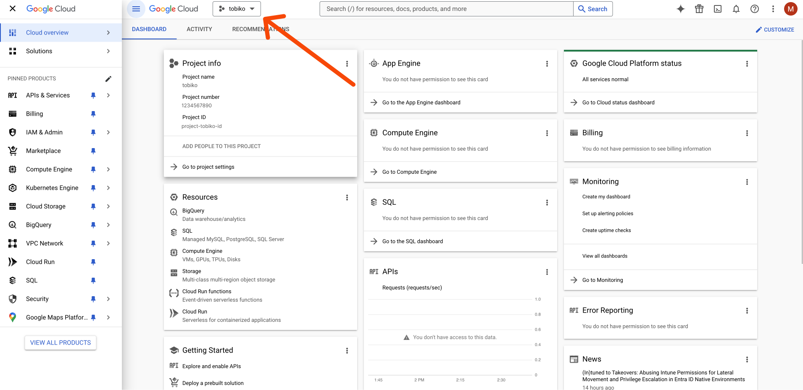
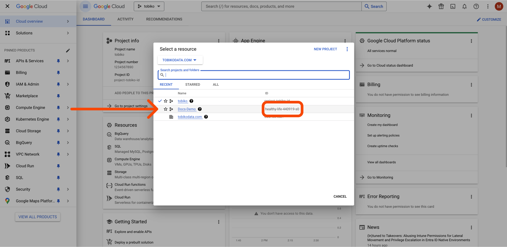
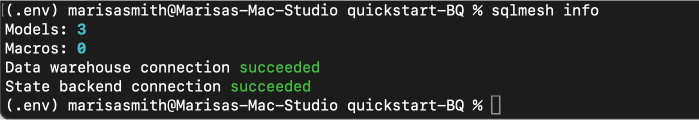
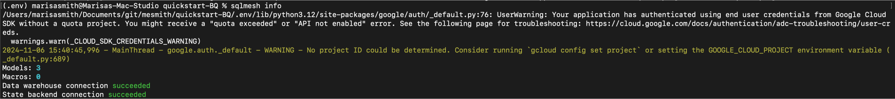
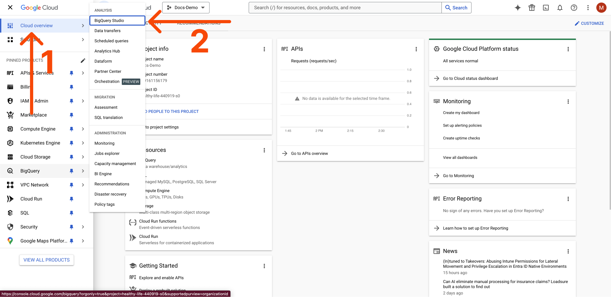
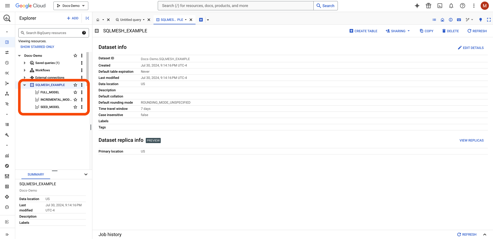

# BigQuery

## はじめに

このガイドでは、SQLMesh を BigQuery SQL エンジンに接続する方法について、段階的に説明します。

SQLMesh と BigQuery 接続ライブラリをローカルにインストールし、SQLMesh で接続を構成し、[クイックスタート プロジェクト](../../quick_start.md) を実行する手順を詳しく説明します。

## 前提条件

このガイドでは、SQLMesh で使用する BigQuery プロジェクトについて、以下の条件を満たしていることを前提としています。

- プロジェクトが既に存在していること
- プロジェクトで [CLI/API アクセスが有効](https://cloud.google.com/endpoints/docs/openapi/enable-api) であること
- プロジェクトで [課金が設定されている](https://cloud.google.com/billing/docs/how-to/manage-billing-account) こと (つまり、サンドボックス プロジェクトではないこと)
- SQLMesh が、プロジェクトに対してコマンドを実行する権限を持つアカウントを使用して認証できること

## インストール

[クイックスタート インストール ガイド](../../installation.md) の [SQLMesh のインストール](../../installation.md#install-sqlmesh-core) まで実行してください。この手順では、必要な BigQuery ライブラリもインストールします。

SQLMesh コアだけでなく、BigQuery エンジン ライブラリもインストールします。

```bash
> pip install "sqlmesh[bigquery]"
```

### Google Cloud SDK をインストールします

SQLMesh は Python [`google-cloud-bigquery` ライブラリ](https://pypi.org/project/google-cloud-bigquery/) を介して BigQuery に接続します。このライブラリは、[BigQuery の認証](https://googleapis.dev/python/google-api-core/latest/auth.html) に [Google Cloud SDK `gcloud` ツール](https://cloud.google.com/sdk/docs) を使用します。

Google Cloud SDK をコンピュータにインストールして設定するには、以下の手順に従ってください。

- [Google Cloud インストール ガイド](https://cloud.google.com/sdk/docs/install) から、お使いのシステムに適したインストーラをダウンロードします。
- ダウンロードしたファイルを `tar` コマンドで解凍します。

    ```bash
    > tar -xzvf google-cloud-cli-{SYSTEM_SPECIFIC_INFO}.tar.gz
    ```

- インストール スクリプトを実行します。

    ```bash
    > ./google-cloud-sdk/install.sh
    ```

- シェル プロファイルを再読み込みします (例: zsh の場合):

    ```bash
    > source $HOME/.zshrc
    ```

- [`gcloud init` を実行して認証を設定します](https://cloud.google.com/sdk/gcloud/reference/init)

## 構成

### BigQuery 用に SQLMesh を構成する

SQLMesh プロジェクトの `config.yaml` ファイルに次のゲートウェイ仕様を追加します。

```yaml
bigquery:
  connection:
    type: bigquery
    project: <your_project_id>

default_gateway: bigquery
```

これにより、`bigquery` という名前のゲートウェイが作成され、プロジェクトのデフォルトゲートウェイになります。

[`oauth` 認証方式](#authentication-methods) を使用します。この認証方式では、接続構成でユーザー名やその他の情報を直接指定しません。その他の認証方法については[後述](#authentication-methods)で説明します。

BigQuery でダッシュボードに移動し、SQLMesh プロジェクトで使用する BigQuery プロジェクトを選択します。Google Cloud ダッシュボードで、矢印を使用してポップアップ メニューを開きます。



これで、上記の `config.yaml` ゲートウェイ仕様に必要なプロジェクトIDを特定できます。作業対象のプロジェクトを選択してください。ポップアップメニューからIDラベルを選択すると、yamlファイルに追加する必要があるプロジェクトIDが表示されます。



このガイドでは、Docs-Demo を使用するため、この例のプロジェクト ID は `healthy-life-440919-s0` になります。

## 使用方法

### 接続をテストする

SQLMesh が BigQuery に接続できることを確認するには、次のコマンドを実行します。

```bash
> sqlmesh info
```

出力は次のようになります。



- **クォータプロジェクトの設定（オプション）**

    `sqlmesh info` を実行すると、次のような警告が表示される場合があります。

    

    クォータプロジェクトに関するこれらの警告を回避するには、次のコマンドを実行します。

    ```bash
    > gcloud auth application-default set-quota-project <your_project_id>
    > gcloud config set project <your_project_id>
    ```


### プランを作成して実行する

接続を確認したので、BigQuery でプランを作成して実行する準備が整いました。

```bash
> sqlmesh plan
```

### BigQuery コンソールで結果を表示

プロジェクトモデルが期待どおりに動作していることを確認しましょう。

まず、BigQuery Studio コンソールに移動します。



次に、左側のサイドバーからプロジェクトと新しく作成されたモデルを見つけます。



SQLMesh プロジェクトが BigQuery で正常に動作していることを確認しました。

## ローカル/組み込みスケジューラ

**エンジンアダプタタイプ**: `bigquery`

### インストール
```
pip install "sqlmesh[bigquery]"
```

### 接続オプション

| オプション | 説明 | タイプ | 必須 |
|---------------------------------|--------------------------------------------------------------------------------------------------------------------------------------------------------------------------------|:-------:|:--------:|
| `type` | エンジンタイプ名 - `bigquery` である必要があります | 文字列 | Y |
| `method` | 接続方法 - [使用可能な値](#authentication-methods)を参照してください。デフォルト: `oauth`。 | 文字列 | N |
| `project` | GCP プロジェクトの ID | 文字列 | N |
| `location` | データセットのロケーション (リージョンまたはマルチリージョン) | 文字列 | N |
| `execution_project` | モデルの実行に対して課金する GCP プロジェクトの名前。設定されていない場合は、モデルに関連付けられたプロジェクトが使用されます。 | 文字列 | N |
| `quota_project` |割り当てに使用される GCP プロジェクトの名前。設定されていない場合は、アカウントの認証情報内に設定されている `quota_project_id` を使用して BigQuery への認証が行われます。| 文字列 | N |
| `keyfile` | サービス アカウント メソッドで使用されるキーファイルへのパス | 文字列 | N |
| `keyfile_json` | キーファイル情報はインラインで提供されます (非推奨) | 辞書 | N |
| `token` | OAuth 2.0 アクセス トークン | 文字列 | N |
| `refresh_token` | OAuth 2.0 リフレッシュ トークン | 文字列 | N |
| `client_id` | OAuth 2.0 クライアント ID | 文字列 | N |
| `client_secret` | OAuth 2.0 クライアント シークレット | 文字列 | N |
| `token_uri` | OAuth 2.0 認可サーバーのトークン エンドポイント URI | 文字列 | N |
| `scopes` |承認を取得するために使用されるスコープ | リスト | N |
| `impersonated_service_account` | 設定されている場合、SQLMesh はこのサービス アカウントの偽装を試みます | 文字列 | N |
| `job_creation_timeout_seconds` | 基になるジョブが作成されるのを待機する最大時間 (秒)。 | int | N |
| `job_execution_timeout_seconds` | 基になるジョブが完了するまでを待機する最大時間 (秒)。 | int | N |
| `job_retries` | 基になるジョブが失敗した場合に再試行する回数。(既定値: `1`) | int | N |
| `priority` | 基になるジョブの優先度。(既定値: `INTERACTIVE`) | 文字列 | N |
| `maximum_bytes_billed` | 基になるジョブに対して課金される最大バイト数。 | int | N |

## 認証方法
- [oauth](https://google-auth.readthedocs.io/en/master/reference/google.auth.html#google.auth.default) (デフォルト)
    - 関連する認証情報の設定:
        - `scopes` (オプション)
- [oauth-secrets](https://google-auth.readthedocs.io/en/stable/reference/google.oauth2.credentials.html)
    - 関連する認証情報の設定:
        - `token` (オプション): リフレッシュ情報が提供されている場合は None を指定できます。
        - `refresh_token` (オプション): 指定すると、認証情報を更新できます。
        - `client_id` (オプション): リフレッシュの場合は必ず指定してください。トークンを更新できない場合は None のままにできます。
        - `client_secret` (オプション): リフレッシュの場合は必ず指定してください。トークンを更新できない場合は None のままにできます。
        - `token_uri` (オプション): リフレッシュのために指定する必要があります。トークンをリフレッシュできない場合は None のままにできます。
        - `scopes` (オプション): OAuth 2.0 認証情報は、認可後に追加のスコープを要求できません。リフレッシュ情報が提供されている場合、スコープはリフレッシュトークンから導出可能である必要があります（例：リフレッシュトークンのスコープは、このスコープのスーパーセットであるか、「https://www.googleapis.com/auth/any-api」のようなワイルドカードスコープを含む）。
- [service-account](https://google-auth.readthedocs.io/en/master/reference/google.oauth2.service_account.html#google.oauth2.service_account.IDTokenCredentials.from_service_account_file)
    - 関連する認証情報の設定：
        - `keyfile`（必須）
        - `scopes`（オプション）
- [service-account-json](https://google-auth.readthedocs.io/en/master/reference/google.oauth2.service_account.html#google.oauth2.service_account.IDTokenCredentials.from_service_account_info)
    - 関連する認証情報の設定：
        - `keyfile_json` (必須)
        - `scopes` (オプション)

`impersonated_service_account` 引数が設定されている場合、SQLMesh は次の処理を実行します。

1. 上記のいずれかの方法でユーザーアカウントの認証情報を認証します。
2. その認証情報を使用してサービスアカウントの権限借用を試みます。

ユーザーアカウントには、[サービスアカウントの権限借用に必要な権限](https://cloud.google.com/docs/authentication/use-service-account-impersonation) が必要です。

## 必要な権限
上記のいずれの接続方法を使用する場合でも、SQLMesh が正しく動作するために、以下の BigQuery 権限が有効になっていることを確認してください。

- [`BigQuery データオーナー`](https://cloud.google.com/bigquery/docs/access-control#bigquery.dataOwner)
- [`BigQuery ユーザー`](https://cloud.google.com/bigquery/docs/access-control#bigquery.user)
