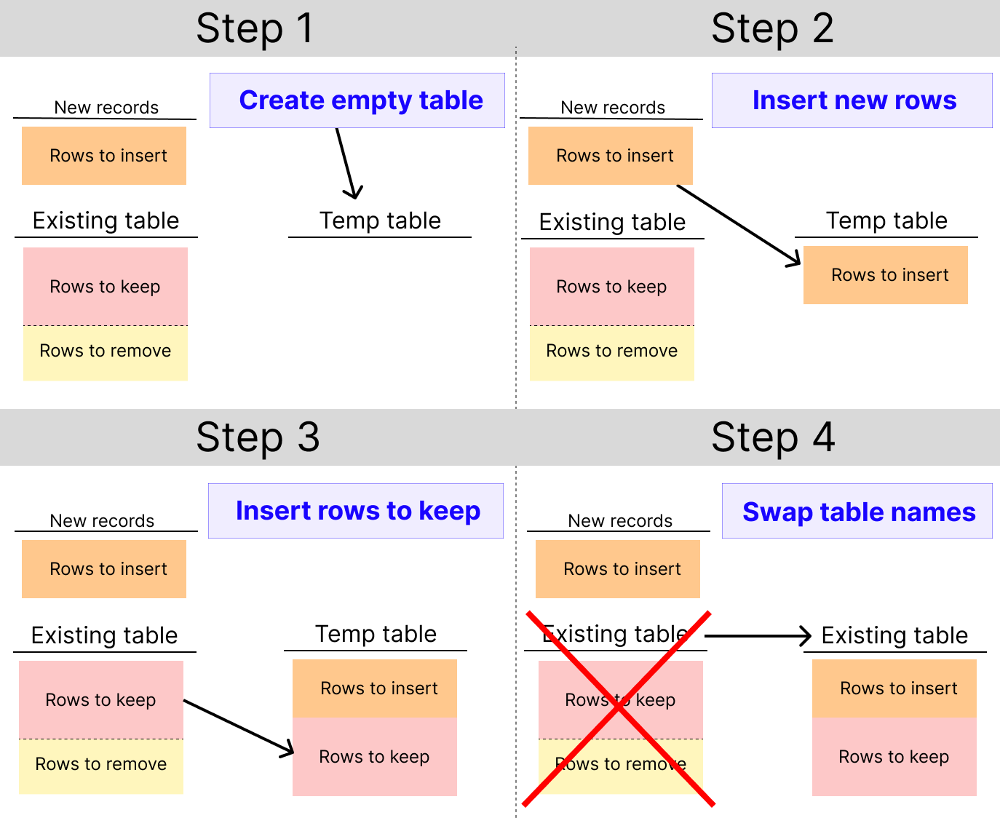

# ClickHouse

このページでは、ClickHouse 固有の構成オプションを含む、ClickHouse エンジンの SQLMesh サポートについて説明します。

!!! note

    ClickHouseはSQLMeshの[状態接続](../../reference/configuration.md#connections)には使用できません。

## 背景

[ClickHouse](https://clickhouse.com/) は、分析ワークロードを迅速に実行するために設計された、分散型の列指向SQLエンジンです。

ClickHouseは、ユーザーがその動作をきめ細かく制御できますが、そのためには複雑な設定が必要になります。

このセクションでは、ClickHouseの背景情報を提供し、ClickHouseエンジンでSQLMeshを使用する方法について説明します。

### オブジェクトの命名

ほとんどのSQLエンジンは、3階層の階層的な命名スキームを使用します。テーブル/ビューは_schemas_内にネストされ、スキーマは_catalogs_内にネストされます。たとえば、テーブルの完全な名前は「my_catalog.my_schema.my_table」のようになります。

ClickHouseは、_catalog_に相当するものがない2階層の階層的な命名スキームを使用します。さらに、階層の2番目のレベルを「データベース」と呼びます。SQLMeshとそのドキュメントでは、この2番目のレベルを「スキーマ」と呼んでいます。

SQLMeshは、ユーザーの操作なしにClickHouseの2階層の命名スキームを完全にサポートしています。

### テーブルエンジン

ClickHouse のすべてのテーブルは、[テーブルデータの保存方法とクエリ方法を制御する「テーブルエンジン」](https://clickhouse.com/docs/en/engines/table-engines) を使用して作成されます。ClickHouse (および SQLMesh) のデフォルトのテーブルエンジンは `MergeTree` です。

[`MergeTree` エンジンファミリー](https://clickhouse.com/docs/en/engines/table-engines/mergetree-family/mergetree) では、すべてのテーブルを `ORDER BY` 句を使用して作成する必要があります。

SQLMesh は、すべての `MergeTree` ファミリーテーブルの `CREATE` ステートメントに空の `ORDER BY` 句を自動的に挿入します。または、テーブルを並べ替える列/式を指定することもできます。

### ClickHouse の動作モード

概念的には、ClickHouse にはシングルサーバー、クラスター、ClickHouse Cloud の 3 つの動作モードがあると考えると分かりやすいでしょう。SQLMesh はこれら 3 つのモードすべてをサポートしています。

#### シングルサーバーモード

シングルサーバーモードは他のSQLエンジンと同様です。各テーブルのエンジンを選択するだけで、計算の実行方法については気にする必要はありません。標準的なSQLコマンド/クエリを発行すれば、ClickHouseがそれを実行します。

#### クラスターモード

クラスターモードでは、ClickHouse エンジンを任意の数のネットワークサーバーに拡張できます。これにより大規模なワークロードが可能になりますが、ネットワークサーバーによる計算の実行方法を指定する必要があります。

ClickHouse は、[ClickHouse Keeper](https://clickhouse.com/docs/en/architecture/horizo​​ntal-scaling) を使用して、ネットワークサーバー上の計算を調整します（[Apache ZooKeeper](https://zookeeper.apache.org/) もサポートしています）。

Keeper の設定で、名前付き仮想サーバークラスターを指定します。これらのクラスターは、データオブジェクトと計算のための名前空間を提供します。例えば、ネットワークに接続されたすべてのサーバーを `MyCluster` という名前でクラスターに含めることができます。

通常、コマンドを実行するには ClickHouse サーバーに接続している必要があります。デフォルトでは、実行する各コマンドは、接続しているサーバー上でシングルサーバーモードで実行されます。

オブジェクトをクラスターに関連付けるには、クラスターを作成または変更するDDLコマンドに「ON CLUSTER [クラスター名]」というテキストを含める必要があります。

SQLMeshの接続設定でクラスター名を指定すると、SQLMeshはプロジェクト実行中に作成されるすべてのオブジェクトのDDLコマンドに「ON CLUSTER」ステートメントを自動的に挿入します。SQLMeshのクラスターに関する詳細は、[下記](#cluster-specification)で説明しています。

#### ClickHouse Cloud モード

[ClickHouse Cloud](https://clickhouse.com/cloud) は、マネージド ClickHouse プラットフォームです。これにより、クラスターを自分で管理したり、クラスター上で実行するために SQL コマンドを変更したりすることなく、ClickHouse を拡張できます。

ClickHouse Cloud は ClickHouse のクラスター制御を自動化しますが、これにより ClickHouse の柔軟性や SQL コマンドの実行方法が制限される場合があります。たとえば、`SELECT` コマンドを使用してテーブルを作成する場合、[ClickHouse Cloud では 2 つの手順で実行する必要があります](https://clickhouse.com/docs/en/sql-reference/statements/create/table#from-select-query)。SQLMesh がこの制限を処理します。

これらの制約を除けば、ClickHouse Cloud モードはシングルサーバーモードに似ています。つまり、標準の SQL コマンド/クエリを実行すると、ClickHouse Cloud がそれらを実行します。

## 権限

デフォルトのSQLMesh設定では、ユーザーは新しいClickHouseデータベースを作成するための十分な権限を持っている必要があります。

あるいは、SQLMeshがテーブルオブジェクトとビューオブジェクトを作成する特定のデータベースを設定することもできます。

### 環境ビュー

[プロジェクト設定の `environment_suffix_target` キー](../../guides/configuration.md#disable-environment-specific-schemas) を使用して、環境ビューを新しいデータベースではなくモデルのデータベース内に作成するように指定します。

``` yaml
environment_suffix_target: table
```

### 物理テーブル

[プロジェクト構成の `physical_schema_mapping` キー](../../guides/configuration.md#physical-table-schemas) を使用して、物理テーブルを作成するデータベースを指定します。

このキーには、モデルデータベース名と物理テーブルを作成するデータベースをマッピングする正規表現の辞書を指定できます。

SQLMesh は、モデルのデータベース名と各正規表現を比較し、最初に一致した表現を使用して物理テーブルを作成するデータベースを決定します。

たとえば、次の構成では、正規表現 `.*` が任意のデータベース名に一致するため、すべてのモデルの物理テーブルが `model_physical_tables` データベースに配置されます。

``` yaml
physical_schema_mapping:
  '.*': model_physical_tables
```

## クラスター仕様

ClickHouse クラスターを使用すると、ネットワークに接続された複数の ClickHouse サーバーが同じデータオブジェクトを操作できます。各クラスターは ClickHouse 設定ファイルで名前を付ける必要があり、その名前はテーブルの DDL ステートメントの `ON CLUSTER` 句に渡されます。

例えば、クラスター `TheCluster` にテーブル `my_schema.my_table` を作成するには、`CREATE TABLE my_schema.my_table ON CLUSTER TheCluster (col1 Int8)` と記述します。

クラスター上に SQLMesh オブジェクトを作成するには、SQLMesh 接続定義の `cluster` キーにクラスター名を指定します（すべての接続パラメータについては [下記](#localbuilt-in-scheduler) を参照してください）。

SQLMesh は、指定した `ON CLUSTER` 句とクラスター名をすべてのプロジェクトの DDL ステートメントに自動的に挿入します。

## モデル定義

このセクションでは、SQLMesh モデルにおけるテーブルエンジンとその他の ClickHouse 固有の機能の制御方法について説明します。

### テーブルエンジン

SQLMesh は、デフォルトで空の `ORDER BY` 句を持つ `MergeTree` テーブルエンジンを使用します。

別のテーブルエンジンを指定するには、モデル DDL の `storage_format` パラメータにテーブルエンジン定義を渡します。例えば、`Log` テーブルエンジンは次のように指定できます。

``` sql linenums="1" hl_lines="4"
MODEL (
    name my_schema.my_log_table,
    kind full,
    storage_format Log,
);

select
    *
from other_schema.other_table;
```

より複雑なテーブルエンジン定義を指定することもできます。例:

``` sql linenums="1" hl_lines="4"
MODEL (
    name my_schema.my_rep_table,
    kind full,
    storage_format ReplicatedMergeTree('/clickhouse/tables/{shard}/table_name', '{replica}', ver),
);

select
    *
from other_schema.other_table;
```

#### ORDER BY

`MergeTree` ファミリーのエンジンでは、テーブルの `CREATE` 文に `ORDER BY` 句が含まれている必要があります。

SQLMesh は、`MergeTree` ファミリーのエンジンを使用してテーブルを作成する際に、空の `ORDER BY()` 句を自動的に挿入します。これにより、順序付けのないテーブルが作成されます。

`ORDER BY` 句で指定する列/式は、モデルの `physical_properties` ディクショナリの `order_by` キーに渡すことができます。

例えば、列 `col1` と `col2` で並べ替える場合は、次のようにします。

``` sql linenums="1" hl_lines="4-6"
MODEL (
    name my_schema.my_log_table,
    kind full,
    physical_properties (
        order_by = (col1, col2)
    )
);

select
    *
from other_schema.other_table;
```

`order_by` のキー名と値 `(col1, col2)` の間に `=` があることに注意してください。

複雑な `ORDER BY` 式は、一重引用符で囲んで渡す必要がある場合があります。その場合、一重引用符内の引用符は `\` 文字でエスケープする必要があります。

#### PRIMARY KEY

テーブルエンジンは `PRIMARY KEY` 指定も受け入れる場合があります。`ORDER BY` と同様に、モデル DDL の `physical_properties` ディクショナリで主キーを指定します。例:

``` sql linenums="1" hl_lines="6"
MODEL (
    name my_schema.my_log_table,
    kind full,
    physical_properties (
        order_by = (col1, col2),
        primary_key = col1
    )
);

select
    *
from other_schema.other_table;
```

`primary_key` キー名と値 `col1` の間に `=` があることに注意してください。

### TTL

ClickHouse テーブルは、一定時間経過後に行を削除するなどの[アクションをトリガーする TTL 式](https://clickhouse.com/docs/en/guides/developer/ttl) を受け入れます。

`ORDER_BY` や `PRIMARY_KEY` と同様に、モデル DDL の `physical_properties` ディクショナリに TTL キーを指定します。例:

``` sql linenums="1" hl_lines="6"
MODEL (
    name my_schema.my_log_table,
    kind full,
    physical_properties (
        order_by = (col1, col2),
        primary_key = col1,
        ttl = timestamp + INTERVAL 1 WEEK
    )
);

select
    *
from other_schema.other_table;
```

`ttl` キー名と値 `timestamp + INTERVAL 1 WEEK` の間に `=` があることに注意してください。

### パーティショニング

一部の ClickHouse テーブルエンジンはパーティショニングをサポートしています。モデル DDL の `partitioned_by` キーでパーティショニングする列/式を指定します。

例えば、次のように `col1` と `col2` 列でパーティション分割できます。

``` sql linenums="1" hl_lines="4"
MODEL (
    name my_schema.my_log_table,
    kind full,
    partitioned_by (col1, col2),
);

select
    *
from other_schema.other_table;
```

SQLMesh が [パーティション化されたテーブルを使用してパフォーマンスを向上させる](#performance-considerations) 方法については、以下で詳しく説明します。

## 設定

ClickHouse は [膨大な数の設定](https://clickhouse.com/docs/en/operations/settings) をサポートしており、その多くは ClickHouse 設定ファイル、Python クライアント接続引数、DDL 文、SQL クエリなど、複数の場所で変更できます。

このセクションでは、SQLMesh で ClickHouse 設定を制御する方法について説明します。

### 接続設定

SQLMesh は [`clickhouse-connect` ライブラリ](https://clickhouse.com/docs/en/integrations/python) を使用して Python に接続します。この接続メソッドは、ClickHouse に渡される任意の設定のディクショナリを受け入れます。

これらの設定は `connection_settings` キーで指定します。次の例は、`distributed_ddl_task_timeout` 設定を `300` に設定する方法を示しています。

``` yaml linenums="1" hl_lines="8-9"
clickhouse_gateway:
  connection:
    type: clickhouse
    host: localhost
    port: 8123
    username: user
    password: pw
    connection_settings:
      distributed_ddl_task_timeout: 300
  state_connection:
    type: duckdb
```

### DDL 設定

ClickHouse 設定は、`CREATE` などの DDL コマンドでも指定できます。

これらの設定は、モデル DDL の [`physical_properties` キー](https://sqlmesh.readthedocs.io/en/stable/concepts/models/overview/?h=physical#physical_properties) で指定します（[`order_by`](#order-by) と [`primary_key`](#primary-key) の値が存在する場合は、それらも指定します）。

次の例は、`index_granularity` 設定を `128` に設定する方法を示しています。

``` sql linenums="1" hl_lines="4-6"
MODEL (
    name my_schema.my_log_table,
    kind full,
    physical_properties (
        index_granularity = 128
    )
);

select
    *
from other_schema.other_table;
```

`index_granularity` キー名と値 `128` の間に `=` があることに注意してください。

### クエリ設定

ClickHouse の設定は、モデルのクエリ内で `SETTINGS` キーワードを使用して直接指定できます。

次の例では、`join_use_nulls` 設定を `1` に設定しています。

``` sql linenums="1" hl_lines="9"
MODEL (
    name my_schema.my_log_table,
    kind full,
);

select
    *
from other_schema.other_table
SETTINGS join_use_nulls = 1;
```

`SETTINGS` キーワードを繰り返し使用することで、クエリ内で複数の設定を指定できます。例: `SELECT * FROM other_table SETTINGS first_setting = 1 SETTINGS second_setting = 2;`

#### SQLMesh での使用法

ClickHouse 設定の `join_use_nulls` は、SQLMesh SCD モデルとテーブル差分の動作に影響します。このセクションでは、SQLMesh がクエリ設定を使用してその動作を制御する方法について説明します。

^^背景^^

一般的に、テーブルの `JOIN` は、両方のテーブルに存在しない行に対して空のセルを返すことがあります。

例えば、2つのテーブル `left` と `right` を `LEFT JOIN` で結合するとします。ここで、列 `right_column` は `right` テーブルにのみ存在します。`left` テーブルにのみ存在する行は、結合後のテーブルの `right_column` に値を持ちません。

他のSQLエンジンでは、これらの空のセルには `NULL` が設定されます。

一方、ClickHouse は空のセルにデータ型固有のデフォルト値（例：整数列の場合は 0）を設定します。`join_use_nulls` 設定を `1` に設定すると、セルには `NULL` が設定されます。

^^SQLMesh^^

SQLMesh は、SCD タイプ 2 モデルとテーブル比較の両方に対して SQL クエリを自動的に生成します。これらのクエリには、テーブルの `JOIN` と `NULL` 値の存在に基づく計算が含まれます。

これらのクエリは空のセルに `NULL` 値が入ることを想定しているため、SQLMesh は生成された SCD およびテーブル比較 SQL コードに `SETTINGS join_use_nulls = 1` を自動的に追加します。

SCD モデル定義クエリは、SQLMesh によって生成された完全なクエリに CTE として埋め込まれます。単独で実行した場合、モデル定義クエリは ClickHouse サーバーの現在の `join_use_nulls` 値を使用します。

この値が `1` でない場合、外部クエリの SQLMesh 設定がサーバーの値を上書きし、誤った結果が生成されます。

そのため、SQLMesh はモデル定義クエリが正しい `join_use_nulls` 値で実行されるように、以下の手順に従います。

- モデルクエリ自体が `join_use_nulls` を設定している場合は何も行いません。
- モデルクエリが `join_use_nulls` を設定せず、現在のサーバーの `join_use_nulls` 値が `1` の場合は何も行いません。
- モデルクエリが `join_use_nulls` を設定せず、現在のサーバーの `join_use_nulls` 値が `0` の場合は、CTE モデルクエリに `SETTINGS join_use_nulls = 0` を追加します。
    - その他のすべての CTE と外部クエリは、引き続き `join_use_nulls` 値が `1` の状態で実行されます。

## パフォーマンスに関する考慮事項

ClickHouse はレコードの書き込み/読み取りに最適化されているため、レコードの削除/置換に非常に時間がかかる場合があります。

このセクションでは、SQLMesh がレコードの削除/置換を必要とする理由と、ClickHouse エンジンアダプタがこれらの制限をどのように回避するかについて説明します。

### なぜ削除または置換するのですか？

SQLMesh は、モデルの種類を以下のように様々な方法で「具体化」します。

- テーブル全体を置換する ([`FULL` モデル](../../concepts/models/model_kinds.md#full))
- 特定の時間範囲のレコードを置換する ([`INCREMENTAL_BY_TIME_RANGE` モデル](../../concepts/models/model_kinds.md#incremental_by_time_range))
- 特定のキー値を持つレコードを置換する ([`INCREMENTAL_BY_UNIQUE_KEY` モデル](../../concepts/models/model_kinds.md#incremental_by_unique_key))
- 特定のパーティション内のレコードを置換する ([`INCREMENTAL_BY_PARTITION` モデル])モデル](../../concepts/models/model_kinds.md#incremental_by_partition))

SQLエンジンによって、レコードの置換方法は異なります。

一部のエンジンは、レコードの更新または挿入（「アップサート」）をネイティブでサポートしています。例えば、一部のエンジンでは、キーに基づいて新しいテーブルを既存のテーブルに「マージ」できます。新しいテーブルのレコードのうち、既存のテーブルに既にキーが存在するレコードは、既存のレコードを更新/置換します。新しいテーブルのレコードのうち、既存のテーブルにキーが存在しないレコードは、既存のテーブルに挿入されます。

他のエンジンはアップサートをネイティブでサポートしていないため、SQLMeshはレコードを2段階で置換します。まず、既存のテーブルから更新/置換するレコードを削除し、次に新しいレコードを挿入します。

ClickHouseはアップサートをサポートしておらず、この2段階の削除/挿入操作は非常に遅く、実用的ではありません。そのため、SQLMeshはレコードの置換に別の方法を使用します。

### 一時テーブルスワップ

SQLMeshは、ClickHouseのレコードを置き換える際に、「一時テーブルスワップ」と呼ばれる手法を使用します。

ClickHouseはレコードの書き込みと読み取りに最適化されているため、テーブルの大部分をコピーする方が、レコードの一部を削除するよりも高速になる場合が多くあります。これが、一時テーブルスワップ手法で採用されているアプローチです（パーティションテーブルの場合は、オプションでパフォーマンスを向上できます）。

一時テーブルスワップには4つのステップがあります。

1. 既存のテーブルと同じ構造（列、データ型、テーブルエンジンなど）を持つ空の一時コピーを作成します。
2. 一時テーブルに新しいレコードを挿入します。
3. **保持** する必要がある既存のレコードを一時テーブルに挿入します。
4. テーブル名を交換し、一時テーブルの名前を既存のテーブルと同じにします。

図1は、これらの4つのステップを示しています。
<br></br>

{ loading=lazy }
_図1: 一時テーブルスワップの実行手順_
<br></br>

この方法の弱点は、既存のすべての行をコピーして保持する必要があることです（手順3）。これは、大規模なテーブルでは問題となる可能性があります。

この弱点に対処するため、SQLMeshはテーブルがパーティション分割されている場合、代わりに*パーティション*スワップを使用します。

### パーティションスワップ

ClickHouse は、レコードのグループを別々のファイル（つまり「パーティション」）に保存する「パーティション化された」テーブルをサポートしています。

テーブルは、テーブル列または SQL 式（「パーティションキー」）に基づいてパーティション化されます。パーティションキーの値が同じすべてのレコードは、同じパーティションにまとめて保存されます。

例えば、各レコードの作成日を datetime 列に格納するテーブルを考えてみましょう。テーブルを月ごとにパーティション化すると、タイムスタンプが 1 月のレコードはすべて 1 つのパーティションに保存され、2 月のレコードは別のパーティションに保存される、といった具合になります。

テーブルパーティション化は、スワップパフォーマンスを向上させる上で大きなメリットをもたらします。レコードは個々のパーティションで挿入、更新、または削除できます。

SQLMesh はこれを利用して、大量の既存レコードを一時テーブルにコピーすることを回避します。代わりに、ロードによって新たに取り込まれたレコードの影響を受けるパーティション内のレコードのみをコピーします。

SQLMesh は、[`partitioned_by`](../../concepts/models/overview.md#partitioned_by) キーを指定する増分モデルに対してパーティション スワッピングを自動的に使用します。

#### パーティションキーの選択

テーブルをパーティション分割する最初のステップは、パーティションキー（列または式）を選択することです。キーを選択する際に最も考慮すべき点は、生成されるパーティションの総数です。これはテーブルのパフォーマンスに影響します。

パーティションが多すぎると、パーティションファイルの処理にかかるオーバーヘッドが、コピーするレコード数が少ないことによるメリットを相殺してしまうため、パフォーマンスが大幅に低下する可能性があります。パーティションが少なすぎると、増分ロードのたびに多くの既存レコードをコピーする必要があるため、スワップパフォーマンスが低下します。

!!! question "パーティションが多すぎるとしたら何個でしょうか?"

    ClickHouse のドキュメントでは、[テーブルのパーティションが多すぎる場合](https://clickhouse.com/docs/en/engines/table-engines/mergetree-family/custom-partitioning-key) という警告が出ており、最大 1000 が推奨されています。

テーブル内のパーティションの総数は、パーティション列/式のみではなく、テーブル内の実際のデータによって決まります。

例えば、日付でパーティション分割されたテーブルを考えてみましょう。`2024-10-23` に作成されたレコードを挿入すると、テーブルには 1 つのパーティションが含まれます。次に `2024-10-24` からのレコードを挿入すると、テーブルには 2 つのパーティションが作成されます。キーの一意の値ごとに1つのパーティションが作成されます。

プロジェクト内のパーティション分割されたテーブルごとに、パーティション分割式とデータの特性の組み合わせによって作成されるパーティションの数を慎重に検討してください。

#### 時間による増分モデル

`INCREMENTAL_BY_TIME_RANGE` タイプのモデルは、時間でパーティション分割する必要があります。モデルの `time_column` がどの `partitioned_by` 式にも指定されていない場合、SQLMesh はそれを最初のパーティション分割式として自動的に追加します。

デフォルトでは、`INCREMENTAL_BY_TIME_RANGE` モデルは週ごとにパーティション分割されるため、推奨される最大 1,000 パーティションは約 19 年分のデータに相当します。SQLMesh プロジェクトでは時間範囲とデータサイズが大きく異なるため、システムが処理するデータに基づいてモデルのパーティション分割キーを選択する必要があります。

モデルの各パーティションに多数のレコードが含まれる場合、モデルの [`ORDER_BY` 式](#order-by) に時間列を含めることで、パフォーマンスがさらに向上する可能性があります。

!!! info "時間による分割"

    `INCREMENTAL_BY_TIME_RANGE` モデルは時間でパーティション分割する必要があります。

    SQLMesh は、`partitioned_by` 構成キーに時間列またはそれに基づく式が含まれていない限り、モデルを **週** で自動的にパーティション分割します。

    処理するデータの特性に基づいてモデルの時間パーティション分割の粒度を選択し、パーティションの総数が 1,000 以下になるようにしてください。

ローカル/組み込みスケジューラ

**エンジンアダプタタイプ**: `clickhouse`

| オプション | 説明 | タイプ | 必須 |
| ------------------------- | ------------------------------------------------------------------------------------------------------------------------------------------------------------------------------------------------------------------------------------------------------------------------------------------------- | :----: | :------: |
| `type` | エンジンタイプ名 - `clickhouse` である必要があります | 文字列 | Y |
| `host` | ClickHouse サーバーのホスト名または IP アドレス | 文字列 | Y |
| `username` | ClickHouse ユーザー名 | 文字列 | Y |
| `password` | ClickHouse ユーザーパスワード | 文字列 | N |
| `port` | ClickHouse HTTP または HTTPS ポート (デフォルト: `8123`) | 整数 | N |
| `cluster` | ClickHouse クラスター名 | 文字列 | N |
| `connect_timeout` |接続タイムアウト（秒）（デフォルト: `10`）| int | N |
| `send_receive_timeout` | 送受信タイムアウト（秒）（デフォルト: `300`）| int | N |
| `query_limit` | クエリ結果の制限（デフォルト: `0` - 制限なし）| int | N |
| `use_compression` | 圧縮を使用するかどうか（デフォルト: `True`）| bool | N |
| `compression_method` | 使用する圧縮方法 | 文字列 | N |
| `http_proxy` | HTTP プロキシ アドレス（HTTP_PROXY 環境変数の設定に相当）| 文字列 | N |
| `verify` | サーバーの TLS/SSL 証明書を検証する（デフォルト: `True`）| bool | N |
| `ca_cert` | verify が `False` の場合は無視されます。verify が `T