# Databricks

このページでは、Databricks SQL エンジンで SQLMesh を使用する方法について説明します。まず、SQLMesh を Databricks に接続する 3 つの方法について説明します。

その後に、Databricks への接続方法を示す [接続クイックスタート](#connection-quickstart) があります。または、[組み込み](#localbuilt-in-scheduler) を使用して Databricks を使用する方法に直接進むこともできます。

## Databricks の接続方法

Databricks は複数のコンピューティング オプションと接続方法を提供します。このセクションでは、SQLMesh に接続する 3 つの方法について説明します。

### Databricks SQL コネクタ

SQLMesh は、デフォルトで [Databricks SQL コネクタ](https://docs.databricks.com/dev-tools/python-sql-connector.html) ライブラリを使用して Databricks に接続します。

SQL コネクタは SQLMesh にバンドルされており、コマンド `pip install "sqlmesh[databricks]"` に `databricks` エクストラオプションを含めると自動的にインストールされます。

SQL コネクタには、SQLMesh が Databricks および PySpark DataFrame を返さない Python モデル上で SQL モデルを実行するために必要なすべての機能が備わっています。

PySpark DataFrame を返す Python モデルがある場合は、[Databricks Connect](#databricks-connect-1) セクションをご覧ください。

### Databricks Connect

Databricks で SQLMesh Python モデル内の PySpark DataFrame を処理する場合、SQLMesh は Databricks SQL Connector ライブラリではなく [Databricks Connect](https://docs.databricks.com/dev-tools/databricks-connect.html) ライブラリを使用して Databricks に接続する必要があります。

SQLMesh には Databricks Connect ライブラリが含まれたりバンドルされたりすることはありません。Databricks クラスターで使用されている Databricks Runtime と一致するバージョンの [Databricks Connect](https://docs.databricks.com/en/dev-tools/databricks-connect/python/install.html) をインストールする必要があります。

[詳細な構成情報については以下を参照](#databricks-connect-1)。

### Databricks ノートブックインターフェース

SQLMesh コマンドを常に Databricks クラスターインターフェースで直接実行している場合（[ノートブックマジックコマンド](../../reference/notebook.md)を使用した Databricks ノートブックなど）、すべての SQLMesh コマンドの実行には Databricks が提供する SparkSession が使用されます。

[詳細な設定については以下をご覧ください](#databricks-notebook-interface-1)。

## 接続クイックスタート

クラウドウェアハウスへの接続にはいくつかの手順が必要です。この接続クイックスタートでは、Databricks を使い始めるために必要な情報を提供します。

SQLMesh にバンドルされている `databricks-sql-connector` Python ライブラリを使用して、Databricks [All-Purpose Compute](https://docs.databricks.com/en/compute/index.html) インスタンスに接続する方法を説明します。

!!! tip

    このクイックスタートは、SQLMesh の基本的なコマンドと機能に精通していることを前提としています。

    そうでない場合は、先に [SQLMesh クイックスタート](../../quick_start.md) をお読みください。

### 前提条件

この接続クイックスタートを実行する前に、以下の点を確認してください。

1. 適切な Databricks ワークスペースにアクセスできる Databricks アカウントがあること
    - ワークスペースが [個人用アクセストークン](https://docs.databricks.com/en/dev-tools/auth/pat.html) による認証をサポートしていること (Databricks [Community Edition ワークスペースはサポートしていません](https://docs.databricks.com/en/admin/access-control/tokens.html))
    - アカウントにワークスペースアクセス権限とコンピューティング作成権限があること (これらの権限はデフォルトで有効になっています)
2. Databricks コンピューティングリソースで [Unity Catalog](https://docs.databricks.com/aws/en/data-governance/unity-catalog/) が有効化されていること
3. コンピューターに [SQLMesh がインストール](../../installation.md) され、[Databricks エクストラが利用可能](../../installation.md#install-extras) になっていること
    - コマンドラインからコマンド `pip install "sqlmesh[databricks]"` でインストールします。
4. お使いのコンピューターで [SQLMesh サンプルプロジェクト](../../quickstart/cli#1-create-the-sqlmesh-project) を初期化しました。
    - コマンドラインインターフェースを開き、プロジェクトファイルを配置するディレクトリに移動します。
    - コマンド `sqlmesh init duckdb` でプロジェクトを初期化します。

!!! important "Unityカタログが必要です"

    SQLMesh で使用される Databricks コンピューティング リソースでは、[Unity Catalog](https://docs.databricks.com/aws/en/data-governance/unity-catalog/) がアクティブ化されている必要があります。

### 接続情報の取得

Databricks 接続を構成するための最初のステップは、Databricks コンピューティングインスタンスから必要な情報を収集することです。

#### コンピューティングの作成

接続先が必要なので、まずは Databricks のコンピューティングインスタンスを作成してアクティブ化します。既にインスタンスが稼働している場合は、[次のセクション](#get-jdbcodbc-info) に進んでください。

まずは Databricks ワークスペースのデフォルトビューから始めます。左側のメニューで `Compute` エントリをクリックして、コンピューティングビューにアクセスします。

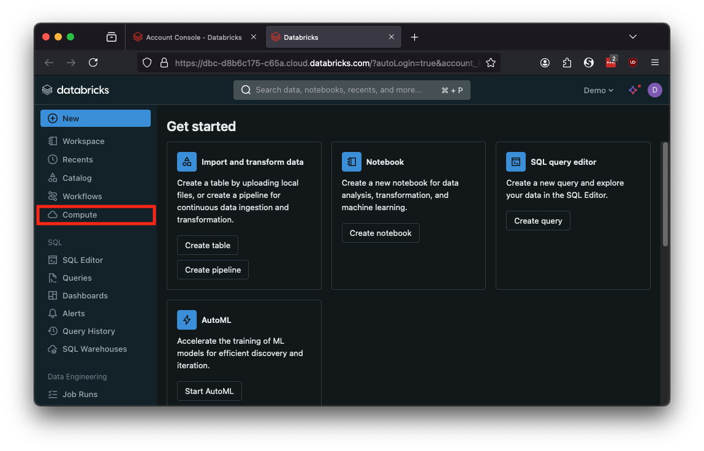{ loading=lazy }

Compute ビューで、`Create compute` ボタンをクリックします。

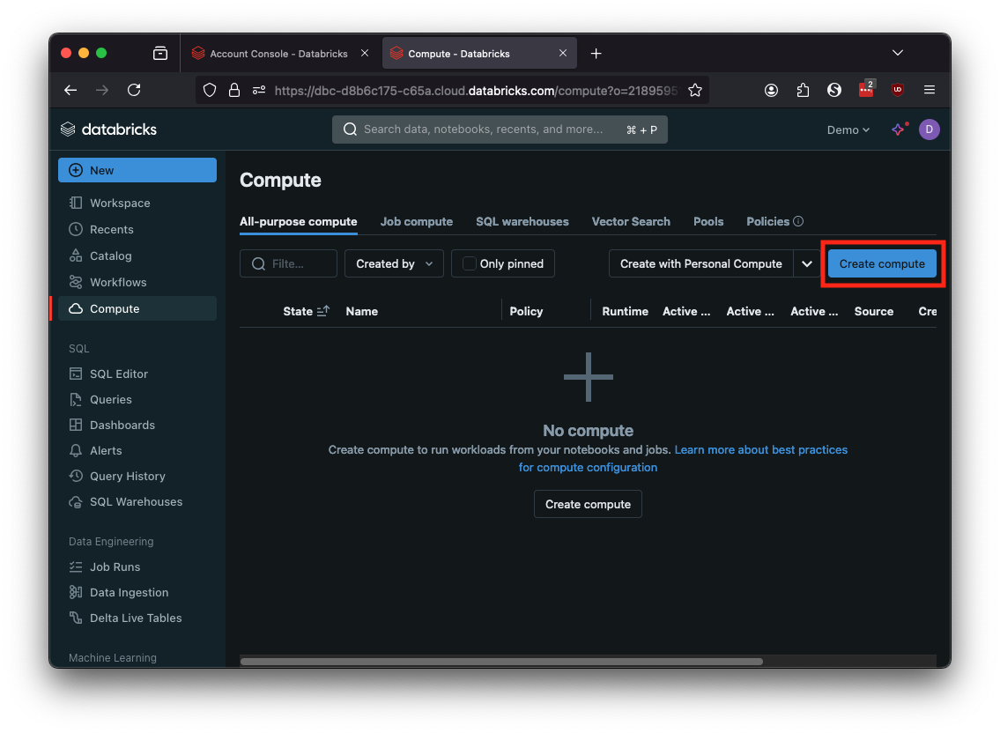{ loading=lazy }

必要に応じてコンピューティング クラスターのオプションを変更し、 `Create compute` ボタンをクリックします。

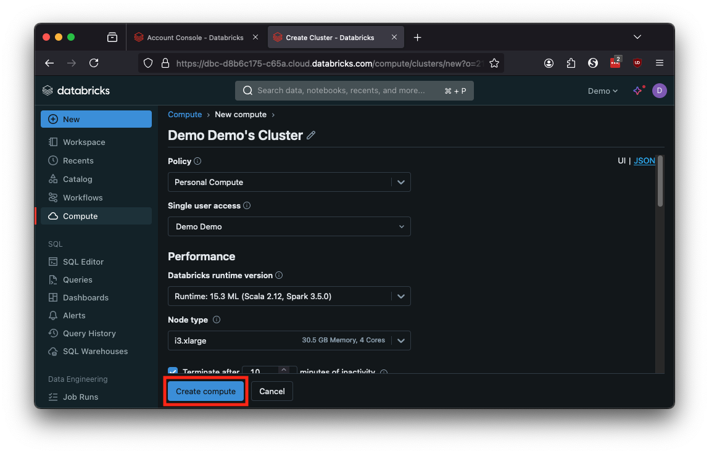{ loading=lazy }

#### JDBC/ODBC 情報を取得する

ビューの一番下までスクロールし、 `Advanced Options` ビューを開きます。

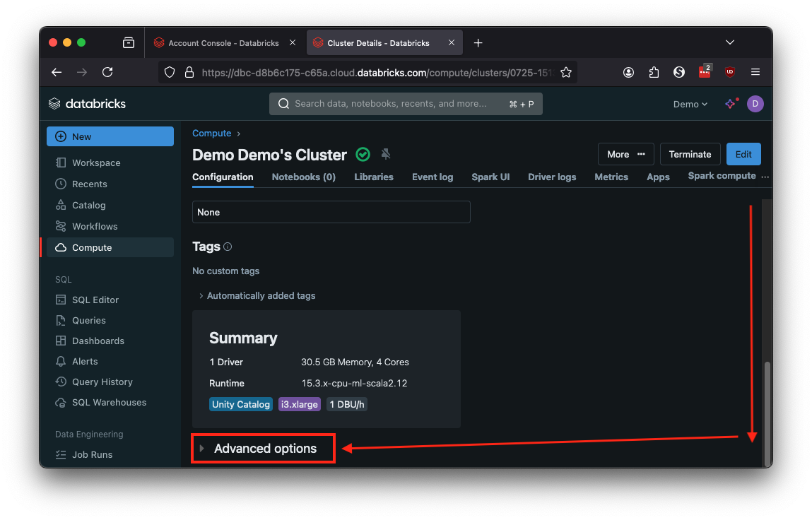{ loading=lazy }

 `JDBC/ODBC` タブをクリックします。

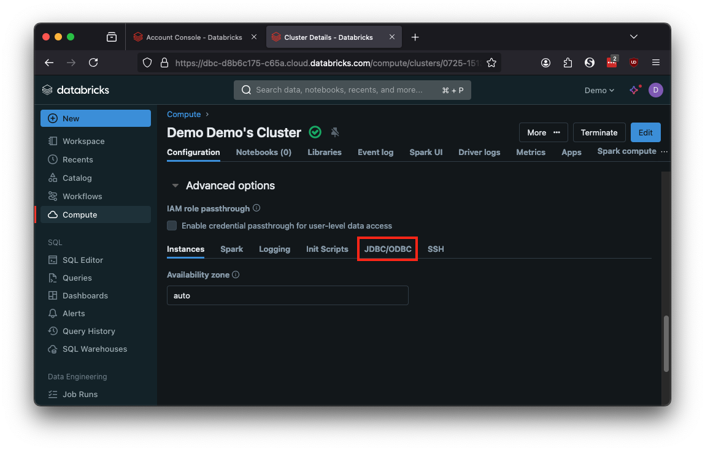{ loading=lazy }

テキスト エディターでプロジェクトの `config.yaml` 構成ファイルを開き、既存の `local` ゲートウェイの下に `databricks` という名前の新しいゲートウェイを追加します。

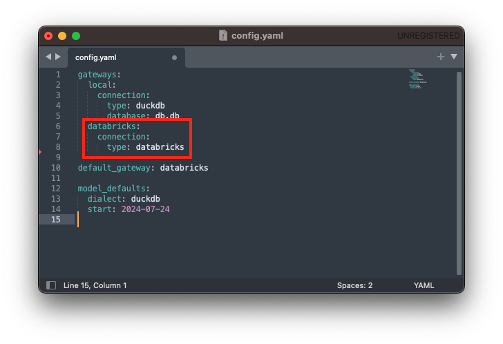{ loading=lazy }

Databricks JDBC/ODBC タブから `server_hostname` および `http_path` 接続値を `config.yaml` ファイルにコピーします。

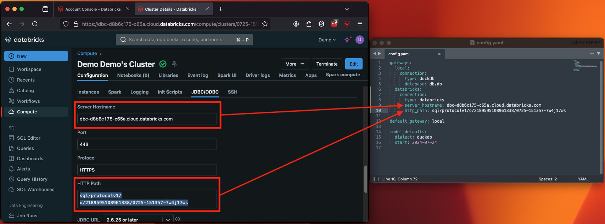{ loading=lazy }

#### 個人アクセストークンを取得する

`config.yaml` ファイルに必要な最後の情報は、個人アクセストークンです。

!!! warning
    **個人アクセス トークンを他の人と共有しないでください。**

    アクセストークンなどのシークレットを保存するベストプラクティスは、[構成ファイルが動的に読み込む環境変数](../../guides/configuration.md#environment-variables)に配置することです。簡潔にするため、このガイドでは代わりに構成ファイルに直接値を設定します。

    以下のコードは、構成ファイルの `access_token` パラメータに環境変数 `DATABRICKS_ACCESS_TOKEN` を使用する方法を示しています。

    ```yaml linenums="1"
    gateways:
      databricks:
          connection:
            type: databricks
            access_token: {{ env_var('DATABRICKS_ACCESS_TOKEN') }}
    ```

<br></br>
個人アクセス トークンを作成するには、プロフィール ロゴをクリックして、プロフィールの「設定」ページに移動します。

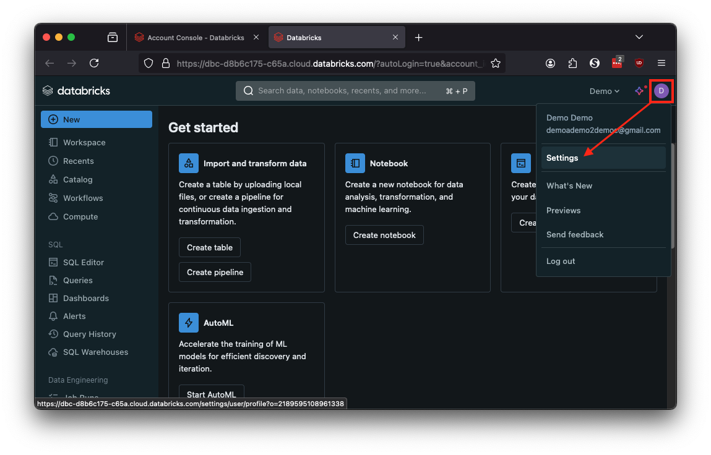{ loading=lazy }

ユーザーメニューの `Developer` ビューに移動してください。アカウントの役割によっては、ワークスペース管理者セクションがページに表示されない場合があります。

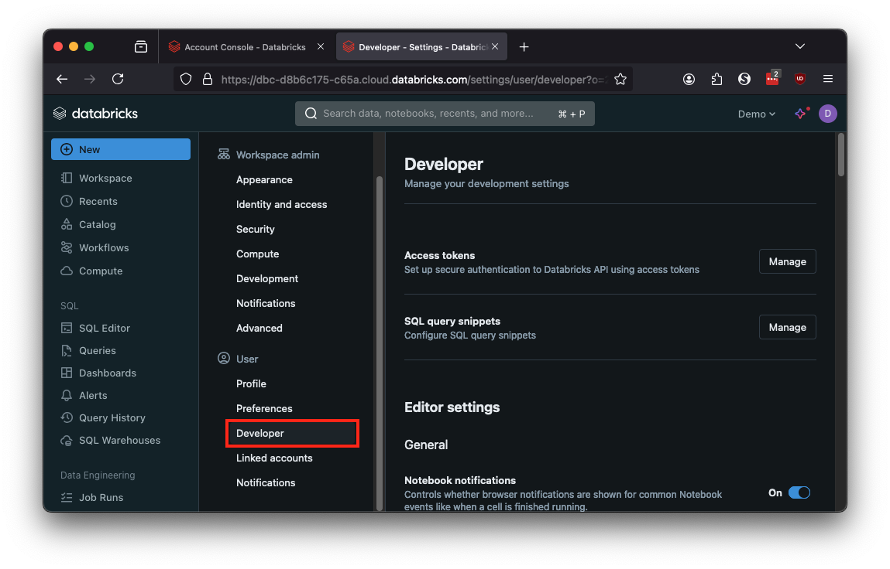{ loading=lazy }

アクセス トークン セクションの `Manage` ボタンをクリックします。

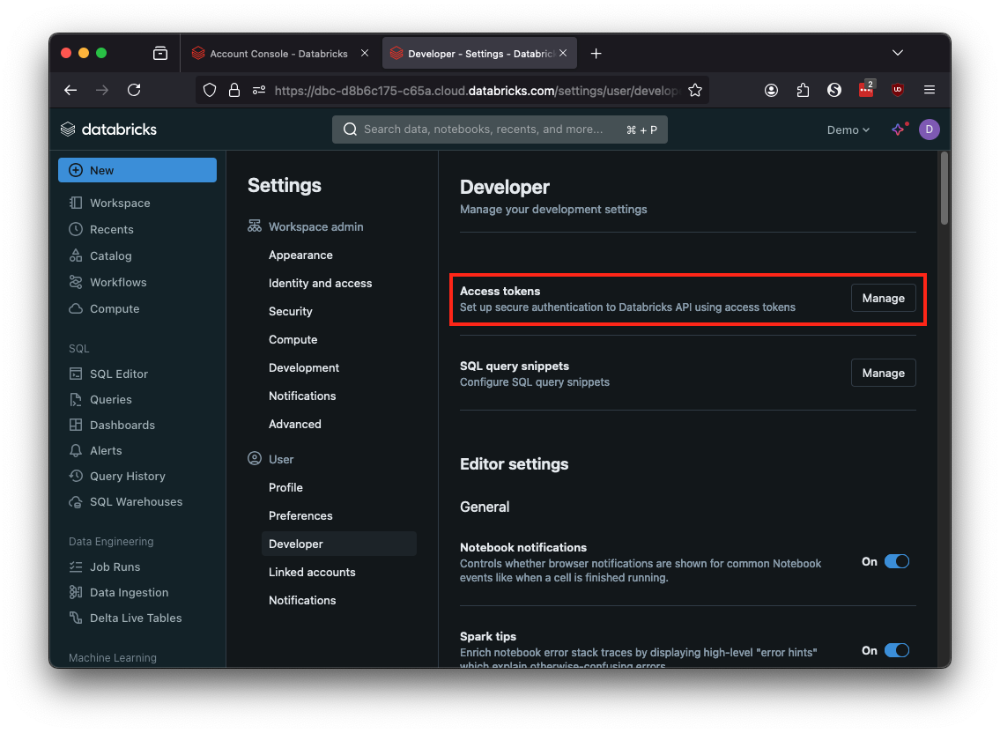{ loading=lazy }

`Generate new token` ボタンをクリックします。

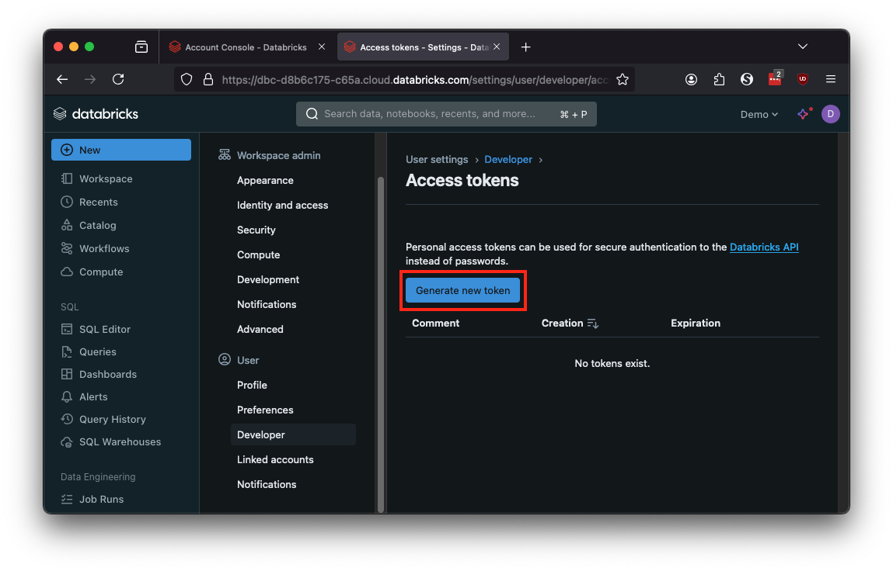{ loading=lazy }

 `Comment` フィールドにトークンの名前を入力し、 `Generate` ボタンをクリックします。

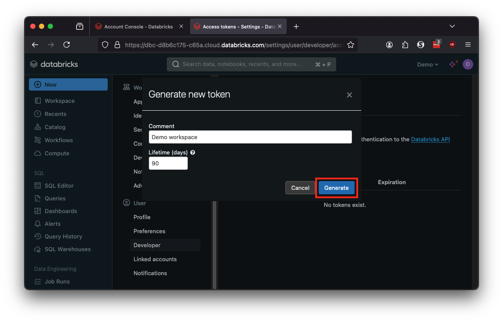{ loading=lazy }

コピーボタンをクリックし、トークンを `access_token` キーに貼り付けます。

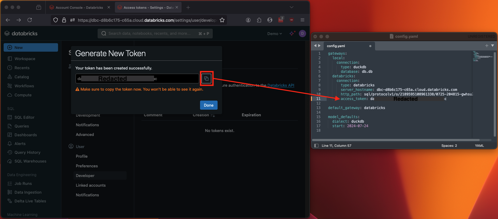{ loading=lazy }

!!! warning
    **個人アクセス トークンを他の人と共有しないでください。**

    アクセストークンなどのシークレットを保存するベストプラクティスは、[構成ファイルが動的に読み込む環境変数](../../guides/configuration.md#environment-variables)に配置することです。簡潔にするため、このガイドでは代わりに構成ファイルに直接値を設定します。

    以下のコードは、構成ファイルの `access_token` パラメータに環境変数 `DATABRICKS_ACCESS_TOKEN` を使用する方法を示しています。

    ```yaml linenums="1"
    gateways:
      databricks:
          connection:
            type: databricks
            access_token: {{ env_var('DATABRICKS_ACCESS_TOKEN') }}
    ```

### 接続の確認

`databricks` ゲートウェイの接続情報を指定したので、SQLMesh が Databricks に正常に接続できることを確認できます。`sqlmesh info` コマンドで接続をテストします。

まず、コマンドラインターミナルを開きます。`sqlmesh --gateway databricks info` コマンドを入力します。

`databricks` ゲートウェイはプロジェクトのデフォルトゲートウェイではないため、手動で指定します。

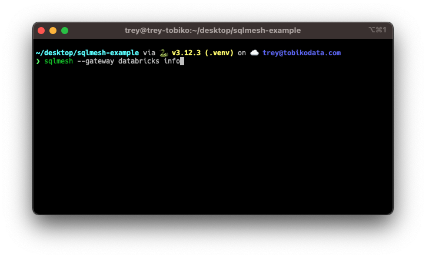{ loading=lazy }

出力は、データ ウェアハウスの接続が成功したことを示しています。

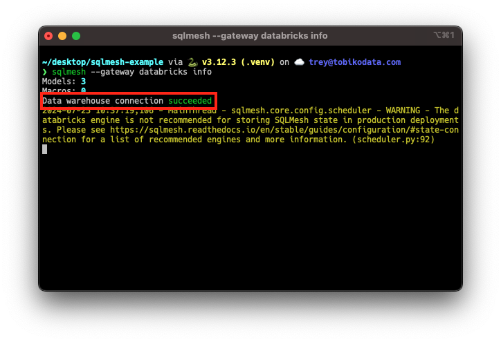{ loading=lazy }

ただし、出力には、SQLMesh の状態を保存するために Databricks SQL エンジンを使用することに関する  `WARNING` が含まれます。

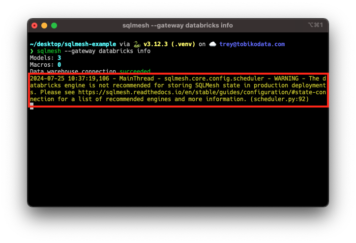{ loading=lazy }

!!! warning

    Databricks はトランザクションワークロード向けに設計されていないため、テスト環境であっても SQLMesh の状態を保存するために使用しないでください。

    SQLMesh の状態の保存の詳細については、[こちら](../../guides/configuration.md#state-connection) をご覧ください。

### 状態接続の指定

`databricks` ゲートウェイで `state_connection` を指定することで、SQLMesh の状態を別の SQL エンジンに保存できます。

この例では、DuckDB エンジンを使用して、ローカルの `databricks_state.db` ファイルに状態を保存しています。

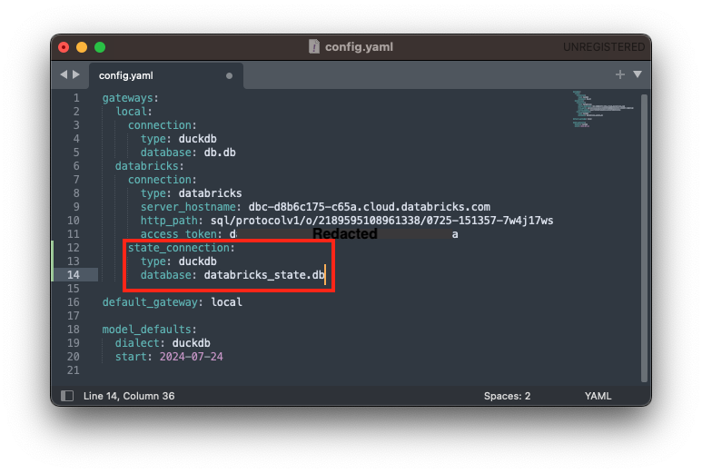{ loading=lazy }

これで、`sqlmesh --gateway databricks info` を実行しても警告は表示されなくなり、新しいエントリ `State backend connection successful` が表示されます。

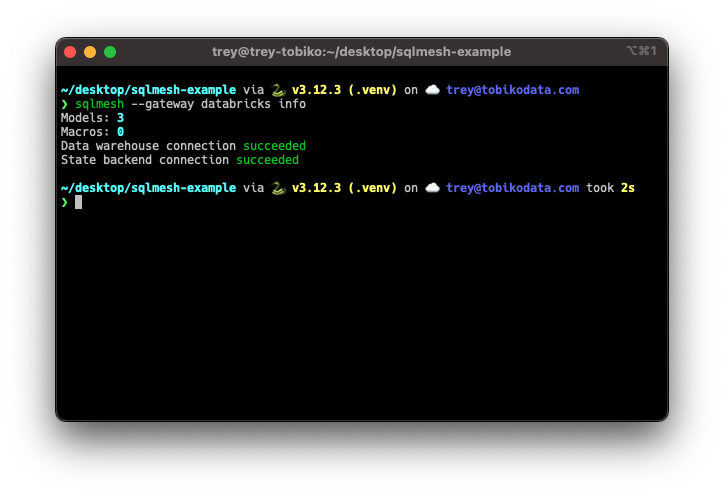{ loading=lazy }

### `sqlmesh plan` を実行します。

便宜上、プロジェクトの `default_gateway` として `databricks` を指定することで、CLI コマンドから `--gateway` オプションを省略できます。

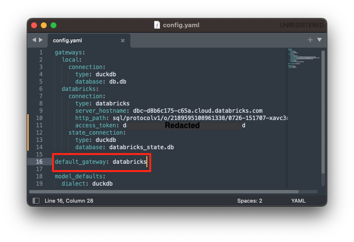{ loading=lazy }

そして、Databricks で `sqlmesh plan` を実行します。

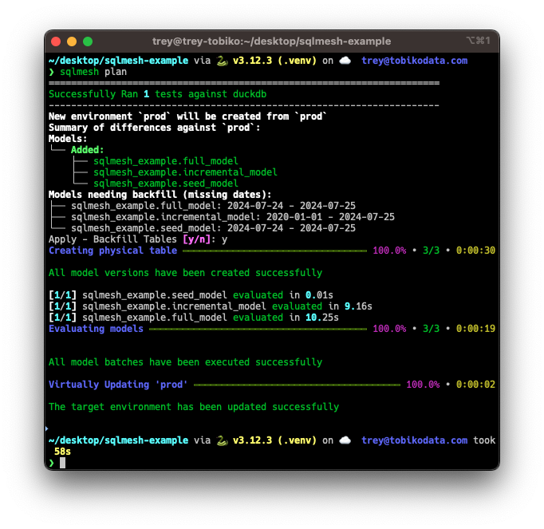{ loading=lazy }

スキーマとオブジェクトが Databricks カタログに存在することを確認します。

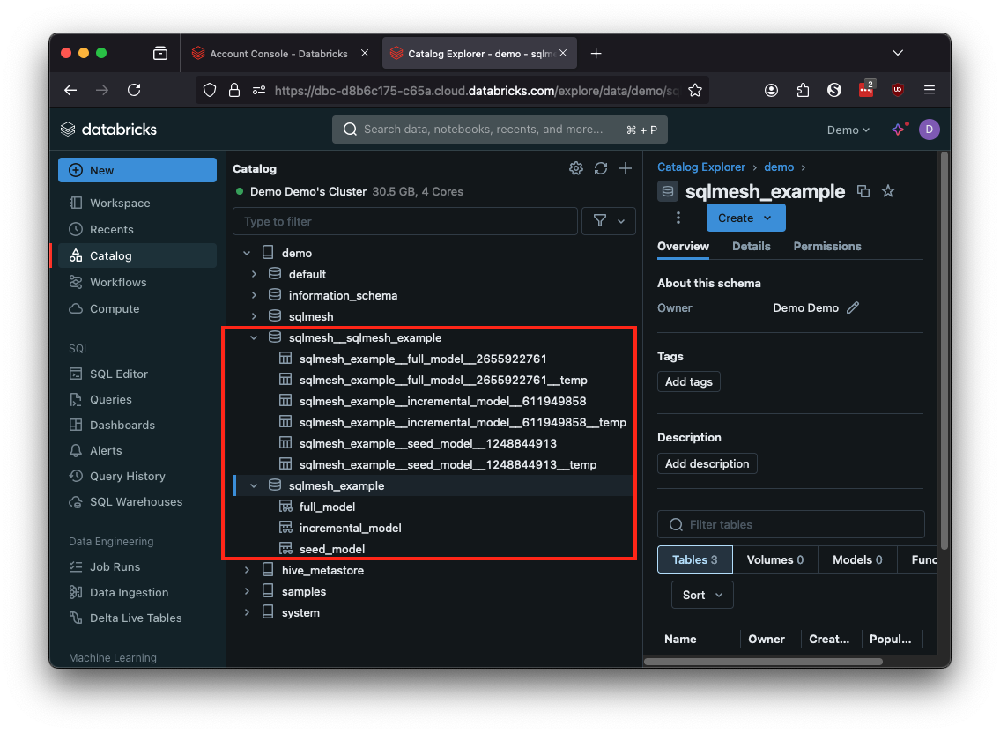{ loading=lazy }

おめでとうございます。SQLMesh プロジェクトが Databricks 上で稼働しています。

!!! tip

    SQLMesh はデフォルトで Databricks クラスターのデフォルトカタログに接続します。別のカタログに接続するには、接続構成の [`catalog` パラメータ](#connection-options) でカタログ名を指定します。

## ローカル/組み込みスケジューラ
**エンジンアダプタタイプ**: `databricks`

### インストール
```
pip install "sqlmesh[databricks]"
```

### 接続方法の詳細

Databricks は複数のコンピューティング オプションと接続方法を提供しています。[上記のセクション](#databricks-connection-methods) では、SQLMesh でそれらを使用する方法について説明しており、このセクションでは追加の構成の詳細について説明します。

#### Databricks SQL コネクタ

SQLMesh は、デフォルトで [Databricks SQL コネクタ](https://docs.databricks.com/dev-tools/python-sql-connector.html) を使用して Databricks に接続します。[詳細は上記のセクション](#databricks-sql-connector) をご覧ください。

#### Databricks Connect

Databricks で SQLMesh Python モデル内の PySpark DataFrame を処理する場合、SQLMesh は Databricks SQL Connector ではなく [Databricks Connect](https://docs.databricks.com/dev-tools/databricks-connect.html) を使用して Databricks に接続する必要があります。

SQLMesh には Databricks Connect ライブラリがバンドルされていません。Databricks クラスターで使用されている Databricks Runtime と一致するバージョンの [Databricks Connect をインストール](https://docs.databricks.com/en/dev-tools/databricks-connect/python/install.html) する必要があります。

SQLMesh は Databricks Connect がインストールされていることを検出すると、自動的に接続を構成し、Pandas または PySpark DataFrame を返すすべての Python モデルでその接続を使用します。

databricks-connect をインストールして SQLMesh で無視されるようにするには、接続設定で `disable_databricks_connect` を `true` に設定してください。

Databricks Connect は、SQLMesh の `databricks_connect_*` 接続オプションを設定することで、SQL 操作と DataFrame 操作を異なるクラスターで実行できます。例えば、これらのオプションを使用することで、SQLMesh が [Databricks SQL Warehouse](https://docs.databricks.com/sql/admin/create-sql-warehouse.html) で SQL 操作を実行するように設定しながら、DataFrame 操作は通常の Databricks クラスターにルーティングすることができます。

!!! note

    Databricks Connect を使用する場合は、Databricks の [要件](https://docs.databricks.com/dev-tools/databricks-connect.html#requirements) と [制限](https://docs.databricks.com/dev-tools/databricks-connect.html#limitations) について必ず確認してください。

#### Databricks Notebook インターフェース

SQLMesh コマンドを常に Databricks クラスター上で直接実行している場合（[ノートブックマジックコマンド](../../reference/notebook.md) を使用した Databricks Notebook 内など）、すべての SQLMesh コマンドの実行には Databricks が提供する SparkSession が使用されます。

関連する SQLMesh 構成パラメーターは、オプションの `catalog` パラメーターのみです。

### 接続オプション

| オプション | 説明 | タイプ | 必須 |
|--------------------------------------|----------------------------------------------------------------------------------------------------------------------------------------------------------------------------------------------------------------------------------------------------------------------------------------|:------:|:--------:|
| `type` | エンジンタイプ名 - `databricks` である必要があります | 文字列 | Y |
| `server_hostname` | Databricks インスタンスのホスト名 | 文字列 | N |
| `http_path` | DBSQL エンドポイント (`/sql/1.0/endpoints/1234567890abcdef` など) または All-Purpose クラスター (`/sql/protocolv1/o/1234567890123456/1234-123456-slid123` など) への HTTP パス | 文字列 | N |
| `access_token` | HTTP ベアラー アクセス トークン (Databricks 個人用アクセス トークンなど) | 文字列 | N |
| `catalog` | 接続に使用するカタログの名前。[デフォルトでは Databricks クラスターのデフォルトが使用されます](https://docs.databricks.com/en/data-governance/unity-catalog/create-catalogs.html#the-default-catalog-configuration-when-unity-catalog-is-enabled)。 | 文字列 | N |
| `auth_type` | SQL コネクタのみ: OAuth をトリガーするには 'databricks-oauth' または 'azure-oauth' に設定します (または `access_token` を使用するには設定しないでください) | 文字列 | N |
| `oauth_client_id` | SQL コネクタのみ: オプション [M2M](https://docs.databricks.com/en/dev-tools/python-sql-connector.html#oauth-machine-to-machine-m2m-authentication) `auth_type` が設定されているときに使用する OAuth クライアント ID | 文字列 | N |
| `oauth_client_secret` | SQL コネクタのみ: オプション [M2M](https://docs.databricks.com/en/dev-tools/python-sql-connector.html#oauth-machine-to-machine-m2m-authentication) `auth_type` が設定されている場合に使う OAuth クライアント シークレット | 文字列 | N |
| `http_headers` | SQL コネクタのみ: すべてのリクエストに設定される HTTP ヘッダーのオプションのディクショナリ | 辞書 | N |
| `session_configuration` | SQL コネクタのみ: Spark セッション パラメーターのオプションのディクショナリ。使用可能なコマンドの完全なリストを取得するには、SQL コマンド `SET -v` を実行します。 | 辞書 | N |
| `databricks_connect_server_hostname` | Databricks Connect のみ: Databricks Connect サーバーのホスト名。設定されていない場合は `server_hostname` を使用します。 | 文字列 | N |
| `databricks_connect_access_token` | Databricks Connect のみ: Databricks Connect アクセス トークン。設定されていない場合は `access_token` を使用します。| 文字列 | N |
| `databricks_connect_cluster_id` | Databricks Connect のみ: Databricks Connect クラスター ID。設定されていない場合は `http_path` を使用します。Databricks SQL Warehouse は指定できません。| 文字列 | N |
| `databricks_connect_use_serverless` | Databricks Connect のみ: `databricks_connect_cluster_id` の代わりに、Databricks Connect にサーバーレス クラスターを使用します。| bool | N |
| `force_databricks_connect` | ローカルで実行している場合、すべてのモデル操作で Databricks Connect の使用を強制します (したがって、すべてのモデルで SQL コネクタを使用しないでください) | bool | N |
| `disable_databricks_connect` | ローカルで実行している場合、すべてのモデル操作で Databricks Connect の使用を無効にします (したがって、すべてのモデルで SQL コネクタを使用します) | bool | N |
| `disable_spark_session` | SparkSession が利用可能な場合は使用しません (ノートブックで実行している場合など)。 | bool | N |

## テーブルの変更をサポートするためのモデルテーブルプロパティ

[forward only](../../guides/incremental_time.md#forward-only-models) のテーブルの構造を変更する場合は、モデルの `physical_properties` に以下の設定を追加する必要があります。


```sql
MODEL (
    name sqlmesh_example.new_model,
    ...
    physical_properties (
        'delta.columnMapping.mode' = 'name'
    ),
)
```

このプロパティを設定せずに変更しようとすると、`databricks.sql.exc.ServerOperationError: [DELTA_UNSUPPORTED_DROP_COLUMN] DROP COLUMN is not supported for your Delta table.` のようなエラーが発生します。
[詳細については、Databricks のドキュメントを参照してください](https://docs.databricks.com/en/delta/column-mapping.html#requirements)。
