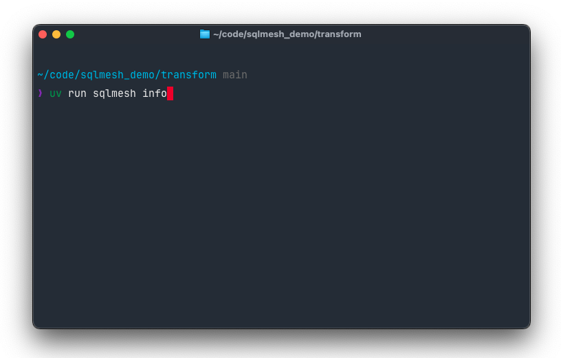
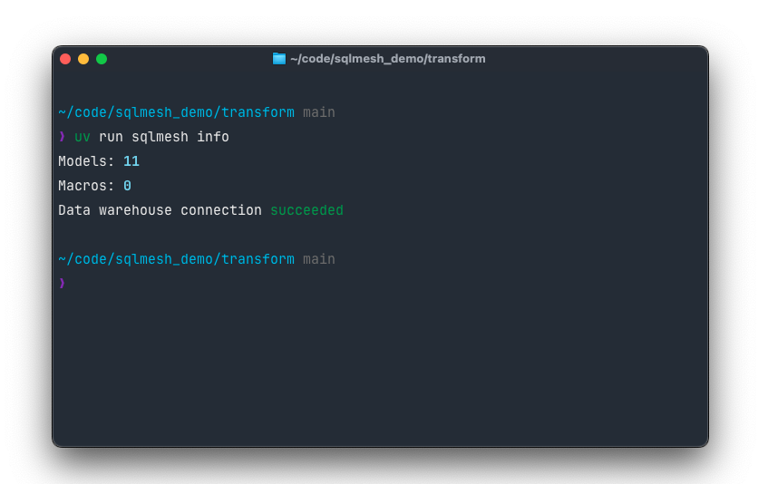
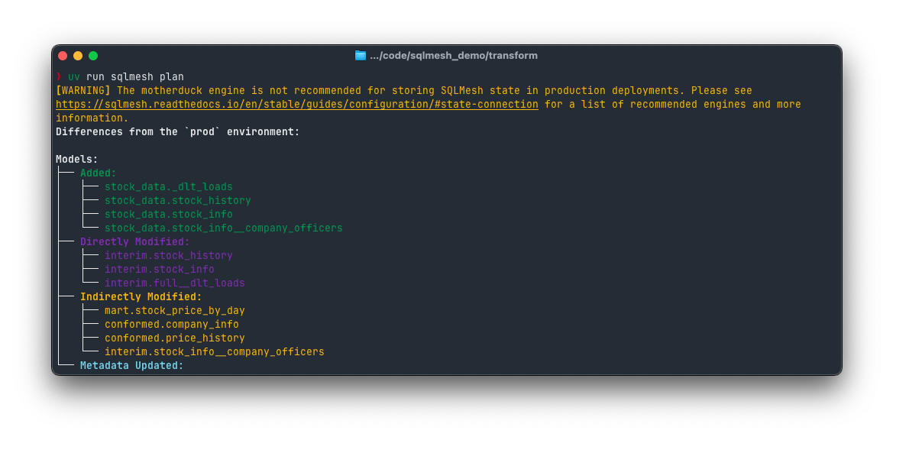
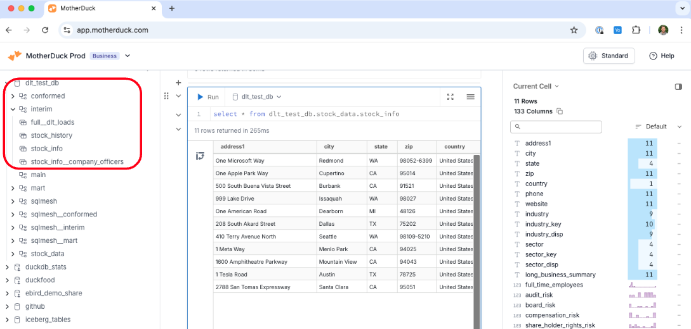

# MotherDuck

このページでは、MotherDuck で SQLMesh を使用する方法について説明します。

[接続クイックスタート](#connection-quickstart) では、MotherDuck への接続方法を説明します。また、組み込みスケジューラを使用して MotherDuck を使用する方法についての解説に直接進むこともできます。

## 接続クイックスタート

クラウドウェアハウスへの接続にはいくつかの手順が必要です。この接続クイックスタートでは、MotherDuck を使い始めるために必要な情報を提供します。

SQLMesh にバンドルされている `duckdb` ライブラリを使用して MotherDuck に接続する方法を説明します。

MotherDuck は接続を承認する単一の方法を提供します。このクイックスタートでは、トークンを使用した認証方法を説明します。

!!! tip

    このクイックスタートは、SQLMeshの基本的なコマンドと機能に精通していることを前提としています。

    まだよく知らない場合は、先に[SQLMeshクイックスタート](../../quick_start.md)をお読みください。

### 前提条件

このクイックスタートガイドを進める前に、以下の点を確認してください。

1. motherduck アカウントとアクセストークンがあること。
2. お使いのコンピュータに SQLMesh がインストールされており、DuckDB エクストラが利用可能であること。
    1. コマンドラインからコマンド `pip install “sqlmesh[duckdb]”` でインストールすること。
3. お使いのコンピュータで SQLMesh サンプルプロジェクトを初期化しておくこと。
    1. コマンドラインインターフェースを開き、プロジェクトファイルを配置するディレクトリに移動します。
    2. `duckdb` が方言であるため、コマンド `sqlmesh init duckdb` でプロジェクトを初期化すること。

#### アクセス制御権限

SQLMesh には、MotherDuck データベースの作成とアクセスに必要な権限が必要です。権限は特定のユーザーに特定のデータベースに対して付与されるため、MotherDuck への書き込みに必要な資格情報を含む SQLMesh 用のサービスアカウントを作成する必要があります。

### 接続を構成する

これで、SQLMesh と MotherDuck の接続を構成するために必要な準備が整いました。

まず、サンプルプロジェクトの config.yaml ファイルに「motherduck」という名前のゲートウェイを追加し、「デフォルトゲートウェイ」として設定します。また、トークン、永続カタログ、およびエフェメラルカタログも追加します。

```yaml
gateways:
  motherduck:
    connection:
      type: motherduck
        catalogs:
          persistent: "md:"
          ephemeral: ":memory:"
      token: <your_token>

default_gateway: motherduck
```

カタログは、[DuckDB を接続できるもの](./duckdb.md#other-connection-catalogs-example) すべてに接続するように定義できます。

!!! warning

    トークンなどのシークレットを保存するベストプラクティスは、[設定ファイルが動的に読み込む環境変数](../../guides/configuration.md#environment-variables)に配置することです。簡潔にするため、このガイドでは設定ファイルに直接値を設定します。

    以下のコードは、設定ファイルの `token` パラメータに環境変数 `MOTHERDUCK_TOKEN` を使用する方法を示しています。

    ```yaml linenums="1" hl_lines="5"
    gateways:
      motherduck:
        connection:
          type: motherduck
          token: {{ env_var('MOTHERDUCK_TOKEN') }}
    ```

### 接続を確認

`motherduck` ゲートウェイの接続情報を指定したので、SQLMesh が MotherDuck に正常に接続できることを確認できます。`sqlmesh info` コマンドで接続をテストします。

まず、コマンドラインターミナルを開きます。`sqlmesh info` コマンドを入力します。



出力は、データ ウェアハウスの接続が成功したことを示しています。



### `sqlmesh plan` を実行する

これで、MotherDuck で `sqlmesh plan` を実行する準備が整いました。



スキーマとオブジェクトが MotherDuck カタログに存在することを確認します。



おめでとうございます。SQLMesh プロジェクトが MotherDuck 上で稼働しています。


## ローカル/組み込みスケジューラ

**エンジンアダプタタイプ**: `motherduck`

### 接続オプション

| オプション | 説明 | タイプ | 必須 |
|--------------------|----------------------------------------------------------------------------------------------------------------------------|:-------:|:--------:|
| `type` | エンジンタイプ名 - `motherduck` である必要があります | 文字列 | Y |
| `database` | データベース名。 | 文字列 | Y |
| `token` | オプションの MotherDuck トークン。指定されていない場合、ユーザーは Web ブラウザでログインするよう求められます。 | 文字列 | N |
| `extensions` | duckdb に読み込む拡張機能。自動読み込み可能な拡張機能のみがサポートされています。 | リスト | N |
| `connector_config` | duckdb コネクタに渡す設定。 | dict | N |
| `secrets` | DuckDB シークレットを使用して外部ソース (例: S3) を認証するための設定。 | dict | N |