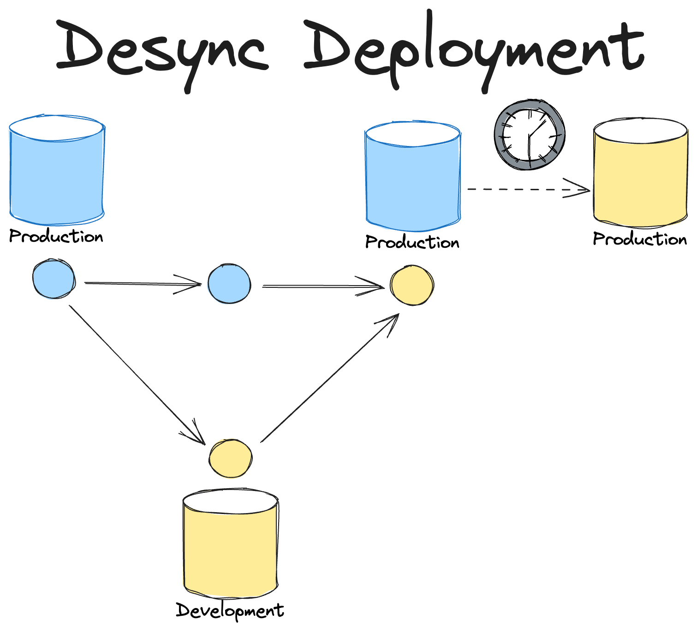
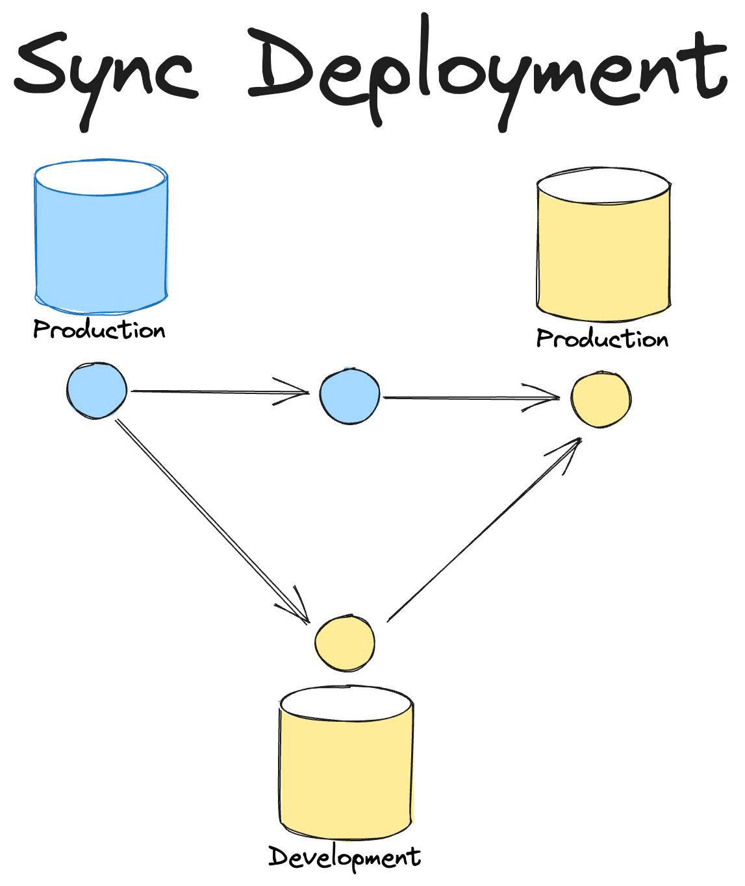
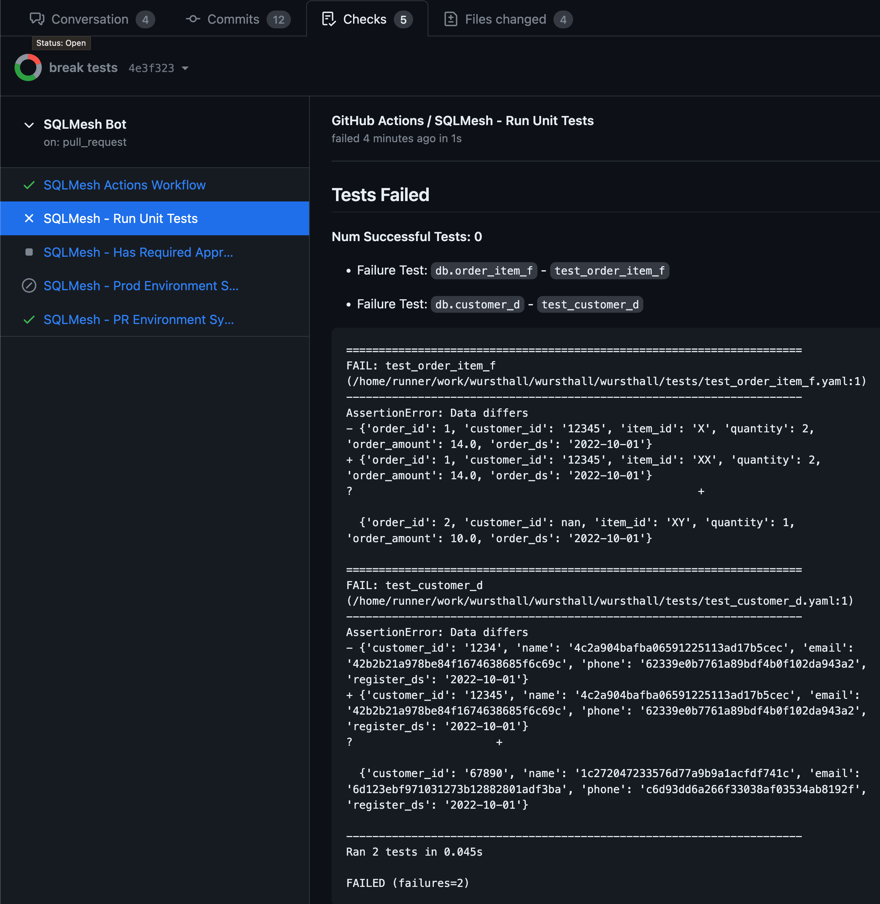
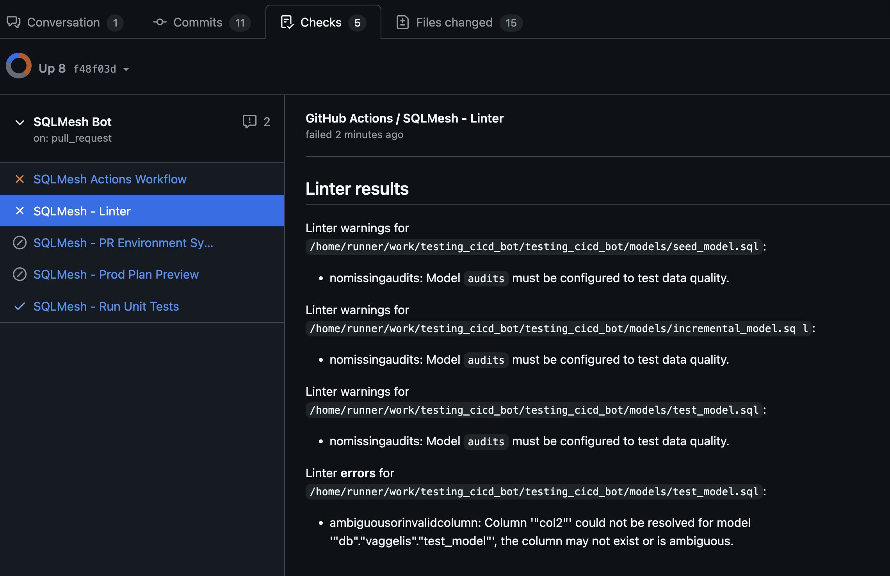
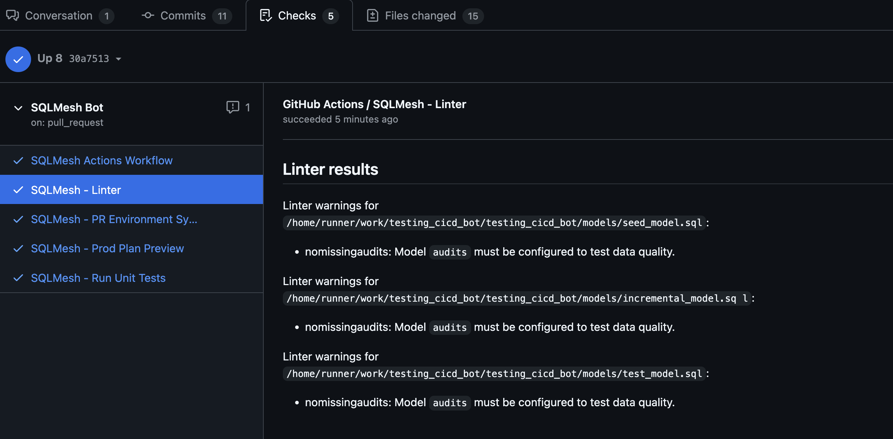
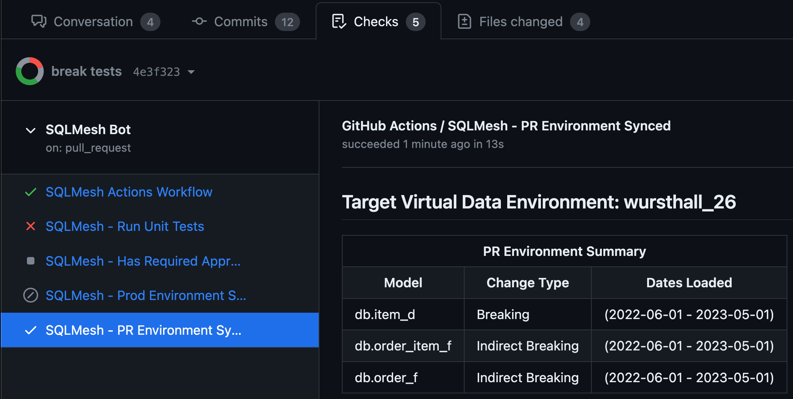
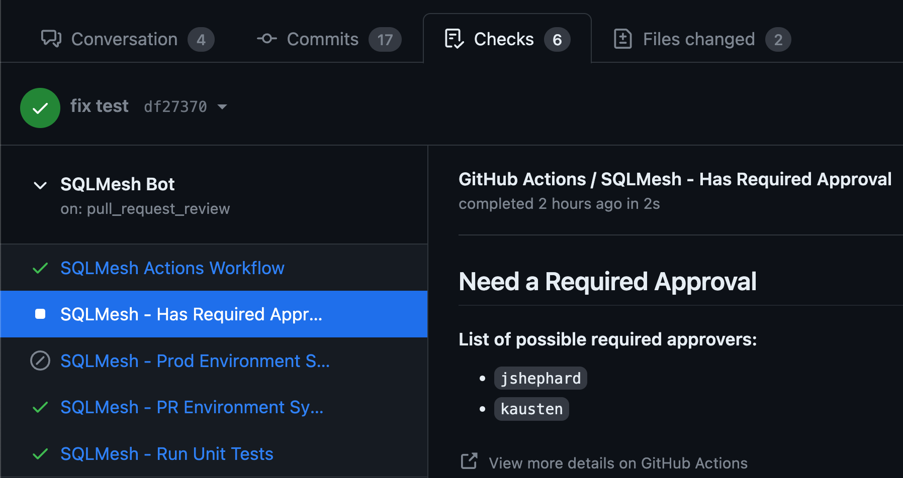
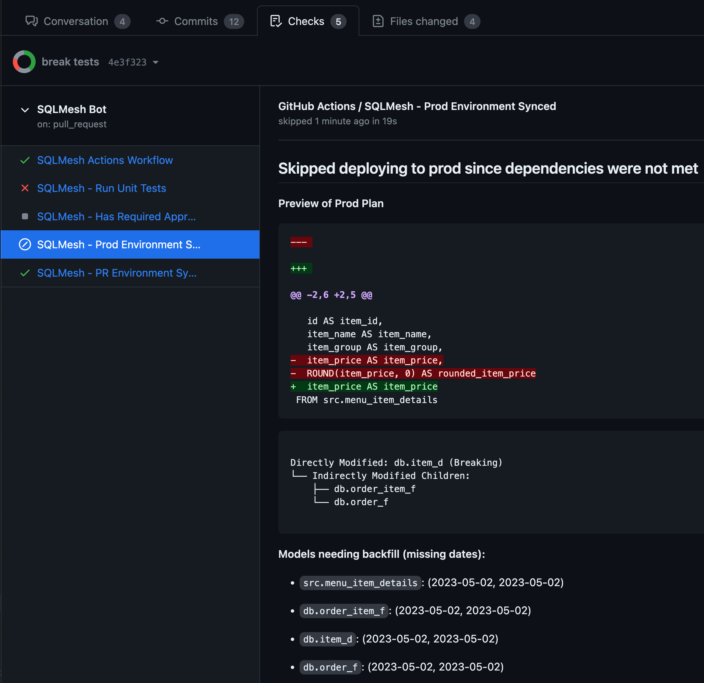
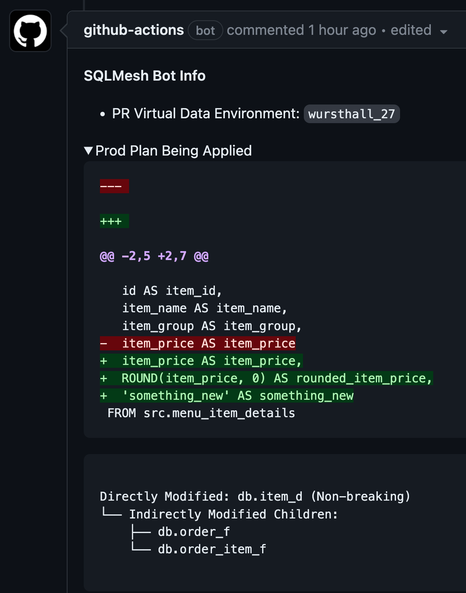

# GitHub Actions CI/CD Bot

<iframe width="704" height="396" src="https://www.youtube.com/embed/TkGT1vVZItU?si=gpnJeWefRN4qT4hi" title="Bot Overview" frameborder="0" allow="accelerometer; autoplay; clipboard-write; encrypted-media; gyroscope; picture-in-picture; web-share" allowfullscreen></iframe>

GitHub Actions CI/CD Bot を使用すると、チームは GitHub Actions を使用して SQLMesh プロジェクトを自動化できます。この Bot は、以下の機能を実行するように設定できます。

* PR でユニットテストを自動実行
* PR でリンターを自動実行
* PR 内のコード変更を反映した PR 環境を自動作成
* 変更されたモデルのデータを自動的に分類およびバックフィル
* データギャップを自動で防止し、変更を本番環境へ自動デプロイして PR をマージ

これらの機能はすべて、PR 内の関連情報の概要とリンクを提供するため、何が起こっているのか、そしてその理由を簡単に把握できます。

この Bot は様々な方法で設定できるため、まずは初期設定を行い、その後、さまざまな設定オプションを試して、ユースケースに適したものを見つけることをお勧めします。

## 初期設定
1. SQLMesh がプロジェクトの依存関係に追加され、github の extra が含まれていることを確認します (`pip install sqlmesh[github]`)。
2. `.github/workflows/sqlmesh.yml` に以下の内容の新しいファイルを作成します。

```yaml
name: SQLMesh Bot
run-name: 🚀SQLMesh Bot 🚀
on:
  pull_request:
    types:
    - synchronize
    - opened
# The latest commit is the one that will be used to create the PR environment and deploy to production
concurrency:
  group: ${{ github.workflow }}-${{ github.head_ref || github.ref_name }}
  cancel-in-progress: true
jobs:
  sqlmesh:
    name: SQLMesh Actions Workflow
    runs-on: ubuntu-latest
    permissions:
      # Required to access code in PR
      contents: write
      # Required to post comments
      issues: write
      # Required to update check runs
      checks: write
      # Required to merge
      pull-requests: write
    steps:
      - name: Setup Python
        uses: actions/setup-python@v4
      - name: Checkout PR branch
        uses: actions/checkout@v4
        with:
          ref: refs/pull/${{ github.event.issue.pull_request && github.event.issue.number || github.event.pull_request.number  }}/merge
      - name: Install SQLMesh + Dependencies
        run: pip install -r requirements.txt
        shell: bash
      - name: Run CI/CD Bot
        run: |
          sqlmesh_cicd -p ${{ github.workspace }} github --token ${{ secrets.GITHUB_TOKEN }} run-all
```

次に、[コアボット動作設定ガイド](#core-bot-behavior-configuration-guide) でボットのコア動作の設定方法を確認してください。次に、[ボット設定](#bot-configuration) でボットの一般的な動作の設定方法を確認してください。最後に、[カスタムワークフロー設定](#custom-workflow-configuration) でボットで利用可能なカスタマイズの全セットを確認してください。

## Core Bot 動作設定ガイド {#core-bot-behavior-configuration-guide}

ボットの設定には、本番環境のコードとデータを同期させるか、非同期にするかという2つの基本的な方法があります。

### 同期型デプロイメントと非同期型デプロイメント

通常、データプロジェクトのCI/CDワークフローは、コードがメインブランチにマージされ、その後、メインブランチのコードで表現される本番環境データセットが**最終的に**コードに合わせて更新されるというフローに従います。
これは、マージ時に更新ジョブの完了後に更新される場合と、更新ジョブがスケジュールに従って実行される場合の2通りがあります。
いずれの場合も、本番環境のデータはメインブランチのコードより**遅れ**ているため、コードとデータは**非同期**状態になります。

このアプローチの利点は、ユーザーがブランチをマージするだけで、変更が**最終的に**本番環境に反映されるのを確認できることです。
欠点は、ユーザーが本番環境の現在の状態と、変更がいつ反映されるかを把握するのが難しい場合があることです。
さらに、本番環境のデータ更新中にエラーが発生した場合、本番環境のデータはメインブランチの状態を反映しない可能性があります。

SQLMesh の仮想データ環境は、デプロイメントを **同期** できる別のアプローチを提供します。
つまり、SQLMesh の仮想更新を使用して開発データセットを本番環境に迅速にデプロイし、その直後にブランチが自動的にメインブランチにマージされます。
これで、本番環境のコードとデータが同期され、ユーザーは変更内容をすぐに確認できます。

このアプローチの欠点は、SQLMesh が変更をデプロイし、その後マージを実行する必要があるため、ユーザーがブランチをマージするだけでは本番環境に変更を反映できないことです。
そのため、変更を本番環境にデプロイしたいことを示す「シグナル」をユーザーから受け取る必要があり、そのシグナルによってボットが変更をデプロイし、PR をマージするようになります。

SQLMesh の GitHub CI/CD ボットはどちらのアプローチもサポートしており、組織の制約を考慮してどのモードが最適であるかは各チーム次第です。

### 本番環境のコードとデータ構成の同期

シグナルアプローチの種類に関わらず、本番環境へのデプロイ後にPRをマージする際に使用するマージ方法を使用するようにボットを設定する必要があります。

=== "YAML"

    ```yaml linenums="1"
    cicd_bot:
      type: github
      merge_method: squash
    ```

=== "Python"

    ```python linenums="1"
    from sqlmesh.integrations.github.cicd.config import GithubCICDBotConfig, MergeMethod
    from sqlmesh.core.config import Config
    
    config = Config(
        cicd_bot=GithubCICDBotConfig(
            merge_method=MergeMethod.SQUASH
        )
    )
    ```

この例では、マージメソッドを `squash` に設定しました。`merge_method` オプションの詳細については、[ボット設定](#bot-configuration) を参照してください。

#### 承認必須シグナル

SQLMesh に PR を本番環境へデプロイする準備が整ったことを通知する方法の一つは、「必須承認者」を使用することです。
このアプローチでは、ユーザーは SQLMesh プロジェクトで「必須承認者」に指定されたユーザーをリストするように設定し、ボットがこれらの承認者のいずれかから承認を受けたことを検出すると、本番環境へのデプロイのタイミングと判断します。
ボットは、ベースブランチが本番環境ブランチ（ボットの設定で定義されますが、デフォルトでは「main」または「master」）の場合のみ、本番環境へのデプロイを実行します。
このパターンは、既にこのような承認プロセスを導入しているチームに最適です。SQLMesh がデプロイとマージを自動化するため、手動で行う必要がなくなり、作成者と承認者の手間が省けます。

##### 承認必須設定

このパターンを設定するには、SQLMesh プロジェクトで「承認必須」ロールを持つユーザーを定義する必要があります。

=== "YAML"

    ```yaml linenums="1"
    users:
    - username: <A username to use within SQLMesh to represent the user>
      github_username: <Github username>
      roles:
        - required_approver
    ```

=== "Python"

    ```python linenums="1"
    from sqlmesh.core.config import Config
    from sqlmesh.core.user import User, UserRole
    
    config = Config(
        users=[
            User(
                username="<A username to use within SQLMesh to represent the user>",
                github_username="<Github username>",
                roles=[UserRole.REQUIRED_APPROVER],
            )
        ]
    )
    ```

プル リクエストのレビューが届いたかどうかに基づいてアクションをトリガーするように、GitHub Actions ワークフローを更新する必要があります。

```yaml linenums="1"
on:
  pull_request:
    types:
    - synchronize
    - opened
  # Required if using required approvers to automate deployments
  pull_request_review:
    types:
    - edited
    - submitted
    - dismissed
```

ボットがこのユーザーからの承認を検出すると、変更を本番環境にデプロイし、PR をマージします。

### デプロイコマンドシグナル

このアプローチでは、ユーザーはボットに `/deploy` コマンドを発行することで、PR の変更を本番環境にデプロイすることを通知できます。
このパターンは、承認要求パターンよりも柔軟性があります。
デプロイコマンドシグナルは、承認要求シグナルと併用することも、単独で使用することもできます。
デプロイコマンドが発行された場合、承認要求シグナルはオーバーライドされ、変更が本番環境にデプロイされ、PR がマージされます。

#### デプロイコマンドの設定

このコマンドはボットの設定で有効にする必要があります。

=== "YAML"

    ```yaml linenums="1"
    cicd_bot:
      type: github
      merge_method: squash
      enable_deploy_command: true
    ```

=== "Python"

    ```python linenums="1"
    from sqlmesh.integrations.github.cicd.config import GithubCICDBotConfig, MergeMethod
    from sqlmesh.core.config import Config
    
    config = Config(
        cicd_bot=GithubCICDBotConfig(
            enable_deploy_command=True
            merge_method=MergeMethod.SQUASH
        )
    )
    ```

オプションとして、他のボットとの競合を避けるため、`command_namespace` を設定できます。`command_namespace` オプションの詳細については、[ボット設定](#bot-configuration) を参照してください。

コメントが作成されたかどうかに基づいてアクションをトリガーするように、GitHub Actions ワークフローを更新する必要があります。

```yaml linenums="1"
on:
  pull_request:
    types:
    - synchronize
    - opened
  # Required if using comments to issue commands to the bot
  issue_comment:
    types:
    - created
```

注: `issue_comment` イベントは、この変更がメインブランチにマージされるまで動作しません。そのため、これを有効にするには、ブランチで変更を加えてマージする必要があります。その後、将来のブランチで deploy コマンドがサポートされるようになります。

### 非同期の本番環境コードとデータ構成

このパターンをサポートするには、ワークフローに、main へのマージ後に `deploy-production` コマンドを実行するステップを追加する必要があります。
さらに、マージ時と非マージ時の挙動を区別するために、if チェックを使用して、それ以前のステップをいくつか更新する必要があります。

```yaml linenums="1"
pull_request:
    types:
      - synchronize
      - opened
      # Add closed
      - closed
...
jobs:
  sqlmesh:
    steps:
    - name: Checkout PR branch
      uses: actions/checkout@v4
      # Add if statement so we don't checkout merged PR but instead main branch
      if: github.event.pull_request.merged == false
      with:
        ref: refs/pull/${{ github.event.issue.pull_request && github.event.issue.number || github.event.pull_request.number  }}/merge
    - name: Checkout main branch
      # Add if statement so we use main when merged
      if: github.event.pull_request.merged == true
      uses: actions/checkout@v4
      with:
        ref: main
    ...
    - name: Run CI/CD Bot
      # Add if statement so we don't run-all on merged PR
      if: github.event.pull_request.merged == false
      run: |
        sqlmesh_cicd -p ${{ github.workspace }} github --token ${{ secrets.GITHUB_TOKEN }} run-all
    # Add deploy step that only runs on merged PR
    - name: Deploy to Production
      # `main` should be the name of your branch that represents production
      if: github.event.pull_request.merged == true && github.event.pull_request.base.ref == 'main'
      run: |
        sqlmesh_cicd -p ${{ github.workspace }} github --token ${{ secrets.GITHUB_TOKEN }} deploy-production
```

「必要な承認者」が構成されていないこと (デフォルトでは構成されていません)、および「デプロイ コマンド」が有効になっていないこと (デフォルトでは有効になっていません) を確認します。

## ボットの設定 {#bot-configuration}

ボットの動作は、プロジェクトの `config.yaml` ファイルまたは `config.py` ファイルを使用して設定します。SQLMesh の一般的なセットアップと構成方法の詳細については、[SQLMesh の設定](https://sqlmesh.readthedocs.io/en/stable/guides/configuration/) を参照してください。

以下は、YAML または Python でボットのデフォルト設定を定義する例です。

=== "YAML"

    ```yaml linenums="1"
    cicd_bot:
      type: github
    ```

=== "Python"

    ```python linenums="1"
    from sqlmesh.integrations.github.cicd.config import GithubCICDBotConfig
    from sqlmesh.core.config import Config
    
    config = Config(
        cicd_bot=GithubCICDBotConfig()
    )
    ```

### 構成プロパティ

| Option                                | Description                                                                                                                                                                                                                                                                                                                                                                                              |  Type  | Required |
|---------------------------------------|----------------------------------------------------------------------------------------------------------------------------------------------------------------------------------------------------------------------------------------------------------------------------------------------------------------------------------------------------------------------------------------------------------|:------:|:--------:|
| `invalidate_environment_after_deploy` | 変更がデプロイされた後、作成された PR 環境を自動的に無効化するかどうかを示します。無効化された環境は Janitor によって自動的にクリーンアップされます。デフォルト: `True` | bool | N |
| `merge_method` | 本番環境にデプロイした後に PR を自動的にマージするときに使用するマージ方法。デフォルトは `None` で、自動マージは行われません。オプション: `merge`、`squash`、`rebase` | str | N |
| `enable_deploy_command` | 本番環境への同期デプロイを許可するために `/deploy` コマンドを有効にするかどうかを示します。デフォルト: `False` | bool | N |
| `command_namespace` | SQLMesh コマンドに使用する名前空間。たとえば、値として `#SQLMesh` を指定した場合、コマンドは `#SQLMesh/<command>` の形式で指定する必要があります。デフォルト: `None` (名前空間は使用されないことを意味します)。| string | N |
| `auto_categorize_changes` | ボットに使用する自動分類動作。指定されていない場合は、プロジェクト全体の分類動作が使用されます。詳細については、[モデルの変更を自動分類する](https://sqlmesh.readthedocs.io/en/stable/guides/configuration/#auto-categorize-model-changes) を参照してください。| dict | N |
| `default_pr_start` | PR 環境プランを作成するときのデフォルトの開始。ボットがモデルを自動的にバックフィルするモードで実行している場合 (`auto_categorize_changes` 動作に基づいて)、これを使用してバックフィルされるデータの量を制限できます。デフォルトは `None` で、開始日は最も古いモデルの開始に設定されるか、[データ プレビュー](../concepts/plans.md#data-preview) を計算する必要がある場合は 1 日前に設定されます。| str | N |
| `pr_min_intervals` | `default_pr_start` が `1 week ago` などの相対時間に設定されている場合に使用します。これにより、PR 環境のバックフィルに、すべてのモデルで少なくともこの数の間隔が含まれるようになります。これがない場合、間隔単位が `default_pr_start` よりも広いモデル (`default_pr_start` が `1 week ago` に設定されている場合の `@monthly` モデルなど) は、バックフィルから完全に除外されます。| int | N |
| `skip_pr_backfill` | ボットが PR 環境でモデルのバックフィルをスキップするかどうかを示します。デフォルト: `True` | bool | N |
| `pr_include_unmodified` | PR 環境に未変更のモデルを含めるかどうかを示します。デフォルトはプロジェクトの設定値 (デフォルトは `False`) です | bool | N |
| `run_on_deploy_to_prod` | 本番環境にデプロイするときに最新の間隔を実行するかどうかを示します。false に設定すると、デプロイメントでは本番環境の既存の最新間隔までの変更されたモデルのみがバックフィルされ、この時点以降の欠落した間隔は無視されます。デフォルト: `False` | bool | N |
| `pr_environment_name` | PR 番号が追加される PR 環境の名前。指定されていない場合は、デフォルトでリポジトリ名になります。注: 名前は、英数字 + アンダースコアと小文字に正規化されます。 | str | N |
| `prod_branch_name` | 本番環境に関連付けられた Git ブランチの名前。例: `prod`。デフォルト: `main` または `master` は prod と見なされます | str | N |
| `forward_only_branch_suffix` | Git ブランチにこのサフィックスが付いている場合は、通常のプランではなく [forward-only](../concepts/plans.md#forward-only-plans) プランをトリガーします。デフォルト: `-forward-only` | str | N |

すべてのプロパティが定義された例:

=== "YAML"

    ```yaml linenums="1"
    cicd_bot:
      type: github
      invalidate_environment_after_deploy: false
      enable_deploy_command: true
      merge_method: squash
      command_namespace: "#SQLMesh"
      auto_categorize_changes:
        external: full
        python: full
        sql: full
        seed: full
      default_pr_start: "1 week ago"
      skip_pr_backfill: false
      run_on_deploy_to_prod: false
      prod_branch_name: production
    ```

=== "Python"

    ```python linenums="1"
    from sqlmesh.integrations.github.cicd.config import GithubCICDBotConfig, MergeMethod
    from sqlmesh.core.config import AutoCategorizationMode, CategorizerConfig, Config
    
    config = Config(
        cicd_bot=GithubCICDBotConfig(
            invalidate_environment_after_deploy=False,
            enable_deploy_command=True,
            merge_method=MergeMethod.SQUASH,
            command_namespace="#SQLMesh",
            auto_categorize_changes=CategorizerConfig(
                external=AutoCategorizationMode.FULL,
                python=AutoCategorizationMode.FULL,
                sql=AutoCategorizationMode.FULL,
                seed=AutoCategorizationMode.FULL,
            ),
            default_pr_start="1 week ago",
            skip_pr_backfill=False,
            run_on_deploy_to_prod=False,
            prod_branch_name="production",
        )
    )
    ```

## ボット出力

ステップ出力はボットによって作成され、実行中に結論に達した各チェックのステータスをキャプチャします。
これらは、ワークフロー内の後続ステップをトリガーするために使用できます。
ボットによって作成される可能性のある出力は次のとおりです（ボットの設定に基づきます）。

* `run_unit_tests`
* `linter`
* `has_required_approval`
* `pr_environment_synced`
* `prod_plan_preview`
* `prod_environment_synced`

[考えられる結論は多数あります](https://github.com/TobikoData/sqlmesh/blob/main/sqlmesh/integrations/github/cicd/controller.py#L96-L102)。そのため、この出力の最適なユースケースは、`success` 結論を確認して後続ステップを実行する可能性があることです。
エラーが発生した場合、結論が設定されず、空の文字列が返される可能性があることに注意してください。

pr 環境が同期された後にステップを実行する例:

```yaml linenums="1"
  steps:
    - id: run-bot
      ...
    - id: do-after-pr-env-sync
      if: steps.run-bot.outputs.pr_environment_synced == 'success'
      run: ...
```

さらに、以下のカスタム出力があります。

* `created_pr_environment` - PR環境が初めて作成された場合は、`"true"`（値が`true`の文字列）に設定されます。初めて作成されていない場合は、この値は設定されていないか、チェックしても空文字列とみなされます。
* `pr_environment_name` - PR環境の名前。PR環境の同期チェックが完了するたびに出力されます。したがって、この出力に基づいて操作を行う前に、`created_pr_environment`または`pr_environment_synced`のステータスを確認してください。

注: `linter`ステップは、プロジェクトの設定（`config.yaml` / `config.py`）で有効になっている場合にのみ実行されます。linterがエラーを検出した場合、このステップは失敗します。それ以外の場合は、警告のみが出力されます。

## カスタムワークフロー構成 {#custom-workflow-configuration}

各アクションを個別のステップとして実行するように設定できます。これにより、より複雑なワークフローを作成したり、特定のステップをトリガーする他のアクションと統合したりできます。`sqlmesh_cicd github` を実行すると、指定可能なコマンドとそのオプションの一覧が表示されます。

```bash
  Github Action CI/CD Bot

Options:
  -t, --token TEXT  The Github Token to be used. Pass in `${{
                    secrets.GITHUB_TOKEN }}` if you want to use the one
                    created by Github actions
  --help            Show this message and exit.

Commands:
  check-required-approvers  Checks if a required approver has provided...
  deploy-production         Deploys the production environment
  run-all                   Runs all the commands in the correct order.
  run-tests                 Runs the unit tests
  update-pr-environment     Creates or updates the PR environments
```

## 同期された完全なワークフローの例
このワークフローでは、DatabricksへのSQLMesh接続を構成します。

```yaml
name: SQLMesh Bot
run-name: 🚀SQLMesh Bot 🚀
on:
  pull_request:
    types:
    - synchronize
    - opened
  # Required if using required approvers to automate deployments
  pull_request_review:
    types:
    - edited
    - submitted
    - dismissed
  # Required if using comments to issue commands to the bot
  issue_comment:
    types:
    - created
# The latest commit is the one that will be used to create the PR environment and deploy to production
concurrency:
  group: ${{ github.workflow }}-${{ github.head_ref || github.ref_name }}
  cancel-in-progress: true
jobs:
  sqlmesh:
    name: SQLMesh Actions Workflow
    runs-on: ubuntu-latest
    permissions:
      contents: write
      # Required to post comments
      issues: write
      # Required to update check runs
      checks: write
      # Required to merge
      pull-requests: write
    env:
      SQLMESH__GATEWAYS__DATABRICKS__CONNECTION__TYPE: "databricks"
      SQLMESH__GATEWAYS__DATABRICKS__CONNECTION__SERVER_HOSTNAME: "XXXXXXXXXXXXXXX"
      SQLMESH__GATEWAYS__DATABRICKS__CONNECTION__HTTP_PATH: "XXXXXXXXXXXX"
      SQLMESH__GATEWAYS__DATABRICKS__CONNECTION__ACCESS_TOKEN: ${{ secrets.DATABRICKS_TOKEN }}
      SQLMESH__DEFAULT_GATEWAY: "databricks"
    steps:
      - name: Setup Python
        uses: actions/setup-python@v4
        with:
          python-version: '3.9'
      - name: Checkout PR branch
        uses: actions/checkout@v4
        with:
          ref: refs/pull/${{ github.event.issue.pull_request && github.event.issue.number || github.event.pull_request.number  }}/merge
      - name: Install Dependencies
        run: pip install -r requirements.txt
        shell: bash
      - name: Run CI/CD Bot
        run: |
          sqlmesh_cicd -p ${{ github.workspace }} github --token ${{ secrets.GITHUB_TOKEN }} run-all
```

## スクリーンショットの例
### エラーサマリー付きの自動ユニットテスト

### エラーサマリー付きの自動リンティング

### 警告サマリー付きの自動リンティング

### PR 内のコード変更を表す PR 環境を自動的に作成

### PR をマージする前に、特定のレビュー担当者による承認を必須にする

### デプロイ前に本番環境プランをプレビュー

### 本番環境への自動デプロイとマージ

