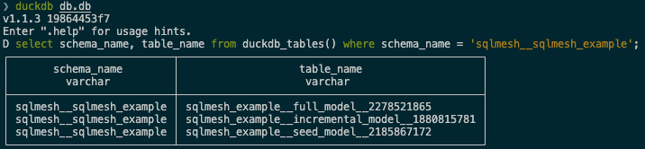
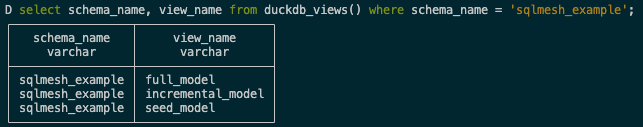

# CLI

このクイックスタートでは、SQLMesh コマンドラインインターフェース (CLI) を使用して、SQLMesh のスキャフォールドジェネレーターを起動して実行します。

[DuckDB](https://duckdb.org/) を埋め込み SQL エンジンとして使用し、ローカルコンピュータ上で実行されるサンプルプロジェクトを作成します。

開始する前に、SQLMesh を使用するためのすべての [前提条件](../prerequisites.md) を満たしていることを確認してください。

??? info "クイックスタートプロジェクト構造の詳細"

    このプロジェクトでは、シンプルなデータパイプライン上でSQLMeshワークフローを段階的に実行することで、主要なSQLMesh機能のデモを行います。このセクションでは、プロジェクトの構造と、作業を進める中で遭遇するSQLMeshの概念について説明します。

    このプロジェクトには、CSVファイルを唯一のデータソースとする3つのモデルが含まれています。

    ```
    ┌─────────────┐
    │seed_data.csv│
    └────────────┬┘
                 │
                ┌▼─────────────┐
                │seed_model.sql│
                └─────────────┬┘
                              │
                             ┌▼────────────────────┐
                             │incremental_model.sql│
                             └────────────────────┬┘
                                                  │
                                                 ┌▼─────────────┐
                                                 │full_model.sql│
                                                 └──────────────┘
    ```

    このプロジェクトはシンプルですが、SQLMesh を生産的に使用するために必要なすべての主要な概念に触れています。

## 1. SQLMesh プロジェクトを作成する

まず、プロジェクトディレクトリを作成し、そこに移動します。

```bash
mkdir sqlmesh-example
```
```bash
cd sqlmesh-example
```

Python 仮想環境を使用する場合は、[インストール](../installation.md) 中に使用したフォルダーから `source .venv/bin/activate` コマンドを実行して、まず仮想環境がアクティブ化されていることを確認してください。

### 1.1 プロジェクトの初期化

SQLMesh には、新しい SQLMesh プロジェクトを初期化するためのスキャフォールド ジェネレーターが含まれています。

スキャフォールド ジェネレーターはいくつかの質問をし、その回答に基づいて SQLMesh 構成ファイルを作成します。

回答に応じて、このクイックスタートで使用する SQLmesh サンプル プロジェクト用の複数のファイルも作成されます。

`sqlmesh init` コマンドを実行して、スキャフォールド ジェネレーターを起動します。

```bash
sqlmesh init
```

??? info "質問をスキップ"

    対話型スキャフォールドジェネレータを使用しない場合は、[`sqlmesh init` コマンド](../reference/cli.md#init) に引数を指定してプロジェクトを初期化できます。

    必須の引数は `engine` のみです。これは、プロジェクトで使用する SQL エンジンを指定します。[サポート対象エンジンのリスト](../integrations/overview.md#execution-engines) にあるエンジン `type` のいずれかを指定してください。

    この例では、`duckdb` エンジンを指定しています。

    ```bash
    sqlmesh init duckdb
    ```

    スキャフォールドには、SQLMesh 構成ファイルとサンプルプロジェクトのディレクトリとファイルが含まれます。これで、[下記](#2-create-a-prod-environment) のクイックスタートに進む準備が整いました。

#### プロジェクトの種類

最初の質問では、作成したいプロジェクトの種類を尋ねられます。作成したいプロジェクトの種類に対応する番号を入力し、「Enter」キーを押してください。

``` bash
──────────────────────────────
Welcome to SQLMesh!
──────────────────────────────

What type of project do you want to set up?

    [1] DEFAULT - Create SQLMesh example project models and files
    [2] dbt     - You have an existing dbt project and want to run it with SQLMesh
    [3] EMPTY   - Create a SQLMesh configuration file and project directories only

Enter a number: 1
```

このクイックスタートでは、`DEFAULT` オプション `1` を選択して、サンプル プロジェクト ファイルがプロジェクト ディレクトリに含まれるようにします。

#### SQL エンジン

2 番目の質問では、プロジェクトで使用する SQL エンジンを選択します。SQLMesh は、選択したエンジンの接続設定を構成ファイルに含めます。この設定ファイルは、プロジェクトをエンジンに接続するために後で入力します。

このクイックスタートでは、`DuckDB` オプション `1` を選択します。これにより、追加の設定を必要としない組み込みの DuckDB エンジンでサンプルプロジェクトを実行できます。

``` bash
Choose your SQL engine:

    [1]  DuckDB
    [2]  Snowflake
    [3]  Databricks
    [4]  BigQuery
    [5]  MotherDuck
    [6]  ClickHouse
    [7]  Redshift
    [8]  Spark
    [9]  Trino
    [10] Azure SQL
    [11] MSSQL
    [12] Postgres
    [13] GCP Postgres
    [14] MySQL
    [15] Athena
    [16] RisingWave

Enter a number: 1
```

#### CLI モード

SQLMesh のコアコマンドには、動作を変更する複数のオプションがあります。これらのオプションの一部は、SQLMesh の `plan` ワークフローと CLI 出力を効率化します。

効率的なワークフロー（プロンプトなし、ファイル差分プレビューなし、変更の自動適用）を希望する場合は、`FLOW` CLI モードを選択して、これらのオプションをプロジェクト設定ファイルに自動的に含めてください。

SQLMesh が提供するすべての出力を確認したい場合は、このクイックスタートで使用する `DEFAULT` モードを選択してください。

``` bash
Choose your SQLMesh CLI experience:

    [1] DEFAULT - See and control every detail
    [2] FLOW    - Automatically run changes and show summary output

Enter a number: 1
```

#### 準備完了

これでプロジェクトの準備が整いました。SQLMesh は次のステップを案内するメッセージを表示します。

DuckDB エンジンを選択した場合は、DuckDB でサンプルプロジェクトを実行できます。

別のエンジンを選択した場合は、追加の SQLMesh コマンドを実行する前に、エンジンの接続情報を `config.yaml` ファイルに追加してください。

``` bash
Your SQLMesh project is ready!

Next steps:
- Update your gateway connection settings (e.g., username/password) in the project configuration file:
    /sqlmesh-example/config.yaml
- Run command in CLI: sqlmesh plan
- (Optional) Explain a plan: sqlmesh plan --explain

Quickstart guide:
https://sqlmesh.readthedocs.io/en/stable/quickstart/cli/

Need help?
- Docs:   https://sqlmesh.readthedocs.io
- Slack:  https://www.tobikodata.com/slack
- GitHub: https://github.com/TobikoData/sqlmesh/issues
```

??? info "プロジェクトの構成について詳しく知る: `config.yaml`"

    SQLMesh のプロジェクトレベル設定パラメータは、プロジェクトディレクトリ内の `config.yaml` ファイルで指定します。

    このサンプルプロジェクトでは組み込みの DuckDB SQL エンジンを使用しているため、ゲートウェイの接続タイプとして `duckdb` を指定しています。使用可能なすべての設定がこのファイルに含まれていますが、オプションの設定はデフォルト値に設定され、コメントアウトされています。

    SQLMesh にはデフォルトのモデル SQL ダイアレクトが必要です。SQLMesh はプロジェクトの SQL エンジンの SQL ダイアレクトを自動的に指定し、設定ファイルの `model_defaults` `dialect` キーに格納します。この例では DuckDB エンジンを指定したため、`duckdb` がデフォルトの SQL ダイアレクトになります。

    ```yaml linenums="1"
    # --- Gateway Connection ---
    gateways:
      duckdb:
        connection:
          # For more information on configuring the connection to your execution engine, visit:
          # https://sqlmesh.readthedocs.io/en/stable/reference/configuration/#connection
          # https://sqlmesh.readthedocs.io/en/stable/integrations/engines/duckdb/#connection-options
          #
          type: duckdb               # <-- DuckDB engine
          database: db.db
          # concurrent_tasks: 1
          # register_comments: True  # <-- Optional setting `register_comments` has a default value of True
          # pre_ping: False
          # pretty_sql: False
          # catalogs:                # <-- Optional setting `catalogs` has no default value
          # extensions:
          # connector_config:
          # secrets:
          # token:

    default_gateway: duckdb

    # --- Model Defaults ---
    # https://sqlmesh.readthedocs.io/en/stable/reference/model_configuration/#model-defaults

    model_defaults:
      dialect: duckdb                # <-- Models written in DuckDB SQL dialect by default
      start: 2025-06-12 # Start date for backfill history
      cron: '@daily'    # Run models daily at 12am UTC (can override per model)

    # --- Linting Rules ---
    # Enforce standards for your team
    # https://sqlmesh.readthedocs.io/en/stable/guides/linter/

    linter:
      enabled: true
      rules:
        - ambiguousorinvalidcolumn
        - invalidselectstarexpansion
    ```

    SQLMesh プロジェクトの設定の詳細については、[こちら](../reference/configuration.md) をご覧ください。

スキャフォールドジェネレーターは、SQLMesh プロジェクトファイルを保存する複数のディレクトリと、サンプルプロジェクトを構成する複数のファイル（SQL モデルなど）を作成します。

??? info "プロジェクトのディレクトリとファイルの詳細"

    SQLMesh は、新しいプロジェクトを開始するためにスキャフォールドジェネレータを使用します。このジェネレータは、SQLMesh プロジェクトコードを整理するための複数のサブディレクトリとファイルを作成します。

    スキャフォールドジェネレータは、以下の設定ファイルとディレクトリを作成します。

    - config.yaml
        - プロジェクト設定用のファイルです。設定の詳細については[こちら](../guides/configuration.md)をご覧ください。
    - ./models
        - SQLおよびPythonモデル。モデルの詳細については、[こちら](../concepts/models/overview.md)をご覧ください。
    - ./seeds
        - シードファイル。シードに関する詳細は[こちら](../concepts/models/seed_models.md)をご覧ください。
    - ./audits
        - 共有監査ファイル。監査の詳細については、[こちら](../concepts/audits.md)をご覧ください。
    - ./tests
        - ユニットテストファイル。テストの詳細については[こちら](../concepts/tests.md)をご覧ください。
    - ./macros
        - マクロファイル。マクロの詳細については、[こちら](../concepts/macros/overview.md)をご覧ください。

    このクイックスタートの例に必要なファイルも作成されます。

    - ./models
        - full_model.sql
        - incremental_model.sql
        - seed_model.sql
    - ./seeds
        - seed_data.csv
    - ./audits
        - assert_positive_order_ids.sql
    - ./tests
        - test_full_model.yaml

最後に、スキャフォールド ジェネレーターは、サンプル プロジェクトで使用するデータを作成します。

??? info "プロジェクトのデータについて詳しく知る"

    このサンプルプロジェクトで使用するデータは、`/seeds` プロジェクトディレクトリ内の `seed_data.csv` ファイルに保存されています。このデータは、2020 年 1 月の 7 日間における 3 つの商品の売上を反映しています。

    ファイルには `id`、`item_id`、`event_date` という 3 つの列があり、それぞれ各行の一意の ID、販売された商品の ID 番号、商品の販売日に対応しています。

    This is the complete dataset:

    | id | item_id | event_date |
    | -- | ------- | ---------- |
    | 1  | 2       | 2020-01-01 |
    | 2  | 1       | 2020-01-01 |
    | 3  | 3       | 2020-01-03 |
    | 4  | 1       | 2020-01-04 |
    | 5  | 1       | 2020-01-05 |
    | 6  | 1       | 2020-01-06 |
    | 7  | 1       | 2020-01-07 |

## 2. 本番環境を作成する {#2-create-a-prod-environment}

SQLMesh の主要なアクションは、*プラン*を作成して*環境*に適用することです。現時点では、環境は空の `prod` 環境のみです。

??? info "SQLMeshのプランと環境について詳しくはこちら"

    SQLMesh の主要なアクションは、*プラン*を作成して *環境* に適用することです。

    [SQLMesh 環境](../concepts/environments.md) は、モデルとそれらが生成したデータを含む独立した名前空間です。

    最も重要な環境は `prod`（「本番環境」）で、これはビジネスで日常的に使用するアプリケーションの背後にあるデータベースで構成されます。`prod` 以外の環境は、モデルコードの変更を実際に適用して業務に影響を与える前に、テストとプレビューを行う場所を提供します。

    [SQLMesh プラン](../concepts/plans.md) には、ある環境と別の環境の比較と、それらを整合させるために必要な一連の変更が含まれています。

    たとえば、新しい SQL モデルが `dev` 環境に追加され、テストされ、実行された場合、それらを整合させるには `prod` 環境にも追加され、実行する必要があります。SQLMesh はこのようなすべての変更を識別し、互換性の問題を引き起こすか、互換性の問題を伴わないかに分類します。

    破壊的変更とは、環境に既に存在するデータを無効にする変更です。例えば、`dev` 環境のモデルに `WHERE` 句が追加された場合、`prod` 環境でそのモデルによって作成された既存のデータは無効になります。これは、新しい `WHERE` 句によって除外される行が含まれている可能性があるためです。

    `dev` 環境のモデルに新しい列を追加するなどの変更は、`prod` 環境の既存データはすべて引き続き有効であるため、破壊的変更ではありません。環境を整合させるには、新しいデータのみを追加する必要があります。

    SQLMesh はプランを作成した後、破壊的変更と非破壊的変更の概要を表示し、プランを適用した場合に何が起こるかを理解できるようにします。プランを適用するために、データの「バックフィル」を行うように促します。（ここでのバックフィルとは、初期ロードや完全リフレッシュなど、テーブルのデータの更新または追加を指す一般的な用語です。）

??? info "プランのアクションについて詳しく知る: `sqlmesh plan --explain`"

    プランを適用する前に、`sqlmesh plan` コマンドで explain フラグを渡すことで、実行されるアクションの詳細な説明を表示できます。

    ```bash
    sqlmesh plan --explain
    ```

    上記のクイックスタート サンプル プロジェクトに explain フラグを渡すと、出力に次の情報が追加されます。

    ```bash
    Explained plan
    ├── Validate SQL and create physical layer tables and views if they do not exist
    │   ├── sqlmesh_example.seed_model -> db.sqlmesh__sqlmesh_example.sqlmesh_example__seed_model__2185867172
    │   │   ├── Dry run model query without inserting results
    │   │   └── Create table if it doesn't exist
    │   ├── sqlmesh_example.full_model -> db.sqlmesh__sqlmesh_example.sqlmesh_example__full_model__2278521865
    │   │   ├── Dry run model query without inserting results
    │   │   └── Create table if it doesn't exist
    │   └── sqlmesh_example.incremental_model -> db.sqlmesh__sqlmesh_example.sqlmesh_example__incremental_model__1880815781
    │       ├── Dry run model query without inserting results
    │       └── Create table if it doesn't exist
    ├── Backfill models by running their queries and run standalone audits
    │   ├── sqlmesh_example.seed_model -> db.sqlmesh__sqlmesh_example.sqlmesh_example__seed_model__2185867172
    │   │   └── Fully refresh table
    │   ├── sqlmesh_example.full_model -> db.sqlmesh__sqlmesh_example.sqlmesh_example__full_model__2278521865
    │   │   ├── Fully refresh table
    │   │   └── Run 'assert_positive_order_ids' audit
    │   └── sqlmesh_example.incremental_model -> db.sqlmesh__sqlmesh_example.sqlmesh_example__incremental_model__1880815781
    │       └── Fully refresh table
    └── Update the virtual layer for environment 'prod'
        └── Create or update views in the virtual layer to point at new physical tables and views
            ├── sqlmesh_example.full_model -> db.sqlmesh__sqlmesh_example.sqlmesh_example__full_model__2278521865
            ├── sqlmesh_example.seed_model -> db.sqlmesh__sqlmesh_example.sqlmesh_example__seed_model__2185867172
            └── sqlmesh_example.incremental_model -> db.sqlmesh__sqlmesh_example.sqlmesh_example__incremental_model__1880815781
    ```

    説明には、プランが実行する 3 種類のアクションに対応する 3 つの最上位セクションがあります。

      - SQLを検証し、物理レイヤーのテーブルとビューが存在しない場合は作成します。
      - クエリを実行してモデルをバックフィルし、スタンドアロン監査を実行します。
      - 環境「prod」の仮想レイヤーを更新します。

    各セクションでは、影響を受けるモデルをリストし、発生する事象に関する詳細情報を提供します。例えば、最初のセクションの最初のモデルは次のとおりです。

    ```bash
    ├── sqlmesh_example.seed_model -> db.sqlmesh__sqlmesh_example.sqlmesh_example__seed_model__2185867172
    │   ├── Dry run model query without inserting results
    │   └── Create table if it doesn't exist
    ```

    最初の行はモデル名 `sqlmesh_example.seed_model` と、SQLMeshがデータ保存用に作成する物理層テーブル `db.sqlmesh__sqlmesh_example.sqlmesh_example__seed_model__2185867172` を示しています。2行目と3行目は、このステップでSQLMeshがモデルクエリのドライランを実行し、物理層テーブルが存在しない場合は作成することを示しています。

    2番目のセクションでは、バックフィルステップで何が起こるかを説明します。このセクションの2番目のモデルは次のとおりです。

    ```bash
    ├── sqlmesh_example.full_model -> db.sqlmesh__sqlmesh_example.sqlmesh_example__full_model__2278521865
    │   ├── Fully refresh table
    │   └── Run 'assert_positive_order_ids' audit
    ```

    最初の行には、モデル名 `sqlmesh_example.full_model` と、SQLMesh がモデルのデータを挿入する物理層テーブル `db.sqlmesh__sqlmesh_example.sqlmesh_example__full_model__2278521865` が表示されます。2 行目と 3 行目は、バックフィル アクションによってモデルの物理テーブルが完全に更新され、`assert_positive_order_ids` 監査が実行されることを示しています。

    最後のセクションでは、仮想レイヤーの更新ステップにおけるSQLMeshのアクションについて説明します。このセクションの最初のモデルは次のとおりです。

    ```bash
    └── Create or update views in the virtual layer to point at new physical tables and views
        ├── sqlmesh_example.full_model -> db.sqlmesh__sqlmesh_example.sqlmesh_example__full_model__2278521865
    ```

    仮想レイヤーステップは、`sqlmesh_example.full_model` 仮想レイヤービューを更新し、物理テーブル `db.sqlmesh__sqlmesh_example.sqlmesh_example__full_model__2278521865` に対して `SELECT * FROM` を実行します。

最初の SQLMesh プランでは、本番環境にデータを入力するため、すべてのモデルを実行する必要があります。`sqlmesh plan` を実行すると、プランと以下の出力が生成されます。

```bash linenums="1"
$ sqlmesh plan
======================================================================
Successfully Ran 1 tests against duckdb in 0.1 seconds.
----------------------------------------------------------------------

`prod` environment will be initialized

Models:
└── Added:
    ├── sqlmesh_example.full_model
    ├── sqlmesh_example.incremental_model
    └── sqlmesh_example.seed_model
Models needing backfill:
├── sqlmesh_example.full_model: [full refresh]
├── sqlmesh_example.incremental_model: [2020-01-01 - 2025-06-22]
└── sqlmesh_example.seed_model: [full refresh]
Apply - Backfill Tables [y/n]:
```

出力の3行目は、`sqlmesh plan` がプロジェクトのテスト `tests/test_full_model.yaml` を duckdb で正常に実行したことを示しています。

6行目は、プランの適用時に影響を受ける環境（この場合は新しい `prod` 環境）を示しています。

出力の8～12行目は、SQLMesh が現在の空の環境を基準として3つの新しいモデルを検出したことを示しています。

13～16行目は、プランによって実行される各モデルと、日付間隔または更新タイプをリストしています。`full_model` と `seed_model` の両方に `[full refresh]` が表示され、`incremental_model` には特定の日付範囲 `[2020-01-01 - 2025-06-22]` が表示されます。増分モデルの日付範囲は、定義でモデルの開始日として `2020-01-01` が指定されているため、2020-01-01 から始まります。

??? info "プロジェクトのモデルについて詳しく知る"

    プランのアクションは、プロジェクトで使用されるモデルの [種類](../concepts/models/model_kinds.md) によって決まります。このサンプルプロジェクトでは、次の 3 種類のモデルを使用します。

    1. [`SEED` モデル](../concepts/models/model_kinds.md#seed) は、SQLMesh プロジェクトディレクトリに保存されている CSV ファイルからデータを読み取ります。
    2. [`FULL` モデル](../concepts/models/model_kinds.md#full) は、モデルが実行されるたびに、モデルに関連付けられたデータを完全に更新（書き換え）します。
    3. [`INCREMENTAL_BY_TIME_RANGE` モデル](../concepts/models/model_kinds.md#incremental_by_time_range) は、日付/時刻データ列を使用して、プランの影響を受ける時間間隔を追跡し、モデルの実行時に影響を受ける時間間隔のみを処理します。

    ここで、プロジェクト内の各モデルについて簡単に説明します。

    最初のモデルは、`seed_data.csv` をインポートする `SEED` モデルです。`SEED` モデルはデータベースへのクエリを実行しないため、このモデルは `MODEL` ステートメントのみで構成されています。

    モデル名とモデルファイルからの相対CSVパスを指定するだけでなく、CSV内の列名とデータ型も指定します。また、モデルの `grain` を、モデルの一意の識別子である `id` と `event_date` を構成する列に設定します。

    ```sql linenums="1"
    MODEL (
      name sqlmesh_example.seed_model,
      kind SEED (
        path '../seeds/seed_data.csv'
      ),
      columns (
        id INTEGER,
        item_id INTEGER,
        event_date DATE
      ),
      grain (id, event_date)
    );
    ```

    2つ目のモデルは、`INCREMENTAL_BY_TIME_RANGE` モデルで、`MODEL` 文と、最初のシードモデルから選択する SQL クエリの両方が含まれています。

    `MODEL` 文の `kind` プロパティには、各レコードのタイムスタンプを含むデータ列の必須指定が含まれています。また、モデルがデータを処理する開始日時を指定するオプションの `start` プロパティと、モデルを毎日実行することを指定する `cron` プロパティも含まれています。これにより、モデルの粒度が `id` 列と `event_date` 列に設定されます。

    SQL クエリには、SQLMesh がデータを増分ロードする際に特定の日時間隔でデータをフィルタリングするために使用する `WHERE` 句が含まれています。

    ```sql linenums="1"
    MODEL (
      name sqlmesh_example.incremental_model,
      kind INCREMENTAL_BY_TIME_RANGE (
        time_column event_date
      ),
      start '2020-01-01',
      cron '@daily',
      grain (id, event_date)
    );

    SELECT
      id,
      item_id,
      event_date,
    FROM
      sqlmesh_example.seed_model
    WHERE
      event_date between @start_date and @end_date
    ```

    プロジェクトの最後のモデルは「FULL」モデルです。他のモデルで使用されるプロパティに加えて、この「MODEL」ステートメントには[`audits`](../concepts/audits.md)プロパティが含まれています。プロジェクトの`audits`ディレクトリには、カスタムの`assert_positive_order_ids`監査が含まれています。この監査は、すべての`item_id`値が正の数であることを検証します。この監査は、モデルが実行されるたびに実行されます。

    ```sql linenums="1"
    MODEL (
      name sqlmesh_example.full_model,
      kind FULL,
      cron '@daily',
      grain item_id,
      audits (assert_positive_order_ids),
    );

    SELECT
      item_id,
      count(distinct id) AS num_orders,
    FROM
      sqlmesh_example.incremental_model
    GROUP BY item_id
    ```

18行目では、13～16行目で記述されているモデルのバックフィルを実行するかどうかを尋ねられます。`y` と入力して `Enter` を押すと、SQLMesh はモデルを実行し、次の出力を返します。

```bash linenums="1"
Apply - Backfill Tables [y/n]: y

Updating physical layer ━━━━━━━━━━━━━━━━━━━━━━━━━━━━━━━━━━━━━━━━ 100.0% • 3/3 • 0:00:00

✔ Physical layer updated

[1/1] sqlmesh_example.seed_model          [insert seed file]                 0.01s
[1/1] sqlmesh_example.incremental_model   [insert 2020-01-01 - 2025-06-22]   0.01s
[1/1] sqlmesh_example.full_model          [full refresh, audits ✔1]          0.01s
Executing model batches ━━━━━━━━━━━━━━━━━━━━━━━━━━━━━━━━━━━━━━━━ 100.0% • 3/3 • 0:00:00

✔ Model batches executed

Updating virtual layer  ━━━━━━━━━━━━━━━━━━━━━━━━━━━━━━━━━━━━━━━━ 100.0% • 3/3 • 0:00:00

✔ Virtual layer updated
```

SQLMesh は、プランを適用する際、以下の 3 つのアクションを実行します。

- モデルの新バージョンの作成と保存
- モデルの評価/実行
- プランのターゲット環境の仮想更新

2 行目から 4 行目は、最初のステップである物理レイヤーの更新（新しいモデルバージョンの作成）の進行状況と完了を示しています。

6 行目から 11 行目は、各モデルの実行と、それぞれの操作とタイミングを示しています。6 行目はシードモデルの挿入、8 行目は指定された日付範囲の増分モデルの挿入、10 行目は監査チェックに合格した完全なモデルの処理を示しています。

12 行目から 14 行目は、2 番目のステップであるモデルバッチの実行の進行状況と完了を示しています。

16 行目から 18 行目は、最後のステップであるプランのターゲット環境の仮想更新（クエリにデータを利用できるようにする）の進行状況と完了を示しています。

SQLMesh が作成したオブジェクトを確認するために、プロジェクトの DuckDB データベースファイルを見てみましょう。まず、`duckdb db.db` コマンドで組み込みの DuckDB CLI ツールを開き、2 つのクエリを実行します。

最初のクエリは、SQLMesh が `sqlmesh__sqlmesh_example` スキーマに作成した 3 つの物理テーブル（モデルごとに 1 つのテーブル）を表示します。



2 番目のクエリは、SQLMesh が `sqlmesh` スキーマに、3 つの物理テーブルから読み取る 3 つの仮想レイヤー ビューを作成したことを示しています。



これで、すべての履歴がバックフィルされた新しい本番環境が作成されました。

## 3. モデルの更新

`prod` 環境にデータを追加したので、SQL モデルの 1 つを変更してみましょう。

クエリに新しい列を追加することで、増分 SQL モデルを変更します。`models/incremental_model.sql` ファイルを開き、`item_id` の下に `#!sql 'z' AS new_column` を次のように追加します。

```sql linenums="1" hl_lines="14"
MODEL (
  name sqlmesh_example.incremental_model,
  kind INCREMENTAL_BY_TIME_RANGE (
    time_column event_date
  ),
  start '2020-01-01',
  cron '@daily',
  grain (id, event_date)
);

SELECT
  id,
  item_id,
  'z' AS new_column, -- Added column
  event_date,
FROM
  sqlmesh_example.seed_model
WHERE
  event_date between @start_date and @end_date
```

## 4. 開発環境で作業する

### 4.1 開発環境を作成する

モデルを変更したら、本番環境に影響を与えずにモデルの変更を検証できるように、開発環境を作成します。

`sqlmesh plan dev` を実行して、`dev` という開発環境を作成します。

```bash linenums="1"
$ sqlmesh plan dev
======================================================================
Successfully Ran 1 tests against duckdb
----------------------------------------------------------------------

New environment `dev` will be created from `prod`


Differences from the `prod` environment:

Models:
├── Directly Modified:
│   └── sqlmesh_example__dev.incremental_model
└── Indirectly Modified:
    └── sqlmesh_example__dev.full_model

---

+++

@@ -14,6 +14,7 @@

 SELECT
   id,
   item_id,
+  'z' AS new_column,
   event_date
 FROM sqlmesh_example.seed_model
 WHERE

Directly Modified: sqlmesh_example__dev.incremental_model
(Non-breaking)
└── Indirectly Modified Children:
    └── sqlmesh_example__dev.full_model (Indirect Non-breaking)
Models needing backfill:
└── sqlmesh_example__dev.incremental_model: [2020-01-01 - 2025-04-17]
Apply - Backfill Tables [y/n]:
```

出力の 6 行目は、既存の `prod` 環境から新しい環境 `dev` が作成されることを示しています。

10 行目から 15 行目は、変更されたモデルと `prod` 環境の違いをまとめたもので、`incremental_model` が直接変更されたことと、`full_model` が増分モデルから選択されているため間接的に変更されたことを検出しています。モデル スキーマは `sqlmesh_example__dev` であり、`dev` 環境で作成されていることを示しています。

31 行目では、SQLMesh が、変更が追加的 (`full_model` で使用されていない列を追加) であり、`prod` に既に存在するデータを無効にしていないことを理解したため、変更を自動的に `Non-breaking` として分類したことがわかります。

プロンプトで `y` と入力し、`Enter` キーを押してプランを適用し、バックフィルを実行します。

```bash linenums="1"
Apply - Backfill Tables [y/n]: y

Updating physical layer ━━━━━━━━━━━━━━━━━━━━━━━━ 100.0% • 2/2 • 0:00:00

✔ Physical layer updated

[1/1] sqlmesh_example__dev.incremental_model  [insert 2020-01-01 - 2025-04-17] 0.03s
Executing model batches ━━━━━━━━━━━━━━━━━━━━━━━━ 100.0% • 1/1 • 0:00:00

✔ Model batches executed

Updating virtual layer  ━━━━━━━━━━━━━━━━━━━━━━━━ 100.0% • 2/2 • 0:00:00

✔ Virtual layer updated
```

3～5行目は、物理レイヤーの更新の進行状況と完了を示しています。

7 行目は、SQLMesh が変更を適用し、2020-01-01 から 2025-04-17 までの日付範囲で `sqlmesh_example__dev.incremental_model` を評価したことを示しています。

9～11行目は、モデルバッチの実行の進行状況と完了を示しています。

13～15行目は、仮想レイヤーの更新の進行状況と完了を示しています。

変更は `Non-breaking` であったため、SQLMesh は `full_model` に対して何もバックフィルする必要はありませんでした。

### 4.2 開発環境で更新を検証

`sqlmesh fetchdf "select * from sqlmesh_example__dev.incremental_model"` を実行して `incremental_model` からデータをクエリすることで、この変更を確認できます。

クエリ内のスキーマ名前空間 `sqlmesh_example` に環境名 `__dev` が追加されることに注意してください。

```bash
$ sqlmesh fetchdf "select * from sqlmesh_example__dev.incremental_model"

   id  item_id new_column  event_date
0   1        2          z  2020-01-01
1   2        1          z  2020-01-01
2   3        3          z  2020-01-03
3   4        1          z  2020-01-04
4   5        1          z  2020-01-05
5   6        1          z  2020-01-06
6   7        1          z  2020-01-07
```

`new_column` がデータセットに追加されたことがわかります。production テーブルは変更されていません。これは、`sqlmesh fetchdf "select * from sqlmesh_example.incremental_model"` を使用して production テーブルにクエリを実行することで確認できます。

`prod` がデフォルト環境であるため、このクエリではスキーマ名前空間 `sqlmesh_example` に何も追加されていないことに注意してください。

```bash
$ sqlmesh fetchdf "select * from sqlmesh_example.incremental_model"

   id  item_id   event_date
0   1        2   2020-01-01
1   2        1   2020-01-01
2   3        3   2020-01-03
3   4        1   2020-01-04
4   5        1   2020-01-05
5   6        1   2020-01-06
6   7        1   2020-01-07
```

`dev` への変更がまだ `prod` に適用されていないため、production テーブルには `new_column` がありません。

## 5. 本番環境を更新する

### 5.1 本番環境への更新の適用
開発環境での変更のテストが完了したので、本番環境に移行します。`sqlmesh plan` を実行して変更を計画し、`prod` 環境に適用します。

`Apply - Virtual Update [y/n]:` プロンプトで `y` と入力し、`Enter` キーを押すと、計画が適用され、バックフィルが実行されます。

```bash
$ sqlmesh plan
======================================================================
Successfully Ran 1 tests against duckdb
----------------------------------------------------------------------

Differences from the `prod` environment:

Models:
├── Directly Modified:
│   └── sqlmesh_example.incremental_model
└── Indirectly Modified:
    └── sqlmesh_example.full_model

---

+++

@@ -14,6 +14,7 @@

 SELECT
   id,
   item_id,
+  'z' AS new_column,
   event_date
 FROM sqlmesh_example.seed_model
 WHERE

Directly Modified: sqlmesh_example.incremental_model (Non-breaking)
└── Indirectly Modified Children:
    └── sqlmesh_example.full_model (Indirect Non-breaking)
Apply - Virtual Update [y/n]: y

SKIP: No physical layer updates to perform

SKIP: No model batches to execute

Updating virtual layer  ━━━━━━━━━━━━━━━━━━━━━━━━ 100.0% • 2/2 • 0:00:00

✔ Virtual layer updated
```

「SKIP: 物理レイヤーの更新は実行されません」および「SKIP: 実行するモデルバッチはありません」というメッセージからわかるように、バックフィルは不要で仮想更新のみが行われたことに注意してください。これは、変更が既に `dev` 環境で計算・実行されており、SQLMesh が既存のテーブルへの仮想参照の更新のみで十分であると認識し、すべてを再計算する必要がないためです。

### 5.2 prod での更新の検証

`sqlmesh fetchdf "select * from sqlmesh_example.incremental_model"` を実行して、`prod` でデータが更新されたことを再確認します。

```bash
$ sqlmesh fetchdf "select * from sqlmesh_example.incremental_model"

   id  item_id new_column  event_date
0   1        2          z  2020-01-01
1   2        1          z  2020-01-01
2   3        3          z  2020-01-03
3   4        1          z  2020-01-04
4   5        1          z  2020-01-05
5   6        1          z  2020-01-06
6   7        1          z  2020-01-07
```

## 6. 次のステップ

おめでとうございます。これで SQLMesh の基本操作は完了です！

ここから、次の操作を行うことができます。

* [SQLMesh CLI コマンドの詳細](../reference/cli.md)
* [データベースまたは SQL エンジンへの接続を設定する](../guides/connections.md)
* [SQLMesh の概念の詳細](../concepts/overview.md)
* [Slack コミュニティに参加する](https://tobikodata.com/slack)