# Notebook

このクイックスタートでは、SQLMesh ノートブック インターフェースを使用して、SQLMesh のスキャフォールド ジェネレーターを起動して実行します。このサンプル プロジェクトは、[DuckDB](https://duckdb.org/) を埋め込み SQL エンジンとして使用し、ローカル コンピューター上で実行されます。

開始する前に、SQLMesh を使用するためのすべての [前提条件](../prerequisites.md) を満たしていることを確認してください。

ノートブック インターフェースは、Jupyter ノートブックと Databricks ノートブックの両方で動作します。Databricks 接続の構成の詳細については、[実行エンジン](../integrations/engines/databricks.md) ページをご覧ください。

??? info "クイックスタートプロジェクト構造の詳細"

    このプロジェクトでは、シンプルなデータパイプライン上でSQLMeshワークフローを段階的に実行することで、主要なSQLMesh機能のデモを行います。このセクションでは、プロジェクトの構造と、作業を進める中で遭遇するSQLMeshの概念について説明します。

    このプロジェクトには、CSVファイルを唯一のデータソースとする3つのモデルが含まれています。

    ```
    ┌─────────────┐
    │seed_data.csv│
    └────────────┬┘
                 │
                ┌▼─────────────┐
                │seed_model.sql│
                └─────────────┬┘
                              │
                             ┌▼────────────────────┐
                             │incremental_model.sql│
                             └────────────────────┬┘
                                                  │
                                                 ┌▼─────────────┐
                                                 │full_model.sql│
                                                 └──────────────┘
    ```

    このプロジェクトはシンプルですが、SQLMesh を生産的に使用するために必要なすべての主要な概念に触れています。

## 1. SQLMesh プロジェクトの作成

まず、オペレーティング システムのグラフィカル ツールまたはコマンドライン ツールを使用して、SQLMesh プロジェクト ディレクトリを作成します。次に、Jupyter または Databricks ノートブック ファイルを作成します。このファイルは SQLMesh プロジェクト ディレクトリ内に置く必要はありません。

Python 仮想環境を使用している場合は、[インストール](../installation.md) 時に使用したフォルダから `source .venv/bin/activate` コマンドを実行して、仮想環境がアクティブ化されていることを確認してください。

SQLMesh ライブラリをインポートして、ノートブック マジック コマンドを読み込みます。

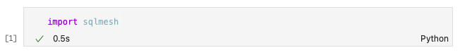{ loading=lazy }

次に、`%init` ノートブック マジックを使用して SQLMesh スキャフォールディングを作成し、モデルのデフォルトの SQL ダイアレクトを指定します。ダイアレクトは、ほとんどのモデルで使用されているダイアレクトに対応している必要があります。特定のモデルについては、モデルの `MODEL` 仕様でオーバーライドできます。 [SQLGlot ライブラリでサポートされている](https://github.com/tobymao/sqlglot/blob/main/sqlglot/dialects/dialect.py) すべての SQL 方言が使用できます。

この例では、`duckdb` 方言を指定します。

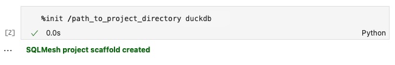{ loading=lazy }

スキャフォールドが正常に作成されると、`SQLMesh project scaffold created` が返されます。

スキャフォールドには、サンプルプロジェクト用の SQLMesh 構成ファイルが含まれます。

??? info "プロジェクトの構成について詳しく知る"

    SQLMesh プロジェクトレベルの設定パラメータは、プロジェクトディレクトリ内の `config.yaml` ファイルで指定します。

    このサンプルプロジェクトは組み込みの DuckDB SQL エンジンを使用しているため、設定ではローカルゲートウェイの接続として `duckdb` を指定し、デフォルトとして `local` ゲートウェイを指定します。

    scaffold ジェネレーターを実行するコマンドは、モデルのデフォルトの SQL ダイアレクトを **必要とします**。これは、設定ファイルの `model_defaults` `dialect` キーに格納されます。この例では、デフォルトとして `duckdb` SQL ダイアレクトを指定しました。

    ```yaml linenums="1"
    gateways:
      local:
        connection:
          type: duckdb
          database: ./db.db

    default_gateway: local

    model_defaults:
      dialect: duckdb
    ```

    SQLMesh プロジェクトの構成の詳細については、[こちら](../reference/configuration.md) をご覧ください。

スキャフォールドには、SQLMesh プロジェクトファイルが保存される複数のディレクトリと、サンプルプロジェクトを構成する複数のファイル (SQL モデルなど) も含まれます。

??? info "プロジェクトのディレクトリとファイルの詳細"

    SQLMesh は、新しいプロジェクトを開始するためにスキャフォールドジェネレータを使用します。このジェネレータは、SQLMesh プロジェクトコードを整理するための複数のサブディレクトリとファイルを作成します。

    スキャフォールドジェネレータは、以下の設定ファイルとディレクトリを作成します。

    - config.yaml
        - プロジェクト設定用のファイルです。[configuration](../reference/configuration.md)を参照してください。
    - ./models
        - SQLおよびPythonモデル。[モデル](../concepts/models/overview.md)を参照してください。
    - ./seeds
        - シードファイル。[seeds](../concepts/models/seed_models.md)を参照してください。
    - ./audits
        - 共有監査ファイル。[監査](../concepts/audits.md)を参照してください。
    - ./tests
        - ユニットテストファイル。[テスト](../concepts/tests.md)を参照してください。
    - ./macros
        - マクロファイル。[マクロ](../concepts/macros/overview.md)を参照してください。

    このクイックスタートの例に必要なファイルも作成されます。

    - ./models
        - full_model.sql
        - incremental_model.sql
        - seed_model.sql
    - ./seeds
        - seed_data.csv
    - ./audits
        - assert_positive_order_ids.sql
    - ./tests
        - test_full_model.yaml

最後に、スキャフォールディングにはサンプル プロジェクトで使用するデータが含まれます。

??? info "プロジェクトのデータについて詳しく知る"

    このサンプルプロジェクトで使用するデータは、`/seeds` プロジェクトディレクトリ内の `seed_data.csv` ファイルに保存されています。このデータは、2020 年 1 月の 7 日間における 3 つの商品の売上を反映しています。

    ファイルには `id`、`item_id`、`event_date` という 3 つの列があり、それぞれ各行の一意の ID、販売された商品の ID 番号、商品の販売日に対応しています。

    This is the complete dataset:

    | id | item_id | event_date |
    | -- | ------- | ---------- |
    | 1  | 2       | 2020-01-01 |
    | 2  | 1       | 2020-01-01 |
    | 3  | 3       | 2020-01-03 |
    | 4  | 1       | 2020-01-04 |
    | 5  | 1       | 2020-01-05 |
    | 6  | 1       | 2020-01-06 |
    | 7  | 1       | 2020-01-07 |

`%context` ノートブックマジックを使用してコンテキストを設定することで、SQLMesh にプロジェクトの場所を通知します。コンテキストが正常に設定されると、リポジトリまたはリポジトリのリストを含むメッセージが返されます。

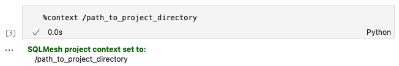{ loading=lazy }

SQLMesh プロジェクトに [複数のリポジトリ](../guides/multi_repo.md) がある場合は、`%context` を 1 回呼び出すだけで複数のディレクトリを指定できます。

## 2. 本番環境を作成する

SQLMesh の主なアクションは、*プラン*を作成し、*環境*に適用することです。この時点では、環境は空の「prod」環境のみです。

??? info "SQLMeshのプランと環境について詳しくはこちら"

    SQLMesh の主要なアクションは、*プラン*を作成し、*環境*に適用することです。

    [SQLMesh 環境](../concepts/environments.md) は、モデルとそれらが生成したデータを含む独立した名前空間です。最も重要な環境は `prod`（「本番環境」）で、これはビジネスで日常的に使用するアプリケーションの背後にあるデータベースで構成されます。`prod` 以外の環境は、モデルコードの変更を実際に適用して業務に影響を与える前に、テストとプレビューを行う場所を提供します。

    [SQLMesh プラン](../concepts/plans.md) には、ある環境と別の環境の比較と、それらを整合させるために必要な一連の変更が含まれています。たとえば、新しい SQL モデルが `dev` 環境に追加され、テストされ、実行された場合、それらを整合させるには `prod` 環境にも追加され、実行する必要があります。SQLMesh はこのようなすべての変更を識別し、互換性の問題を引き起こすか、そうでないかに分類します。

    破壊的変更とは、環境に既に存在するデータを無効にする変更です。例えば、`dev` 環境のモデルに `WHERE` 句が追加された場合、`prod` 環境でそのモデルによって作成された既存のデータは無効になります。これは、新しい `WHERE` 句によって除外される行が含まれている可能性があるためです。`dev` 環境のモデルに新しい列を追加するなどの変更は、`prod` 環境の既存データはすべて引き続き有効であるため、破壊的変更ではありません。環境を整合させるには、新しいデータのみを追加する必要があります。

    SQLMesh はプランを作成した後、破壊的変更と非破壊的変更の概要を表示し、プランを適用した場合に何が起こるかを理解できるようにします。プランを適用するために、データの「バックフィル」を行うように求められます。ここでのバックフィルとは、テーブルのデータの更新または追加（初期ロードや完全リフレッシュを含む）を指す一般的な用語です。

最初の SQLMesh プランでは、本番環境にデータを入力するため、すべてのモデルを実行する必要があります。ノートブックマジック `%plan` を実行すると、プランと以下の出力が生成されます。

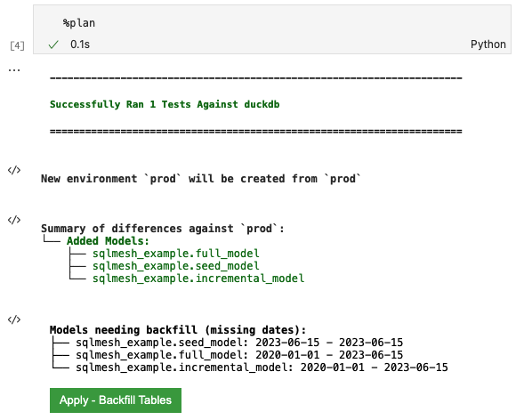

出力の最初のブロックには、`%plan` がプロジェクトのテスト `tests/test_full_model.yaml` を duckdb で正常に実行したことが示されています。

`New environment` 行には、プランを適用した場合に影響を受ける環境（この場合は新しい `prod` 環境）が記述されています。

`Summary of difference` セクションには、SQLMesh が現在の空の環境と比較して 3 つの新しいモデルを検出したことがわかります。

`Models needing backfill` セクションには、プランによって実行される各モデルと、実行される日付間隔がリストされています。 `full_model` と `incremental_model` の両方の開始日が `2020-01-01` と表示されるのは、次の理由によるものです。

1. 増分モデルは、`MODEL` ステートメントの `start` プロパティでその日付を指定しています。
2. フルモデルは増分モデルに依存しています。

`seed_model` の日付範囲は、プランが作成された日から始まります。これは、`SEED` モデルには、前回の SQLMesh プラン以降に変更されたかどうか以外に、時間的な要素がないためです。

??? info "プロジェクトのモデルについて詳しく知る"

    プランのアクションは、プロジェクトで使用されるモデルの [種類](../concepts/models/model_kinds.md) によって決まります。このサンプルプロジェクトでは、次の 3 種類のモデルを使用します。

    1. [`SEED` モデル](../concepts/models/model_kinds.md#seed) は、SQLMesh プロジェクトディレクトリに保存されている CSV ファイルからデータを読み取ります。
    2. [`FULL` モデル](../concepts/models/model_kinds.md#full) は、モデルが実行されるたびに、モデルに関連付けられたデータを完全に更新（書き換え）します。
    3. [`INCREMENTAL_BY_TIME_RANGE` モデル](../concepts/models/model_kinds.md#incremental_by_time_range) は、日付/時刻データ列を使用して、プランの影響を受ける時間間隔を追跡し、モデルの実行時に影響を受ける時間間隔のみを処理します。

    ここで、プロジェクト内の各モデルについて簡単に説明します。

    最初のモデルは、`seed_data.csv` をインポートする `SEED` モデルです。`SEED` モデルはデータベースへのクエリを実行しないため、このモデルは `MODEL` ステートメントのみで構成されています。

    モデル名とモデルファイルからの相対CSVパスを指定するだけでなく、CSV内の列名とデータ型も指定します。また、モデルの `grain` を、モデルの一意の識別子である `id` と `event_date` を構成する列に設定します。

    ```sql linenums="1"
    MODEL (
      name sqlmesh_example.seed_model,
      kind SEED (
        path '../seeds/seed_data.csv'
      ),
      columns (
        id INTEGER,
        item_id INTEGER,
        event_date DATE
      ),
      grain (id, event_date)
    );
    ```

    2つ目のモデルは、`INCREMENTAL_BY_TIME_RANGE` モデルで、`MODEL` 文と、最初のシードモデルから選択する SQL クエリの両方が含まれています。

    `MODEL` 文の `kind` プロパティには、各レコードのタイムスタンプを含むデータ列の必須指定が含まれています。また、モデルがデータを処理する開始日時を指定するオプションの `start` プロパティと、モデルを毎日実行することを指定する `cron` プロパティも含まれています。これにより、モデルの粒度が `id` 列と `event_date` 列に設定されます。

    SQL クエリには、SQLMesh がデータを増分ロードする際に特定の日時間隔でデータをフィルタリングするために使用する `WHERE` 句が含まれています。

    ```sql linenums="1"
    MODEL (
      name sqlmesh_example.incremental_model,
      kind INCREMENTAL_BY_TIME_RANGE (
        time_column event_date
      ),
      start '2020-01-01',
      cron '@daily',
      grain (id, event_date)
    );

    SELECT
      id,
      item_id,
      event_date,
    FROM
      sqlmesh_example.seed_model
    WHERE
      event_date between @start_date and @end_date
    ```

    プロジェクトの最終モデルは「FULL」モデルです。他のモデルで使用されるプロパティに加えて、この「MODEL」ステートメントには[`audits`](../concepts/audits.md)プロパティが含まれています。プロジェクトの`audits`ディレクトリには、カスタムの`assert_positive_order_ids`監査が含まれています。この監査は、すべての`item_id`値が正の数であることを検証します。この監査は、モデルが実行されるたびに実行されます。

    ```sql linenums="1"
    MODEL (
      name sqlmesh_example.full_model,
      kind FULL,
      cron '@daily',
      grain item_id,
      audits (assert_positive_order_ids),
    );

    SELECT
      item_id,
      count(distinct id) AS num_orders,
    FROM
      sqlmesh_example.incremental_model
    GROUP BY item_id
    ```

`Apply - Backfill Tables` という緑色のボタンをクリックしてプランを適用し、バックフィルを開始します。以下の出力が表示されます。

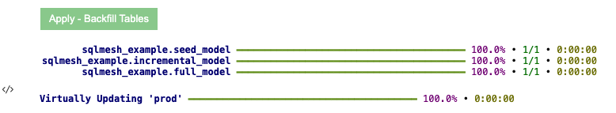{ loading=lazy }

最初の出力ブロックには、各モデルの完了率と実行時間が表示されます（このシンプルな例では非常に高速です）。次の行は、`prod` 環境がモデル実行中に作成されたテーブルを指していることを示しています。

これで、すべての履歴がバックフィルされた新しい本番環境が作成されました。

## 3. モデルの更新

`prod` 環境へのデータ投入が完了したので、SQL モデルの 1 つを変更してみましょう。

`%model` *line* ノートブックマジック（`%` が 1 つであることに注意）とモデル名を使用して、増分 SQL モデルを変更できます。

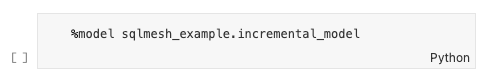{ loading=lazy }

セルを実行すると、その内容は `%%model` *cell* ノートブックマジック（`%%` が 2 つあることに注意）とモデルの内容、そしてレンダリングされたモデル SQL クエリに置き換えられます。 SQLMesh はクエリに明示的な列エイリアスを自動的に追加しました (例: `id AS id`):

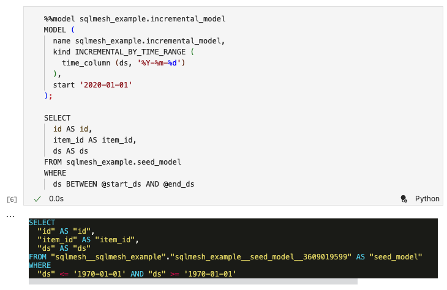{ loading=lazy }

クエリに新しい列を追加することで、増分 SQL モデルを変更します。セルを実行すると、更新されたモデルの内容がファイルに書き込まれ、クエリのレンダリングバージョンが更新されます:

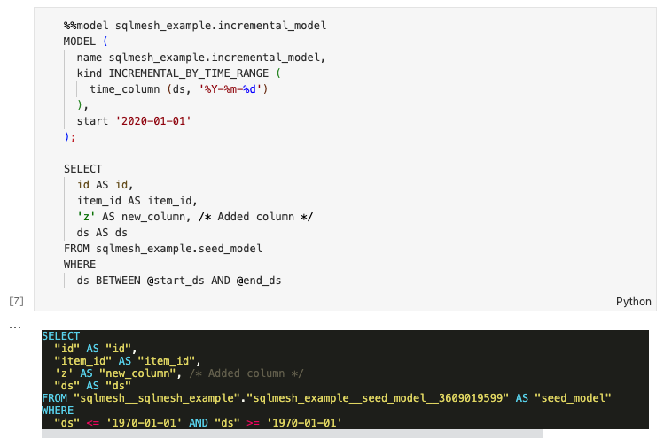{ loading=lazy }

## 4. 開発環境で作業する

### 4.1 開発環境を作成する

モデルを変更したので、本番環境に影響を与えずにモデルの変更を検証できるように、開発環境を作成します。

`%plan dev` を実行して、`dev` という開発環境を作成します。以下の出力が表示されます。

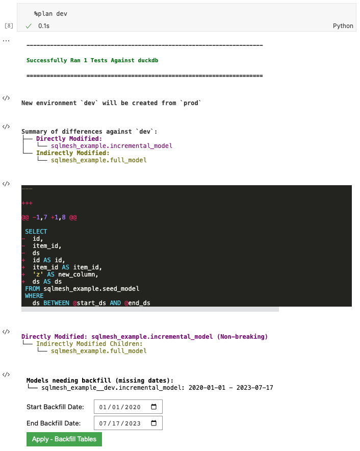{ loading=lazy }

出力の最初のブロックには、`%plan` がプロジェクトのテスト `tests/test_full_model.yaml` を duckdb で正常に実行したことが示されています。

`New environment` 行は、プランの適用時に影響を受ける環境を指定します。既存の `prod` 環境から新しい `dev` 環境が作成されます。

`Summary of differences`セクションには、変更されたモデルと新しい `dev` 環境（現在は `prod` のコピー）の差分がまとめられており、`incremental_model` が直接変更されたこと、そして `full_model` が増分モデルから選択されているため間接的に変更されたことが検出されています。このセクションには、既存モデルと更新されたモデルの差分が表示されます。

SQLMesh は、変更が追加的 (`full_model` で使用されていない列を追加) であり、`prod` に既に存在するデータを無効にしていないことを理解したため、変更を自動的に `Non-breaking` として分類しました。

`Models needing backfill` セクションには、直接変更された `incremental_model` のみがバックフィルを必要とすることが示されており、バックフィルの開始日と終了日を指定するための日付ピッカーが用意されています。

緑色のボタンをクリックしてバックフィルを実行します。

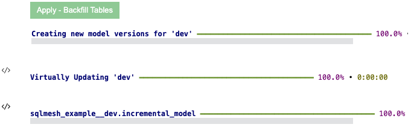{ loading=lazy }

出力を見ると、SQLMesh が `dev` に新しいモデルバージョンを作成したことがわかります。出力の最後の行には、SQLMesh が `sqlmesh_example__dev.incremental_model` に変更を適用したことがわかります。モデルスキーマのサフィックス「`__dev`」は、`dev` 環境であることを示しています。

変更は `Non-breaking` であったため、SQLMesh は `full_model` に対してバックフィルを実行する必要はありませんでした。

### 4.2 開発環境での更新を検証

`%%fetchdf` *cell* マジック（2 つの `%` 記号に注意）と SQL クエリ `select * from sqlmesh_example__dev.incremental_model` を使用して `incremental_model` からデータをクエリすることで、この変更を確認できます。

クエリでは、環境名 `__dev` がスキーマ名前空間 `sqlmesh_example` に追加されていることに注意してください。

{ loading=lazy }

`new_column` がデータセットに追加されたことがわかります。

本番環境テーブルは変更されていません。これは、`%%fetchdf` とクエリ `select * from sqlmesh_example.incremental_model` を使用して本番環境テーブルをクエリすることで確認できます。

`prod` がデフォルト環境であるため、スキーマ名前空間 `sqlmesh_example` には何も追加されていないことに注意してください。

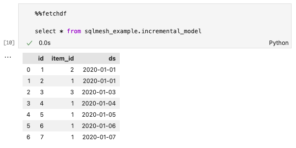{ loading=lazy }

`dev` への変更がまだ `prod` に適用されていないため、production テーブルには `new_column` がありません。

## 5. 本番環境を更新する

開発環境での変更のテストが完了したので、本番環境に移行します。`%plan` を実行して変更を計画し、`prod` 環境に適用します。

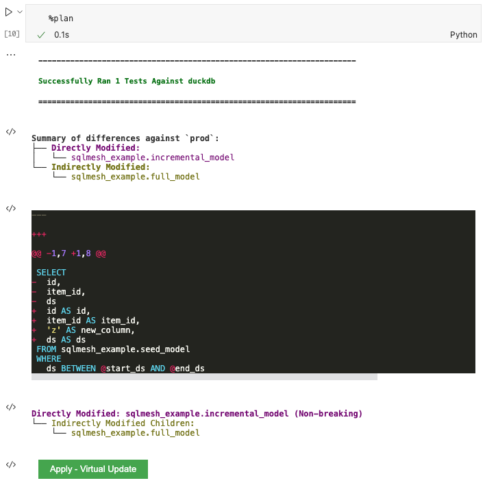{ loading=lazy }

緑色の `Apply - Virtual Update` ボタンをクリックして計画を適用し、バックフィルを実行します。

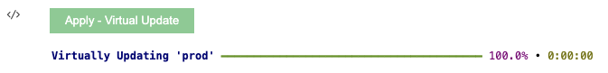{ loading=lazy }

バックフィルは不要で、仮想更新のみが行われたことに注意してください。

### 5.2 prod での更新の検証

SQL クエリ `select * from sqlmesh_example.incremental_model` を指定して `%%fetchdf` を実行し、`prod` でデータが更新されたことを再度確認します。

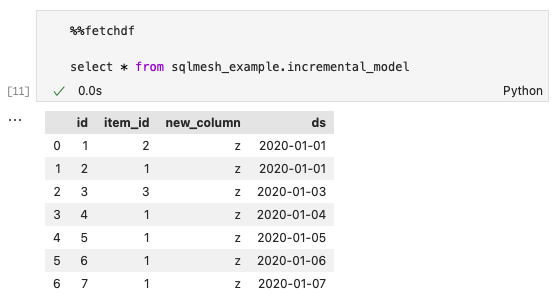{ loading=lazy }

`new_column` が `prod` 増分モデルに存在します。

## 6. 次のステップ

おめでとうございます。これで SQLMesh の基本操作は完了です！

ここから、次の操作を行うことができます。

* [SQLMesh ノートブックコマンドの詳細](../reference/notebook.md)
* [データベースまたは SQL エンジンへの接続を設定する](../guides/connections.md)
* [SQLMesh の概念の詳細](../concepts/overview.md)
* [Slack コミュニティに参加する](https://tobikodata.com/slack)