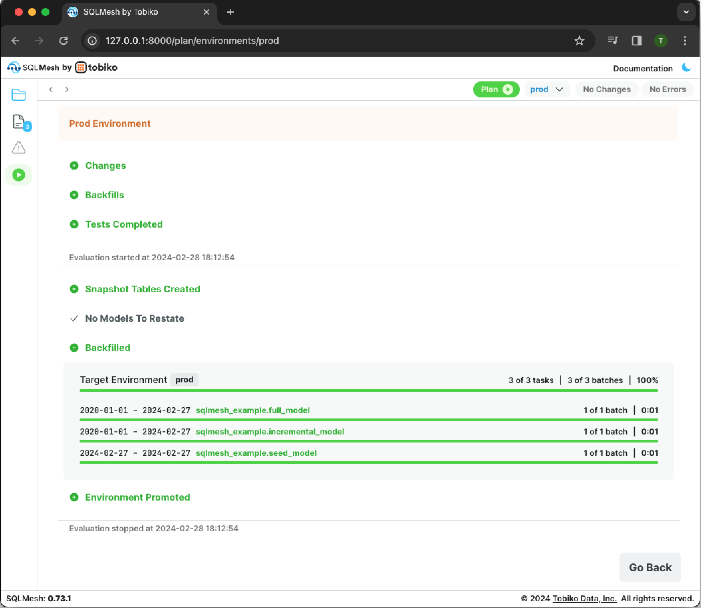

# ブラウザUI

!!! warning

    ブラウザUIは非推奨です。代わりに[VSCode拡張機能](../guides/vscode.md)をご利用ください。

このクイックスタートでは、SQLMesh ブラウザのユーザーインターフェースを使用して、SQLMesh のスキャフォールドジェネレーターを起動して実行します。このサンプルプロジェクトは、[DuckDB](https://duckdb.org/) を埋め込みSQLエンジンとして使用し、ローカルのコンピュータ上で実行されます。

??? info "クイックスタートプロジェクト構造の詳細"

    このプロジェクトでは、シンプルなデータパイプライン上でSQLMeshワークフローを段階的に実行することで、主要なSQLMesh機能のデモを行います。このセクションでは、プロジェクトの構造と、作業を進める中で遭遇するSQLMeshの概念について説明します。

    このプロジェクトには、CSVファイルを唯一のデータソースとする3つのモデルが含まれています。

    ```
    ┌─────────────┐
    │seed_data.csv│
    └────────────┬┘
                 │
                ┌▼─────────────┐
                │seed_model.sql│
                └─────────────┬┘
                              │
                            ┌─▼───────────────────┐
                            │incremental_model.sql│
                            └────────────────────┬┘
                                                 │
                                                ┌▼─────────────┐
                                                │full_model.sql│
                                                └──────────────┘
    ```

    このプロジェクトはシンプルですが、SQLMesh を生産的に使用するために必要なすべての主要な概念に触れています。

## セットアップ

始める前に、SQLMesh を使用するための [前提条件](../prerequisites.md) をすべて満たしていることを確認してください。SQLMesh ブラウザ UI を使用するには、SQLMesh の基本インストールには含まれていない追加の Python ライブラリが必要です。

UI を使用するには、`web` アドオンを使用して SQLMesh をインストールします。まず、Python 仮想環境を使用している場合は、[インストール](../installation.md) 時に使用したフォルダから `source .venv/bin/activate` コマンドを実行して、仮想環境がアクティブ化されていることを確認してください。

次に、`pip` を使用して UI をインストールします。

```bash
pip install "sqlmesh[web]"
```

## 1. SQLMesh プロジェクトを作成する
SQLMesh ブラウザ UI で作業する前に、オペレーティング システムのグラフィカル インターフェースまたはコマンドラインからプロジェクト ディレクトリを作成します。

```bash
mkdir sqlmesh-example
```

コマンドラインでディレクトリに移動します。

```bash
cd sqlmesh-example
```

Python 仮想環境を使用している場合は、[インストール](../installation.md) 時に使用したフォルダから `source .venv/bin/activate` を実行して、仮想環境がアクティブ化されていることを確認してください。

以下のコマンドで SQLMesh スキャフォールドを作成し、モデルのデフォルトの SQL 方言を指定します。方言は、ほとんどのモデルで使用されている方言と一致させる必要があります。特定のモデルについては、モデルの `MODEL` 仕様でオーバーライドできます。[SQLGlot ライブラリでサポートされている](https://github.com/tobymao/sqlglot/blob/main/sqlglot/dialects/dialect.py) すべての SQL 方言が使用できます。

この例では、`duckdb` 方言を指定しています。

```bash
sqlmesh init duckdb
```

スキャフォールディングには、サンプル プロジェクトの SQLMesh 構成ファイルが含まれます。

??? info "プロジェクトの構成について詳しく知る"

    SQLMesh プロジェクトレベルの設定パラメータは、プロジェクトディレクトリ内の `config.yaml` ファイルで指定します。

    このサンプルプロジェクトは組み込みの DuckDB SQL エンジンを使用しているため、設定ではローカルゲートウェイの接続として `duckdb` を指定し、デフォルトとして `local` ゲートウェイを指定します。

    scaffold ジェネレーターを実行するコマンドは、モデルのデフォルトの SQL ダイアレクトを **必要とします**。これは、設定ファイルの `model_defaults` `dialect` キーに格納されます。この例では、デフォルトとして `duckdb` SQL ダイアレクトを指定しました。

    ```yaml linenums="1"
    gateways:
      local:
        connection:
          type: duckdb
          database: ./db.db

    default_gateway: local

    model_defaults:
      dialect: duckdb
    ```

    SQLMesh プロジェクト構成の詳細については、[こちら](../reference/configuration.md) を参照してください。

スキャフォールディングには、SQLMesh プロジェクト ファイルが保存される複数のディレクトリと、サンプル プロジェクトを構成する複数のファイル (SQL モデルなど) も含まれます。

??? info "プロジェクトのディレクトリとファイルの詳細"

    SQLMesh は、新しいプロジェクトを開始するためにスキャフォールドジェネレータを使用します。このジェネレータは、SQLMesh プロジェクトコードを整理するための複数のサブディレクトリとファイルを作成します。

    スキャフォールドジェネレータは以下の設定ファイルとディレクトリを作成します。

    - config.yaml
        - プロジェクト設定ファイル。[configuration](../reference/configuration.md) を参照してください。
    - ./models
        - SQL および Python モデル。[models](../concepts/models/overview.md) を参照してください。
    - ./seeds
        - シードファイル。[seeds](../concepts/models/seed_models.md) を参照してください。
    - ./audits
        - 共有監査ファイル。[auditing](../concepts/audits.md) を参照してください。
    - ./tests
        - ユニットテストファイル。[testing](../concepts/tests.md) を参照してください。
    - ./macros
        - マクロファイル。[macros](../concepts/macros/overview.md) を参照してください。

    また、このクイックスタート例に必要なファイルも作成されます。

    - ./models
        - full_model.sql
        - incremental_model.sql
        - seed_model.sql
    - ./seeds
        - seed_data.csv
    - ./audits
        - assert_positive_order_ids.sql
    - ./tests
        - test_full_model.yaml

最後に、スキャフォールディングにはサンプル プロジェクトで使用するデータが含まれます。

??? info "プロジェクトのデータについて詳しく知る"

    このサンプルプロジェクトで使用するデータは、`/seeds` プロジェクトディレクトリ内の `seed_data.csv` ファイルに格納されています。このデータは、2020 年 1 月の 7 日間における 3 つの商品の売上を反映しています。

    ファイルには `id`、`item_id`、`event_date` という 3 つの列が含まれており、それぞれ各行の一意の ID、販売された商品の ID 番号、商品の販売日に対応しています。

    完全なデータセットは次のとおりです。

    | id | item_id | event_date |
    | -- | ------- | ---------- |
    | 1  | 2       | 2020-01-01 |
    | 2  | 1       | 2020-01-01 |
    | 3  | 3       | 2020-01-03 |
    | 4  | 1       | 2020-01-04 |
    | 5  | 1       | 2020-01-05 |
    | 6  | 1       | 2020-01-06 |
    | 7  | 1       | 2020-01-07 |

## 2. SQLMesh Web UI を開きます

プロジェクトディレクトリ内から `sqlmesh ui` コマンドを実行して UI を開きます。

```bash
sqlmesh ui
```

起動後、SQLMesh Web UI はデフォルトで `http://127.0.0.1:8000` で提供されます。

{ loading=lazy }

ターミナルでリンクをクリックするか (サポートされている場合)、Web ブラウザにコピーして貼り付けて、URL に移動します。

{ loading=lazy }

SQLMesh UI のデフォルトビューには、次の 5 つのペインがあります。

1. プロジェクトディレクトリでは、プロジェクトディレクトリとファイル間を移動できます。
2. エディタータブでは、開いているコードエディターが表示されます。
3. コードエディターでは、コードファイルの表示と編集ができます。
4. インスペクターでは、最近の操作と現在アクティブなペインに基づいて設定と情報が表示されます。(注: インスペクターペインはデフォルトで折りたたまれています。折りたたまれたペインの上部にあるハンバーガーボタンをクリックして展開します (前の画像を参照)。)
5. 詳細では、エディターで開いているモデルの列レベルの系統とクエリの結果が表示されます。(注: 詳細ペインはデフォルトで折りたたまれています。エディターでモデルを開いたり、クエリを実行したりすると、自動的に展開されます。)

{ loading=lazy }

また、次の9つのボタンがあります。

1. エディター/データカタログ/エラーの切り替えは、コードエディター（デフォルト）、データカタログ、エラービューを切り替えます。エラービューは、エラーが発生した場合にのみ表示されます。
2. 履歴ナビゲーションは、Webブラウザの戻るボタンと同様に、前のビューに戻ります。
3. 新しいタブの追加は、新しいコードエディターウィンドウを開きます。
4. プランコマンドの実行は、[`sqlmesh plan` コマンド](../reference/cli.md#plan)を実行します。
5. ドキュメントは、SQLMeshドキュメントWebサイトへのリンクです。
6. 三日月は、ページのライトモードとダークモードを切り替えます。
7. SQLクエリの実行は、[`sqlmesh fetchdf` コマンド](../reference/cli.md#fetchdf)を実行します。
8. SQLクエリのフォーマットは、SQLGlotの美しいレイアウトを使用してSQLクエリを再フォーマットします。
9. SQLダイアレクトの変更は、カスタムSQLクエリの現在のタブのSQLダイアレクトを指定します。プロジェクトの SQL 方言には影響しません。

{ loading=lazy }

デフォルトビューには、4つのステータスインジケーターがあります。

1. エディタータブの言語には、現在のコードエディタータブのプログラミング言語（SQLまたはPython）が表示されます。
2. 現在の環境には、現在選択されている環境が表示されます。
3. 変更インジケーターには、選択した環境で最後に実行されたSQLMeshプランと比較した、プロジェクトファイルの変更の概要が表示されます。
4. エラーインジケーターには、プロジェクト内のエラーの数が表示されます。

{ loading=lazy }

## 3. 環境の計画と適用
### 3.1 本番環境の作成

SQLMesh の主なアクションは、*計画*を作成し、*環境*に適用することです。この時点では、環境は空の「prod」環境のみです。

??? info "SQLMeshのプランと環境について詳しくはこちら"

    SQLMesh の主要なアクションは、*プラン*を作成し、*環境*に適用することです。

    [SQLMesh 環境](../concepts/environments.md) は、モデルとそれらが生成したデータを含む独立した名前空間です。最も重要な環境は `prod`（「本番環境」）で、これはビジネスで日常的に使用するアプリケーションの背後にあるデータベースで構成されます。`prod` 以外の環境は、モデルコードの変更を実際に適用して業務に影響を与える前に、テストとプレビューを行う場所を提供します。

    [SQLMesh プラン](../concepts/plans.md) には、ある環境と別の環境の比較と、それらを整合させるために必要な一連の変更が含まれています。たとえば、新しい SQL モデルが `dev` 環境に追加され、テストされ、実行された場合、それらを整合させるには `prod` 環境にも追加され、実行する必要があります。SQLMesh はこのようなすべての変更を識別し、互換性の問題を引き起こすか、そうでないかに分類します。

    破壊的変更とは、環境に既に存在するデータを無効にする変更です。例えば、`dev` 環境のモデルに `WHERE` 句が追加された場合、`prod` 環境でそのモデルによって作成された既存のデータは無効になります。これは、新しい `WHERE` 句によって除外される行が含まれている可能性があるためです。`dev` 環境のモデルに新しい列を追加するなどの変更は、`prod` 環境の既存データはすべて引き続き有効であるため、破壊的変更ではありません。環境を整合させるには、新しいデータのみを追加する必要があります。

    SQLMesh はプランを作成した後、破壊的変更と非破壊的変更の概要を表示し、プランを適用した場合に何が起こるかを理解できるようにします。プランを適用するために、データの「バックフィル」を行うように求められます。ここでのバックフィルとは、テーブルのデータの更新または追加（初期ロードや完全リフレッシュを含む）を指す一般的な用語です。

最初の SQLMesh プランでは、本番環境にデータを入力するため、すべてのモデルを実行する必要があります。右上にある緑色の「プラン」ボタンをクリックすると、新しいペインが開きます。

このペインには、プランに関する複数の情報が表示されます。

- 「本番環境の初期化」セクションには、プランが「本番環境」を初期化していることがわかります。
- 「開始日」と「終了日」セクションは、プランを「本番環境」で実行する際に許可されないため、グレー表示されています。
- 「変更」セクションには、SQLMesh が現在の空の環境に対して追加された 3 つのモデルを検出したことがわかります。
- 「バックフィル」セクションには、追加された 3 つのモデルすべてに対してバックフィルが行われることがわかります。

??? info "プロジェクトのモデルについて詳しく知る"

    プランのアクションは、プロジェクトで使用されるモデルの [種類](../concepts/models/model_kinds.md) によって決まります。このサンプルプロジェクトでは、次の 3 種類のモデルを使用します。

    1. [`SEED` モデル](../concepts/models/model_kinds.md#seed) は、SQLMesh プロジェクトディレクトリに保存されている CSV ファイルからデータを読み取ります。
    2. [`FULL` モデル](../concepts/models/model_kinds.md#full) は、モデルが実行されるたびに、モデルに関連付けられたデータを完全に更新（書き換え）します。
    3. [`INCREMENTAL_BY_TIME_RANGE` モデル](../concepts/models/model_kinds.md#incremental_by_time_range) は、日付/時刻データ列を使用して、プランの影響を受ける時間間隔を追跡し、モデルの実行時に影響を受ける時間間隔のみを処理します。

    ここで、プロジェクト内の各モデルについて簡単に説明します。

    最初のモデルは、`seed_data.csv` をインポートする `SEED` モデルです。`SEED` モデルはデータベースへのクエリを実行しないため、このモデルは `MODEL` ステートメントのみで構成されています。

    モデル名とモデルファイルからの相対CSVパスを指定するだけでなく、CSV内の列名とデータ型も指定します。また、モデルの `grain` を、モデルの一意の識別子である `id` と `ds` を構成する列に設定します。

    ```sql linenums="1"
    MODEL (
      name sqlmesh_example.seed_model,
      kind SEED (
        path '../seeds/seed_data.csv'
      ),
      columns (
        id INTEGER,
        item_id INTEGER,
        event_date DATE
      ),
      grain (id, event_date)
    );
    ```

    2つ目のモデルは、`INCREMENTAL_BY_TIME_RANGE` モデルで、`MODEL` 文と、最初のシードモデルから選択する SQL クエリの両方が含まれています。

    `MODEL` 文の `kind` プロパティには、各レコードのタイムスタンプを含むデータ列の必須指定が含まれています。また、モデルがデータを処理する開始日時を指定するオプションの `start` プロパティと、モデルを毎日実行することを指定する `cron` プロパティも含まれています。これにより、モデルの粒度が `id` 列と `event_date` 列に設定されます。

    SQL クエリには、SQLMesh がデータを増分ロードする際に特定の日時間隔でデータをフィルタリングするために使用する `WHERE` 句が含まれています。

    ```sql linenums="1"
    MODEL (
      name sqlmesh_example.incremental_model,
      kind INCREMENTAL_BY_TIME_RANGE (
        time_column event_date
      ),
      start '2020-01-01',
      cron '@daily',
      grain (id, event_date)
    );

    SELECT
      id,
      item_id,
      event_date,
    FROM
      sqlmesh_example.seed_model
    WHERE
      event_date between @start_date and @end_date
    ```

    プロジェクトの最終モデルは「FULL」モデルです。他のモデルで使用されるプロパティに加えて、この「MODEL」ステートメントには[`audits`](../concepts/audits.md)プロパティが含まれています。プロジェクトの`audits`ディレクトリには、カスタムの`assert_positive_order_ids`監査が含まれています。この監査は、すべての`item_id`値が正の数であることを検証します。この監査は、モデルが実行されるたびに実行されます。

    ```sql linenums="1"
    MODEL (
      name sqlmesh_example.full_model,
      kind FULL,
      cron '@daily',
      grain item_id,
      audits (assert_positive_order_ids),
    );

    SELECT
      item_id,
      count(distinct id) AS num_orders,
    FROM
      sqlmesh_example.incremental_model
    GROUP BY item_id
    ```

{ loading=lazy }

`Apply Changes And Backfill` という青いボタンをクリックして、計画を適用し、バックフィルを開始します。

ページが更新され、新しい出力セクションが表示されます。各セクションは計画適用の各段階を反映しており、ステップが成功すると緑色になります。

`Tests Completed` セクションは、プロジェクトの[ユニットテスト](../concepts/tests.md)が正常に実行されたことを示します。

`Snapshot Tables Created` セクションは、追加および変更されたモデルの[スナップショット](../concepts/architecture/snapshots.md)が正常に作成されたことを示します。

 `Backfilled` セクションには、バックフィル操作の進行状況インジケーターが表示されます。最初の進行状況インジケーターは、バックフィル操作全体のタスクの合計数と完了率を示します。残りの進行状況バーは、各モデルの完了率と実行時間（このシンプルな例では非常に短い時間です）を示します。

{ loading=lazy }

 `Go Back` ボタンをクリックしてペインを閉じます。

これで、すべての履歴がバックフィルされた新しい本番環境が作成されました。

### 2.2 開発環境を作成する
本番環境を作成したら、次は開発環境を作成し、本番環境に影響を与えずにモデルを変更できるようにします。

右上の緑色の `Plan` ボタンの横にある `prod \/` ボタンをクリックして、環境メニューを開きます。「Environment」フィールドに `dev` と入力し、青色の `Add`ボタンをクリックします。

{ loading=lazy }

ボタンには、SQLMesh UI が `dev` 環境で動作していることが表示されます。

{ loading=lazy }

緑色の `Plan` ボタンをクリックすると、新しいペインが開きます。

{ loading=lazy }

`dev` は既存の `prod` 環境から変更を加えずに作成されているため、出力セクションには追加/変更されたモデルやバックフィルは表示されません。プロジェクトは変更されていないため、新たな計算を実行する必要はなく、仮想更新が行われます。

新しいプランを適用するには、青い `Apply Virtual Update` ボタンをクリックします。

{ loading=lazy }

出力は、テスト、仮想更新、スナップショットテーブルの作成、環境の昇格の各手順が完了したことを示しています。 `Go Back` ボタンをクリックしてペインを閉じてください。

## 3. 最初の更新を実行する

`prod` 環境と `dev` 環境の両方にデータが入力されました。SQL モデルを 1 つ変更し、`dev` 環境で検証して、`prod` 環境にプッシュしてみましょう。

### 3.1 モデルクエリの編集
増分SQLモデルを変更するには、ウィンドウ左側のプロジェクトディレクトリペインでモデルをクリックしてエディターで開きます。

下部の `Details` ペインには、プロジェクトのテーブルと列の系統が表示されます。

{ loading=lazy }

クエリに新しい列を追加して、増分SQLモデルを変更します。`Cmd + S`（Windowsの場合は`Ctrl + S`）を押して変更したモデルファイルを保存し、更新された系統を表示します。

{ loading=lazy }


## 4. 更新を計画して適用する
右上にある緑色の `Plan` ボタンをクリックして、変更の影響をプレビューします。

{ loading=lazy }

`Changes` セクションでは、`incremental_model` が直接変更されたこと、および `full_model` が増分モデルから選択されているため間接的に変更されたことが検出されます。SQLMesh は、変更が追加的なもの (`full_model` で使用されていない列を追加したもの) であることを理解し、自動的に非破壊的な変更として分類しました。

 `Backfill` セクションでは、`incremental_model` のみがバックフィルを必要としていることがわかります。青い `Apply Changes And Backfill` ボタンをクリックしてプランを適用し、バックフィルを実行します。

{ loading=lazy }

SQLMeshは`sqlmesh_example.incremental_model`に変更を適用し、モデルをバックフィルします。`Backfilled`セクションには、バックフィルが正常に完了したことが示されています。

### 4.1 開発環境での更新の検証
`incremental_model` からデータをクエリすることで、この変更を確認できます。エディターの「カスタムSQL 1」タブにSQLクエリ `select * from sqlmesh_example__dev.incremental_model` を追加します。

{ loading=lazy }

クエリ `select * from sqlmesh_example__dev.incremental_model` では、環境名 `__dev` がスキーマ名前空間`sqlmesh_example` に追加されていることに注意してください。

右下の `Run Query` ボタンをクリックしてクエリを実行します。

{ loading=lazy }

`new_column` がデータセットに追加されたことがわかります。production テーブルは変更されていません。これを確認するには、クエリを修正して `select * from sqlmesh_example.incremental_model` で production テーブルから選択するようにします。

`prod` がデフォルト環境であるため、スキーマ名前空間 `sqlmesh_example` には何も追加されていないことに注意してください。

{ loading=lazy }

`dev` への変更がまだ `prod` に適用されていないため、production テーブルには `new_column` がありません。

### 4.2 本番環境への更新の適用
開発環境での変更点のテストが完了したので、本番環境に移行します。右上の環境メニューを開き、 `prod` 環境を選択します。

{ loading=lazy }

緑色の `Plan` ボタンをクリックして、実行計画インターフェースを開きます。

{ loading=lazy }

青い `Apply Virtual Update` ボタンをクリックすると、警告画面が表示されます。

{ loading=lazy }

プランの適用を続行するには、 `Yes, Run prod` ボタンをクリックします。

{ loading=lazy }

バックフィルは不要で、仮想更新のみが行われたことに注意してください。計算は `dev` でモデルのバックフィルを行った際に既に実行されています。 `Go Back` ボタンをクリックしてペインを閉じてください。

### 4.3. prod での更新の検証
エディターから SQL クエリを再実行し、`prod` でデータが更新されたことを再確認します。 `Run Query` ボタンをクリックしてクエリを実行します。

{ loading=lazy }

`new_column` が `prod` 増分モデルに追加されました。

## 5. 次のステップ

おめでとうございます。これで SQLMesh の基本操作は完了です。

ここから、次の操作を実行できます。

* [データベースまたは SQL エンジンへの接続を設定する](../guides/connections.md)
* [SQLMesh の概念について詳しく学ぶ](../concepts/overview.md)
* [Slack コミュニティに参加する](https://tobikodata.com/slack)